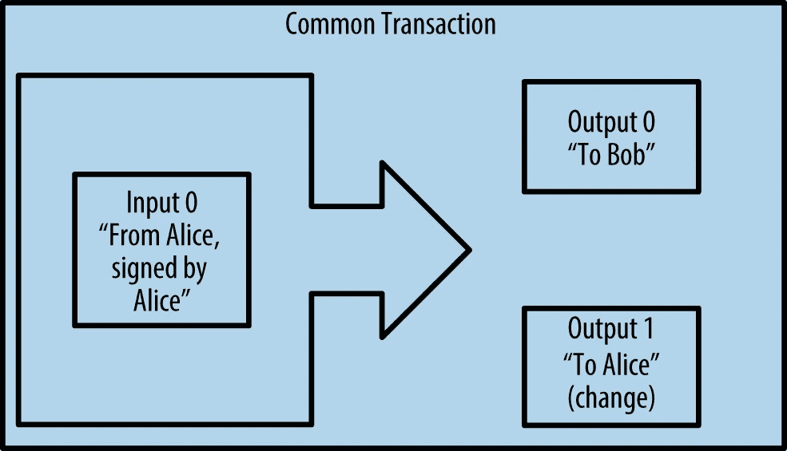
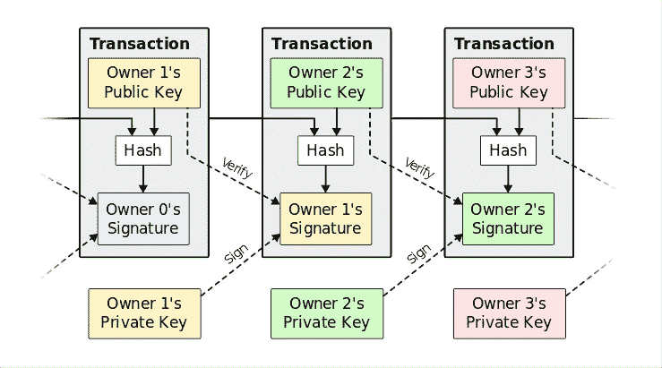
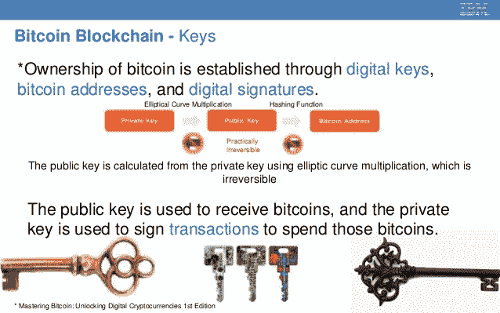
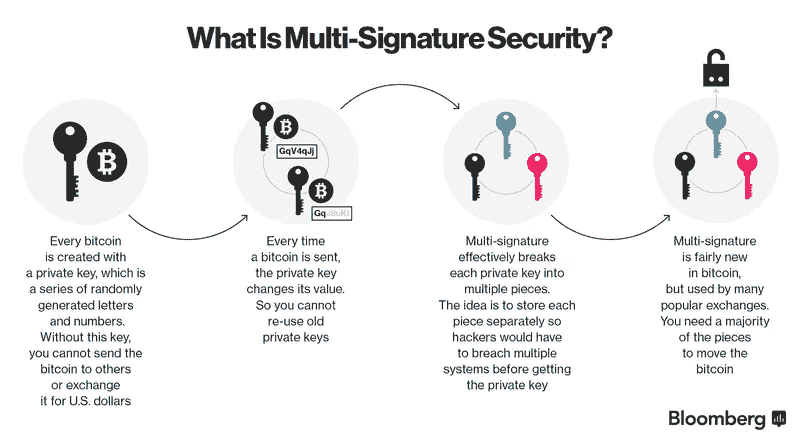

# 交易请求——将区块链拉开

> 原文：<https://itnext.io/the-transaction-request-pulling-the-blockchain-apart-7767893ba05a?source=collection_archive---------0----------------------->

## 打开神奇东西的引擎盖

[*点击这里在 LinkedIn* 上分享这篇文章](https://www.linkedin.com/cws/share?url=https%3A%2F%2Fitnext.io%2Fthe-transaction-request-pulling-the-blockchain-apart-7767893ba05a)

区块链技术的核心目的是**以一种可以被认为是安全和真实的方式存储交易**。

保证交易的细节是有效的，密封的，因此以后不能被更改，这是区块链的独特卖点。

在本文中，我将重点关注事务的请求。

首先，让我们看看什么是交易，以及在区块链中如何管理交易的完整性和安全性。本文关注的是交易本身。在下一篇文章中，我将描述块(事务集合)背后的整个事务，事务的有效性是如何确定的，大多数区块链计算机是如何确定一个事务是可以的并且将被包括在块中的，等等。

# 交易的定义是什么？

定义交易有多种方式。如果我们知道它是什么，那么我们就有了验证区块链交易的依据。

## 由会计师定义的交易

1.  必须有两方:
2.  该活动必须可以用金钱衡量:
3.  该事件必须导致财产或服务的转移:
4.  该事件必须改变企业的财务状况:

“业务交易特征”[http://www . accounting explanation . com/Features _ of _ Transaction . htm](http://www.accountingexplanation.com/features_of_transaction.htm)

## 由企业架构师定义的事务

1.  发起方发出请求，其中明确定义了发起方的请求。
2.  执行方审查该程序，并决定同意或不同意该请求；根据这一决定，执行方向发起方发出承诺。
3.  成功完成第 1 步和第 2 步后，执行方将采取必要的行动来兑现所做的承诺。
4.  结果将提交给发起方批准。
5.  发起方接受或不接受结果
6.  结束了。

Bert Noorman“白皮书 pronto BPM-aan pak Sogeti”[http://bankingreview.nl/download/22289](http://bankingreview.nl/download/22289)

## 为什么定义很重要？

如果满足这两个定义中的条件，就意味着我们完全支持一个事务。这也意味着，当你的想法不能映射到交易的定义上时，就没有必要去寻找区块链的支持。

# 价值交易

货币是交易中唯一可以交换的价值单位，这种想法当然有点陈旧和奇怪。

钱只是一个数字，象征着价值交换中的信任。有了信任和价值，就有了可供交易的东西。关于这个话题的一个很好的读物是格林·戴维斯的《T2 货币史:从古至今》。通过解释货币的历史来描述价值等于信任的整个概念。

接受价值交换概念有几个方面。*当*我们仅仅关注价值表示的交换时，**接受**被委托给 blochchain。然后，交易的有效性将由网络参与者同意的一组规则来决定。*当*价值表示的交换是商品交换的一部分时，区块链之外的另一个流程应该可以处理可能的争议。

**例如**，您可以使用区块链登记房屋所有权，并通过区块链内置的验证检查批准交易。让我们假设有一些重大问题的基础建设和前业主从未提及。这将产生关于所有权转让有效性的法律争议。在一些国家，这可能使房屋所有权的交换无效；因此，属性和代表值应该颠倒。由于区块链交易是不可逆转的，因此有必要在区块链建立一个新的业务。因此，就像在现实世界中一样，您需要一个带有套利方式的流程，命令双方调用新的事务。

希望这个例子表明，在区块链上，您需要知道记录了哪些特定的价值交换，以及这对您的真实世界流程和业务意味着什么。

**回到区块链的交易**

# 事务生命周期

总的来说，步骤的顺序是:

1.  有人**通过一个叫做钱包的东西请求交易**。
2.  **交易被发送**(广播)到特定区块链网络中的所有参与计算机。
3.  网络中的每台计算机都根据特定区块链网络的创建者设定的一些验证规则来检查(**验证**)交易。
4.  经过验证的事务被**存储到一个块**中，并用一个锁(哈希)密封。
5.  当网络中的其他计算机**验证**该块上的锁是否正确时，该块成为区块链的一部分。
6.  现在交易是区块链的一部分，不能以任何方式改变。

这里的诀窍是，每一步的实现都应该保证完整性、安全性和匿名性。我将一个一个地介绍这些步骤。

# 请求交易

假设 Alice 想转账给 Bob。或者让它更适合每一种可能的情况:Alice 想把某物的所有权转让给 Bob。在这个交易过程中会出现什么问题？

[http://chimera . labs . oreilly . com/books/1234000001802/ch02 . html # _ common _ transaction _ forms](http://chimera.labs.oreilly.com/books/1234000001802/ch02.html#_common_transaction_forms)

## Alice 和 Bob 之间的交易面临哪些威胁？

1.  **爱丽丝不想把多余的单元让给别人。如果交易以这样一种方式被改变，它也向其他人发送价值单位，这将是一件坏事。例如，当 Alice 向 Bob 发送 100 个单位时，有人更改了它，并向 Erik 发送 200 个单位，然后 Erik 向 Bob 发送 100 个单位。如果从 Alice 处扣除 200 个单位，将 100 个单位发送给 Bob，并将另外 100 个单位发送给 Eric(完整性),而不是捎带，则是错误的。**
2.  爱丽丝是唯一可以批准交易的人。
    该交易不应是伪造的。当 Alice 看到从她的总金额中扣除了 100 个单位，但她没有发送该事务的批准(初始化)时，事情就出错了。
3.  **Alice 需要确定 Bob 收到了正确数量的单位。** 交易金额发生变化怎么办？因此，不是 100 个单位，而是 110 个单位被发送给 Bob(完整性)。
4.  **Alice 需要确保 Bob 将收到正确的金额，而不是其他人。**
    交易变更，金额发给人家怎么办？因此，不是将 100 个单位发送给 Bob，而是将这些单位发送给 Patricia (integrity)。
5.  **Alice 需要确保 Bob 知道是她而不是其他人向他发送了交易。** 通常一笔交易是价值单位对服务或商品的交换。所以知道交易是由特定的人发起的是很重要的。否则，您可以将交易中的 Alice 的名称更改为 Michael，并从 Bob 处检索商品，同时将交易指向您的名称。
6.  **Alice 需要知道 Bob 已经收到交易。** 在交易中发送一些价值，意图获得一些回报，需要知道价值单位何时被接收的重要特征；否则，你会得到一个漫长的是或否的乒乓游戏。

## 总结交易需求

1.  Alice 和 Bob 应该能够以这样一种方式来识别他们自己，这样身份盗窃就不可能发生
2.  Alice 和 bob 之间的事务需要受到保护，这样 Alice 和 Bob 都知道没有人能够篡改内容。
3.  Alice 和 Bob 之间的事务需要一种双方可以确定事务状态(是否开始、验证和完成)的通信方式。

## 安全身份&保护消息

实现这一点的方法是使用复杂的加密方法。这被称为 PGP，代表相当好的隐私。它使用每个人都知道的公共密码(公钥)和只有所有者知道的私有密码(私钥)。有一种方法可以在两个人之间传递信息；除了接收者，其他人都不可读。你可以在发送的信息上签名，这样只有发送者才能发送它。

> " PGP 支持消息认证和完整性检查."—[https://en . Wikipedia . org/wiki/Pretty _ Good _ Privacy # Digital _ signatures](https://en.wikipedia.org/wiki/Pretty_Good_Privacy#Digital_signatures)

如果你想了解更多关于 PGP 的知识，我建议阅读维基百科[页面](https://en.wikipedia.org/wiki/Pretty_Good_Privacy#Digital_signatures)和电子前沿基金会页面“ [*公钥加密和 PGP*](https://ssd.eff.org/en/module/introduction-public-key-cryptography-and-pgp) ”

实现 PGP 还包括一些共享密钥的好方法。

## 开始交易请求！

当 Alice 向 Bob 点一杯咖啡时，Bob 将向 Alice 提供一个地址(例如通过 QR 码)。在这个二维码里，附上了地址、描述和金额。通过将这些信息输入她的钱包应用程序，Alice 将根据 Bob 的请求继续交易。

《掌握比特币》一书对交易的描述如下:

> **交易链**
> 
> Alice 向 Bob's Cafe 的付款使用以前交易的输出作为输入。在前一章中，爱丽丝从她的朋友乔那里收到了比特币，以换取现金。那次交易创造了被爱丽丝的钥匙锁定的比特币价值。她对 Bob's Cafe 的新事务引用以前的事务作为输入，并创建新的输出来支付一杯咖啡的费用和接受零钱。这些事务形成了一个链，其中最新事务的输入对应于先前事务的输出。爱丽丝的密钥提供了解锁那些先前交易输出的签名，从而向比特币网络证明她拥有资金。她将咖啡的付款附加到 Bob 的地址上，从而“妨碍”了该输出，要求 Bob 出示签名以花费该金额。这代表了 Alice 和 Bob 之间的价值转移。—[https://github . com/bitcoinbook/bitcoinbook/blob/8d 01749 BCF 45 f 69 f 36 cf 23606 bbbf 3 f 0 BD 540 db 3/ch02 . asciidoc](https://github.com/bitcoinbook/bitcoinbook/blob/8d01749bcf45f69f36cf23606bbbf3f0bd540db3/ch02.asciidoc)

## 通过区块链中的区块保护所有交易

现在我们知道了什么是安全交易，PGP 是用来保护交易的。那么，让我们来看一下下一个阶段，发送事务，这当然也应该是安全的。下面几行简要介绍了使用 PGP 保护包含事务的块。

您可能知道，区块链的原则是将事务按块分组。这些块与先前块的指纹链接在一起，创建了包含事务集合的块菊花链

这个指纹(散列)是对 PGP 方法的补充，用于保护交易。散列确保事务块的内容不会在不影响散列的情况下被改变，另一方面，完整的事务集被连接在一起。

请注意，并非交易的全部内容都将被加密。因为一些数据需要对网络中的所有计算机公开可读，以验证交易。在接下来的博客中会有更多的介绍。

## 总结交易的安全性

http://nakamotoinstitute.org/bitcoin/

## 比特币支持额外的多重签名安全。

多重签名并不在本文的讨论范围之内，但是由于比特币是区块链的一种实现，所以让我们快速看一下。在比特币中，不仅 Alice 和 Bob 使用 PGP 进行身份验证，比特币也有公钥和私钥。有一个选项可以将私钥放在不同的地方，这样黑客就无法检索比特币的私钥。这与《哈利·波特》故事中伏地魔的[魂器](http://harrypotter.wikia.com/wiki/Horcrux)相似，魂器被放在不同的地方，这样伏地魔就能活下去。

[https://www . slide share . net/HowardAnglin/tutorial-区块链-technical overview ss-66485781](https://www.slideshare.net/HowardAnglin/tutorial-blockchain-technicaloverviewss-66485781)

[https://www . Bloomberg . com/news/articles/2016-08-17/the-猥琐-无尽循环的比特币黑客](https://www.bloomberg.com/news/articles/2016-08-17/the-wretched-endless-cycle-of-bitcoin-hacks)

# 交易请求摘要

在这篇文章中，我描述了是什么让一个东西成为一个交易，是什么让一个交易成为一个安全的交易。关键要点是，身份管理和数据完整性是区块链实施中必须涵盖的最重要的属性。但这仅仅是开始。我们刚刚讨论了如何以安全的方式发送数据。现在我们开始精彩的部分了。什么使网络成为网络？谁可以参与？什么能确保人们不会伪造信息？等等。

# 下一站:发送交易