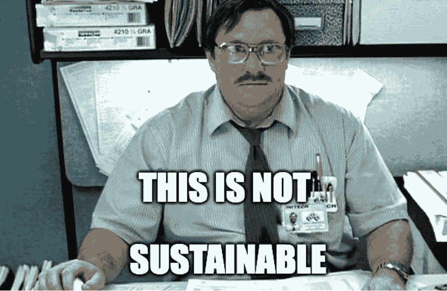

# 思考可持续性

> 原文：<https://itnext.io/thinking-sustainability-b381783be1d0?source=collection_archive---------5----------------------->

在解决方案架构中

商标和版权 20 世纪福克斯电影公司

# 建筑师同行的想法

随着可持续发展概念在技术驱动和数据驱动的流程中越来越受到关注，企业决策包括碳足迹和他们开发、实施、支持和发展业务的方式的长期影响等主题。

这些问题通常是双重的且相互依赖的:环境影响和业务可持续性:通过这篇文章，我想向解决方案架构师的同事，以及在提高产品的可持续性和长期成功方面投入很多的利益相关者伸出援手。

# 为什么选择可持续发展

作为一名解决方案架构师，我经常面对业务驱动的需求，高度关注价值，以及架构必须如何提供指导，(通常)基于非常少的关于如何可持续地执行长期愿景的信息。

企业必须对自己的可持续发展路线图负责，而不是将其留给外部监管框架(我们可以从消费者隐私和所有数据基础设施的混乱中吸取教训)。

如果我们看一下加密开采的无计划、无限制增长如何严重影响资源利用率的例子，就会发现:

*   不可再生能源的高耗电量
*   不断增长的计算硬件需求
*   缩短硬件生命周期导致更多电子垃圾，

我们应该关注这种盲目的价值驱动方法很快会对云计算产生什么影响。

# 如何，什么样的未来

下面这句话经常被滥用:“未来就是现在”。然而，如今企业的运营方式是，我们正朝着资源稀缺的方向螺旋上升，从连续性的角度来看，这最终将导致监管结果、限制、制裁和更高的总体成本。最好有所准备，对吧？

在我的角色中，在提供技术和思想领导的同时，我专注于解决方案；总会有答案，增加有影响力价值的不同方法**和**遵循可持续实践:

*   **精益数据架构的设计**:仅仅拥有可用的数据对于任何组织来说都是没有用的，除非它能回答“增值”问题。明确只收集必要的高质量数据，将有效地降低成本，优化资源使用，并允许更快地做出决策(减少要分析的无关数据)。我认为这是一种极具争议的方法:为了与“数据驱动”的组织进行沟通，他们应该将不太有用的数据排除在范围之外。除非您的基础设施已经成熟，能够高效地处理不太相关的数据，否则它将不可避免地遭遇“垃圾输入=垃圾输出”的问题。大多数试图完全收集“所有数据”的巨石“数据仓库”方法的失败，只是没有对其做任何其他事情，这是一个很好的证据，表明首先构建到那个成熟度级别，是一个好得多的方法。
*   **正确评估工具:**应用程序、编程语言性能和遗留系统都有可测量的足迹，并且通过测量它们的效率可以获得有价值的信息:速度、数据存储和能耗等。在任何运行系统的规模影响的重要方面，很难在非常少的数据上准确地建议或指导交付团队。收集数据的一个好方法是包括验证技术峰值或 PoC 的异步流程，以包括围绕主要技术范围(如存储、可扩展性和能源需求)的其他数据。然后，您就能更好地评估解决方案的未来影响。
*   **直接测量可持续性:**创建正确的数据观点，将对碳足迹等事物的认识纳入可测量的输出(仪表盘、报告)，这对于架构层面上任何决策的长期影响都是至关重要的。提供这个反馈来支持 EA 和 CDO 的角色，将有助于实现业务思维在可持续性问题上与架构愿景的一致。云提供商已经具备了提供大量此类见解的能力，与定制解决方案相比，实施工作要少得多。
*   投资持久的知识:尽早采用新的主张有好处，但会极大地增加风险因素。投资于稳定的技术栈是很好的，在那里你可以建立领域知识，以使你的企业更少地依赖市场上的专业知识。
*   **将交付团队的知识能力从特定领域的知识中分离出来**:这种方法意味着应用程序、语言和工具专业知识的更可持续的生命周期，并允许采用新的框架，保持创新与主线或遗留操作诀窍的健康平衡:如果您从长期知识和能力路线图中单独缩小特定领域标准的需求，那么集成特定领域标准就不那么困难，并且从减少技术债务的角度来看是有益的。
*   **简单设计**:当一个计划太复杂时，很难解释，更难实施。如果你的设计的知识焦点转移或者被重新优先化(或者随着人们的前进，角色的改变而逐步淘汰)，它肯定会被一个更简单的命题所淘汰，这个命题会被更多的人和结构所理解和采纳。请记住，更简单的设计通常更具可持续性，采用起来也更容易。
*   **不要为每个决定都力求完美**:有时候足够好就足够好了:快速失败可以带来更有成效和更快的改进周期。我总是喜欢通过频繁地迭代核心架构构建块来保持基础设施和数据环境没有遗留工件和技术债务:为了拥有更强大的治理模型和改进的能力，敏捷提供了一个不断改进的伟大框架，但是如果我们不不断地重新评估通往长期目标的路线图，并让决策者沿着价值的概念改进较小的增量，而不是构建新的(一次又一次)来修复以前的迭代“错误”，那么敏捷最终会变得不那么有用。
*   **以系统和服务寿命为目标**:可重用的构建模块是大多数现代架构框架(例如:TOGAF)的核心，但这一概念必须应用于所有基础设施和数据层，尤其是在共享资源池上，例如 PaaS 和 SaaS 云供应商提供的资源池:仅仅因为你能做到，并不意味着你应该这样做。设计数据架构来满足当前的数据需求已经不够了。新的数据架构需要足够灵活，以适应未知的未来需求:数据管道需要模块化地构建，以编程方式生成并自动化，从而在数据需求变化时缩短改进迭代周期。
*   **培育以数据为中心的文化，执行清晰的数据成熟度战略**:你的公司声称“数据驱动”，但它是以数据为中心的吗？关注数据意味着所有系统和流程最终都支持数据的中心:要成功执行数据策略，您需要首先评估当前的数据成熟度，并设计最有效的方式来收集、处理和交付信息。例如，询问当前的 MDM 策略是否允许执行业务和架构愿景？所有目标是否被所有参与者完全理解(并以同样的方式)？例如，创建一个稳定、可信的数据基础对于业务运营的长久性和可持续性是至关重要的，并且将允许更可持续的治理，因此这是简化资源使用的非常有效的途径。

# 一些鼓励的话

从以上几点我们可以理解，既有办法建立增值的解决方案，也有办法建立可持续的系统，所以未来确实不会太暗淡。此外，这些只是从一个更复杂的环境中获得的一小部分，在这个环境中，你的里程可能会有所不同；这绝不是一个全面的“解决方案”列表，只是一些想法和可能的路径，以便更好地做出决策，实现更可持续的未来。

可持续发展是一种心态。当我们努力改变并把我们的思维进化成像数据网格、连续架构、产品思维等概念时。在这个敏捷、云和 DevOps 时代，it 也成为交付团队的责任，因此，我们应该在可持续发展的维度内思考未来，以便创建可行、灵活和持久的系统架构。

不管你从事什么行业，一个共同的目标是评估我们自己在这个星球上的影响和地位。

