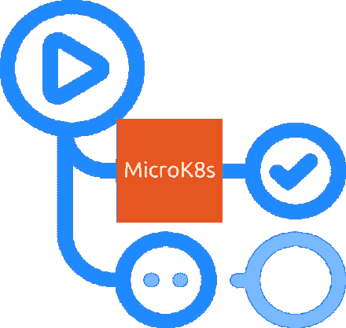

# 这不仅仅是一个 MicroK8s GitHub 动作

> 原文：<https://itnext.io/this-is-more-than-a-microk8s-github-action-6a531cdc7b95?source=collection_archive---------3----------------------->



你现在可能听说过[micro k8s](https://microk8s.io/)；“适用于集群、笔记本电脑、物联网和边缘的最小、最简单的纯生产 Kubernetes ”,只需一个命令即可安装:

```
sudo snap install microk8s --classic
```

现在有一个 MicroK8s [GitHub action](https://github.com/marketplace/actions/microk8s-action) 可以用来 CI 你的项目。让我们看看如何利用它。

# 您的简单项目到 CI

我们拥有的[玩具项目](https://github.com/ktsakalozos/SimpleProject)包含一个部署清单:

```
apiVersion: apps/v1
kind: Deployment
metadata:
  name: nginx-deployment
  labels:
    app: nginx
spec:
  replicas: 3
  selector:
    matchLabels:
      app: nginx
  template:
    metadata:
      labels:
        app: nginx
    spec:
      containers:
      - name: nginx
        image: nginx:1.14.2
        ports:
        - containerPort: 80
```

对于每个拉取请求，我们都希望`kubectl apply`这个部署，并确保 nginx 仍然能够响应。为此，我们在`.github/workflows/`下创建一个包含以下内容的文件:

```
name: Test Microk8s
on:
  pull_request:
    branches: [ master ]
jobs:
  test:
    runs-on: ubuntu-latest
    name: Install MicroK8s
    steps:
    - uses: balchua/microk8s-actions@v0.1.3
      with:
        channel: 'latest/stable'
    - name: Checkout
      uses: actions/checkout@v2
    - name: Test nginx
      id: Nginx
      run: |
        set -ex
        kubectl apply -f ${{ github.workspace }}/deploy/nginx.yaml
        kubectl expose deployment nginx-deployment --name nginx-srv2 --cluster-ip=10.152.183.210
        kubectl rollout status deployment/nginx-deployment
        curl 10.152.183.210 | grep nginx 
```

在此工作流文件的最顶端，我们请求在针对主分支的每个拉请求上运行操作:

```
on:
  pull_request:
    branches: [ master ]
```

在准备阶段，这个工作流从`latest/stable`渠道安装 MicroK8s，并检查要测试的代码:

```
 - uses: balchua/microk8s-actions@v0.1.3
      with:
        channel: 'latest/stable'
    - name: Checkout
      uses: actions/checkout@v2
```

如果我们针对某个特定的 Kubernetes 版本，我们可以设置适当的`[channel](https://microk8s.io/docs/setting-snap-channel).` MicroK8s 包，并在几乎与上游相同的日子发布 Kubernetes。发行版包括补丁和预稳定修订版。K8s 发布日你没有被破的借口:)。

除了`channel`之外，此时您还可以启用`dns`和`RBAC`。请务必查看[行动页面](https://github.com/marketplace/actions/microk8s-action)以获取更新。

接下来是我们进行实际测试的部分:

```
- name: Test nginx
      id: Nginx
      run: |
        set -ex
        kubectl apply -f ${{ github.workspace }}/deploy/nginx.yaml
        kubectl expose deployment nginx-deployment --name nginx-srv2 --cluster-ip=10.152.183.210
        kubectl rollout status deployment/nginx-deployment
        curl 10.152.183.210 | grep nginx
```

我们应用`nginx.yaml`清单，将其暴露在特定的集群 IP 中，并测试 nginx 是否响应。

实际上，你的测试工作流程会更加复杂。例如，您可能希望启用本地注册表，构建一个或多个 docker 映像，部署基础设施的迷你版本，并运行一些集成测试。看看关于如何使用本地注册表来完成这些任务的官方文档。

去吧！提交一份 PR，让 GitHub 行动让你保持正轨。

# 这怎么比 GitHub 的动作还多？

你可能已经注意到 MicroK8s GitHub 动作不是由 Canonical 或 Ubuntu 提供的，而是来自于 [@balchua](https://github.com/balchua) 。 [@balchua](https://github.com/balchua) 是 MicroK8s 社区非常活跃的成员。本着真正的 ubuntu 精神，他一直在 bug 分类、代码审查、功能提议/实现/维护方面提供帮助，并在一些伟大的 MicroK8s 相关项目中工作，如我们展示的 GitHub action 和 [Terraforming DigitalOcean](https://github.com/balchua/do-microk8s) 。

如果没有你们 [@balchua](https://github.com/balchua) ，MicroK8s 就不会这样。我个人非常感谢您和其他贡献者所做的工作， [@inercia](https://github.com/inercia) [、](https://github.com/apnar)[@ apnar](https://github.com/iskitsas)、 [@iskitsas](https://github.com/iskitsas) 、 [@cyril-corbon](https://github.com/cyril-corbon) 、[、@trulede](https://github.com/trulede) 、[、@marcobellaccini](https://github.com/marcobellaccini) 、[、@hpidcock](https://github.com/hpidcock) 、 [@double73](https://github.com/double73) 、 [@nepython](https://github.com/nepython) 、 [](https://github.com/nepython) [@giorgos-apo](https://github.com/giorgos-apo) 、 [@davecahill](https://github.com/davecahill) 、 [@dangtrinhnt](https://github.com/dangtrinhnt) 、 [@giner](https://github.com/giner) 、 [@rlankfo](https://github.com/rlankfo) 、 [@nobusugi246](https://github.com/nobusugi246) 、 [@fabrichter](https://github.com/fabrichter) 、 [@icanhazbroccoli](https://github.com/icanhazbroccoli) 、 [@greenyouse](https://github.com/greenyouse) 、 [](https://github.com/joestringer) [@waquidvp](https://github.com/waquidvp) ， [@khteh](https://github.com/khteh) ，[@ keshadvv](https://github.com/keshavdv)， [@klarose](https://github.com/klarose) ， [@davefinster](https://github.com/davefinster) ， [@miguelgarcia](https://github.com/miguelgarcia) ， [@lhotari](https://github.com/lhotari) ，do。

# 链接

[](https://microk8s.io/) [## MicroK8s -面向开发人员、edge 和物联网的零运营 Kubernetes | MicroK8s

### sudo snap 安装 microk8s - classic 没有 snap 命令？获取快照设置 microk8s 启用仪表板 dns…

microk8s.io](https://microk8s.io/) [](https://github.com/ubuntu/microk8s) [## ubuntu/microk8s

### 单包完全兼容的轻量级 Kubernetes，可在 42 种风格的 Linux 上运行。完美适用于:典范力量…

github.com](https://github.com/ubuntu/microk8s) [](https://github.com/marketplace/actions/microk8s-action) [## MicroK8s 行动- GitHub 市场

### GitHub Action MicroK8s 是轻量级纯上游 K8s。最小最简单的纯量产 K8s。对于集群…

github.com](https://github.com/marketplace/actions/microk8s-action) [](https://github.com/balchua/do-microk8s) [## balchua/do-microk8s

### 使用 Terraform 引导数字海洋中的高可用 MicroK8s 集群。例如，引导 1 个主节点和…

github.com](https://github.com/balchua/do-microk8s)