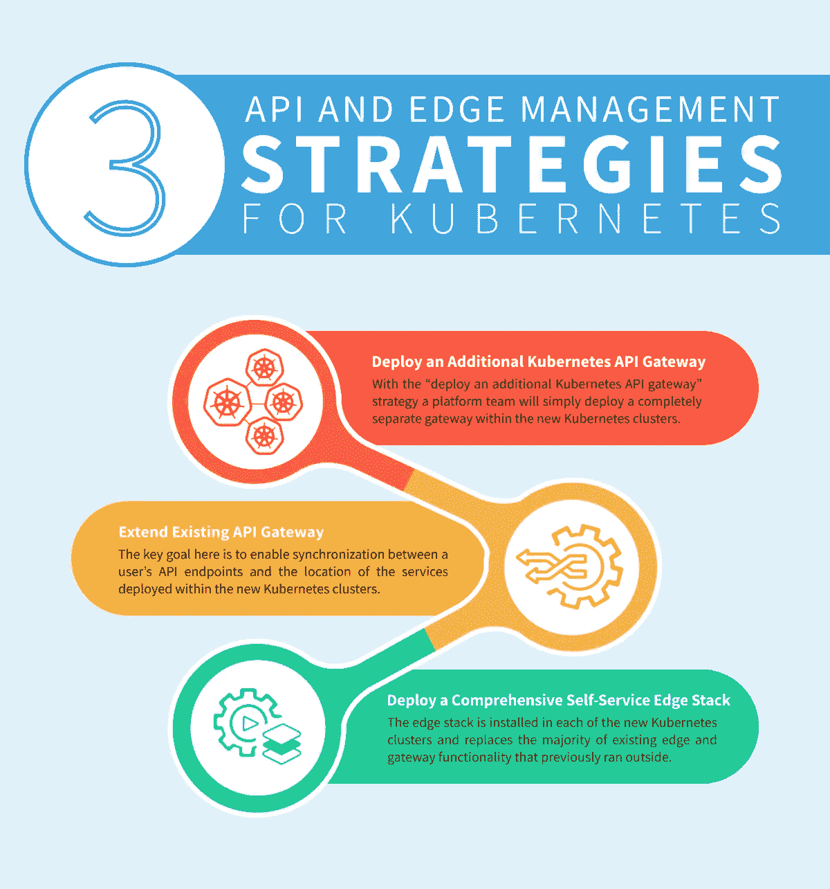
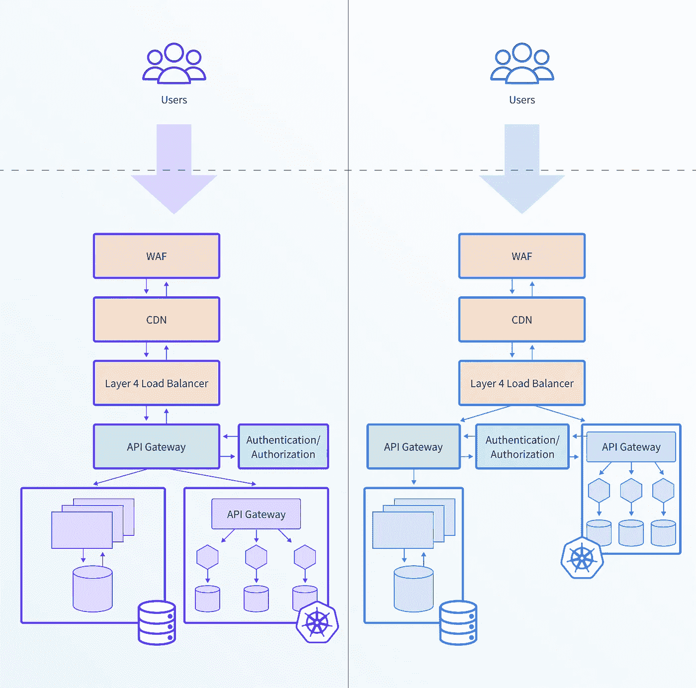
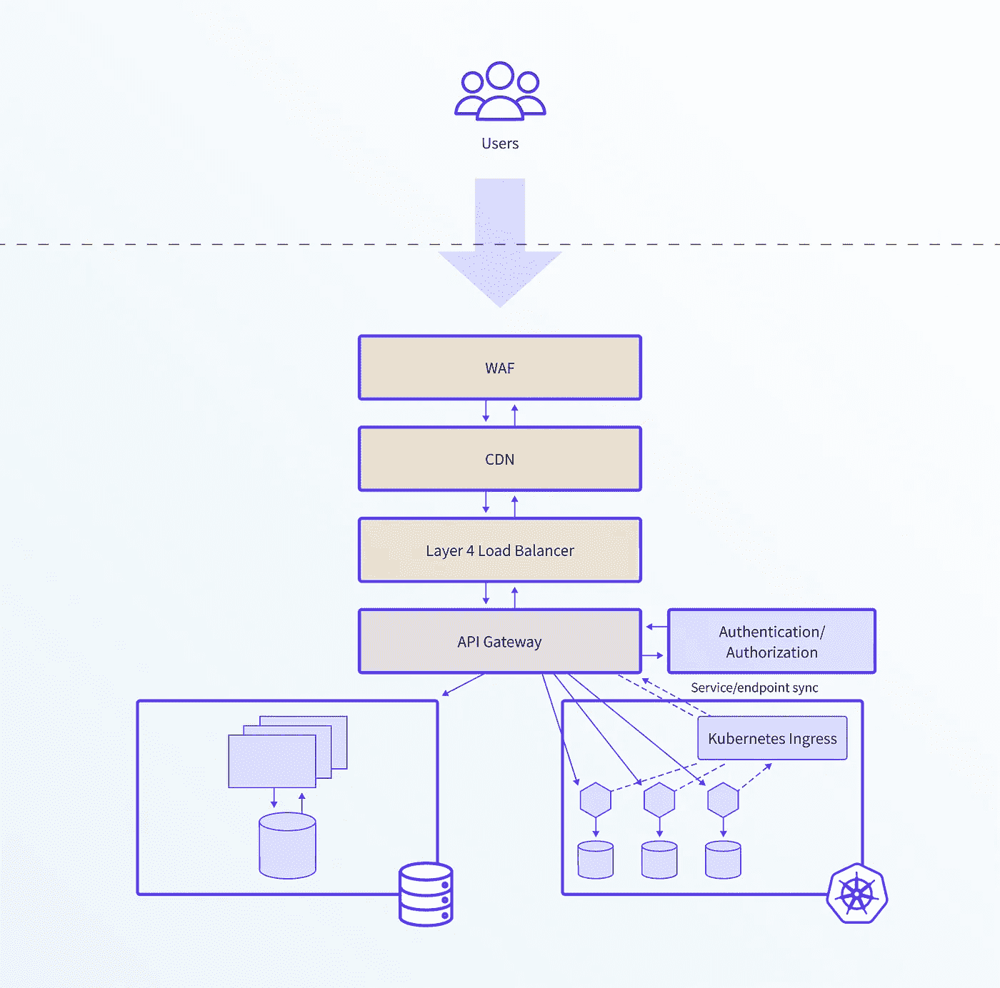
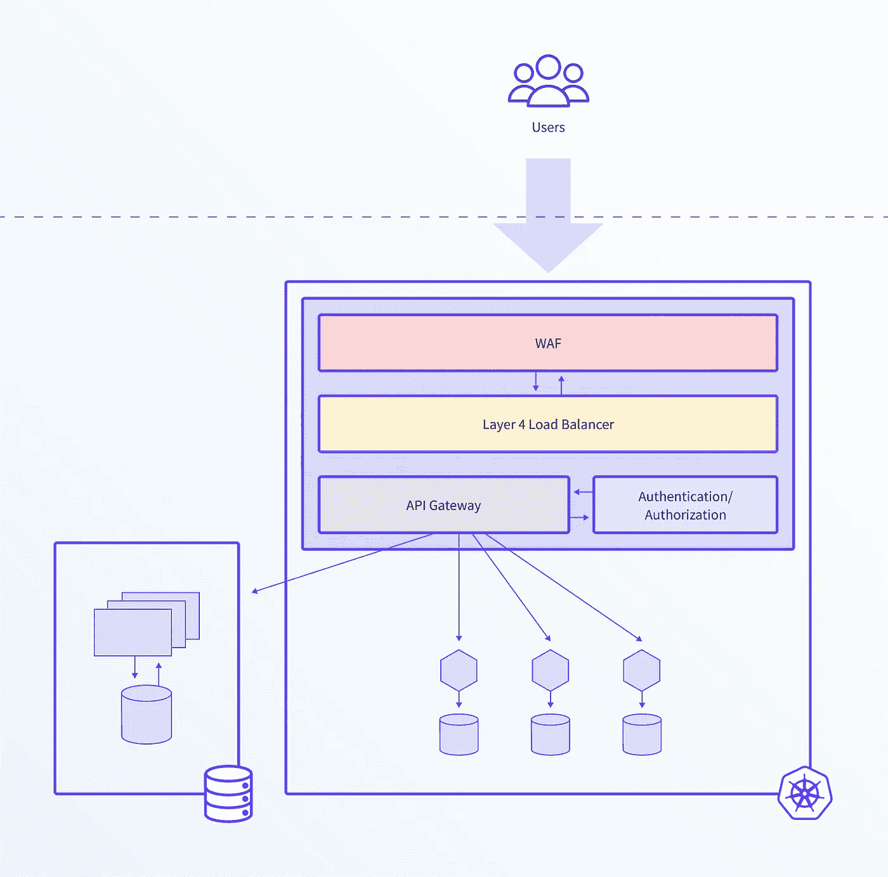

# 使用 Kubernetes 管理 API、Ingress 和 Edge 的三种策略

> 原文：<https://itnext.io/three-strategies-for-managing-apis-ingress-and-the-edge-with-kubernetes-1a5422d1f40a?source=collection_archive---------9----------------------->

## 部署额外的 k8s 网关、扩展现有网关或部署全面的自助服务边缘堆栈

将应用程序重构为容器中的微服务风格的架构包，并部署到 Kubernetes 中，这为 edge 带来了几个新的挑战。特别是，随着越来越多的微服务暴露给最终用户，edge 必须支持管理各种微服务的多种配置。有关这些挑战的更多信息，请参见文章“[采用 Kubernetes](https://www.getambassador.io/resources/challenges-api-gateway-kubernetes/) 时 API 网关面临的两个最重要的挑战”

本文探讨了工程团队在迁移到微服务和 Kubernetes 时可以应用的三种策略，以便有效地管理边缘:部署额外的 Kubernetes API 网关；扩展现有的 API 网关；以及部署全面的自助式边缘堆栈。

每个策略的演示都包括技术概述、相关利弊的讨论，以及在采用 Kubernetes 时解决方案如何应对 API 网关的两个主要挑战的分析。

# 策略#1:部署一个额外的 Kubernetes API 网关

顾名思义，这种策略的实现只需要在边缘部署一个额外的 API 网关。通常，一个基于 web 的应用程序已经存在了几个月以上的组织已经有了一系列提供边缘和 API 管理的组件，如第 4 层负载平衡器、Web 应用程序防火墙(WAF)和传统的 API 网关。通过“部署额外的 Kubernetes API 网关”策略，平台团队只需在新的 Kubernetes 集群中部署一个完全独立的网关。

实现这种策略有两种方法。第一种是在现有网关的正下方部署额外的 API 网关。这里，相关流量从现有网关转发到新的网关，并转发到适当的服务。第二种变化是在现有解决方案的“旁边”部署新的 API 网关。通过这种方法，流量从栈中较高位置的边缘组件(如第 4 层负载平衡器)转发到新网关，新网关再将流量转发到 Kubernetes 服务。

一旦采用了这种策略，就可以使用两种方法之一来操作和维护它。在一些组织中，现有平台或基础设施团队将负责部署和维护新网关。其他时候，一个完全独立的团队将拥有新的解决方案，或者将责任推给各个微服务开发团队。不管确切的组织结构如何，许多需要对边缘进行的例行更改将需要跨多个 API 网关和相关组件进行协调。

> ***要点:多部署一个 Kubernetes API 网关***
> 
> *这种策略很容易规划和实现:只需在现有解决方案的基础上部署和操作一个现有的特定于 Kubernetes 的 API 网关。然而，这种方法通常会给例行的 API 更改增加额外的管理和协调成本，并且在边缘处理额外的相互依赖的层会增加定位和修复故障所需的时间。*

# 体系结构

下图提供了“部署一个额外的 Kubernetes API 网关”策略的两个典型实现的架构概述。左图显示了部署在当前网关“下方”的新网关，右图显示了部署在现有解决方案“旁边”的新网关:

# 权衡取舍

下一节强调了“添加额外的 API 网关”策略的主要优点和缺点:

*优点*

*   对核心边缘基础设施的改动很小。这种策略通常允许使用所有现有的边缘组件。
*   通过同时维护两个网关，可以轻松支持基于 VM 的应用程序和基于 Kubernetes 的应用程序之间的增量迁移。
*   当在边缘遇到灾难性故障时，这种方法提供了有限的爆炸半径，例如，如果新的 API 网关遇到问题，只有基于 Kubernetes 的应用程序受到影响。

*缺点*

*   使用不同的组件会增加管理开销(和认知负荷),例如，每个 API 网关很可能有不同的 UI、SDK 或 API。
*   这种方法增加了运营开销，因为需要更新、维护和监控额外的关键任务 API 网关。
*   向每个独立的微服务团队公开边缘组件的完整功能可能是一项挑战(并且很难支持协调)。例如，如果现有的 API 网关用于身份验证，微服务团队可能无法直接对此进行配置。
*   对于所有的团队来说，理解由多个相似组件组成的新架构可能很困难。另一个相关的主题是，定位和调试边缘堆栈中出现问题的位置也是一项挑战。

# 应对挑战

要在此战略中扩展边缘管理，组织应实施“多层”边缘管理战略:

*   应该将尽可能多的边缘功能推入 Kubernetes API 网关，并直接向应用程序开发人员公开。这最大化了开发团队的灵活性和速度。
*   对于需要保持集中化的边缘功能，运营团队应该为应用程序开发人员创建一个工作流，并通过 SLA 提供支持。
*   应用程序开发团队应该在他们的发布计划中使用这些 SLA 来最小化发布延迟。
*   如果选择得当，额外的 Kubernetes API 网关可以提供支持各种微服务所需的广泛功能。这包括对 gRPC 和 gRPC-Web 等当代 L7 协议的支持，以及断路器和自动重试等可观察性和弹性功能。至关重要的是，对于较新的协议，现有的边缘组件应该配置为将特定路由上的流量传递到附加网关，以获得正确的功能。请注意，这种方法有一个折衷，因为对于这些路由，现有边缘堆栈的其余部分无法使用。

# 策略 2:扩展现有的 API 网关

“扩展现有 API 网关”策略是通过修改或扩充当前在生产中部署的现有 API 网关解决方案来实现的。这一修改的主要目标是支持用户访问的 API 端点和新 Kubernetes 集群中部署的相应服务的位置之间的同步。

在 Kubernetes 中，这通常是通过为现有的 API 网关或负载平衡器部署定制的入口控制器来实现的。入口控制器将解析 Kubernetes 入口配置，将入口配置转换为本机 API 网关格式，并通过各自的 API 配置 API 网关或负载平衡器。

> ***要点:扩展现有 API 网关***
> 
> *这种策略确保平台团队将只处理单个 API 网关和一组边缘组件。但是，这种方法需要修改现有的网关配置工作流，以避免在 Kubernetes 集群之外运行的现有路由/服务与在新集群中部署的路由/服务之间的任何潜在冲突。*

# 体系结构

下图提供了“扩展现有 API 网关”策略的典型实现的架构概述。在此图中，入口控制器部署在集群中的一个独立 pod 上，读取 Kubernetes 入口配置。然后，将配置传递给现有的 API 网关/负载平衡器，后者部署在集群之外。

# 权衡取舍

下一节强调了“扩展现有 API 网关”策略的主要优点和缺点:

*优点*

*   该策略提供了使用现有 API 网关的能力；这项技术经过反复试验，平台团队对此很熟悉。
*   平台团队可以利用与内部基础架构和服务的现有集成，例如路由到新的内部 k8s 集群的硬件负载平衡器。
*   很少需要学习 Kubernetes 网络技术，特别是对于不与边缘或集群入口交互的开发团队。

*缺点*

*   现有的配置工作流将需要改变，以便为 API 网关配置保留单一的事实来源。
*   大多数定制入口控制器通过 Kubernetes 注释公开有限数量的配置参数，并需要繁琐的配置映射或其他解决方法来配置更多高级选项。
*   可能需要对开发人员进行额外的教育和培训，尤其是入口控制器不具备的配置参数。

# 应对挑战

要使用这种 API 网关扩展策略扩展边缘管理，组织应该完全采用 Kubernetes 入口控制器指定的推荐配置方法，并从现有网关的传统 API/UI 驱动配置模型中脱离出来。此外，应该使用一组标准化的脚本，以便对运行在 Kubernetes 集群之外的服务的任何路由修改都不会与运行在新集群内部的服务发生冲突

在采用该策略之前，对微服务的当前和预期边缘需求进行架构路线图审查至关重要。确保现有的网关/负载平衡器支持这些需求，将避免需要添加另一个 API 网关来支持意外需求的情况。

# 策略#3:部署全面的自助式边缘堆栈

部署自助服务边缘堆栈包括使用 Kubernetes-native API 网关，该网关包含额外的集成支持边缘组件，如 WAF 和身份验证/授权。edge stack 安装在每个新的 Kubernetes 集群中，取代并整合了以前在集群外运行的大多数现有边缘和网关功能。

一旦部署了此策略，通常会看到平台团队负责底层基础架构组件(及其成功的操作和监控)，并提供“合理的默认值”来管理跨职能需求，如默认超时值、重试和电路断开。然后，独立的微服务团队被完全授权并负责配置边缘堆栈，作为其正常工作流程的一部分；例如，当部署一个新的服务时，开发团队还将指定路由配置，并覆盖现有的跨功能默认设置。

> ***要点:部署全面的自助边缘堆栈***
> 
> *使用这种策略可以确保平台团队只处理单一的 API 网关和整合的 edge 组件。使用 Kubernetes-native edge 堆栈还可以轻松集成该平台，并支持云原生最佳实践，如自助服务、声明式配置和配置的“单一来源”。*

# 体系结构

下图提供了“部署全面的自助式边缘堆栈”策略的两种典型实施的体系结构概述。

# 权衡取舍

以下部分重点介绍了“部署全面的自助式边缘堆栈”策略的主要优缺点:

*优点*

*   该策略提供了与新 API 网关和周围“云原生”栈的良好集成，例如 Kubernetes、服务网格和在线身份(IdP)代理。
*   边缘管理被简化为一个单一的堆栈，通过与任何其他 Kubernetes 配置相同的机制进行配置和部署。这可以让独立的微服务团队“自助”他们所有的配置更改。
*   这种方法允许工程团队采用云原生最佳实践，例如为边缘配置定义“单一事实来源”，支持动态/弹性基础架构，以及帮助快速配置更改(通过 GitOps 等方法)。

*缺点*

*   可能会有一个大的架构转变。现有的边缘组件将被替换，现有的网络架构和配置可能需要更改。
*   该策略将要求平台团队了解新的代理技术和潜在的新的边缘组件技术。
*   工程工作流程将会发生变化。例如，随着独立微服务团队能够配置 edge 以支持广泛的协议和架构，设计时和运行期间的责任也随之增加..

# 应对挑战

在自助式边缘堆栈策略中，每个微服务团队都有权维护特定于其每个微服务的边缘配置。边缘栈将分布式配置聚合成边缘的单个一致配置。为了支持边缘服务的多样性，采用构建在具有强大社区的现代 L7 代理上的边缘堆栈，例如云本地计算基金会的 Envoy 代理。社区的广度有助于确保边缘堆栈中的核心路由引擎能够支持多种用例。

# 摘要

当迁移到部署在新 Kubernetes 集群中的基于微服务的架构时，有三种主要策略来管理 API 和系统边缘。本文概述了三种方法:部署额外的 API 网关；扩展现有的 API 网关；以及部署自助服务边缘堆栈。

*这个故事最初出现在*[*https://www . getambassador . io/resources/strategies-managing-APIs-edge-kubernetes*](https://www.getambassador.io/resources/strategies-managing-apis-edge-kubernetes)