# TLS 迁移—更好的方法

> 原文：<https://itnext.io/tls-migration-a-better-way-10796a1b3a24?source=collection_archive---------3----------------------->

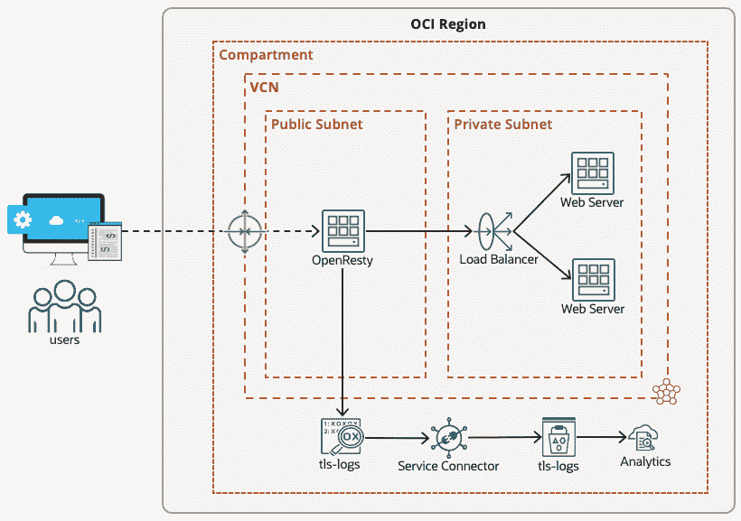

HTTPS 是必不可少的，因为它保护我们在互联网上的数据隐私。W3 的 2022 年报告显示，近 80%的网站使用 HTTPS 作为默认网络协议，比上一年增长了 6%。

开始使用 HTTP/TLS 相当简单。获得一个 CA 签名的证书，在你的 web 服务器和反向代理负载平衡器上配置它，你就可以开始了。但是，您如何确保您的配置符合当前的行业标准呢？

网络安全是一场军备竞赛。随着硬件和软件的发展，开发利用它们的工具和技术也在发展。这种激烈的竞争在很大程度上推动了我们今天在行业中看到的创新。

这与 TLS 有什么关系？自从 Netscape 在 90 年代开始使用 SSLv1 以来，已经有了许多版本，SSLv2、SSLv3、TLSv1.1、TLSv1.2，当前版本是 tlsv 1.3。tlsv 1.1 在 2021 年被弃用，大约每 5 年发布一次新版本。鉴于漏洞被发现的速度，这些发布周期也需要保持同步。

对于组织来说，这带来了许多有趣的挑战，因为你只能控制你支持的 TLS 版本。此外，如果你的网站或 API 是公开的，那么你很可能无法控制连接的客户端，或者他们可以使用哪些 TLS 版本。

那么，您如何知道何时取消对较旧的、不太安全的 TLS 版本的支持呢？在支持了几次迁移后，我了解到:

*   客户通常使用不再接收操作系统更新的设备，因此无法获得加密库和软件更新。这限制了他们能够使用的 TLS 版本。
*   API 到处都在使用。它们为从物联网设备到销售点系统，甚至洗车场的一切事物提供动力(稍后将详细介绍)。这些设备经常被安装、遗忘，或者没有更新，或者不能接收更新。
*   企业系统很复杂，很难了解哪些组件支持哪些 TLS 版本，以及 HTTPS 请求来自哪里。
*   企业需要花费大量的时间来调查和改变他们的系统，因此需要大量的预先通知。
*   B2C 和 B2B 服务通知邮件经常被忽略。即使 it 部门明确表示他们需要采取行动，否则会面临服务中断的风险。
*   对 TLS 协议支持做出不知情或不明智的更改通常会导致客户投诉、品牌受损和不可避免的倒退。

对于这种性质的变化，我很快对充分的计划产生了欣赏。回到 2016 年，在一次 TLS 迁移中，一个我称之为 Bob 的人提出了一张支持票。Bob 想知道为什么他的洗车店的顾客不能使用他们的 EFTPOS 和信用卡付款。看着这张罚单，很明显他明显感到沮丧(说得轻松些)，这是可以理解的，因为这影响了他的业务收入。经过调查，我们确定他的洗车店运行的是 Windows XP 终端，可以进行 API 调用。请记住，Windows XP 已于 2014 年停产，但 Bob 对此一无所知，因为它们由另一家第三方维护。同样，在这种情况下，我们既没有 Bob 的详细信息，也没有他的第三方的详细信息，所以他没有收到 6 个月前发生这种变化的通知。由此，为了最大限度地降低风险，企业认识到，我们需要采取更明智、更主动的方法，就此类关键服务变更与客户接洽。

# 挑战

大多数人都熟悉 Web 服务器、负载平衡器和反向代理的概念。这些基本上是终止、处理或路由 HTTP 流量。此外，他们还可以执行 SSL 卸载和其他 web 加速任务。

大多数 web 应用程序和 API 需要伸缩能力，因此需要负载平衡器或反向代理。不利的一面是，他们将终止 HTTPS 连接，并建立一个新的连接到您的 web 服务器。因此，客户端 TLS 版本将仅记录在负载平衡器访问日志中，这意味着您只能确定特定版本的流量所占的百分比，以及您的终端设备可能提供的任何其他元数据，如 URL 和 IP 地址。

# 我已经记录了客户端 TLS 版本，这还不够吗？

如果您提供驱动关键业务流程的应用程序和 API，并且可以影响客户的收入流，那么中断将会导致许多令人头痛的问题。在进行迁移之前，您需要考虑:

*   我的客户中有多少比例会因为关闭特定版本而受到影响？
*   在这些客户中，有哪些是“大客户”？
*   我的客户对 TLS 迁移服务通知的响应速度有多快？
*   有什么交通是我不需要担心的吗？例如，机器人，或来自我的企业不在其中运营的外国的流量。

要回答这些问题，您需要能够将用户链接到特定的 TLS 版本，并地理定位他们的原始客户端 IP 地址；大多数云提供商的负载平衡器没有这些必需的日志功能。

# 扩展反向代理日志记录

我对这个问题的解决方案相当简单。它使用:

*   您现有的 OCI 租赁、VCN、子网和应用服务器。
*   运行 [OpenResty](https://openresty.org/) 作为 HTTPS 负载平衡器/反向代理的 Oracle Linux 8 虚拟机。
*   Lua 脚本扩展了 [OpenResty](https://openresty.org/) 的日志功能。
*   [Oracle 的统一监控代理](https://docs.oracle.com/en-us/iaas/Content/Logging/Concepts/agent_management.htm)将我定制的 JSON 日志收集到 [OCI 日志](https://docs.oracle.com/en-us/iaas/Content/Logging/Concepts/loggingoverview.htm)中。
*   一个[服务连接器](https://docs.oracle.com/en-us/iaas/Content/service-connector-hub/overview.htm)将我的定制日志推送到[对象存储](https://docs.oracle.com/en-us/iaas/Content/Object/Concepts/objectstorageoverview.htm)。
*   日志收集规则，将我的日志接收到日志分析中。
*   [日志分析](https://docs.oracle.com/en-us/iaas/logging-analytics/doc/logging-analytics1.html)中的仪表盘和日志浏览器，用于可视化数据。

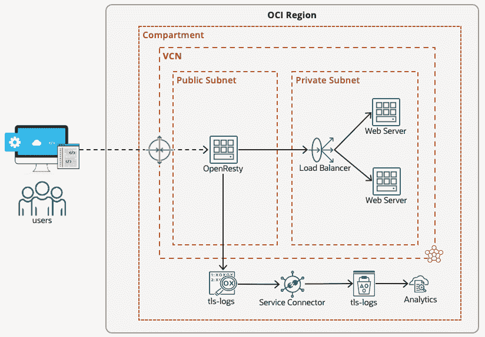

这种方法的伟大之处在于，它只需要对现有架构进行最小的改动，我可以利用 OCI 超酷的本地服务来完成日志收集和分析等繁重的工作。

# 设置和配置

我将向您展示如何配置 OpenResty 和其他必需的 OCI 服务。首先，我们需要创建我们的 VCN、子网和互联网网关:

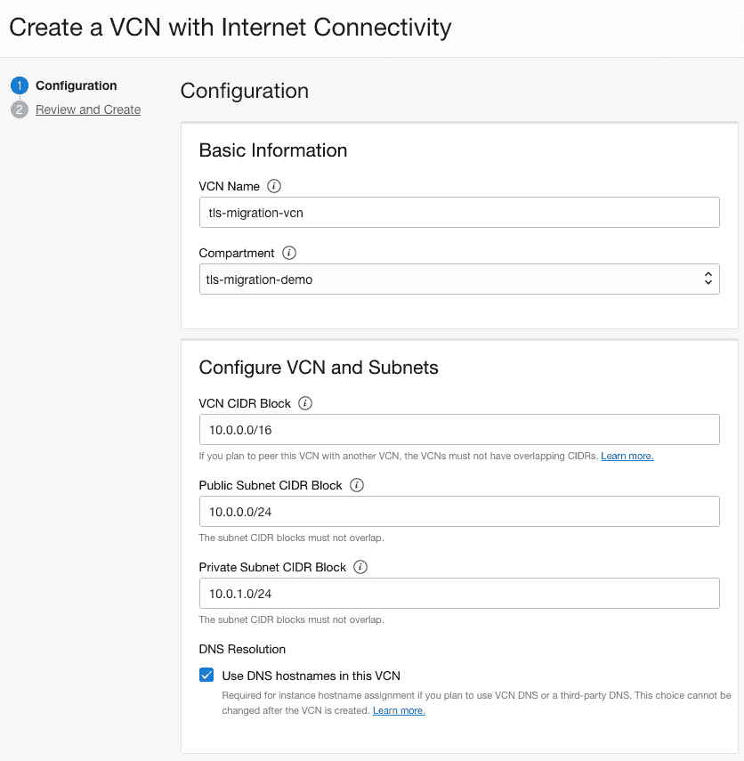

现在，我们需要向安全列表添加规则，以允许 TCP 443 (HTTPS)流量进入我们的公共子网:

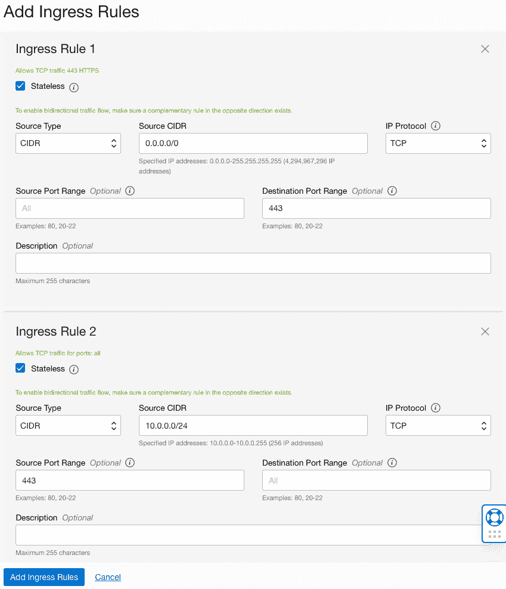

我使用无状态规则，因为这样更快，所以我添加了第二个规则来允许双向流。请注意，第二条规则的源 CIDR 是公共子网的 CIDR。您的规则应该是这样的:

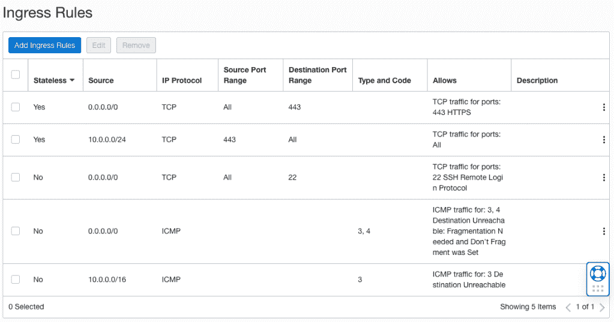

我还应该指出，默认情况下，SSH 被允许进入您的公共子网。对于生产环境，我建议删除这条规则，使用 OCI 的堡垒服务。

现在我要创建一个 Oracle Linux 8 虚拟机来运行 OpenResty。选择 Oracle Linux 8 作为映像，并确保选择具有足够 CPU、内存和网络资源的形状来处理传入的网络流量:

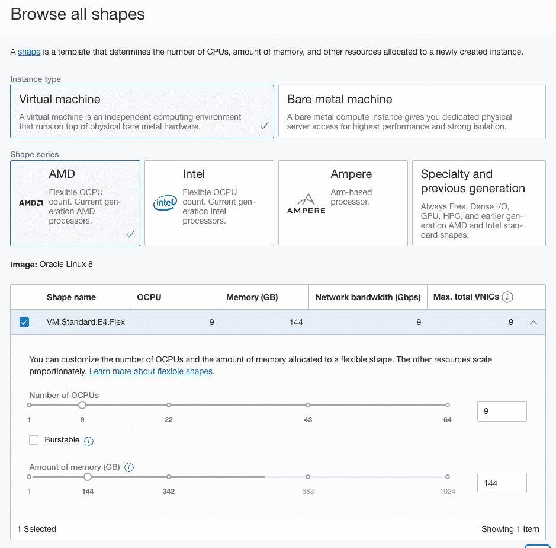

选择 VCN 的公共子网，确保选择了“分配公共 IPv4 地址”。您还需要上传一个现有的 SSH 公钥，或者下载一个随机生成的密钥。我的建议是使用随机生成的密钥，并且不要在不同环境之间重复使用密钥:

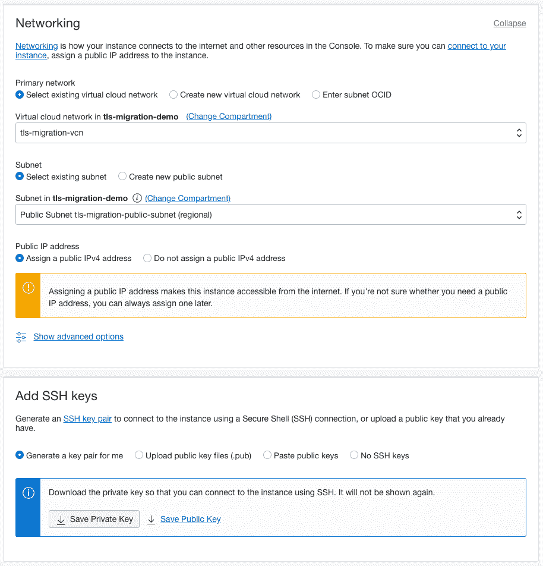

单击“创建”以调配计算实例。

如果您正在尝试这个演示，并且没有 web 服务器来转发流量，您可以按照这些说明创建另一个运行 Nginx 的 Oracle Linux 8 虚拟机。注意，您只需要按照“安装和启用 Nginx”一节中的说明进行操作。

现在我们想创建一个 OCI 负载平衡器，我们将使用它来代理 OpenResty 服务器和 web 服务器之间的流量。再次确保选择支持预期网络流量的形状:

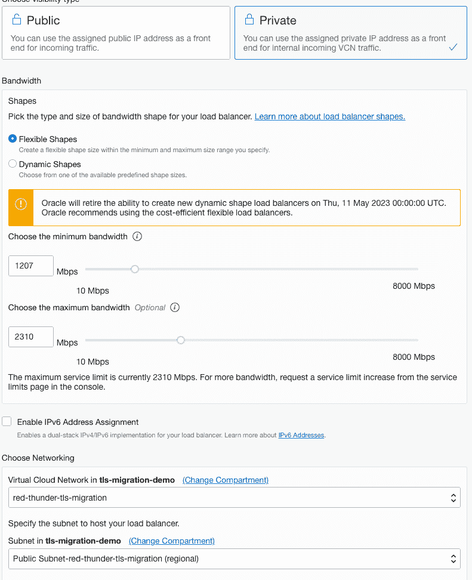

添加您创建的后端 web 服务器:


配置 HTTPS 监听器。如果您没有 SSL 证书，您可以使用以下方式生成自签名证书:

```
$ openssl req -x509 -newkey rsa:4096 -keyout key.pem -out cert.pem -sha256 -days 365
```

选择“负载平衡器管理的证书”并上传证书、私钥，然后输入私钥的密码。

如果需要，您可以选择启用日志记录。单击提交创建负载平衡器。创建 IP 地址后，请记下它，因为我们很快就会用到它。

现在我们将在虚拟机上安装 OpenResty。通过 SSH 或 OCI 堡垒服务连接到实例:

```
$ ssh -i ~/.ssh/[your ssh key].key opc@[ip address]
```

运行以下命令安装 OpenResty:

```
$ wget https://openresty.org/package/oracle/openresty.repo 
$ sudo mv openresty.repo /etc/yum.repos.d/ 
$ sudo yum check-update $ sudo yum install -y openresty-resty
```

在本地机器上，使用 scp 将 SSL 证书和密钥复制到 OpenResty 服务器:

```
$ cd /path/to/cert/folder $ scp -i ~/.ssh/[your ssh key].key *.pem opc@[ip address]:.
```

现在，在 OpenResty 虚拟机上，将证书文件复制到所需的位置。

```
$ sudo mkdir -p /etc/pki/nginx/private 
$ sudo cp cert.pem /etc/pki/nginx/ 
$ sudo cp key.pem /etc/pki/nginx/private/ 
$ sudo touch /etc/pki/nginx/private/key_password 
$ sudo vi /etc/pki/nginx/private/key_password
```

将私钥密码添加到文件中，保存并退出 Vi。

现在我们要替换 OpenResty Nginx 配置:

```
$ sudo rm /usr/local/openresty/nginx/conf/nginx.conf 
$ sudo vi /usr/local/openresty/nginx/conf/nginx.conf
```

添加以下代码块:

```
#user  nobody;
worker_processes  1;#error_log  logs/error.log;
#error_log  logs/error.log  notice;
#error_log  logs/error.log  info;#pid        logs/nginx.pid;events {
    worker_connections  1024;
}http {
    include       mime.types;
    default_type  application/octet-stream;
    sendfile        on;
    keepalive_timeout  65;include migration-server.conf;
}
```

保存并退出 Vi。现在我们不想从 Github 获取所需的 Nginx 配置和 Lua 文件。像往常一样，在运行之前检查从网上下载的任何代码。

```
$ cd /usr/local/openresty/nginx/conf/ 
$ sudo wget [https://raw.githubusercontent.com/scotti-fletcher/tls-migration/main/migration-server.conf](https://raw.githubusercontent.com/scotti-fletcher/tls-migration/main/migration-server.conf)
```

使用 Vi 编辑 migration-server.conf 文件，更新所需的行 server_name、ssl_certificate、ssl_certificate_key、ssl_password_file 和 proxy_pass。proxy_pass 值需要是您之前创建的负载平衡器的专用 IP 地址。

现在我们需要获得所需的 Lua 脚本:

```
$ sudo mkdir /usr/local/openresty/nginx/lua 
$ cd /usr/local/openresty/nginx/lua 
$ sudo wget [https://raw.githubusercontent.com/scotti-fletcher/tls-migration/main/request-logger.lua](https://raw.githubusercontent.com/scotti-fletcher/tls-migration/main/request-logger.lua)
```

在这个文件中，您可以定制您想要捕获的特定信息，在这个例子中，我涵盖了 HTTP 基本身份验证(针对 API)和 HTTP POST 参数，例如当用户登录时。根据您的使用案例和登录用户名参数，您可能需要更新该文件:

```
json = require("cjson")
local b64 = require("ngx.base64")
local ssl = require "ngx.ssl"local data = {request={}}
local req = data["request"]
req["host"] = ngx.var.host
req["uri"] = ngx.var.uri
if ngx.req.get_headers()['user_agent'] then    
    req['user_agent'] = ngx.req.get_headers()['user_agent']
else
    req['user_agent'] = 'Unknown'
end
if ngx.req.get_headers()['authorization'] then
    -- We're assuming the auth header is HTTP Basic & Base64 encoded, update as per your requirement
    auth_header = ngx.req.get_headers()['authorization']
    i, j = string.find(auth_header, " ")
    decoded_value = b64.decode_base64url(string.sub(auth_header, i+1))
    k, l = string.find(decoded_value, ':')
    username = string.sub(decoded_value, 1, k-1)
    req['api_username'] = username
end
tls_version, err = ssl.get_tls1_version_str()
req['client_ip'] = ngx.var.remote_addr
req['tls_version'] = tls_version
req["time"] = ngx.req.start_time()
req["method"] = ngx.req.get_method()
-- Customise to capture usernames on login
if ngx.req.get_post_args()['username'] then
    req['username'] = ngx.req.get_post_args()['username']
endlocal file = io.open("/usr/local/openresty/nginx/logs/tls.log", "a")
file:write(json.encode(data) .. "\n")
file:close()
```

现在我们需要创建日志来存储我们捕获的 JSON 数据:

```
$ sudo touch /usr/local/openresty/nginx/logs/tls.log 
$ sudo chmod 666 /usr/local/openresty/nginx/logs/tls.log
```

我还建议为 tls.log 文件设置 Logrotate。

现在我们需要启用本地防火墙来允许端口 443 上的 TCP 流量:

```
$ sudo firewall-cmd --zone=public --permanent --add-port=443/tcp 
$ sudo firewall-cmd --reload 
$ sudo firewall-cmd --list-ports
```

现在，您应该能够在 web 浏览器中浏览您的站点了。如果您选择了自签名证书，则需要接受浏览器证书警告消息。您应该会看到一个类似如下的页面:

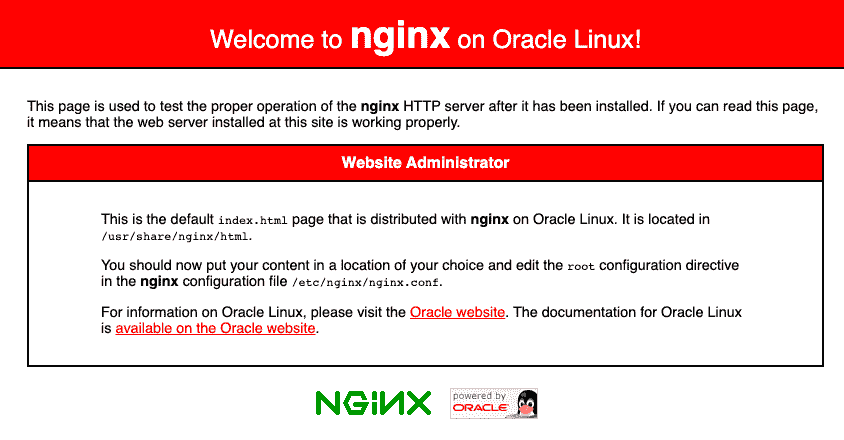

现在，我们将模拟一些流量，以演示捕获和记录。首先，我们将发送一个 API 请求:

```
$ curl -k -X POST -u "scott:password" -H "Content-Type:text/json" --tlsv1.3 --tls-max 1.3 https://[Public IP Address of the OpenResty Instance]/auth
```

如果我查看 tls.log 文件，我可以看到:

```
{"request":{"user_agent":"curl\/7.79.1","method":"POST","api_username":"scott","tls_version":"TLSv1.3","time":1657766981.205,"client_ip":"redacted","host":"redacted","uri":"\/auth"}}
```

如果我发出另一个模拟浏览器登录的请求:

```
$ curl -k -X POST -d "username=jackson" -d "password=test123" -H "Content-Type:application/x-www-form-urlencoded" --tlsv1.3 --tls-max 1.3 https://[Public IP Address of the OpenResty Instance]/login
```

我可以看到:

```
{"request":{"user_agent":"curl\/7.79.1","username":"jackson","method":"POST","tls_version":"TLSv1.3","time":1657767062.466,"client_ip":"redacted","host":"redacted","uri":"\/login"}}
```

我还可以调整使用的 TLS 版本:

```
$ curl -k -X POST -u "scott:password" -H "Content-Type:text/json" --tlsv1.0 --tls-max 1.0 [https://redacted/auth](https://redacted/auth)
```

我可以在我的 JSON 日志中看到 TLS 版本:

```
{"request":{"user_agent":"curl\/7.79.1","method":"POST","api_username":"scott","tls_version":"TLSv1","time":1657767151.891,"client_ip":"redacted","host":"redacted,"uri":"\/auth"}}
```

在这一点上，您希望确保只记录最低限度的需求。默认情况下，脚本只包含您指定的值。我建议不要捕获和记录所有的帖子参数，因为你可能会捕获敏感的 PII。

现在，我们需要接收我们的日志，这样我们就可以做出我前面提到的那些明智的决定。首先，我们需要创建一个动态组:

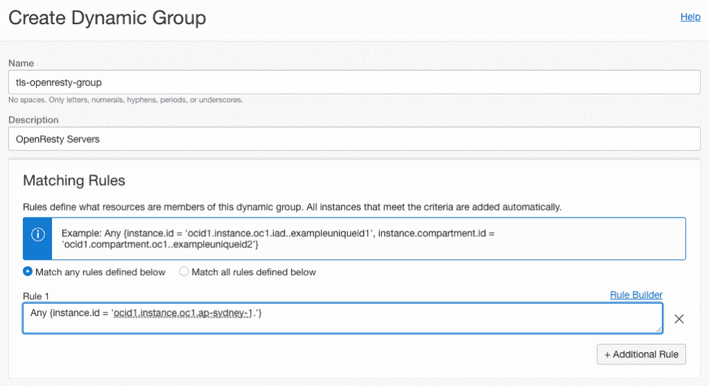

现在我们创建一个日志组:

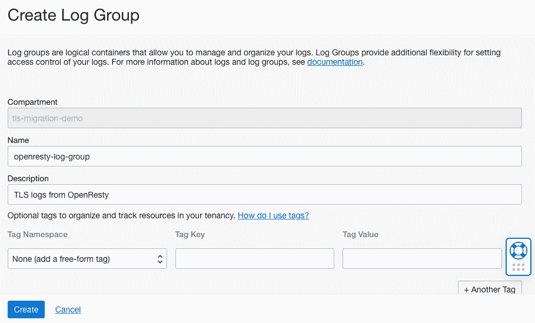

现在我们创建一个自定义日志:

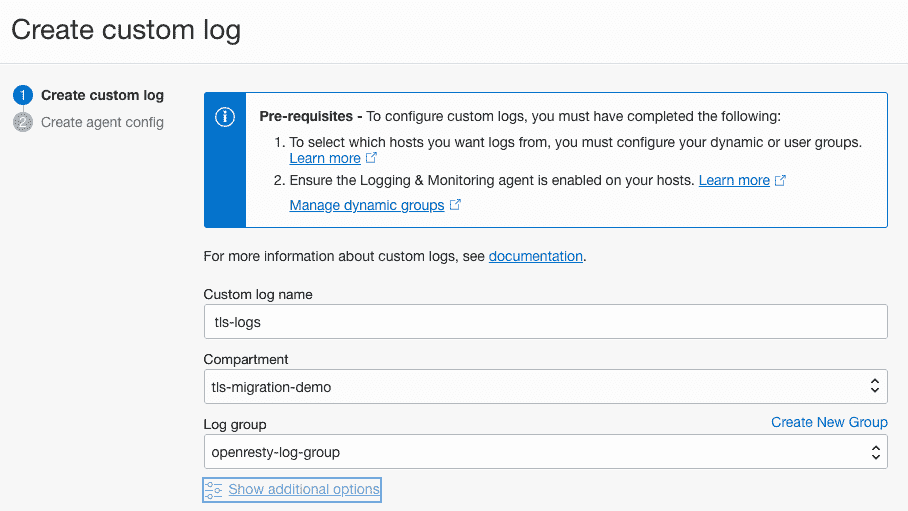

现在我们添加一个代理配置来收集我们的定制 JSON tls.log:

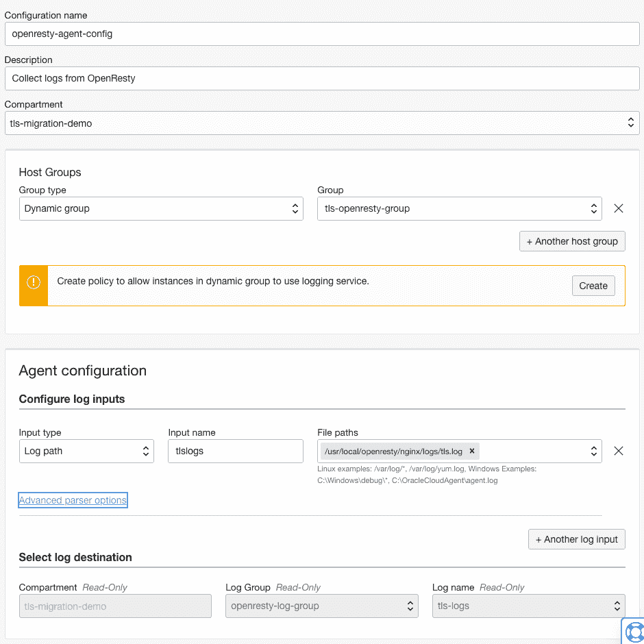

确保您单击了“创建策略以允许动态组中的实例使用日志记录服务”在“高级解析器选项”下，确保选择了 JSON:

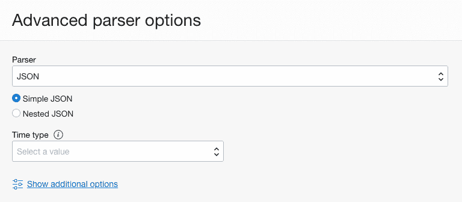

通过选择 JSON 作为解析器，我的 JSON 日志将被正确地导入到 OCI 日志中，这使得在日志分析中映射字段变得更加容易。

您的配置可能需要 30 分钟才能激活并开始收集日志，如果您想加快速度，您可以运行(在 OpenResty 虚拟机上):

```
$ sudo systemctl restart unified-monitoring-agent_config_downloader
```

然后，您应该能够在 OCI 日志中看到您的日志:


现在，我们需要创建一个存储桶来在日志记录和分析之间移动日志:

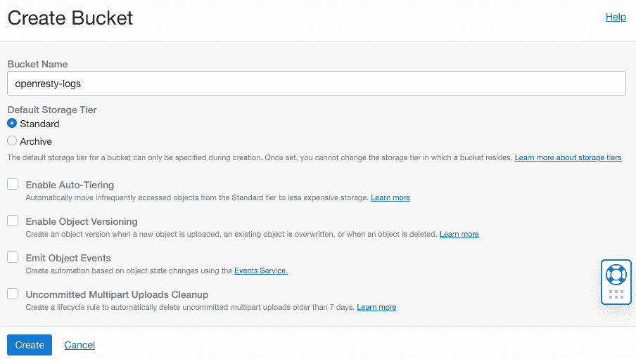

现在我们需要创建一个服务连接器来将日志移动到我们的存储桶中:

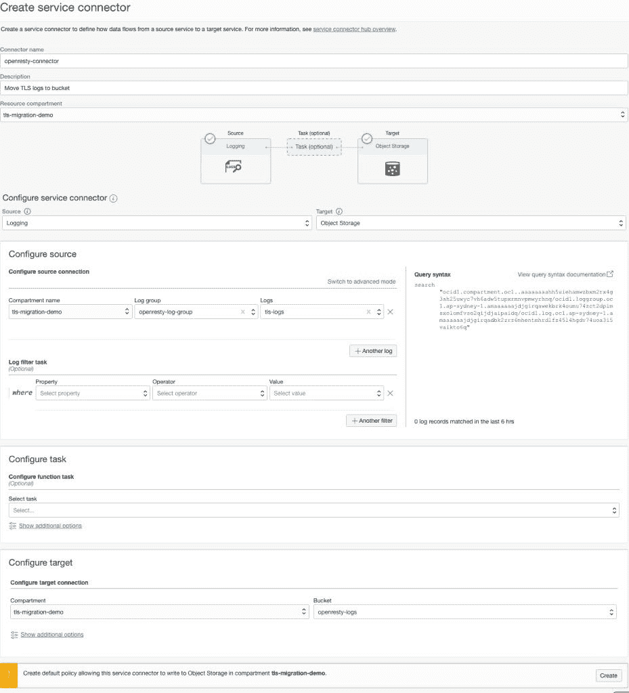

确保单击“创建默认策略”，然后单击“创建”。

现在通过 Curl，或者通过你的网络浏览器产生更多的流量。5–10 分钟后，您应该会在对象存储桶中看到日志:


在日志分析中，创建一个日志组来保存我们的 TLS 日志。我将我的日志称为“tls 日志”:

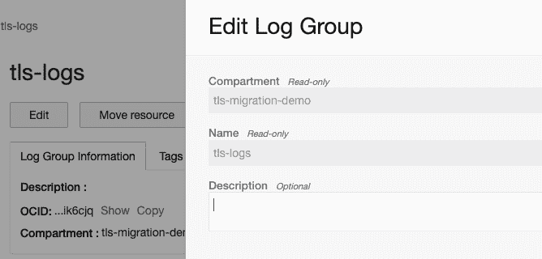

如果您尚未从 GitHub[https://GitHub . com/scotti-Fletcher/TLS-migration/blob/main/TLS-migration-Source . zip](https://github.com/scotti-fletcher/tls-migration/blob/main/tls-migration-source.zip)中检索到日志分析日志源和解析器配置，请下载该配置

点击“导入配置内容”，选择 ZIP 文件，点击导入:

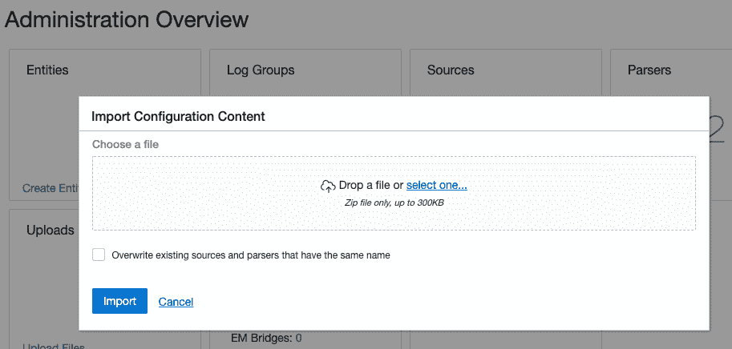

现在我们需要创建一个对象收集规则，该规则允许从我们的 openresty-logs 桶中收集日志，并将它们加载到我们的 tls-logs 日志组中。

```
$ oci log-analytics object-collection-rule create --name tls-collection-rule --compartment-id [Your Compartment OCID] --os-namespace [Your Object Storage Namespace] --os-bucket-name openresty-logs --log-group-id [The OCID of the tls-logs Log Group] --log-source-name tls-migration-source --namespace-name [Your Object Storage Namespace] --collection-type HISTORIC_LIVE --poll-since BEGINNING
```

CLI 应该返回一个 JSON 响应，表明您的规则创建成功。您还应该能够看到创建的事件规则:


如果您还没有从 GitHub[https://GitHub . com/scotti-Fletcher/TLS-migration/blob/main/TLS-migration-Dashboard . JSON](https://github.com/scotti-fletcher/tls-migration/blob/main/tls-migration-dashboard.json)下载日志分析仪表板。您需要找到“ENTER_COMPARTMENT_ID”的所有值，并将其替换为要创建仪表板的车厢的 OCID。

使用 CLI 运行以下命令。您还需要更新您想要创建仪表板的区域的端点的 URL:

```
$ oci raw-request --target-uri https://managementdashboard.ap-sydney-1.oci.oraclecloud.com/20200901/managementDashboards/actions/importDashboard --http-method POST --request-body file://tls-migration-dashboard.json
```

然后，您应该能够查看您的仪表板和数据:

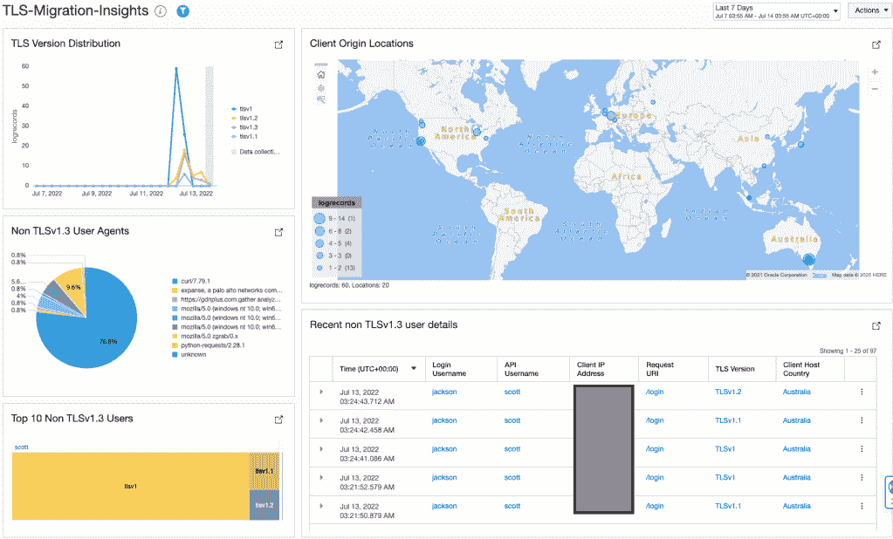

我创建的仪表板显示了您的流量来源、一段时间内的流量数量、版本、正在连接的非 TLSv1.3 用户代理，以及有关哪些 API 和基于 Web 的用户未通过 TLSv1.3 进行连接的信息。

从这里开始，你将能够回答那些早先的问题:

*   我的客户中有多少比例会因为关闭特定版本而受到影响？
*   在这些客户中，有哪些是“大客户”？
*   我的客户对 TLS 迁移服务通知的响应速度有多快？
*   有什么交通是我不需要担心的吗？例如，机器人，或来自我的企业不在其中运营的外国的流量。

如果您有其他具体问题，可以使用日志资源管理器编写自己的自定义查询。要查看仪表板中使用的查询，请单击每个小部件右上角的按钮。

# 一些最后的想法

TLS 迁移可能会很困难！希望我已经向您展示了如何解决这个问题，做出更好的决策，并帮助您的客户迁移到更强的 TLS 版本。

从这里开始，您可以轻松地扩展解决方案，使其包含一个无服务器功能，当发现客户使用较旧的 TLS 版本时，可以向他们发送电子邮件。

根据您的应用程序/ API，您可能希望只捕获存在用户名的请求，例如 web 浏览器的/login，或者 API 的特定 URL。这可以通过修改 Lua 代码很容易地实现:

```
if req["uri"] = '/login' then
    -- do something here
end
```

为了简单起见，我的演示只有一个 OpenResty 实例。如果您要在生产环境中使用它，我建议您设置 HA，这样就不会有单点故障。

最后，OCI 日志是简单的，易于使用，快速设置。管理第三方代理和日志记录基础架构、收集日志并分析它们需要大量时间。OCI 通过其统一监控代理和本地服务为您完成了几乎所有这些繁重的工作。


*原载于 2022 年 7 月 19 日*[*http://red thunder . blog*](https://redthunder.blog/2022/07/19/tls-migration-a-better-way/)*。*