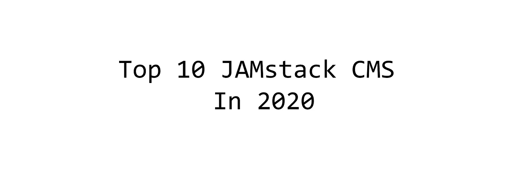

# 2020 年十大 JAMstack CMS

> 原文：<https://itnext.io/top-10-jamstack-cms-in-2020-4a3512e24541?source=collection_archive---------3----------------------->

**Google** 一直在改进其 Javascript 抓取和渲染能力。这影响了越来越多的开发人员尝试使用 JAMstack 架构来构建更快、更精简的网站，以取悦搜索引擎和访问者。

此外，由于搜索引擎优先考虑速度作为他们的首要排名因素之一，静态的，预先呈现的网站，如您可以使用 JAMstack CMS 构建的网站，正在成为现代开发人员工具箱中的主要工具之一。

在之前的一篇文章中，我们重点介绍了 JAMstack 生态系统中的一些先驱[以及 JAMstack 为](https://agilitycms.com/resources/posts/top-jamstack-pioneers)[开发者](https://agilitycms.com/product/developers/)和[营销者](https://agilitycms.com/resources/posts/what-is-jamstack-and-why-should-you-care-as-an-editor/)带来的机遇。
在这一篇中，我们将讨论 10 款 JAMstack 就绪型 CMS，值得您在 2021 年及以后的计划中参考。

# 无头 CMS 101

无头 CMS 架构在开发世界中势头越来越猛，这并不奇怪。一个无头 CMS 使开发者和营销人员能够更快地构建更好的数字体验，并且成本很低。

与传统的 CMS 相比，Headless CMSs 采用了一种不同的 web 开发方法。一般来说，无头 CMS 首先关心的是数据，其次才是设计，这意味着你添加到 CMS 的所有内容都独立于网站，以 API 连接的数据结构存在。这些 API 驱动并向任何渠道和设备提供内容，这使得 headless CMSs 成为寻求提供全渠道体验的公司和品牌的首选架构。

**阅读更多:** [为什么无头 CMS 架构如此受欢迎？](https://agilitycms.com/resources/posts/why-is-a-headless-cms-architecture-so-popular)

# 为什么是 JAMstack？

JAMstack 体系结构为开发人员提供了一种开发软件的新方法，这种方法利用了客户端的静态呈现。通过在浏览器中呈现内容，静态网站可以访问预先呈现的 HTML 文件(提前缓存)以更快地显示内容。

在 JAMstack 生态系统中开发软件的主要优势之一是，您使用的每个工具、调用的每个 API 以及构建的 Javascript 框架都是相互连接的，并且彼此同步工作。因此，在制作网站时，你不必在技术和兼容性问题上纠缠不清。

**阅读更多:**[jam stack 的异军突起](https://agilitycms.com/resources/posts/the-meteoric-rise-of-jamstack)

# 十大 JAMstack CMSs

JAMstack 旨在为前端开发人员提供设计和构建快速数字体验的工具。此外，当您将 JAMstack-ready CMS 添加到等式中时，您将获得营销人员友好性、更好的编辑选项、更多的功能和社区支持。

让我们来看看 JAMstack CMS 的 10 大精选。

## 敏捷 CMS

[**敏捷 CMS**](https://agilitycms.com/) 把内容放在开发过程的前端和中心。通过采用内容优先的方法，Agility CMS 使用户能够比市场上其他 JAMstack 就绪的 CMS 更快地构建数字体验。

## 概观

在 JAMstack 方面，Agility 是少数几个内置页面管理的 JAMstack headless CMSs 之一，它允许开发人员选择内容编辑器将使用哪些属性，从而简化了内容编辑。此外，Agility CMS 允许您选择任何 Javascript 框架，并使用静态站点生成器(如 Gatsby 和 NextJS)对其进行设置。

> Agility CMS 最适合想要全渠道方法的内容编辑。

## 斯特拉皮

[**Strapi**](https://strapi.io/) 是基于 Node.js 的开源无头 CMS，Strapi 使用 GraphQL 获取和查询数据，更快地跨渠道交付内容。Strapi 为用户提供了基于角色的访问控制、丰富的媒体库和令人愉悦的 UI。

## 概观

谈到 JAMstack 开发，Strapi 与市场上大多数静态站点生成器无缝集成，使开发人员能够创建各种可以使用插件扩展的数字内容。

> Strapi 适合有 Javascript 技能的前端开发人员。

## 满足的

[**Contentful**](https://www.contentful.com/) 避开了模板和固定的内容结构，为开发者提供了以自己的方式组织和构建内容的工具。Contentful 专注于为用户提供工具来构建最大化定制的定制内容模型。

## 概观

对于 JAMstack 开发者来说，Contentful 最稳定的特性之一就是 CMS 是建立在坚实的 CDN 之上的。内容与 JSON 紧密相关，这意味着它以标记格式交付内容，可供静态站点生成器和不同渠道使用，从而实现真正的全渠道策略。

> Contentful 适合熟悉 HTTP 请求和 JSON 响应的开发人员。

## DatoCMS

[**DatoCMS**](https://www.datocms.com/) 使用人工智能支持的内容标记和改进的搜索功能，为用户提供增强的数字资产管理。Dato 还附带了一个强大的图像编辑器，可以动态操作内容。

## 概观

从 JAMstack 的角度来看，DatoCMS 使开发人员能够轻松地创建树状数据结构，并简化内容编辑。DatoCMS 还帮助用户决定行政区的外观，因此平台对每个人来说看起来都更清晰。

> DatoCMS 适用于需要特定角色和权限系统的图片丰富的网站。

## 普里米克

[**Prismic**](https://prismic.io/) 使用户能够构建各种数字体验。从维基到博客文章，再到营销页面和 web 应用程序，Prismic 提供了可以在构建时预览的内容。

## 概观

从 JAMstack 的角度来看，使 Prismic 成为竞争者的是他们如何使用内容片来定义页面中的动态内容区域，从而使编辑能够自由地以他们需要的方式创作体验。此外，它们包括开箱即用的内容本地化的事实使它们成为可靠的 JAMstack 就绪的 CMS。

> Prismic 适合创建和编辑多语言网站。

## 内容堆栈

[**Contentstack**](https://www.contentstack.com/) 使非技术用户能够创建和优化全渠道内容体验，同时也为开发人员提供了构建强大前端系统的工具，以便在各种设备和平台之间分发这些内容。

## 概观

谈到 JAMstack CMSs，Contentstack 是另一个值得考虑的有力竞争者。Contentstack 为用户提供了强大的内容建模功能，并实现了与静态站点生成器的无缝集成，从而几乎可以立即创建各种数字体验。

> Contentstack 适用于具有定制内容模型或复杂页面结构的项目。

## 网络生活

[**Netlify**](https://www.netlify.com/) 是一款与技术无关的工具，可以自动化网站和应用程序的构建和部署过程。Netlify 简化了这一过程，并自动将更改部署到其定制的 CDN 中，这意味着您所需要的只是您选择的前端工具和 git 存储库。

## 概观

因为是它的创始人创造了 JAMstack 这个术语，所以没有这个工具就不会有 JAMstack 生态系统。所有基于 Netlify 构建的网站都是预构建的，这意味着它们加载速度更快，并且直接部署到全球边缘网络，用户无需做任何不同于其常规工作流程的事情。

> Netlify 适合需要快速构建和部署生产站点的开发人员。

## 宇宙的

[**Cosmic**](https://www.cosmicjs.com/) 是一个交叉兼容、可扩展的 headless CMS，它集成了 JAMstack 功能，让开发者能够简化开发并缩短生产时间。Cosmic 为用户提供了几十种模板来构建他们需要的一切，从简单的作品集网站到 Android 应用程序。

## 概观

Cosmic 有一个充满活力的用户社区，为用户提供了一个互相学习的地方，并利用这些知识来丰富他们的数字体验和他们构建的平台。类似地，Cosmic 允许用户上传他们自己的启动器，添加到他们提供给新用户的模板库中。

> Cosmic 对于需要一个可靠的网站启动器的用户来说是很好的。

## Directus

[**Directus**](https://directus.io/) 使用户能够通过连接 SQL 数据库和使用直观的平台部署数据来管理内容和数字体验，该平台还可以在不受限制的环境中满足非技术用户的需求。

## 概观

Directus 是一个开源的、数据库优先的 CMS，它使用户能够使用 API 连接不同的 SQL 数据库。此外，Directus 利用 JSON 标记语言让用户完全控制内容的生成、部署和使用。

> Directus 适合需要大量 SQL 支持的用户。

## 头脑清楚

[**Sanity**](https://www.sanity.io/) 允许用户在开源平台中编辑结构化内容，可以使用 Javascript 快速定制，使用户能够使用 JAMstack 架构，并使用任何 Javascript 框架构建数字体验。有了 Sanity，编辑可以轻松地修改结构化内容并将其作为常规数据使用。

## 概观

从 JAMstack 的角度来看，Sanity 是一个可靠的选择，因为它使用户能够从单一来源分发内容，处理工作流，以编程方式进行设计，并查询图像以获取元数据，从而实现更好的内容标记和与任何 DAM 的增强集成。

> 健全对于使用标记语言和结构化内容的团队来说是有益的。

# 那么，最好的 JAMstack CMS 是什么？

事实是，虽然大多数 JAMstack CMSs 都是相似的，但它们都是根据特定的功能和用例构建的。有些是为开发人员设计的，而有些，像 Agility CMS，是为开发人员和编辑人员设计的，给用户两个世界最好的东西。

最佳 JAMstack CMS 的构成因公司而异，但无论您选择哪种 CMS，您都需要清楚地了解您的优先事项以及您的业务发展方向，以便获得 JAMstack 架构的优势。

如果您对 JAMstack 架构如何帮助您变得更加敏捷有疑问，请观看本次网络研讨会 [**使用 JAMstack with Agility CMS**](https://agilitycms.com/resources/posts/using-jamstack-with-agilitycms) 或 [**YouTube**](https://youtu.be/8vbDWKqt4Eg) 。