# 可以帮助你作为一个网站开发者的顶级工具

> 原文：<https://itnext.io/top-tools-that-can-help-you-as-a-web-developer-30705c62455c?source=collection_archive---------6----------------------->

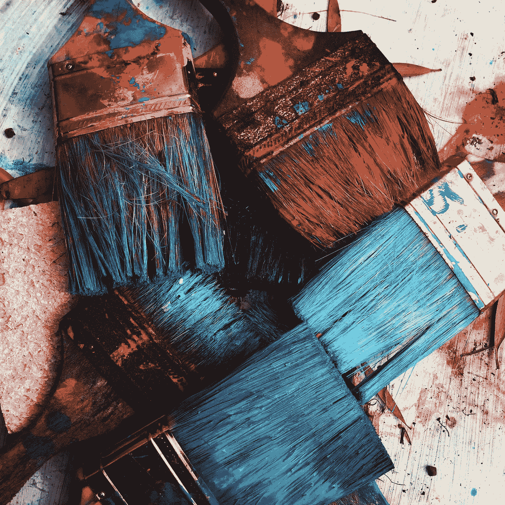

佛罗里达州本土民间艺术家朗达克在 [Unsplash](https://unsplash.com/s/photos/web-tools?utm_source=unsplash&utm_medium=referral&utm_content=creditCopyText) 上拍摄的照片

根据您所做的工作，经常会有一些工具在工作中帮助您。有些甚至可以日常使用。

这是我作为一名 web 开发人员工作时最常用的顶级资源的有序列表。

这个列表包含工具、网站甚至文章形式的资源。

> 它们的顺序是随机的，基于它们在我的书签中出现的顺序:)

# 碳

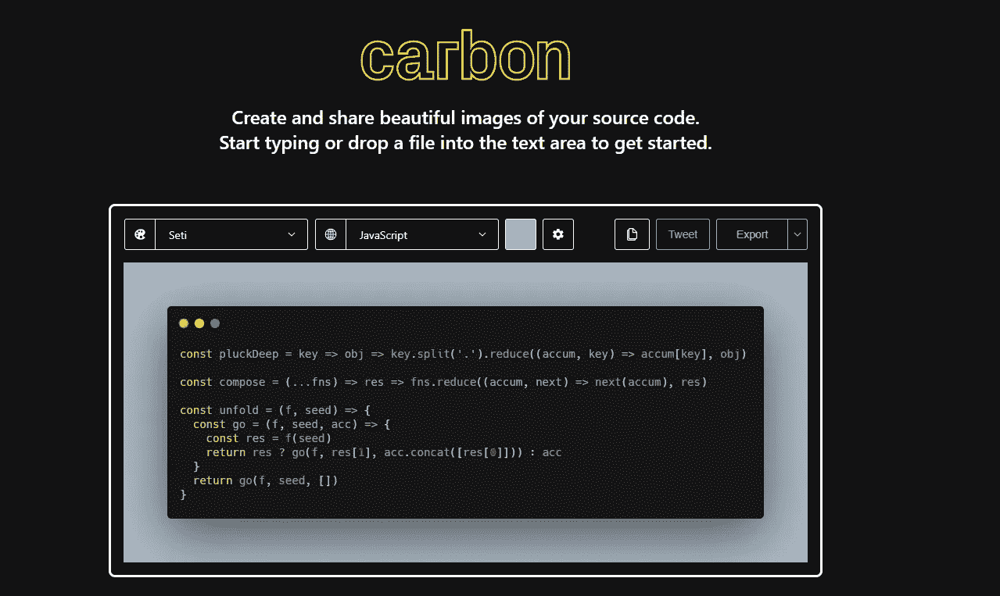

这个清单上的第一个工具是[碳](https://carbon.now.sh/)。正如他们的描述所说，Carbon 是一个共享源代码图像的工具。主要的好处是你可以分享一个代码片段的图像，同时，页面的 URL 会改变以反映你写的代码。

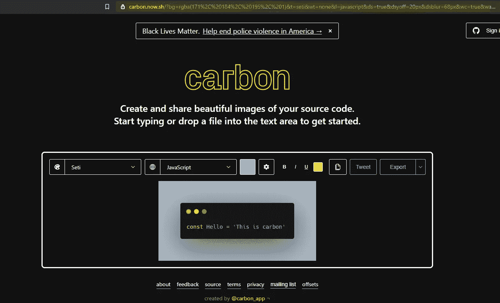

下面的[链接](https://carbon.now.sh/?bg=rgba(171%2C%20184%2C%20195%2C%201)&t=seti&wt=none&l=javascript&ds=true&dsyoff=20px&dsblur=68px&wc=true&wa=true&pv=56px&ph=56px&ln=false&fl=1&fm=Hack&fs=14px&lh=133%25&si=false&es=2x&wm=false&code=const%2520Hello%2520%253D%2520%27This%2520is%2520carbon%27)将带您到 Carbon，并用上图中的代码填充脚本选项卡。

所以你可以很容易地以图片的形式分享你写的代码和源代码的 URL。

# ResizeImage.net

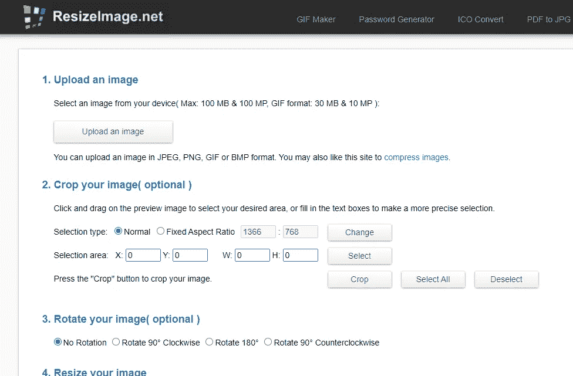

大多数时候，我们开发的网络应用程序也包含图像。通常，这些图像来自外部来源，并且具有最佳的分辨率和质量。问题是，我们不能以原始大小显示图像，因为这会使页面加载非常慢。因此，在使用它们之前，必须对它们进行优化。

ReizeImage.net 是一个可以帮助你实现这一目标的网络工具。虽然它有多个选项可用，选项号 **4。调整图像尺寸**和选项号 **7。** **优化你的形象(可选)**正是你需要优化你的形象。

# 菲格玛

谈到网页设计，Figma 现在是我的首选。

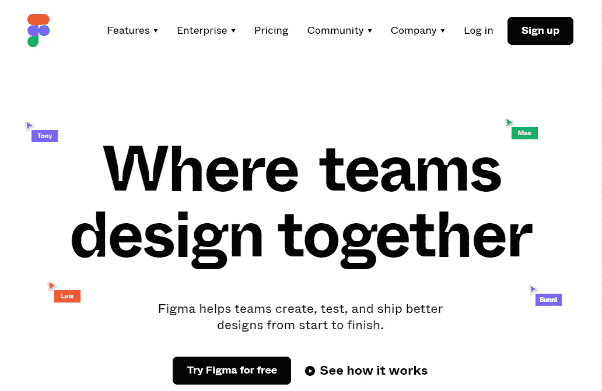

事实上，它是免费使用的，而且是一个网络应用程序，这让我尝试了一下。

丰富的选项板和出色的 UX 的易用性让我放弃了所有其他工具(Photoshop 和 Adobe XD ),坚持使用这个工具。

尽管它是一个 web 应用程序，但性能是惊人的。我从来没有因为 Figma 的突然意外崩溃而丢了工作，也从来没有遇到过性能问题。

当谈到网页设计，它有你需要的一切。

# 不溅

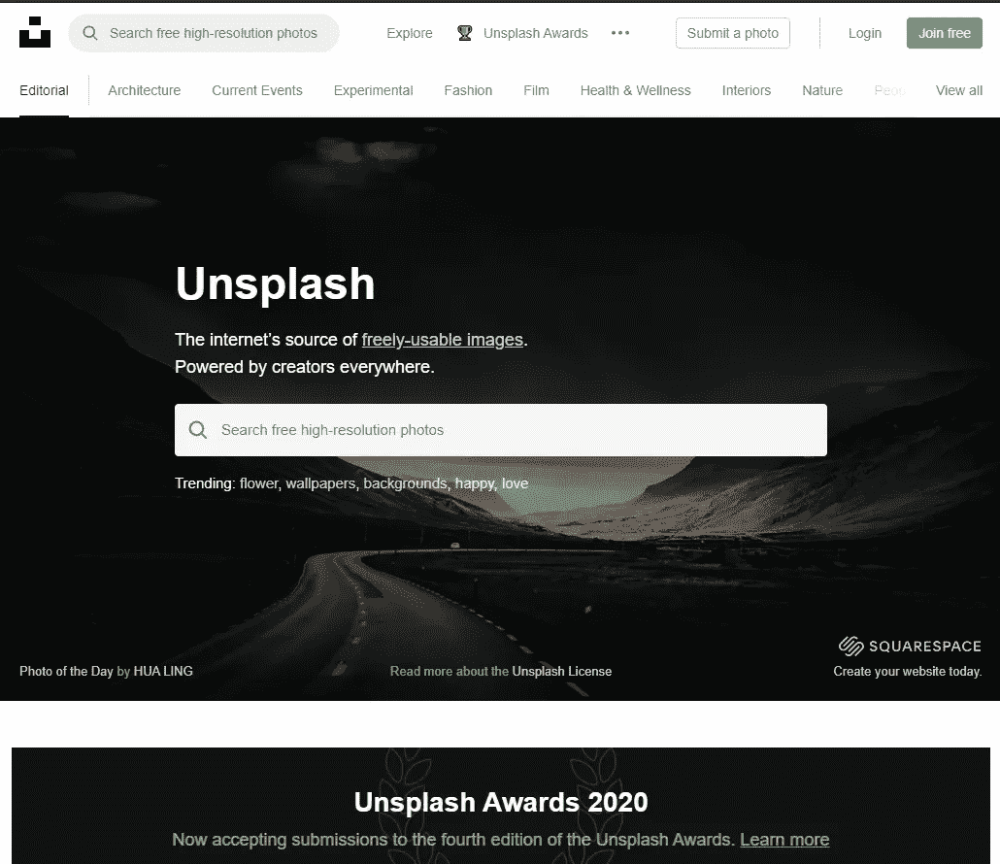

Unsplash 不再是一个新工具，我想可以肯定地说，我们大多数人都已经听说过它了。但是，几乎所有我在我的网站或文章中使用的图片都来自这个网站，所以它理应在这个列表中占有一席之地。

对于那些以前没有听说过这个网站的人来说…

Unsplash 是一个摄影网站，在这里你可以找到你可以在工作中使用的质量最好的免费照片。

但 Unsplash 与其他类似网站的区别在于，所有照片似乎都是由专业人士拍摄的，而且都非常漂亮。

# 捆绑恐惧症

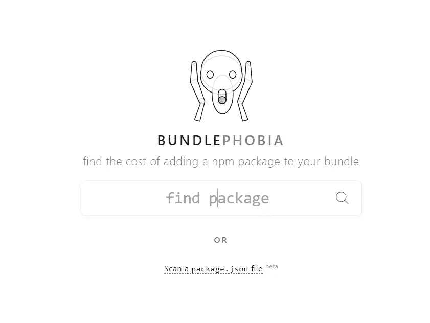

如果你想知道你添加到捆绑包中的 **npm** 包的成本，那么[捆绑恐惧症](https://bundlephobia.com/)就是你需要的工具。

只需输入您想要检查的包的名称，或者添加您的 **package.json** 文件，这个工具将向您展示对它的分析。

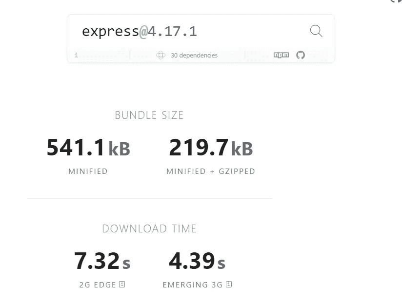

# 特雷罗

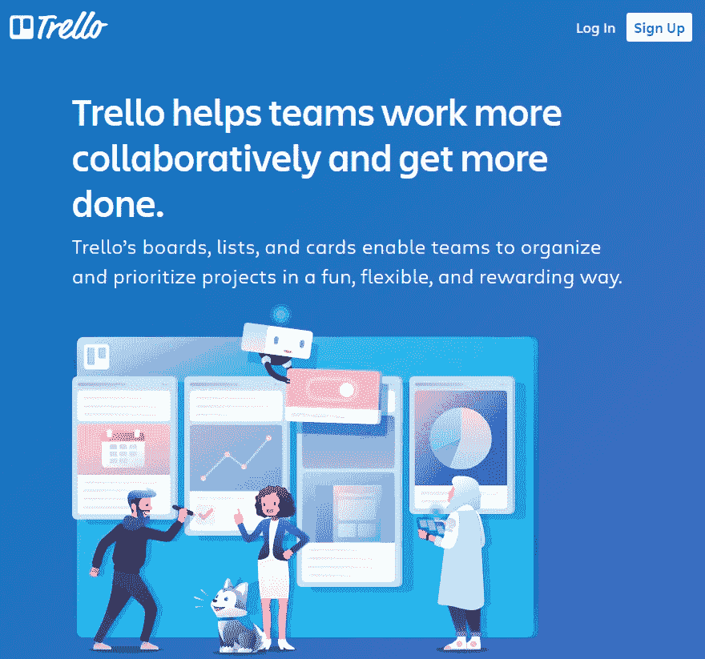

Trello 是一个免费的基于网络的看板式清单制作应用程序，可以用来跟踪你的团队执行的工作。

它像吉拉，但更小。

这个工具的易用性和良好的 UX 使它成为个人项目的一个好选择，但是它拥有的整套功能也使它成为团队的一个好选择。

您可以为想要管理的每个项目创建一个看板，然后您就有了一个看板样式的 UI，您可以在其中创建不同的卡片，这些卡片可以按列表进行分组。

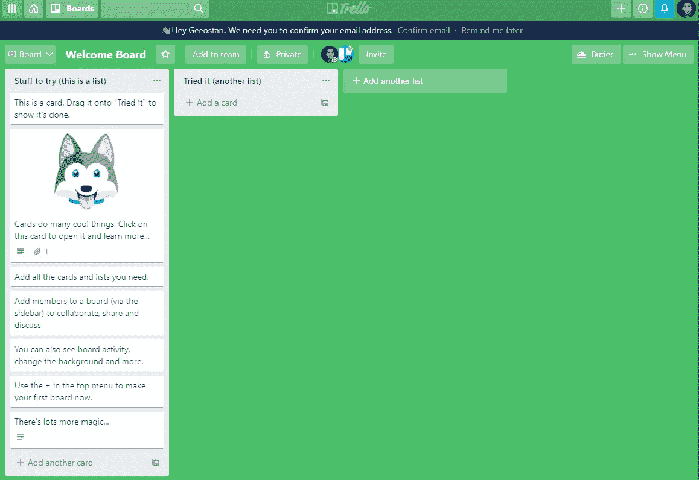

总的来说，我认为我在几乎所有的项目中都使用了它，它对跟踪需要完成的工作非常有用。

# 邮件测试仪

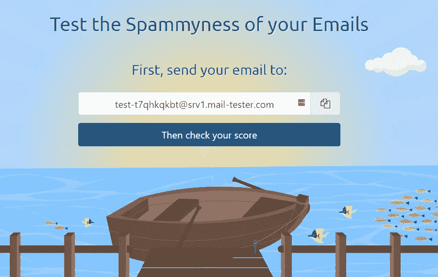

邮件测试器的故事很简单:一个便宜、简单、高效的方法来快速测试你的时事通讯或个人邮件的质量。

当我配置我的 VPS 与邮件服务器正常通信时，我发现这个要求非常困难，使这个设置如此难以实现的是，我有很少的选项来测试我正在做的设置。

几天后，我认为我做的一切都是正确的，我发现我的一些电子邮件没有被发送。

Mail-tester 正是针对这个问题开发的。它的工作原理很简单。

每次您访问他们的网页时，都会生成一个随机的电子邮件地址。你用那个电子邮件地址测试你的系统。

一旦电子邮件被发送到该地址，MailTester 将能够分析邮件、邮件服务器、发送 IP…并显示一份详细的报告，说明哪些配置正确，哪些配置不正确。

# 盒阴影生成器和 CSS 渐变生成器

说到 CSS，我发现有些属性很难记住语法。他们是`box-shadow`和`background`，带一个`linear-gradient`

如果你发现自己处于和我一样的情况，那么这些工具可能会帮助你。

BoxShadowGenerator 是一个 web 应用程序，它允许您交互地配置该属性，同时，您可以实际看到它的样子。

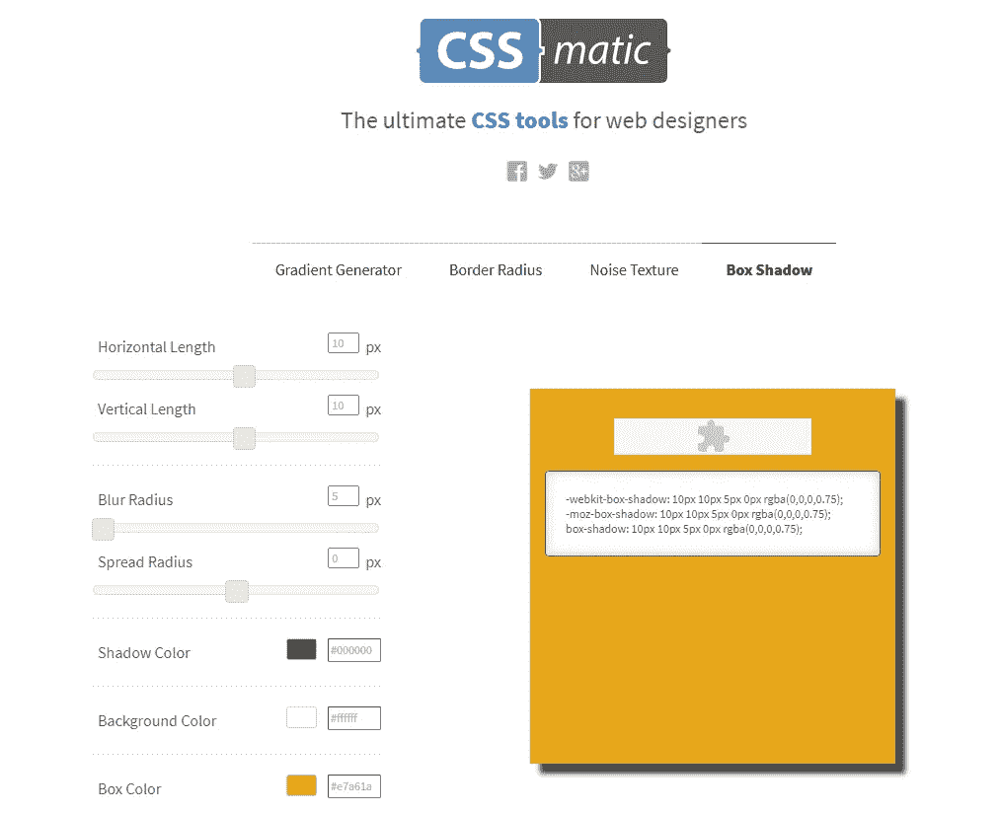

他们也有一个渐变生成器的标签，但是我发现 CSSGradient 应用程序对这项工作更有用

# CSS.gg

作为 web 开发人员，我们都知道 **Font Awesome。**不过，还有另外一组图标叫做 [CSS.gg](https://css.gg/) 虽然没那么流行，但是值得一试。

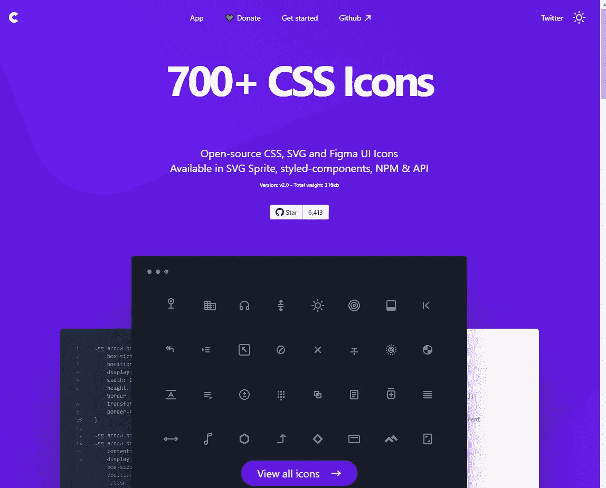

它有 700 多个图标，所有图标都有以下格式:

。css，。svg，。tsx，。图。xd，。json，。可扩展标记语言

它们是纯粹的 CSS 图标，仅由 CSS 伪元素制成。

这些图标在 Adobe XD 和 Figma 中也可以使用，所以你现在也可以在你的网站上使用你在设计中使用的图标。

因为它们是纯粹的 CSS 图标，所以它们非常轻量级，在你的包中几乎不占空间。

虽然这是一个加号，它也可以是一个减号。缺点是这些图标很难调整大小，简单的`font-size`或`width/height`在这种情况下帮不了你。

我知道这一点，因为我在我的一个项目中使用了这些图标，我自己也发现了这种局限性。起初，我认为改变图标的大小是不可能的，我想放弃使用它们，回到 FontAwesome，但后来，我找到了一种方法来调整它们的大小。诀窍是查看您想要使用的图标的 CSS 规则，并用 mixin 覆盖使用固定大小的属性。您可以使用 DevTools 来检查 CSS 规则，也可以直接查看源代码。

例如，这是我为了控制一个**人字形**图标的大小而做的覆盖。

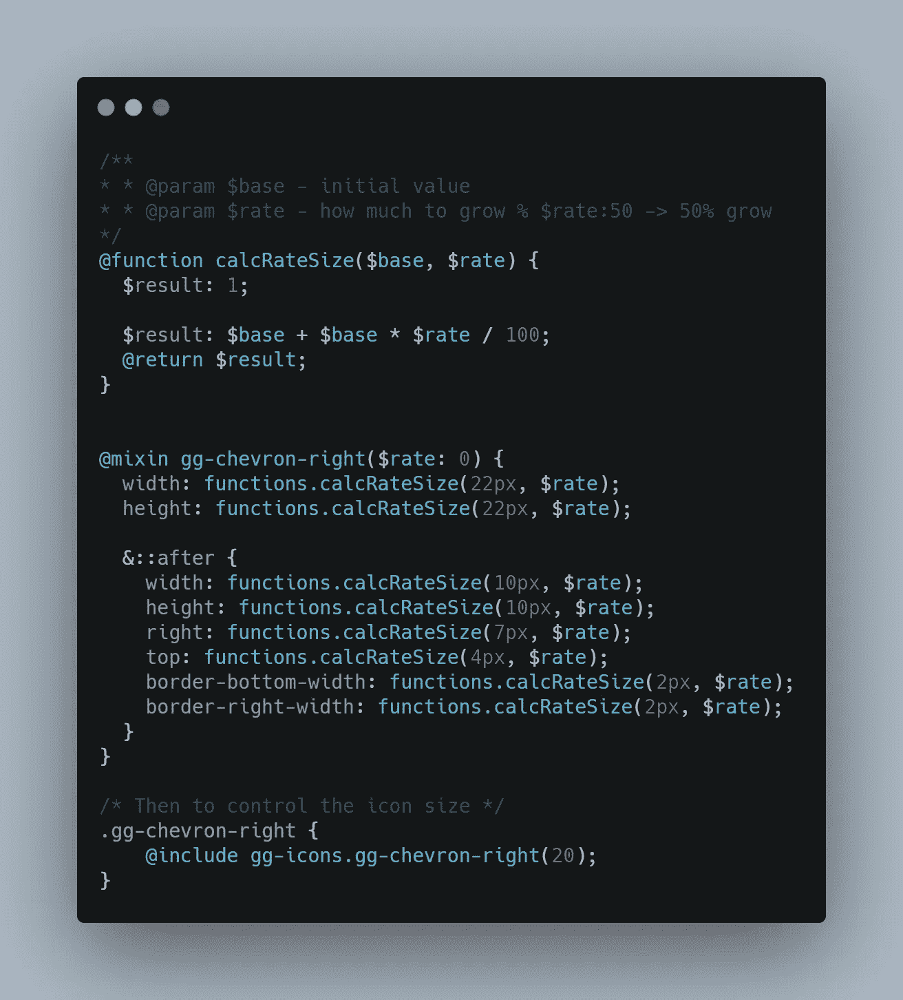

[代码](https://carbon.now.sh/?bg=rgba(171%2C%20184%2C%20195%2C%201)&t=seti&wt=none&l=css&ds=true&dsyoff=20px&dsblur=68px&wc=true&wa=true&pv=56px&ph=56px&ln=false&fl=1&fm=Hack&fs=14px&lh=133%25&si=false&es=2x&wm=false&code=%252F**%250A*%2520*%2520%2540param%2520%2524base%2520-%2520initial%2520value%250A*%2520*%2520%2540param%2520%2524rate%2520-%2520how%2520much%2520to%2520grow%2520%2525%2520%2524rate%253A50%2520-%253E%252050%2525%2520grow%250A*%252F%250A%2540function%2520calcRateSize(%2524base%252C%2520%2524rate)%2520%257B%250A%2520%2520%2524result%253A%25201%253B%250A%250A%2520%2520%2524result%253A%2520%2524base%2520%252B%2520%2524base%2520*%2520%2524rate%2520%252F%2520100%253B%250A%2520%2520%2540return%2520%2524result%253B%250A%257D%250A%250A%250A%2540mixin%2520gg-chevron-right(%2524rate%253A%25200)%2520%257B%250A%2520%2520width%253A%2520functions.calcRateSize(22px%252C%2520%2524rate)%253B%250A%2520%2520height%253A%2520functions.calcRateSize(22px%252C%2520%2524rate)%253B%250A%250A%2520%2520%2526%253A%253Aafter%2520%257B%250A%2520%2520%2520%2520width%253A%2520functions.calcRateSize(10px%252C%2520%2524rate)%253B%250A%2520%2520%2520%2520height%253A%2520functions.calcRateSize(10px%252C%2520%2524rate)%253B%250A%2520%2520%2520%2520right%253A%2520functions.calcRateSize(7px%252C%2520%2524rate)%253B%250A%2520%2520%2520%2520top%253A%2520functions.calcRateSize(4px%252C%2520%2524rate)%253B%250A%2520%2520%2520%2520border-bottom-width%253A%2520functions.calcRateSize(2px%252C%2520%2524rate)%253B%250A%2520%2520%2520%2520border-right-width%253A%2520functions.calcRateSize(2px%252C%2520%2524rate)%253B%250A%2520%2520%257D%250A%257D%250A%250A%252F*%2520Then%2520to%2520control%2520the%2520icon%2520size%2520*%252F%250A.gg-chevron-right%2520%257B%250A%2509%2540include%2520gg-icons.gg-chevron-right(20)%253B%250A%257D)

上面的代码片段将所有的**人字形右**图标的尺寸增加 20%

**CSS.gg** 非常适合那些包的大小非常重要的项目，而且肯定是 CSS.gg 是一个值得监控以进一步改进的项目。

# 掌握降价

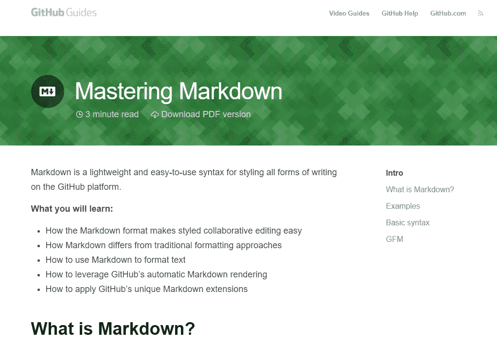

尽管我使用 markdown 为我所有的项目编写了 Readme 文件，但有时我还是会忘记语法。我想我需要添加 100 多个链接才能正确记住语法。

这就是为什么我发现这个[指南](https://guides.github.com/features/mastering-markdown/)对那些使用**的人很有帮助。md** 语法

# 谷歌字体

当谈到在我的一个项目中嵌入字体时，[谷歌字体](https://fonts.google.com/)是我的首选

你会在那里找到大多数可用的字体，你可以轻松地下载它们，或者你可以简单地选择你想要使用的字体，应用程序将为你创建一个嵌入链接，你可以在你的页面上使用。

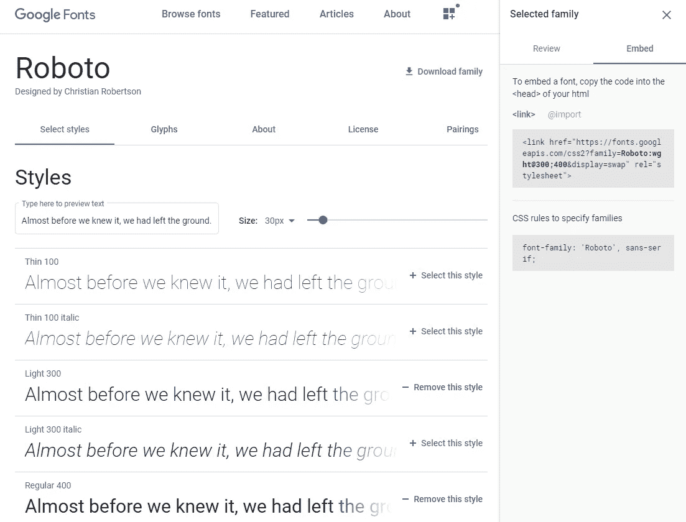

# 代码编辑器选择和扩展

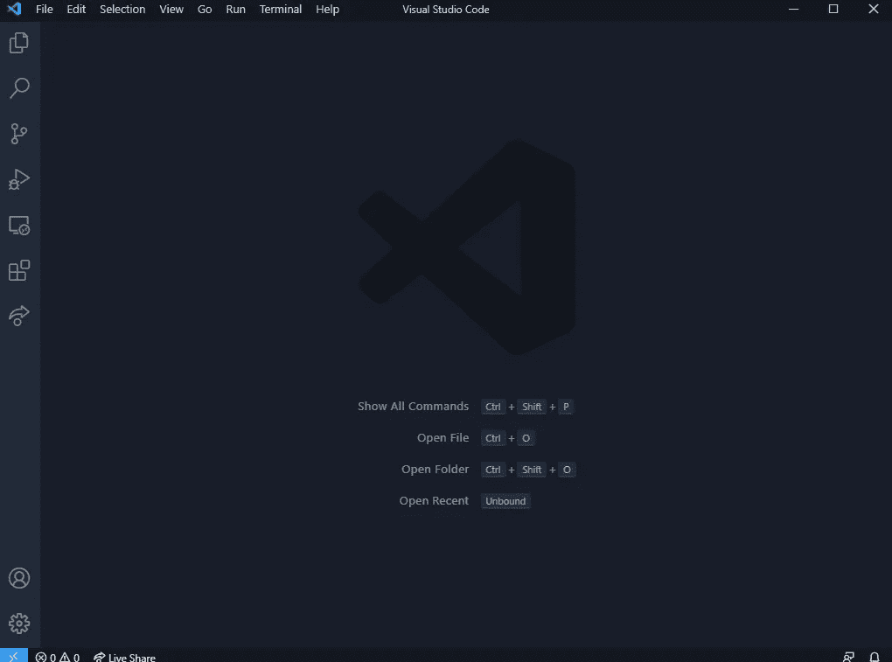

[VS 代码](https://code.visualstudio.com/)说到选择代码编辑器，这是我的选择，我不认为这是一个惊喜，因为大多数开发人员都使用它。关于这个话题，我想分享的是我使用的扩展，它让我的 web 开发生活变得更加简单。

这里有一个列表，里面有我最喜欢的照片和每张照片的简短描述

1.  [Atom Keymap](https://marketplace.visualstudio.com/items?itemName=ms-vscode.atom-keybindings) —这个扩展将流行的 Atom 键盘快捷键移植到 Visual Studio 代码中

2.[更好的评论](https://marketplace.visualstudio.com/items?itemName=aaron-bond.better-comments) —用于创建更人性化的评论

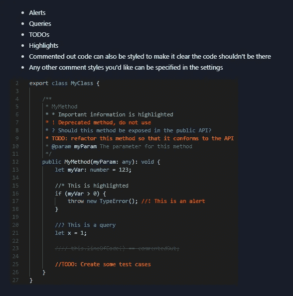

3.[括号对上色器](https://marketplace.visualstudio.com/items?itemName=CoenraadS.bracket-pair-colorizer) —这个扩展允许用颜色来识别匹配的括号。

4.[颜色高亮](https://marketplace.visualstudio.com/items?itemName=naumovs.color-highlight) —在编辑器中高亮显示网页颜色

5. [env-cmd-file-syntax](https://marketplace.visualstudio.com/items?itemName=Nixon.env-cmd-file-syntax) —它通过突出显示。环境文件(例如。env，. env.development 等等)。

6. [Live Server](https://marketplace.visualstudio.com/items?itemName=ritwickdey.LiveServer) — 启动一个本地开发服务器，为静态&动态页面提供实时重新加载功能。

7.[素材图标主题](https://marketplace.visualstudio.com/items?itemName=PKief.material-icon-theme) —你的文件的素材图标

8.[孔雀](https://marketplace.visualstudio.com/items?itemName=johnpapa.vscode-peacock) —微妙地改变你的 Visual Studio 代码工作区的颜色。当您有多个 VS 代码实例时非常理想

# 包裹

我在本文中给出的列表是我个人挑选的工具，我觉得非常有用。

我确信还有一些我忘记提到的，所以如果你有一些你作为一个网站开发人员经常使用的资源，那么请把它们添加到评论区，这样我们可以改进这个列表。