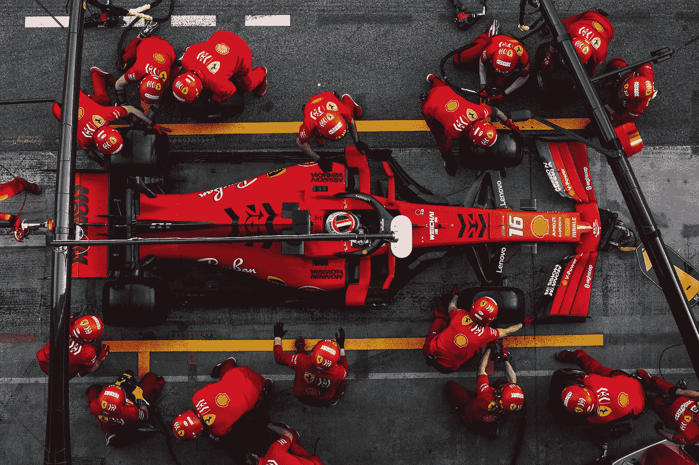

# 软件精英表演团队的特征

> 原文：<https://itnext.io/traits-of-software-elite-performing-teams-11c84f55d054?source=collection_archive---------4----------------------->

古斯塔沃·坎波斯在 [Unsplash](https://unsplash.com?utm_source=medium&utm_medium=referral) 上的照片

根据 DevOps DORA 评估，谁是精英表演者，他们有什么秘诀？

根据这项研究，精英表演者与其他已确定的表演者进行了比较，他们可以被确定为具有:

*   代码部署频率提高 208 倍(向最终用户提供新版本)
*   从实施代码到为最终用户提供服务的交付时间加快了 106 倍
*   从事故/停机中恢复的速度加快了 2604 倍
*   变更失败率低 7 倍(变更失败的可能性是 1/7)。

完整的报告可通过以下[链接](https://cloud.google.com/devops/state-of-devops)获得。

这些数字看起来很棒，但以这种方式表现的关键点是什么？

 [## 加速|作者 Nicole Forsgren、Jez Humble 和 Gene Kim

### “太棒了！以及决定性地表明 DevOps 结果更快，更便宜和更安全，这本书是一个…

itrevolution.com](https://itrevolution.com/book/accelerate/) 

**Accelerate** 是一本展示 IT 领域深入研究成果的书，当我阅读它时，我感觉就像“*所以这就是为什么我会有这种感觉*”，我建议浏览它，你不会后悔的。

所以，精英表演者有这些特质:

# #1 清晰的愿景

这是*至关重要的*点。
一个团队应该对被请求或正在构建的产品有清晰的认识。请不要把它和细节的清晰混淆。产品的清晰性(为什么、如何、什么)比按钮看起来更重要。

清晰的愿景导致清晰的路线图、明确的特性和结构良好的计划。

清晰的愿景类似于:“我想要一辆 F1 赛车”——这不同于拉力赛车或 GT3 赛车。

*那样容易*(理论上)。

# #2 规划

当一个清晰的愿景到位，规划只是一个自然的结果。根据我的经验，我主要在敏捷/Scrum 团队中工作，并且已经为 MVPs 发布计划了工作，这使得阐明达到目标或里程碑的路径变得容易。

我真的相信*特性积压、短迭代、管理和计划*加在一起，正在增加**性能**、**动机**和**责任**。

有了这一套东西，在偏离轨道的情况下，了解进度和路线是正确的真的很容易。

# #3 以用户为中心的体验

拥有一个伟大的技术解决方案是伟大的，我支持它。但这还不够。
**用户说了算**:好不好？好看吗？直观吗？

怎么回答那些问题？
简单:在开发产品时，用户体验应该是首先需要评估的。该解决方案对最终用户有用且直观吗？用户需要阅读 10k 页才能理解如何执行一个简单的动作吗？

举个例子，我想讲一个关于这个的故事:当我在我住的地方开车时，我总是在一个疯狂的十字路口绊倒，他们在那里放了一块巨大的板子，上面写着“生存——通过”它。如果你在十字路口花上 5 分钟，就有可能理解它。但是，乍一看，从 UX 的角度来看，这是一场灾难。仅在十字路口，这可能是一个很好的解决方案，但汽车不会在那里出现/繁殖(就像在视频游戏中一样)。他们经历了一系列以前的情况，并且碰巧在那里(每个司机都是不同的)，司机需要快速反应以度过这一部分。

在开发一个产品的时候，一定要确保用户体验是最终用户可以接受的，不会引起挫败感，并最终交付真正的价值。

# #4 商定的社会和技术合同

在软件开发中，有成千上万种方法来解决挑战或合作。有些事情可能只让团队的一部分人满意，而让另一部分人失望。

确保团队绩效、凝聚力和合作的一种方式，社会和技术契约是至关重要的，因为团队需要在实现功能时就需要采用的技术、实践、过程和方法达成一致(尽管如此，*还是尊重*)。

得益于此，开发人员花更少的时间争论流程、技术细节，并且**更多地关注/合作**产品交付+他们**相互尊重**。

我总是想到蔻驰和球员紧密团结在一起的足球队。

# #5 自动化测试

我没有隐瞒这一点，在我所在的团队中，没有人编写自动化测试(包括我自己)，而是依赖于不断发现 bug 的人工测试人员(也是自愿的)。多么可惜，多么浪费时间！

在我职业生涯的某个时刻，我已经达到了不信任他人代码、技术或产品的内在状态。例如，我想“我怎么能相信一个算法在给定的情况下一定会弄坏我的车？”。

然后我发现了自动化测试。

不幸的是，大多数开发人员(以及项目经理)认为自动化测试是浪费时间。

今天，我喜欢测试，因为它利用了我写的代码，并确保在更改会破坏现有功能的情况下通知我或团队。这是一个游戏改变者，因为手动测试减少了，节省了大量时间。此外，自动化测试为开发人员带来了一种实用的文档(而不是有用/无用的冗长注释)。

测试不仅致力于实现的代码，也适用于最终用户的功能！端到端测试确保涵盖了这种场景，并且有可能实现自动化！这是一件很棒的事情，因为它允许我们了解一个真实的用户在使用新版本(或现有版本)时会体验到什么，并在新的 bug 无意中出现的情况下回到以前的稳定版本。所有这些，没有人手动测试它(所以你可以想想众多的优势)。

除此之外，诸如 **TDD** (测试驱动开发)和 **BDD** (行为驱动开发)的实践正在提高产品质量和正确性。相信我，项目经理/产品所有者也可以用友好的语法编写端到端的测试！

# #6 交付、交付、交付

精英演员不满足于月发行甚至周发行(我甚至不是在说季度发行)。

成功的团队倾向于在一天内**部署更多次**，这样用户就可以每天访问新的特性/改进(而不是等待几周或几个月)。

如果你注意到 fav 应用程序的持续改进，那么这就是一个成功团队的标志(也更容易理解这一点)！

然而，这仍然是一个灰色区域，因为许多团队缺乏测试，并且害怕部署新版本(直到完全测试，并且“批准”)。如果一个特性已经准备好了，或者已经完成了改进，作为一个用户，为什么我不能访问它？这将节省我很多时间和挫折！为什么不让用户享受这种快乐？

当然，在这些情况下，**devo PS/DevSecOps/Extreme Programming**实践确实很有帮助。执行所有构建、检查和部署的自动化方法支持向用户提供高质量产品的过程。

# #7 现场可靠性工程

> 站点可靠性工程(SRE)是一门学科，它结合了软件工程的各个方面，并将它们应用于基础设施和操作问题。主要目标是创建可伸缩和高度可靠的软件系统

忘记手动管理基础架构的旧方法。精英们将基础设施视为需要通过软件实现自动化的东西，比如应用程序或服务。

**基础设施代码**是当今构建小型、中型或大型解决方案的唯一途径。按照这种方法，整体信任、可复制性和责任感都得到了提升。

此外，一个好的做法是将测试的好处也应用到这一部分，依靠**单元测试、功能测试、**或**冒烟测试。**一旦自动化构建/部署完成，基础设施的正确性就会提高。

有什么优势？
几个。
团队中的多个成员可以共享基础设施的知识、责任和透明度，并且*版本化*一切(例如使用 **Git** )允许每个人访问它并执行更改、实现新功能和维护工作软件(而不是执行可能是错误的、过时的、甚至是最糟糕的隐藏的手动操作)。

# #8 死后文化

在中断的情况下会发生什么？

通常，在一般的团队中，“有罪的那个”会被找到，并被要求解决一个修正或改变。我甚至听过“这个特写不是我写的，负责的家伙关了”。这是不允许的。

在精英表演团队中，方法是不同的。在中断的情况下，团队中的某个人会意识到这个问题并进行调查。之后，任何人都可以提供可能的修复/更改，直到停机问题得到解决。
而且还没有结束。在这个疯狂的短时期后，团队聚集在一起，而不是互相侮辱，分析问题并找出根本原因。
这种方法被称为**事后检查**。
这些会议旨在了解哪里出了问题，并制定措施使其不可重复(这也是关于自动化的)。

以这种方式工作，团队通常会反思出错的地方，并在所有领域改进产品的整体体验。

依我看，这些是精英表演团队的基本要素，或许还可以添加其他东西。如果你发现少了什么，我很乐意听听你的意见。此外，每个单独的区域都有许多可以单独处理的细节。

如果你想了解更多，我鼓励并推荐这些阅读材料:

 [## 加速|作者 Nicole Forsgren、Jez Humble 和 Gene Kim

### “太棒了！以及决定性地表明 DevOps 结果更快，更便宜和更安全，这本书是一个…

itrevolution.com](https://itrevolution.com/book/accelerate/)  [## 凤凰计划，五周年纪念版

### 新的周年纪念版！在畅销书《凤凰计划》的最新更新和扩展版中，合著者…

itrevolution.com](https://itrevolution.com/book/the-phoenix-project/) 

干杯！:)