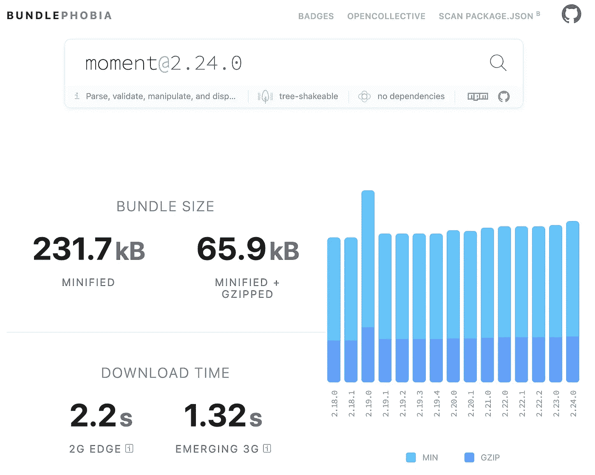
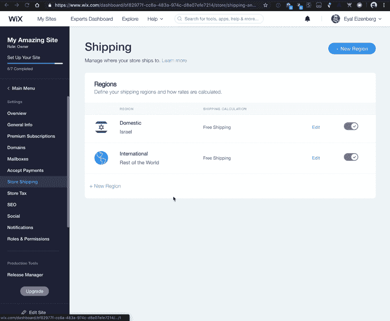
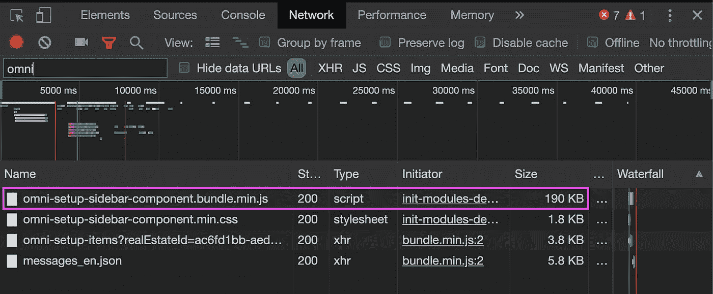
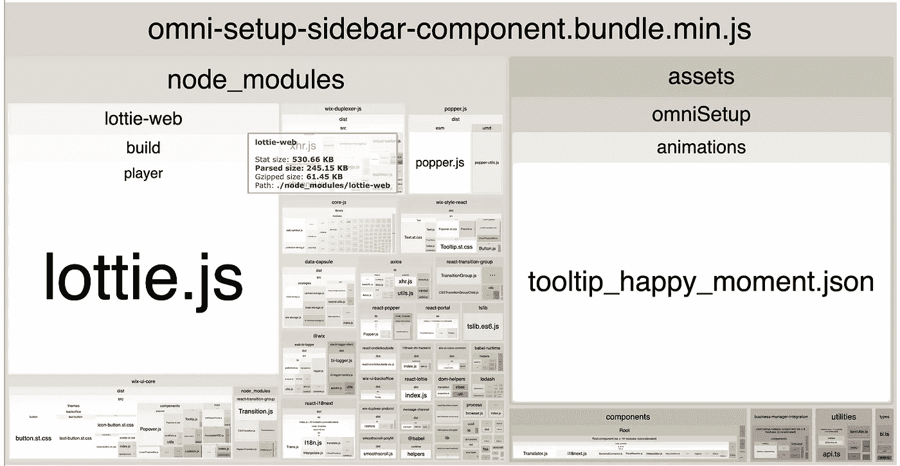
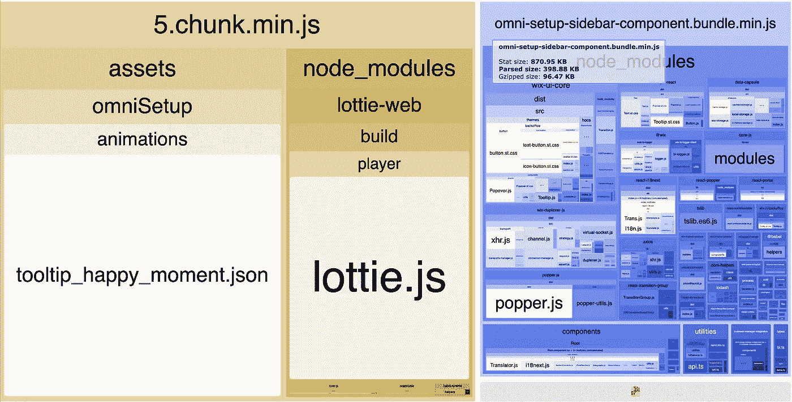
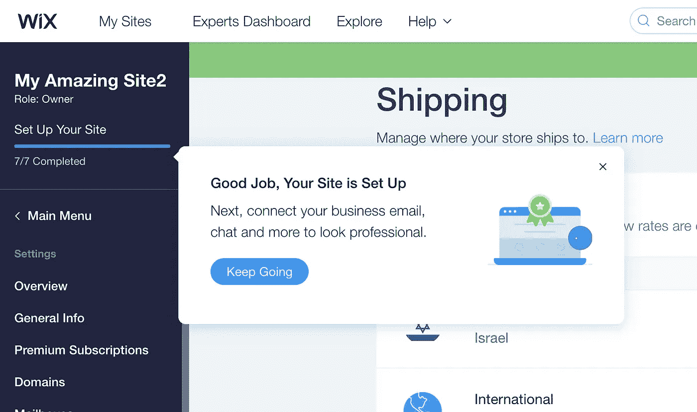
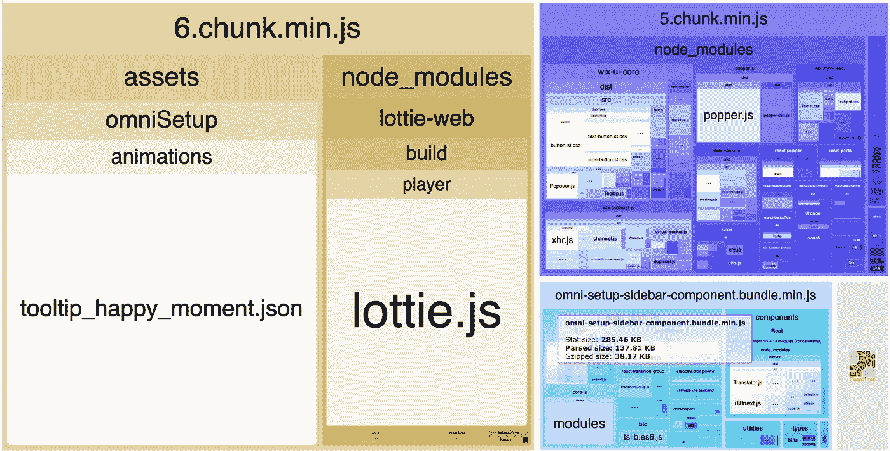

# 使用 Webpack Analyzer 和 React Lazy/suspension 从您的包中剔除脂肪

> 原文：<https://itnext.io/trim-the-fat-from-your-bundles-using-webpack-analyzer-react-lazy-suspense-70dfa0ea93d2?source=collection_archive---------5----------------------->

随着客户端应用程序变得越来越复杂，它们的包也变得越来越大。连接速度较慢的设备和地区受捆绑包大小增加的影响最大，而且情况越来越糟。在这篇文章中，我将回顾我在 Wix 工作中的一个真实例子，在这个例子中，我使用 Webpack Analyzer 和 React Lazy/suspension 将我的包大小减少了大约 80%。

# 应该多早优化？

如果你刚刚开始使用你的新的闪亮的网络应用程序，你可能正试图集中精力让你的产品起死回生。您可能不太关注性能或包的大小。我能理解这一点。然而，根据我的经验，这是你应该从一开始就考虑的事情。从长远来看，良好的架构和尝试“思考你的应用程序的未来”将为你节省大量的时间和技术债务。显然，很难提前“猜测”所有事情，但你应该尽力而为。

有两个伟大的工具，我认为你应该从一开始就使用。这些工具将帮助您识别“有问题的”NPM 包，甚至在您的应用程序中依赖它们之前:

1.  [bundle phobia](https://bundlephobia.com)——一个向你展示 NPM 包裹会增加你的包裹大小的网站。这是一个很棒的工具，可以帮助你做出更好的选择，比如选择你可能需要的第三方包，或者如何设计你的架构，这样你的应用就不会变得臃肿。在下面的截图中，我查看了流行的时间解析库“moment”。你可以看到它很大。差不多 66KB 的 gzipped 文件。对于很多网速超快的人来说，这不算什么。然而，看看 2G/3G 网络的下载时间增加了多长，分别为 2.2s 和 1.32s，而这只是针对**一个套餐。**

Bundlephobia 的结果暂时包装

2.对于各种流行的编辑器来说，这是一个非常酷的扩展([的大约 100 万次下载 VS 代码](https://marketplace.visualstudio.com/items?itemName=wix.vscode-import-cost))，它向你展示了导入一个包将会花费多少。我真正喜欢这个扩展的地方是，它有助于“动态地”识别特定的问题区域。这张 gif(取自 Import Cost 的 Github 页面)展示了一个完美的例子，说明了从 Lodash 导入`uniqueId`属性如何带来整个 Lodash 包(70KB ),而不是直接导入`uniqueId`函数，后者只增加了 2KB。

导入所有 Lodash 与仅导入特定函数的成本

# 膨胀的包—案例研究

因此，你已经建立了你的惊人的应用程序，它在你的高速互联网连接和你的超级动力，超快的额外内存开发计算机上运行良好。过了一会儿，你开始收到用户或分析团队的抱怨，说你的应用程序加载时间不是很长。最近，在我们发布了我在 Wix 工作的一个新功能后，我就遇到了这种情况。

为了让您有所了解，我们先来看看这个新特性。该功能是一个新的进度条，位于侧边栏的顶部。目标是揭示你应该采取的各种步骤，以便有更好的机会成功经营你的企业(连接 SEO，添加运输区域，添加你的第一个产品等)。通过 websockets 连接到服务器，进度条会自动更新。当用户完成所有推荐的步骤时，会显示一个带有“快乐时刻”的工具提示来庆祝你的成就。在“快乐时刻”关闭后，进度条将被隐藏，并且永远不会再显示。它看起来是这样的:

进度条和“快乐时刻”

发生了什么事？为什么我们的分析团队向我抱怨说页面的加载时间增加了？查看 Chrome 开发工具中的网络选项卡，很快发现我的包很大——190 kb。

根据 Chrome 的开发工具，我的捆绑包大小

我心想，为什么这个小特性要有这么(相对)大的捆绑包呢？！为什么真的…

# 在您的包中找到有问题的区域

在意识到包的大小太大之后，是时候找出原因了。一个很好的工具是 [Webpack Bundle Analyzer](https://github.com/webpack-contrib/webpack-bundle-analyzer) ，它可以帮助你找到包中有问题的地方。此工具将在您的浏览器中打开一个新的选项卡，并将可视化您的所有依赖项。

我对我的包运行了分析器，结果如下:

Webpack 分析器的结果

使用分析仪，我能够找到“罪魁祸首”。我使用的是`lottie-web`，它给我的包增加了 61.45KB。Lottie 是一个非常酷的 javascript 库，允许原生渲染特效动画。在我的特定应用中，当“快乐时刻”出现时，我们的设计师/动画师想要一个好的动画。他设计了它，给了我一个 json 文件，我把它“传递”给了 Lottie 包，瞧——一个看起来很棒的动画出现在我眼前。除了`lottie-web`包，我必须传递给 Lottie 的 json 文件是 26KB。所以 Lottie+JSON 文件+额外的小依赖项“花费”了我大约 94KB。只为那部《欢乐时刻》里的动画。这对我来说，实际上是一个“悲伤的时刻”…

# 对救援反应迟钝/犹豫不决

在我掸掉身上的灰尘后，是时候解决这个问题了。很明显，没有必要从一开始就把动画需要的所有东西都带进来。事实上，在当前用户的会话期间,“快乐时刻”很有可能根本不会显示。我读了最近出版的《反应懒惰/悬念》,我想这可能是一个检验它的好机会。

如果你不熟悉惰性组件的概念，这个想法是你把你的应用分成更小的部分，然后只在你需要的时候获取相关的部分。所以在我的例子中，我想把负责呈现“快乐时刻”的组件拆开，只在用户完成所有推荐的步骤时获取它。

React 16.6.0(或更高版本)提供了一个简单的 api 来帮助渲染惰性组件，称为 [React.lazy 和 React。悬念](https://reactjs.org/docs/code-splitting.html)。让我们看看这个简单的例子:

我们在这里有一个组件来呈现一个`div`，在它里面有一个`Suspense`组件来包装`OtherComponent`。如果你看第 1 行，你会发现`OtherComponent`不是直接带来的。通常它会是这样的:`import OtherComponent from './OtherComponent';`

相反，import 命令用作接收文件路径的函数。这是因为 Webpack 有内置的代码分割，当以这种特定的方式使用时，它会返回一个承诺，这个承诺将在获取文件后根据文件的内容进行解析。这个导入被包装在 React.lazy 函数中。

在 MyComponent 的 render 函数中，其他组件被包装在 React 中。悬疑里面有个道具叫`fallback`。这意味着只有当 render 函数“获取”到 OtherComponent(第 7 行)时，它才会开始获取它。同时，它将渲染`fallback`道具中渲染的任何内容。在本例中，是一个文本为`Loading...`的 div

就是这样…“它就是有效”…

您应该考虑两个“问题”:

1.  延迟引入的组件必须有一个默认的导出，这将是组件的入口点。不能使用命名导出。
2.  您必须用 React 包装 React.lazy 组件。悬念组件，并且您必须为它提供`fallback` prop，否则，将会抛出一个错误。但是不要担心，万一在懒惰组件到来之前你不想渲染任何东西，你可以只传递`null`作为`fallback`道具。

# 对我有用吗？

确实如此。嗯，某种程度上……非常有效的部分是代码分割。让我们看看代码拆分后的 Webpack 分析:

Webpack 分析器拆分后的结果

正如你在上面的图片中看到的，我的包已经减少了 50%到 96KB。YEY！

那么什么没有起作用呢？我的工具提示的位置现在关闭了:

错位的工具提示

问题是，我通过在 React 组件中设置一个状态来“告诉”工具提示打开，同时，我使用 React 渲染了`null`(什么也没有)。悬疑成分。一旦内容延迟到达，它就被呈现到 dom 中。然而，工具提示的定位已经预先完成，因为工具提示组件的属性没有改变，它不“知道”它需要检查是否需要重新定位内容。如果我改变 Chrome 的窗口大小，工具提示会“弹出”到正确的位置，因为工具提示正在监听属性变化**和**窗口调整大小以启动重新定位。

那么这里的解决方案是什么呢？去掉中间人。

我需要首先获取惰性组件，然后设置“告诉”工具提示打开的状态。我可以通过使用相同的 Webpack 代码分割功能来做到这一点，但不需要将其包装在 React 中。

这个函数在我的组件 get 通过 websockets 被触发后被调用，它需要显示“快乐的时刻”。我正在使用 Webpacks 导入功能(第 2-4 行)。如果你还记得我之前写的，它返回一个承诺，所以我可以使用`async/await`语法。组件到达后，我将它设置为我的组件的实例(第 5 行),这样我就可以在以后的渲染函数中使用它。还要注意我现在如何使用命名导出，我使用的是最后一个名为`SidebarHappyMoment (line 5).`的导出，但同样重要的是，在我知道我的组件准备好了之后，我通过设置状态**来“告诉”工具提示打开(第 6–8 行)。**

我的渲染函数现在看起来像这样:

注意在第 3 行我是如何呈现我之前在实例上设置的`this.SidebarHappyMoment`的。这是一个普通的同步渲染函数，就像你以前使用过一百万次一样。现在，我的“快乐时刻”工具提示准确地呈现在它应该出现的地方，因为工具提示只有在其内容准备好之后才打开。

# 产品定义了架构

等等，什么？！

是的，完全正确！

该产品定义了当组件第一次呈现时需要什么是可见的和交互的。作为一名开发人员，这将有助于您找出可以拆分的内容，并在以后需要时引入。我对我的具体用例进行了更多的思考，并且“记住”一旦用户完成了设置步骤，或者如果他不是站点的管理员，我们根本不想呈现进度条。使用这些信息，我能够进一步拆分我的包，现在看起来是这样的:

捆绑包的三向分割

如您所见，包的大小现在只有 38KB。还记得我们从 190KB 开始吗？80%的降幅。我已经认识到更多我可以提取的东西，我渴望对这个包进行更多的修整。

# 结论

开发人员倾向于呆在他们的“舒适区”,不钻研代码及其功能以外的内容。然而，使用这些工具，一些创造性的思维，并与你的产品经理密切合作，你可能会通过使你的包变得更小来提高你的应用程序的性能。

在 Twitter 和 Medium 上关注我，了解更多关于我的 Javascript 和 T2 的网络开发冒险！