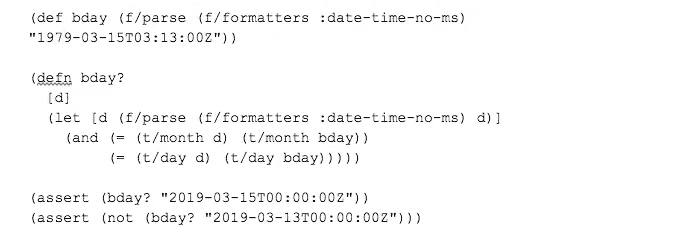
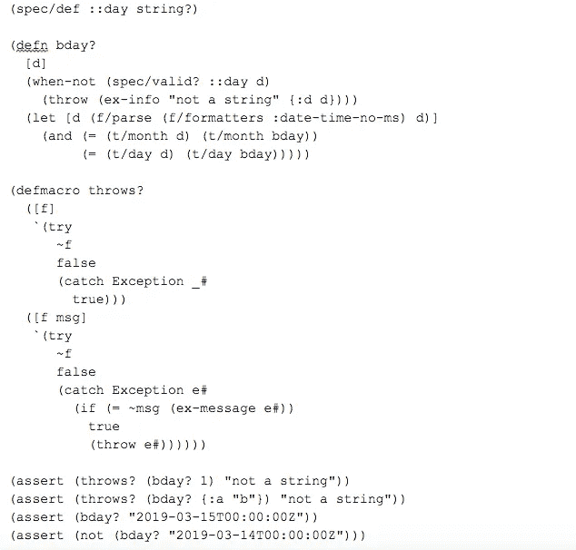
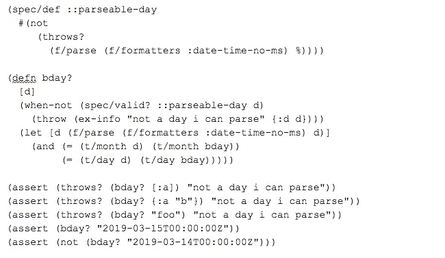
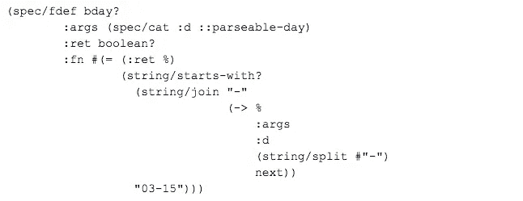

# 类型和规格

> 原文：<https://itnext.io/types-and-specifications-c4d34ade6d5c?source=collection_archive---------3----------------------->

上一篇:[https://medium . com/@ Robert _ 70579/playing-the-wrong-game-32745 fa 3 BAC 7](https://medium.com/@robert_70579/playing-the-wrong-game-32745fa3bac7)

[https://commons . wikimedia . org/wiki/File:Krzywy _ Las _-_ Nowe _ Czarnowo _ 2。JPG](https://commons.wikimedia.org/wiki/File:Krzywy_Las_-_Nowe_Czarnowo_2.JPG)

*你数完了所有的树并不意味着你见过森林。* —匿名

在我上一篇关于测试的文章中，我提出了为如何使用测试来创建高质量代码设置一个不同的度量标准的理由。使用高覆盖率的目标并不是驱动好软件的充分标准，但是什么是呢？幸运的是，覆盖率并不是我们工具箱中唯一的工具。

语言用来保证程序行为的第一个工具是类型系统。有了它，可以在编译时捕获无效操作，在更复杂的语言中，多态类型可以描述对象和操作的行为，同时让实现细节单独确定。类型在程序的对象和函数之间写了一个契约，可以由系统强制执行，让开发人员去考虑其他问题。然而，在大多数语言中，这种做法会造成混乱和代码混乱(我指的是 Java 抽象类)。类型系统解决了一些问题，同时也产生了新的问题，尽管净效应是积极的，但它们仍然存在一些不足。

虽然类型系统，尤其是允许多态接口的系统，是一个强大的工具，但它不足以保证正确性。一些语言已经选择放弃类型系统，但是其他语言创造了一种新的野兽，它具有类型的许多优点，并且释放了一组强大的新工具。虽然这种转换在许多语言中都发生过，但我将在 Clojure 中进行说明。

让我们从一个简单的函数开始，从 JSON 有效负载中获取任意字符串格式的日期，如果是我的生日，就返回。

似乎很合理，对吗？显示代码产生预期结果的两个有效输入。不完全是，这个函数接受一个任意的函数参数，并对它做几个假设。

不管覆盖工具怎么说，最初的测试并没有覆盖这个异常。如果它进入生产环境，可能会导致软件崩溃的未处理异常，并且可能会使开发人员陷入寻找异常的困境。Clojure 中的一种方法是 spec。它允许程序员断言绑定，比如输入参数。第一步是像在强类型语言中使用类型断言一样使用它:

这更近。这个例子用一个额外的特殊异常来模拟异常处理代码，这个异常是处理无效输入类型的替身。这很好，但是当函数得到这样的输入时怎么办呢:

嗯，这是无益的。输入是一个类似于系统声明的类型的字符串，但是它不是一个足够好的字符串。幸运的是，spec 不仅仅将代码局限于类型断言(这已经是一大进步)。这些规格可以是任意函数，以编程方式描述该参数的要求。这不像断言方法存在的抽象类那样工作，而是允许函数直接指定属性。

这就得到那里的函数。不，它不仅声明输入是一个字符串，还定义了内容的抽象属性(本质？)的字符串。尽管如此，你可以想象这些测试是不够的。如果我能以某种方式创建一个巨大的日期列表，并通过我的函数运行它们，会怎么样？也许我可以编译一个包含数千甚至数百万个日期字符串的数据集。不同的世纪，不同的格式？我可以设置一个批处理作业在每次构建时运行，并验证我的函数从未失败。在这个例子中，这显然是矫枉过正，但软件工程师正在用这种方式解决这类问题。我们需要更好的东西，而学者们提出了它。

在 Haskell 中，它被称为 QuickCheck，它试图以这样一种方式来描述一个函数的行为，即一个程序可以为你执行 bug 搜索。我鼓励你不要相信我的话，去看看约翰·休斯关于这个主题的许多视频(不是好莱坞导演，一定要在这些搜索中添加 QuickCheck)。一些语言已经实现了 QuickCheck 的方法，或者现在它通常被称为“生成测试”,包括在 Clojure 中。这里记录了这一点:[https://clojure.org/guides/spec#_generators](https://clojure.org/guides/spec#_generators)，但是这个例子让我们把事情看得更远一些。

首先什么是“字符串？”规范生成的数据看起来像:

虽然这些肯定是字符串，但我想知道字符串生成器是否会为我的生日生成 RFC3339 字符串？需要多少次迭代？约 2 ⁶⁰在 ASCII 可能需要一段时间。我没那么多时间。上面使用的完美功能规范是什么样的:

是的，没有免费的午餐。创建一个描述什么不起作用的函数很容易，但创建一个限制我的选择的函数就比较困难了。幸运的是，gen 有几个构建块，比如数字和日期的范围。它还包括转换和组合这些构件的能力。下面的生成器说明了这一点:

这将生成 1900 到 2100 之间的日期的字符串表示。

检查完毕。最后一步是以类似的方式描述函数本身的行为。

作为一个怀疑论者，我不立即相信这个生成器会在如此广泛的范围内猜测我生日的 200 个事件，所以我故意错误地指定了函数行为。

以上一半以上的时间代表的是结果。我确信至少它会发现一个错误，因此我将构造一个更现实的函数规范:

现在，假设这个例子非常简单，我只是简单地实现了函数 spec 作为一种替代方法，但是它提供了一个例子，说明复杂的交互(比如与另一个系统通信)如何可以用更简单的函数来描述，以作为一个生成器。

成功！我鼓励每一个关心软件质量的人花时间去研究生成测试背后的科学。休斯的职业生涯是指导开发人员使用这些方法，并从事合同工作，他的团队在软件中发现深奥和看似不合逻辑的错误，这些错误使我们保持安全并运行现代世界。通过采用这种方法，或者甚至简单地采用 spec 描述函数行为，就有可能消除编写测试中的重复和猜测工作，甚至从数学上证明正确性。

代码示例可在此处找到:

[spec_vs_type.clj](https://github.com/weberr13/Kata/blob/master/clojure/src/clojure_kata/spec_vs_type.clj)

如果你感兴趣的话，可以申请麻省理工学院的许可。

系列中的下一个:【https://itnext.io/quickcheck-testing-in-golang-772e820f0bd5 