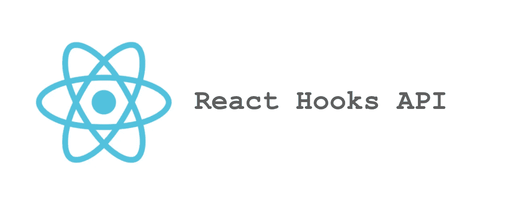

# 支持类型脚本的全局状态反应挂钩

> 原文：<https://itnext.io/typescript-aware-react-hooks-for-global-state-b6e2dfc0e9a7?source=collection_archive---------2----------------------->

React 钩子很牛逼。



React Hooks API 是 React v16.7 的一个新提议。它支持将所有组件编写为具有完整功能的函数。您可以开发“定制挂钩”来添加新的功能。虽然它还没有发布，我想介绍一个新的库来支持全局状态。注意，还是实验。

## 图书馆

它叫做“反应钩子全局状态”，在 [npm](https://www.npmjs.com/package/react-hooks-global-state) 中可用。也请签出 GitHub 库。

[](https://github.com/dai-shi/react-hooks-global-state) [## 戴式/反应钩式-全局-状态

### 钩子 API 反应的简单全局状态。通过创造一个新的世界，为 Dai-Shi/react-hooks-global-state 的发展作出贡献

github.com](https://github.com/dai-shi/react-hooks-global-state) 

## 如何用它编码

首先，您需要定义一个全局状态，并导出一个提供者和一个自定义挂钩。

```
import { createGlobalState } from 'react-hooks-global-state';

export const { GlobalStateProvider, useGlobalState } = createGlobalState({
  counter: 0,
  person: {
    age: 0,
    firstName: '',
    lastName: '',
  },
});
```

然后，使用钩子实现一个组件。

```
import * as React from 'react';

import { useGlobalState } from './state';

const Counter = () => {
  const [value, update] = useGlobalState('counter');
  return (
    <div>
      <span>
        Count:
        {value}
      </span>
      <button type="button" onClick={() => update(v => v + 1)}>+1</button>
      <button type="button" onClick={() => update(v => v - 1)}>-1</button>
    </div>
  );
};

export default Counter;
```

即使您使用了两次`Counter`组件，它们也共享状态。

```
import * as React from 'react';

import { GlobalStateProvider } from './state';import Counter from './Counter';
import Person from './Person'; // Refer the code in the repository

const App = () => (
  <GlobalStateProvider>
    <h1>Counter</h1>
    <Counter />
    <Counter />
    <h1>Person</h1>
    <Person />
    <Person />
  </GlobalStateProvider>
);

export default App;
```

完整的代码在资源库的`examples/02_typescript`文件夹中。您可以通过克隆存储库来尝试这个示例，并运行:

```
git clone [https://github.com/dai-shi/react-hooks-global-state.git](https://github.com/dai-shi/react-hooks-global-state.git)
npm install
npm run examples:typescript
```

启动并运行后，打开 [http://localhost:8080](http://localhost:8080) 。

## 这是打字稿吗？

其实是的！它是完全类型化的，而且代码中没有任何隐式类型。示例代码是用 TypeScript 编写的，但是库本身是用带有类型定义的 JavaScript 编写的，所以您可以随意使用它。

## 有什么反馈吗？

通过媒体、Twitter 或 GitHub 问题获得反馈。谢谢！

## 变更日志

*   *【2018–10–28】:首发。*
*   *【2018–11–08】:跟随库 API 变化，让例子更直观。*
*   *【2018–11–12】:基于上下文 API 再次改变库 API。*