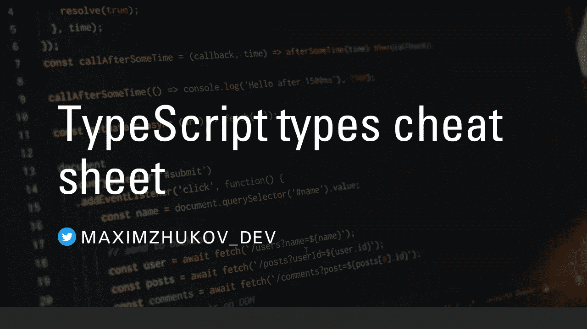

# 类型脚本类型备忘单

> 原文：<https://itnext.io/typescript-types-cheat-sheet-5da7c6ee083d?source=collection_archive---------3----------------------->

这篇文章收集了可用的 TypeScript 类型、它们的常用示例以及 JavaScript 输出。

**更新历史**:

*   2020 年 2 月 13 日—增加了`void`型(thx 到[AngularBeginner](https://www.reddit.com/r/typescript/comments/f33on2/just_blogged_typescript_types_cheat_sheet/fhgvczq?utm_source=share&utm_medium=web2x))；
*   2020 年 2 月 13 日—增加了`unknown`型(thx 至[andra _ nl](https://www.reddit.com/r/typescript/comments/f33on2/just_blogged_typescript_types_cheat_sheet/fhgsax6?utm_source=share&utm_medium=web2x))；
*   2020 年 3 月 8 日—增加了常量枚举部分；

代码中的所有示例都可以在这里获得: [TypeScript playground](http://www.typescriptlang.org/play/?ssl=1&ssc=1&pln=68&pc=53#code/PTAECEHtIGwUwIYDsBQ8AuoCWBnAIpEnAFygBG08yoAvKOgE4CucA3CiiKAHJMC2ZOAzRxMAEzgBjLHwQxSSfoIa1QANnYZQACzgAPBUqGqADHoBmJk2M2jyWJAgYBPQwON0TZEwEZftzEhJdDk3ZVNIAHYAFmj2TjAAZUYHAHMRTElYSAZSHBSkVNUAIjIYFmKA+jg+AAcYBHQ4VQADRIBrZ2wcUAASAG8smByAXxb4rgBBBgYEZwzQGFx0MKEAbQBdVTWfABpQACZ9gGYNqqdZ11Bpy4AeRXcGAD5tvcOTs44uABUmergFgZQGt8gw0vsHspPnptsVdDBhsV9n5PlpQao9GsTKi7A8MTtPglQABRPEAChwMn+EP4Qiwkn2qVxCD4cAAlCg4HiAMLZFT9UAAJTgYlUbwA4gw4FzVAdQCMFpJSLzhio6CqcgA6SXSpBVSQ4PIFIrqvlYrYAHwtoA1DDWtu1Uq5Wy4Oq5XzApP4oApVPg+1BaQ5XO9iX0oAFAFk5M06MVI5MADLEpGgABiNRjJTTxITyeK8oWhtAYZhdFLmuj8FAXCrALRxdLqlLa3jSZTlutLYrdZdnpmOQ9JPJOBZzQAbnIWMG8QA1ODaenVgXcpxi-YABQaRDFha04+L88XkmrdCPS7gmtXDFYoDv95rYB8CwPh4XF9U55Pl63yDYD64Z8iS9PgfV0JoGEgJkiEgJgcBnUMQnQOCIxLEIGCaUU6AAckSb5JkFb5iTwbDN0g1IpRwHo6DeAgdwVIlkHmLQkEgdBEiYKVSCY1Q4hQVj2M42NQGw2RnEEUAEFAQNCmw9gBI4qVVHMOQcDYIcbjmUBIHMSSkGY3E2MUuBE2Wbj9M2V59mw8wnVI+hmDgDYh0UBF9iYJAJHMBwRQWJhSA8ryfKw0BArgbyiBsBYkEMBFVFcmAJjAIhxyEFBzA84IsEIUAhAYMk+BwVIjTBQo2QUOBUv5FAH3QbRIIAd1AIgmuJAd8sK1I2XYBUMqQLKcpUrAYDJcrmsq4x+hq+8pWQhgkFymYyWwtMEGGkVsO6lBesy9BsoWhxzETaBalGiqqojaa7waxdqzJRhp1QhUGK4dBnFqZoECooQ9sIItIFZWdzK6OM6twbpJOk41Kn+wHEy5VI6tWNUfVuGTUieHAAbgWc2U1eBCjqqosbhhG6oOZHVApbHZ0knp0bxgnEe0VggA) 。



# 布尔代数学体系的

没什么特别的，只是`true`和`false`:

**打字稿**:

```
let isDone: boolean = true;
```

**JavaScript** :

```
let isDone = true;
```

> *注意:大写 B 的* `*Boolean*` *与小写 B 的* `*boolean*` *不同，大写* `*Boolean*` *是对象类型，而小写* `*boolean*` *是基本类型。总是推荐使用* `*boolean*` *。*

# 数字

4 种声明数字的方法:

打字稿:

```
let decimal: number = 6;
let hex: number = 0xf00d;
let binary: number = 0b0101;
let octal: number = 0o744;
```

**JavaScript**

```
let decimal = 6;
let hex = 0xf00d;
let binary = 0b0101;
let octal = 0o744;
```

> *注意:TypeScript 中的所有数字都是浮点值*

# 线

`boolean`也是一样，基本上是这样:

打字稿:

```
let color: string = "blue";
let template = `Sky is ${color}`;
```

**JavaScript** :

```
let color = "blue";
let template = `Sky is ${color}`;
```

# 排列

有两种方法可以声明数组:

打字稿:

```
let list: number[] = [1, 2, 3];
let array: Array<number> = [1, 2, 3];
```

JavaScript 脚本:

```
let list = [1, 2, 3];
let array = [1, 2, 3];
```

> *注意:两种方式产生相同的 JavaScript 输出*

您也可以声明包含不同数据类型元素的数组:

**打字稿**:

```
let values: (string | number)[] = ['Apple', 2, 'Orange', 3, 4, 'Banana']; 
// or 
let values: Array<string | number> = ['Apple', 2, 'Orange', 3, 4, 'Banana'];
```

**JavaScript** :

```
let values = ['Apple', 2, 'Orange', 3, 4, 'Banana'];
// or 
let values = ['Apple', 2, 'Orange', 3, 4, 'Banana'];
```

# 元组

Tuple 是一种类型，允许您用固定数量的已知类型的元素来表示数组:

**打字稿**:

```
let x: [string, number];
x = ["hello", 10];
let str = x[0];
let num = x[1];
```

**JavaScript** :

```
let x;
x = ["hello", 10];
let str = x[0];
let num = x[1];
```

# 列举型别

# 数字的

数字枚举允许您使用和指定`numeric`值:

打字稿:

```
enum Color { Red = 1, Green = 2 }
let c: Color = Color.Green;
```

**JavaScript** :

```
var Color;
(function (Color) {
    Color[Color["Red"] = 1] = "Red";
    Color[Color["Green"] = 2] = "Green";
})(Color || (Color = {}));
let c = Color.Green;
```

看看这个优雅的方法:

```
Color[Color["Red"] = 1] = "Red";
```

由于`Color`是对象，该行负责产生以下输出:

```
{
  1: "Red"
  2: "Green"
  Red: 1
  Green: 2
}
```

最终，它允许我们双向访问 enum:或者是`Color.Red`或者是`Color[1]`。

# 获得姓名

获取枚举键的两种方法:

**打字稿**:

```
let cs: string = Color[0] || Color[Color.Green] // Green
```

JavaScript 脚本:

```
let cs = Color[0] || Color[Color.Green]; // Green
```

> *注:仅适用于数字枚举*

# 复制

我不知道为什么，但是您可以为多个枚举键使用一个值:

打字稿:

```
enum Vehicle { Car = 1, Plane = 1 }
let vs: Vehicle = Vehicle.Car;       // 1
let vss: Vehicle = Vehicle.Plane;    // 1
```

**JavaScript** :

```
var Vehicle;
(function (Vehicle) {
    Vehicle[Vehicle["Car"] = 1] = "Car";
    Vehicle[Vehicle["Plane"] = 1] = "Plane";
})(Vehicle || (Vehicle = {}));
let vs = Vehicle.Car; // 1
let vss = Vehicle.Plane; // 1
```

在这种情况下，您将得到以下输出:

```
{
  1: "Plane"
  Car: 1
  Plane: 1
}
```

> *注意:您可以通过多个键获得相同的值，但反之则不行*

# 常数

在编译过程中，常量被完全移除。常量枚举成员被内联:

打字稿:

```
const enum Directions { Up, Down, Left, Right }
let directions = [ 
    Directions.Up, 
    Directions.Down, 
    Directions.Left, 
    Directions.Right
];
```

**JavaScript** :

```
"use strict";
let directions = [0 */* Up */*, 1 */* Down */*, 2 */* Left */*, 3 */* Right */*];
```

# 线

字符串枚举允许您指定`string`值，但输出略有不同:

打字稿:

```
enum Sex { Male = "MALE", Female = "FEMALE" }
```

**JavaScript** :

```
var Sex;
(function (Sex) {
    Sex["Male"] = "MALE";
    Sex["Female"] = "FEMALE";
})(Sex || (Sex = {}));
```

输出对象没有`MALE`和`FEMALE`属性，所以只有一种方法来访问值:

```
let s: Sex = Sex.Male // Male
let ss: Sex = Sex["MALE"] || Sex[Sex.Male] // Error: Property MALE doesn't exist on type Sex
```

# 异种的

同样，用例对我来说并不清楚，但是您可以用各种类型的值来定义枚举:

**打字稿**:

```
enum Status { Started = 'STARTED', Progress = 1, Done }
```

**JavaScript** :

```
var Status;
(function (Status) {
    Status["Started"] = "STARTED";
    Status[Status["Progress"] = 1] = "Progress";
    Status[Status["Done"] = 2] = "Done";
})(Status || (Status = {}));
```

> *地位。完成具有自动计算的值*`*2*`

# *任何的*

*TypeScript 具有类型检查和编译时检查。当我们不知道某些变量的类型时,`any`非常有用:*

*打字稿:*

```
*let notSure: any = 4;
notSure = 'maybe a string';
notSure = false;*
```

*JavaScript 脚本:*

```
*let notSure = 4;
notSure = 'maybe a string';
notSure = false;*
```

*为什么没有任何值的数组？绝对不是问题:*

*打字稿:*

```
*let notSureList: any[] = [1, 'free', true]*
```

***JavaScript** :*

```
*let notSureList = [1, 'free', true];*
```

# *未知的*

*未知类型与`any`非常相似，但更不宽容。一方面`unknown`变量可以保存任何值(例如`true`、`[]`、`Math.random`、`undefined`、`new Error()`)。另一方面，TypeScript 不允许您在没有显式和事先类型检查的情况下访问特定于类型的属性和操作:*

*打字稿:*

```
*// unknown
function format(value: unknown): any {
    // return value.trim();    // Error
    if (typeof value === 'string') {
        return value.trim();    // OK
    } // return value.length; // Error
    if (value instanceof Array) {
        return value.length;    // OK
    }
}*
```

*JavaScript 脚本:*

```
*function format(value) {
    // return value.trim();    // Error
    if (typeof value === 'string') {
        return value.trim(); // OK
    }

    // return value.length; // Error
    if (value instanceof Array) {
        return value.length; // OK
    }
}*
```

> *`typeof`和`instanceof`运算符对类型检查都有效*

# *Null &未定义*

*Null 和 undefined 在 TypeScript 中是不同的类型。它们本身并不十分有用，但是作为联合类型声明的一部分，仍然可以帮助您:*

*打字稿:*

```
*function search(term: string | null | undefined) 
{
}*
```

***JavaScript** :*

```
*function search(term) 
{
}*
```

# *空的*

*Void 类型用于声明不返回任何有意义的值的函数(除了`undefined`和`null`(如果`--strictNullChecks`被禁用)。无论如何，你甚至可以声明 void 变量:*

***打字稿**:*

```
*function log(): void {
    return undefined;
}
const l: void = 1; // Error: Type '1' is not assignable to type 'void'
const ll: void = log(); // undefined*
```

***JavaScript** :*

```
*function log() {
    return undefined;
}
const l = 1; // Error: Type '1' is not assignable to type 'void'
const ll = log(); // undefined*
```

# *从不*

*拼图中的最后一块是类型`never`。它可以用作总是抛出异常或从不返回值的函数的返回类型。*

*打字稿:*

```
*function err(msg: string): never {
    throw new Error(msg);
}
function fail(): never {
    return err('Failed');
}
function infLoop(): never {
    while (true) { }
}*
```

***JavaScript** :*

```
*function err(msg) {
    throw new Error(msg);
}
function fail() {
    return err('Failed');
}
function infLoop() {
    while (true) { }
}*
```

*参考:*

1.  *[打字稿游乐场](http://www.typescriptlang.org/play/?ssl=1&ssc=1&pln=68&pc=53#code/PTAECEHtIGwUwIYDsBQ8AuoCWBnAIpEnAFygBG08yoAvKOgE4CucA3CiiKAHJMC2ZOAzRxMAEzgBjLHwQxSSfoIa1QANnYZQACzgAPBUqGqADHoBmJk2M2jyWJAgYBPQwON0TZEwEZftzEhJdDk3ZVNIAHYAFmj2TjAAZUYHAHMRTElYSAZSHBSkVNUAIjIYFmKA+jg+AAcYBHQ4VQADRIBrZ2wcUAASAG8smByAXxb4rgBBBgYEZwzQGFx0MKEAbQBdVTWfABpQACZ9gGYNqqdZ11Bpy4AeRXcGAD5tvcOTs44uABUmergFgZQGt8gw0vsHspPnptsVdDBhsV9n5PlpQao9GsTKi7A8MTtPglQABRPEAChwMn+EP4Qiwkn2qVxCD4cAAlCg4HiAMLZFT9UAAJTgYlUbwA4gw4FzVAdQCMFpJSLzhio6CqcgA6SXSpBVSQ4PIFIrqvlYrYAHwtoA1DDWtu1Uq5Wy4Oq5XzApP4oApVPg+1BaQ5XO9iX0oAFAFk5M06MVI5MADLEpGgABiNRjJTTxITyeK8oWhtAYZhdFLmuj8FAXCrALRxdLqlLa3jSZTlutLYrdZdnpmOQ9JPJOBZzQAbnIWMG8QA1ODaenVgXcpxi-YABQaRDFha04+L88XkmrdCPS7gmtXDFYoDv95rYB8CwPh4XF9U55Pl63yDYD64Z8iS9PgfV0JoGEgJkiEgJgcBnUMQnQOCIxLEIGCaUU6AAckSb5JkFb5iTwbDN0g1IpRwHo6DeAgdwVIlkHmLQkEgdBEiYKVSCY1Q4hQVj2M42NQGw2RnEEUAEFAQNCmw9gBI4qVVHMOQcDYIcbjmUBIHMSSkGY3E2MUuBE2Wbj9M2V59mw8wnVI+hmDgDYh0UBF9iYJAJHMBwRQWJhSA8ryfKw0BArgbyiBsBYkEMBFVFcmAJjAIhxyEFBzA84IsEIUAhAYMk+BwVIjTBQo2QUOBUv5FAH3QbRIIAd1AIgmuJAd8sK1I2XYBUMqQLKcpUrAYDJcrmsq4x+hq+8pWQhgkFymYyWwtMEGGkVsO6lBesy9BsoWhxzETaBalGiqqojaa7waxdqzJRhp1QhUGK4dBnFqZoECooQ9sIItIFZWdzK6OM6twbpJOk41Kn+wHEy5VI6tWNUfVuGTUieHAAbgWc2U1eBCjqqosbhhG6oOZHVApbHZ0knp0bxgnEe0VggA)；*
2.  *[基本类型](https://www.typescriptlang.org/docs/handbook/basic-types.html)；*
3.  *[打字稿中的枚举](https://www.tutorialsteacher.com/typescript/typescript-enum)；*
4.  *[类型脚本中的布尔值](https://www.tutorialsteacher.com/typescript/typescript-boolean)；*
5.  *[Javascript 和 TypeScript 中的 Boolean](https://fettblog.eu/boolean-in-javascript-and-typescript/)；*
6.  *[TypeScript](https://mariusschulz.com/blog/the-unknown-type-in-typescript)中的未知类型；*