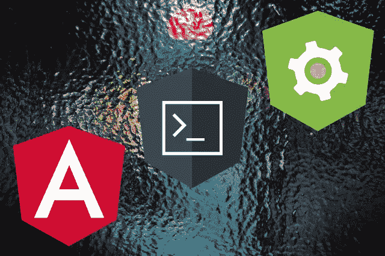

# 使用 angular-cli 6 键入脚本 web workers

> 原文：<https://itnext.io/typescript-web-workers-with-angular-cli-6-19129b299d69?source=collection_archive---------2----------------------->

# 在没有自定义 webpack 配置的情况下，如何在你的 Angular 应用中使用用 TypeScript 编写的 web workers？

在重构 Angular 6 应用程序时，需要将普通的旧 Javascript web workers 迁移到 TypeScript。经过一些研究，在撰写本文时，发现没有简单的方法可以用 angular-cli 做到这一点。

> 注意:angular-cli 计划在版本 8 中为 web workers 提供一些更好的支持

TypeScript web workers 需要 angular-cli 之外的大量 webpack 配置，如本文*中所述。*

*这是行不通的，因为先决条件是保持原生的 angular-cli 支持。但愿，正如在 [***这篇精彩的故事***](https://medium.com/@damoresac/using-web-workers-on-angular-6-6fd0490d07b5) ***，*** 中发现的那样，通过一些技巧，似乎有可能在没有外部 webpack 配置的情况下运行一个 TypeScript web worker。*

*链接的文章展示了一个具有独特的自包含函数的用例，并且在初始调用之后没有从主线程到工作线程的通信。*

*对于一个更复杂的用例来说，将 worker 逻辑分成几个 TypeScript 文件和双向通信并不完全简单，所以我决定在这里分享一下。*

> *本文引用的例子的完整来源可以在这里找到:[https://github.com/fleureyf/angular-web-workers](https://github.com/fleureyf/angular-web-workers)*

* [## 棱角分明的网络工作者

### TypeScript Angular web worker 的演示应用程序

stackblitz.com](https://stackblitz.com/github/fleureyf/angular-web-workers)* 

# *本文的范围*

*这篇文章和链接的源代码提供了一个逻辑简化的代码，但仍然是一个完整的用例:*

*   *可能使用外部 Javascript 依赖项*
*   *主线程和工作线程之间完全双向通信*
*   *Typescript worker 实现拆分为单独文件中的几个 Typescript 类。*

# *目录*

*   *[**主线程和工作线程之间的接口**](https://medium.com/p/19129b299d69#19ee)*
*   *[**一个简单的工人**](https://medium.com/p/19129b299d69#d5bc)*
*   *[—工人行动](https://medium.com/p/19129b299d69#3d74)*
*   *[—外部脚本导入](https://medium.com/p/19129b299d69#9b6a)*
*   *[**职工服务**](https://medium.com/p/19129b299d69#a709)*
*   *[—棘手的部分:工人对象 URL 创建](https://medium.com/p/19129b299d69#e6a5)*
*   *[—工人实例化](https://medium.com/p/19129b299d69#9d16)*
*   *[—向工人发送指令](https://medium.com/p/19129b299d69#9840)*
*   *[—接收来自工人的消息](https://medium.com/p/19129b299d69#12d3)*
*   *[—工人终止](https://medium.com/p/19129b299d69#de54)*
*   *[**用法**](https://medium.com/p/19129b299d69#b826)*
*   *[**附录**](https://medium.com/p/19129b299d69#7b03)*
*   *[—在 worker 内部使用另一个 TypeScript 类](https://medium.com/p/19129b299d69#fbe7)*
*   *[—限制](https://medium.com/p/19129b299d69#8226)*

# *主线程和工作线程之间的接口*

*我们希望尽可能使用 TypeScript 来强制类型。我们首先定义一些接口，用于主线程(在我们的例子中是 Angular 应用程序)和工作线程之间的交换。*

*后台任务将包装我们希望在工作线程上执行的作业。后台任务消息将由工作线程发送回主线程，以监控状态和进度。*

# *简单的工人*

*让我们从编写一个简单的 TypeScript worker 开始，所有的逻辑都包含在一个类中。*

## *工人行动*

*我们继续利用 TypeScript 的优势，并实施工人所支持的动作的原型。*

*因此工人将实现这个接口并相应地管理它的状态。*

*这里有一点需要注意:我们对所有的类方法都使用 ES6 胖箭头符号(所以不是方法而是函数)。这对于下面的**很重要**。*

> *注意:在编译时,“方法符号”将被添加到`prototype`中，而“粗箭头”(或函数)符号将被添加为一个属性。或者我们将在后面讲述在我们的例子中不支持`prototype`内容的`toString()`函数。*

## *外部脚本导入*

*workers 中的一个基本需求是用本机`importScripts`函数导入外部 Javascript 脚本。我们还将使用`postMessage`函数将消息发送回主应用程序。我们可以声明这些类型，因为我们知道它们将在运行时可用。*

*为了使用我们的架构，`importScripts`参数必须是一个完整的 URL，包括应用程序的基本位置(例如`http://my.domain.org/assets/my_external_js_dependency.js`)*

*为了获得基位置，*和其他有用的参数，*在工人端，我们在构造函数中接受了一个`WorkerConfig`对象。*

*我们现在有了一个 worker，它有一些我们想要调用的函数，这些函数可以发送回我们将从角度方面处理的消息。*

# *工人服务*

*Angular 服务将负责所有工人管理，包括:*

*   *工作者实例化*
*   *向工人发送指令*
*   *接收来自工人的消息*
*   *职工解约*

## *棘手的部分:worker 对象 URL 的创建*

*首先，我们创建一个包含 worker 负载的对象 URL。这就是允许我们在没有构建配置的情况下使用 TypeScript worker 的诀窍。它利用了我们可以字符串化任何 Javascript 符号的事实。*

> *注意:这一步也导致了该方法的局限性*

*我们必须编写一些纯文本(不幸的是)来实例化我们的 worker 类并附加事件侦听器。*

*所以这不是最好的部分，但是记住我们要在 worker 构造函数中注入一些属性。我们必须在纯文本工人模板中这样做。*

## *工作者实例化*

*当一个任务开始时，一个新的 worker 被实例化，它的所有消息都将被传输到一个可观察对象，以便于在应用程序中进行最终消费。*

> *注意:为了简单起见，演示项目为每个任务生成一个 worker，但是没有限制阻止在同一个 worker 上运行多个任务(有一些小的修改)。*

## *向工人发送指令*

*让我们构建一个方法`notify`来向工人发送指令。我们可以强制执行`action`的类型。*

*当调用`notify`时，在工作线程上执行一个`postMessage`，我们注册的事件监听器将`WorkerAction`映射到相应的工作函数。*

## *接收来自工人的消息*

*为了方便使用，我们将把工人收到的所有消息包装在一个`Observable`中。*

*我们只需在 worker 上附加两个监听器`message`和`error`，并将事件数据发送给可观察对象。我们还将消息类型强制为`BackgroundTaskMessage`。*

*一旦连接了监听器，就会将`start`指令发送给工作者。*

## *职工解约*

*当任务结束时，工作人员将发送一条状态为`TERMINATED`的消息。当这个消息被接收时，可观察性被完成并且工作者被终止。*

# *使用*

*现在已经设置好在我们的应用程序中使用我们的 worker。演示示例展示了如何启动和监控在 worker 上执行的一些任务。我们可以与 worker 交互，并通过调用 worker 服务接收回它的消息。*

# *附录*

## *在 worker 内部使用另一个 TypeScript 类*

*我们仍然缺少一个特性:在我们的 worker 中使用其他的 TypeScript 类。*

*如果我们只是在主 worker 类中使用另一个类，它在运行时将不可用。记住，我们只是产生了一个符号字符串表示(在我们的例子中主要是 T1)，但是没有人(_*[web pack _)*来解析我们的依赖关系。所以我们必须给自己“注入”我们想要使用的外部类型脚本符号。*

*好的一面是，我们可以在工人端强制我们的依赖类型。糟糕的是，我们将不得不在 Angular 服务中添加一些纯文本，就像我们对属性所做的那样。*

*现在我们可以在 worker 构造函数中实例化这些类。我们可以用这个技巧传递任何类或属性。类型是强制的，但我们不能忘记把它写在模板字符串中(没有错别字；)).*

## *限制*

*对于在工作线程中执行的代码，还有其他一些限制。它包括 worker 类本身，也包括所有“注入”的依赖项。*

*   *正如我们已经提到的，所有方法都必须用 ES6 粗箭头符号编写，否则在运行时将不可用。*
*   *不支持异步/等待*
*   *不支持扩展*

*总的来说，我认为这是一个*好的*解决方案，在后台工作人员中使用 Typescript，同时保持配置简单并完全支持 angular-cli。但如前所述，这是一种权衡，有其局限性。*