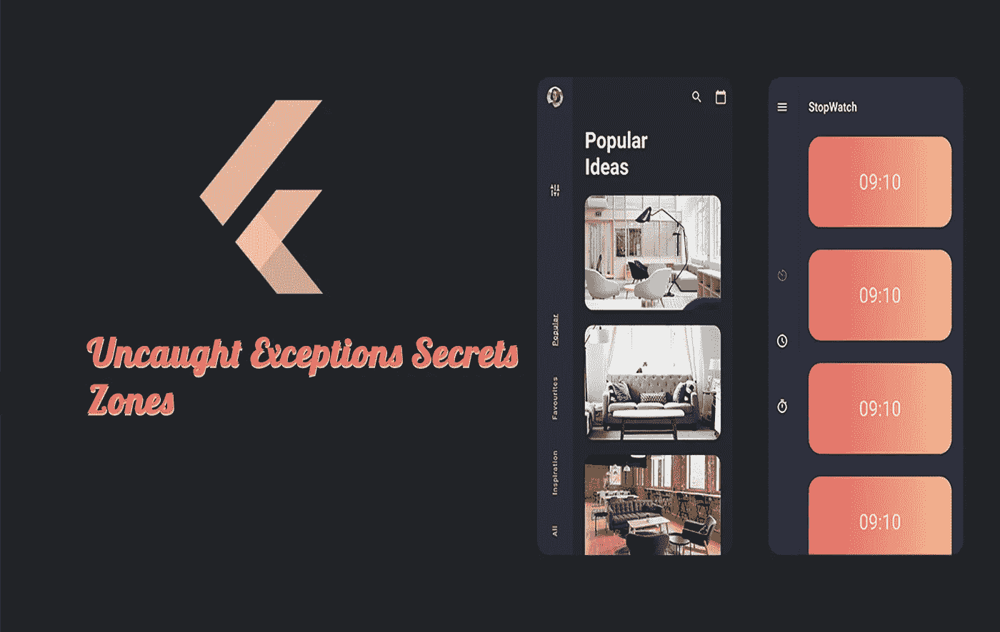

# 未捕获的异常机密，区域

> 原文：<https://itnext.io/uncaught-exception-secrets-zones-c9759fa7a60e?source=collection_archive---------1----------------------->



我们如何处理行为良好的扩展的未被捕获的异常？在这个过程中，我们发现一个未被捕获的异常，然后修改代码来解释它；在这个过程中，区域可以发挥作用。

# **隔离区和隔离区，天啊**

【Dart 不是单线程的。事实是一个线程处于孤立状态。例如，主函数从一个单独的 Zone.root 开始:

那么，当我们在 main 的子区域中创建另一个区域时会发生什么呢？是的，我们有一个单独的隔离，这意味着如果我们有一个未捕获的异常，它不会关闭应用程序的主要功能，因为它在一个单独的隔离中。

要点是，如果我们设置了正确的区域，那么我们就能够通过运行应用程序来调试我们的应用程序，以查看 IDE 控制台日志中显示的未捕获异常，然后重新编写一些代码来处理这种情况，并再次运行应用程序，查看异常是否消失。

# **使用区域**

**首先，我们建立了一个错误处理器来捕捉颤振异常:**

```
**FlutterError.onError = (FlutterErrorDetails details) async {****if (isInDebugMode) {*****// In development mode simply print to console.*****FlutterError.dumpErrorToConsole(details);****} else {*****// In production mode report to the application zone to report to******// app exceptions provider. We do not need this in Profile mode.******// ignore: no-empty-block*****if (isInReleaseMode) {*****// FlutterError class has something not changed as far as null safety******// so I just assume we do not have a stack trace but still want the******// detail of the exception.******// ignore: cast_nullable_to_non_nullable*****Zone.current.handleUncaughtError(*****// ignore: cast_nullable_to_non_nullable*****details.exception,*****// ignore: cast_nullable_to_non_nullable*****details.stack as StackTrace,****);****}****}****};**
```

**我们调用了一个 Zone.current，以便将错误传递给 Zone 未捕获的处理程序，因为所有的 Flutter 框架错误都将是未捕获的异常。**

现在，记住 main 是在它自己的 Zone.root 隔离区中，所以我们需要为 runApp 调用设置一个内部区域:

```
**runZonedGuarded<Future<Null>>(****() async {*****//Since we start another zone we need to******//ensure that SkyEngine has fully loaded Flutter******// and it needs to be called here to enable grabbing the errors*****WidgetsFlutterBinding.ensureInitialized();*****// Service and other initializations here***myLogger.info('app initialized');runApp(*const* MyApp());**},*****// ignore: no-empty-block*****(Object error, StackTrace stack) {****log('$error.runtimeType $stack');****},****zoneSpecification: ZoneSpecification(****// Intercept all print calls****print: (self, parent, zone, line) async {****// Include a timestamp and the name of the App****final messageToLog = "[${DateTime.now()}] $myAppTitle $line $zone";**// Also print the message in the "Debug Console"**// but it's ony an info message and contains no****// privacy prohibited stuff****parent.print(zone, messageToLog);****},****),****);**
```

**我们使用 ZoneSpecification 来重新定义控制台转储(它是 print)以格式化控制台输出。这是完整的代码:**

# **结论**

这只是你必须为你创建的每个应用程序完成的样板文件的一部分。在另一篇文章中，我将向您展示如何将它与 Catcher 插件结合起来，以便我们可以向应用程序用户显示一个定制的错误小部件，并将应用程序异常报告传递给第三方服务。

# **关于我，弗雷德·格罗特**

我是一名改过自新的 Android、Java、Kotlin 和前端开发人员。我是一个改过自新的多动症患者，编码和设计牛仔。不仅如此，我还通过中等文章写作有机地创建了我的 Flutter Developer Book 章节，在:

https://fredgrott.medium.com

该书系列的代码是在一个原始的操场上工作的:

[](https://github.com/fredgrott/flutter_design_and_arch_rosetta) [## Fred grott/flutter _ design _ and _ arch _ Rosetta

### 我正在创建一个颤振开发和设计系列图书，这是它的巨大回购。

github.com](https://github.com/fredgrott/flutter_design_and_arch_rosetta) 

更正式的“即将出版”代码位于:

[](https://github.com/fredgrott/ddi_flutter) [## fredgrott/ddi_flutter

### 这是我更正式的版本，是一个关于 Flutter 演示的 Rosetta Stone，鼓励你深入研究 flutter…

github.com](https://github.com/fredgrott/ddi_flutter) 

我的 GitHub 档案在

[](https://github.com/fredgrott) [## fredgrott -概述

### 我是创业前端开发设计师。我正在构建一些 flutter 应用程序和编写一些 flutter 应用程序开发人员…

github.com](https://github.com/fredgrott) 

我可以在:

[](https://keybase.io/fredgrott) [## 弗雷德·格罗特(弗雷德·格罗特)

### Keybase 是什么鬼东西？Keybase 为您提供了管理身份、创建安全聊天和…

keybase.io](https://keybase.io/fredgrott)