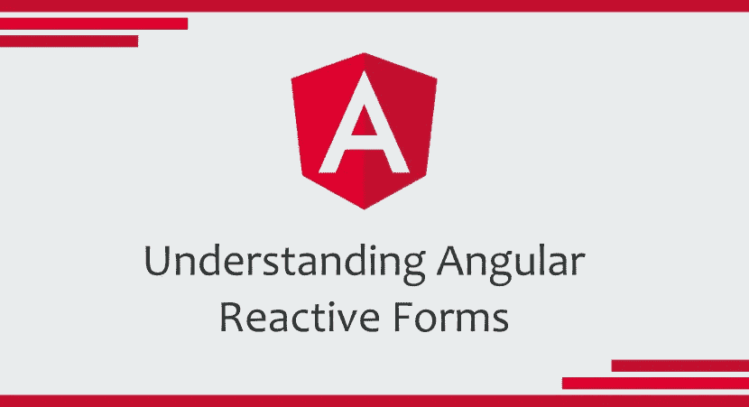

# 了解角反应形式

> 原文：<https://itnext.io/understanding-angular-reactive-forms-241f9ed42c56?source=collection_archive---------4----------------------->

## 一篇有实际例子的深度文章！



> *"* 反应式表单提供了一种模型驱动的方法来处理值随时间变化的表单输入

尽管第一次接触时，角反应形式看起来很复杂，但当你真正理解它时，它们会非常棒。它们非常强大，我在这里的目的是展示一些与它们相关的最重要的东西，这些东西在现实应用中非常有用。

首先，为了使用它们，您需要将 ReactiveFormsModule 导入到所需的模块中。

```
import { ReactiveFormsModule } from ‘@angular/forms’;
```

## 表单控件

一个**表单控件**是一个保存表单每个属性的值和验证状态的类。大致来说，表单中的每个“输入”都将关联到一个**表单控件**。

```
const myFormControl = new FormControl();
```

当创建一个**表单控件**时，你可以将参数传递给构造函数。
下面，我来介绍一下**表单控件**初始化用的一些最有用的。

```
const myFormControl = new FormControl(
    { value: 'My String Value', disabled: true },
    [ Validators.required, Validators.maxLength(30)]
);
```

第一个参数是*表单状态*，在其中我们可以设置**表单控件** **的初始值**以及是否应该初始禁用**。**

**第二个参数是一个**验证器**的数组，当**表单控件**验证不通过时，将其设置为**无效**。例如，在上面的例子中，**表单控件**是**必填**字段，其**最大长度为 30** 。如果输入值不符合这些要求，**表单控制**状态将被设置为**无效**。当它出现时，它将被设置为**有效**。**

**Angular 附带了一些适合大多数需求的预建验证器，可以在这里找到:[https://angular.io/api/forms/Validators](https://angular.io/api/forms/Validators)。**

**然而，有时你需要一些特定的验证，而那些验证器就是不行。对于这些情况，您可以创建自己的**定制验证器**。我将在文章中进一步讨论这个问题。**

## **形式组合**

**一个**表单组**包含一组**表单控件**。它也可能有**嵌套的表单组**。它们还包含关于整个组的验证状态的信息。**

```
const formGroup = new FormGroup({
    'name': new FormControl('', [ Validators.required ]),
    'email': new FormControl('', [ Validators.required ]),
    'address': new FormGroup({
        'zipCode': new FormControl(''),
        'street': new FormControl(''),
        'number': new FormControl('')
    )
});
```

**例如，在上面的例子中，**表单组**的状态只有在*名称*和*电子邮件*属性被填充时才有效。**

**在我们的组件中创建了一个**表单组**，现在我们可以将它绑定到 HTML 中的一个表单。以下示例显示了如何实现这一点:**

```
<form [formGroup]="formGroup" >
  <h1>User Profile Form</h1> <input required
    type="text"
    placeholder="Full Name"
    formControlName="name"
  /> <input required
    type="text"
    placeholder="E-mail"
    formControlName="email"
  /> <div formGroupName="address" >
    <input required
      type="text"
      placeholder="Zipcode"
      formControlName="zipcode"
    /> <input required
      type="text"
      placeholder="Street"
      formControlName="street"
    /> <input required
      type="number"
      placeholder="Number"
      formControlName="number"
    />
  </div>
</form>
```

**如图所示，我们首先将表单绑定到创建的**表单组**。然后，对于每个输入，我们绑定一个**表单控件**。由于我们有一个**嵌套的表单组**，我们必须为它设置一个区域 *formGroupName】，*让 Angular 知道那个区域中的**表单控件**在那个嵌套的表单组中**。****

## **读取表单控件值**

**使用**表单组的**方法 *get* 您可以选择一个特定的**表单控件**以读取其值或调用其一些方法。下面是您如何读取它的值，并且我们将进一步深入到您可以使用的一些方法中。**

```
const inputtedName = formGroup.get('name').value;const inputtedZipCode = formGroup.get('address.zipCode').value;
```

**另外，在您的 HTML 中:**

```
<p>Inputted Name: {{ formGroup.get('name').value }}</p><p>Inputted ZIP: {{ formGroup.get('address.zipCode').value }}</p>
```

## **形成数组**

**一个**表单数组**包含一个 **表单控件**、**表单组**甚至**表单数组**的**数组。这是一个基本但必要的结构，用于处理具有角形的数组。假设你想收集一个用户的电话号码，允许他输入一个主要号码和一个次要号码。这就是你如何在你的**窗体组**中声明一个*手机* **窗体数组**:****

```
const formGroup = new FormGroup({
    'phones': new FormArray([
        new FormGroup({
            'number': new FormControl('', [ Validators.required ]),
            'type': new FormControl('Primary')
        }),
        new FormGroup({
            'number': new FormControl(''),
            'type': new FormControl('Secondary')
        })
    ])
});
```

**然后，这就是如何设置您的标记，提供一个将为表单数组中的每个元素呈现的循环:**

```
<form [formGroup]="formGroup" >
  <h1>User Phones</h1> <div class="phones"
    *ngFor="let phoneGroup of formGroup.get('phones')['controls'];
            let i = index"
    formArrayName="phones"
  >
    <ng-container [formGroupName]="i" > <p>Phone Type: {{ phoneGroup.get('type').value }}</p> <input
        type="tel"
        placeholder="Phone number"
        formControlName="number"
      /> </ng-container>
  </div>
</form>
```

## **更新表单值**

*****设定值*** 和 ***补丁值*** 是来自角度反应表单的方法，允许您设置**表单组** **控件**的值。**

**使用 ***setValue*** 您必须提供完整的对象，该对象将查找所有**表单组的**属性并覆盖**表单控件的**值。如果没有提供一个包含所有**表单组**属性的对象，它将无法工作。下面是一个使用示例。**

```
const formGroup = new FormGroup({
    'name': new FormControl('', [ Validators.required ]),
    'email': new FormControl('', [ Validators.required ]),
    'address': new FormGroup({
        'zipCode': new FormControl(''),
        'street': new FormControl(''),
        'number': new FormControl('')
    )
});const updatedUserInfo = *{* 'name': 'Leonardo Giroto',
  'email': 'leonardo@email.com',
  'address': {
    'zipCode': '22630-010',
    'street': 'Avenida Lucio Costa',
    'number': 9999
  } *};**formGroup.setValue(* updatedUserInfo *);*
```

**另一方面， ***patchValue*** 方法可用于覆盖**表单组**上已更改的任何一组属性。因此，当更新**表单控件的**值时，您可以只传递一些字段。**

**下面是一个使用示例，当我们使用它只更新我们的**表单组**的地址部分时。**

```
const formGroup = new FormGroup({
    'name': new FormControl('', [ Validators.required ]),
    'email': new FormControl('', [ Validators.required ]),
    'address': new FormGroup({
        'zipCode': new FormControl(''),
        'street': new FormControl(''),
        'number': new FormControl('')
    )
});const newUserAddress = {
  'zipCode': '01306-001',
  'street': 'Rua Avanhandava',
  'number': 999
};*formGroup.patchValue({*
  'address': newUserAddress *});*
```

**注意到 ***setValue*** 方法不仅可以在整个**表单组**中使用，而且**也可以在表单控件**中使用。因此，您可以通过在**表单控件**上直接调用它来使用它更新单个控件值，如下所示。**

```
formGroup.get('email').setValue('new_email@email.com');
```

## **表单验证状态**

**当创建一个带有验证器的**表单组**时，如前所示，根据其**表单控件**保存的值，它将包含关于当前**表单验证状态**的信息。例如，如果我们在**表单控件**上有*必需的*验证器，并且所有值都为空，那么表单将被设置为*无效*。**

```
const isFormValid = formGroup.valid;const isEmailValid = formGroup.get('email').valid;
```

**以上是如何检查一个**表单组**是否有效。需要注意的是，每个**表单控件**都有一个验证状态。因此，如果任何一个表单控件验证状态为*无效*无效，则**表单组验证状态为*无效*。****

**另一个有趣的功能是选择**手动设置误差**。如果您碰巧需要在您的流程中手动设置一个**表单控件**为*无效*而不考虑验证器，那么您应该这样做:**

```
formGroup.get('email').setErrors({ 'incorrect': true });
```

**该变更将更新**表单控件验证状态**，并因此更新其**表单组**。同样，您也可以通过将**表单控件的**错误设置为 *null* 来清除它们，如下所示:**

```
formGroup.get('email').setErrors(null);
```

## **感动&肮脏**

> **您可能不希望应用程序在用户有机会编辑表单之前显示错误。对**变脏**和**被触摸**的检查防止错误显示，直到用户做以下两件事之一:改变值，将控件变脏；或者模糊表单控件元素，将控件设置为 touched。**

**检查**表单控件的“已触摸**和**脏**状态非常简单，如下例所示:**

```
const isDirty = formGroup.get('email').dirty;const isTouched = formGroup.get('email').touched;
```

## **观察变化**

**一个非常有趣的特性是能够让*订阅*对**表单组**或**表单控件**的更改。这个想法非常简单:你设置一个订阅，每次窗体(或控件)上的值改变时，回调函数被触发，你可以在那里设置逻辑。这是您设置这些订阅的方式:**

```
formGroup.valueChanges.subscribe((val) => {
   // The form has changed. Insert here your logic!
});
```

**我发现它非常有用的一个实例是地址搜索 API 集成。假设您有一个供用户提供邮政编码的输入。您可以将一个*订阅*添加到它的控件中，一旦您收到一个有效的邮政编码，您就可以调用地址搜索 API，并用它的响应填充其他地址字段；地址、城市、社区等。**

```
formGroup.get(
  'address.zipCode'
).valueChanges.subscribe(async (val) => {
  const fullAddress = await _service.getFullAddress(val);
  formGroup.get('address.street').setValue(fullAddress.street);
});
```

## **自定义验证程序**

**正如我之前说过的，创建你自己的**自定义验证器**来服务于特定的目的是可能的。大致来说，*验证器*是一个函数，它接收**表单控件**作为参数，如果有效则返回 *null* ，如果无效则返回*错误对象*。**

**下面是一个**自定义验证器**的例子。创建该文件是为了验证所提供的 *CPF* 编号(巴西文件)是否有效。**

```
public static CPFValidator(control) {
  if (!control || !control.value) return null; return isCPFValid(control.value) ?
    null : { 'invalidCnpj': 'invalid cpf' };
}function isCPFValid(cpf) {
  const regex = /[.-\s]/g;
  let strCPF = cpf.replace(regex, '');
  let Soma = 0;
  let Resto; for (let i = 1; i <= 9; i++) {
    Soma = Soma + parseInt(strCPF.substring(i - 1, i)) * (11 - i);
    Resto = (Soma * 10) % 11;
  } if ((Resto === 10) || (Resto === 11))
    Resto = 0; if (Resto !== parseInt(strCPF.substring(9, 10)))
    return false; Soma = 0; for (let i = 1; i <= 10; i++) {
    Soma = Soma + parseInt(strCPF.substring(i - 1, i)) * (12 - i);
    Resto = (Soma * 10) % 11;
  } if ((Resto === 10) || (Resto === 11))
    Resto = 0; if (Resto !== parseInt(strCPF.substring(10, 11)))
    return false;
  return true;
}
```

**这就是你如何在**表单控件的**声明中使用它:**

```
const formGroup = new FormGroup({
    'name': new FormControl('', [ Validators.required ]),
    'cpf': new FormControl('',
        [ Validators.required, CPFValidator ]
    )
})
```

**角反应形式是非常强大的，其文件是非常完整的。即使有时候你不得不深入挖掘才能找到你想要的东西，你也可以通过一些例子找到它。**

**希望有帮助😉**

## **参考资料:**

**[https://angular.io/guide/reactive-forms](https://angular.io/guide/reactive-forms)**