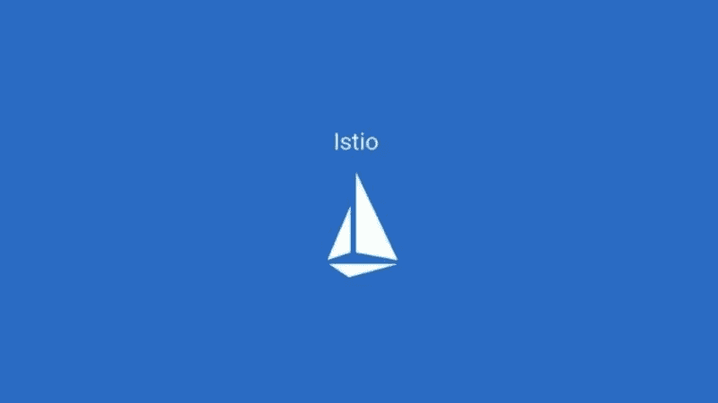

# 了解 Istio 中的应用程序路由

> 原文：<https://itnext.io/understanding-application-routing-in-istio-aade30d594f4?source=collection_archive---------3----------------------->



在这篇博客中，我们将看看如何部署同一个应用程序的两个版本，并根据权重路由流量。这对于在一定比例的用户上测试应用程序的新版本，或者更一般地对于完整的蓝/绿部署来说，非常方便。

首先，我们需要一个 kubernetes 集群，为了构建它，我们将使用下面的[文档](https://docs.microsoft.com/azure/aks/kubernetes-walkthrough?WT.mc_id=docs-blog-sccoulto)或使用下面的代码。如果你没有 Azure 账户，你可以在这里获得免费试用。确保在运行任何其他命令之前运行了`az login`命令。

```
az group create --name k8s --location eastus

az aks create --resource-group k8s \​
    --name k8s \​
    --generate-ssh-keys \​
    --kubernetes-version 1.12.5 \​
    --enable-rbac \​
    --node-vm-size Standard_DS2_v2
```

这将创建我们的资源组，然后创建我们的 kubernetes 集群，如果您已经安装了`kubectl`，则跳过下一步。如果没有，请使用以下命令安装二进制文件

`az install aks-cli`

现在用我们的凭证来设置`kubectl`。我们将使用下面的命令来完成这项工作。

```
az aks get-credentials --resource-group k8s --name k8s
```

现在我们已经启动并运行了集群，我们将通过 [Helm](https://docs.microsoft.com/en-us/azure/aks/kubernetes-helm?WT.mc_id=docs-medium-sccoulto) 部署 Istio。在这篇博客中，我们不打算深入研究赫尔姆。如果你想了解更多，请点击上面的链接。现在，为了让你快速启动并运行，我创建了一个脚本来安装 helm 和 Istio。

```
#!/bin/bash

if [[ "$OSTYPE" == "linux-gnu" ]]; then
    OS="linux"
    ARCH="linux-amd64"
elif [[ "$OSTYPE" == "darwin"* ]]; then
    OS="osx"
    ARCH="darwin-amd64"
fi    

ISTIO_VERSION=1.0.4
HELM_VERSION=2.11.0

check_tiller () {
POD=$(kubectl get pods --all-namespaces|grep tiller|awk '{print $2}'|head -n 1)
kubectl get pods -n kube-system $POD -o jsonpath="Name: {.metadata.name} Status: {.status.phase}" > /dev/null 2>&1 | grep Running
}

pre_reqs () {
curl -sL "https://github.com/istio/istio/releases/download/$ISTIO_VERSION/istio-$ISTIO_VERSION-$OS.tar.gz" | tar xz
if [ ! -f /usr/local/bin/istioctl ]; then  
    echo "Installing istioctl binary"
    chmod +x ./istio-$ISTIO_VERSION/bin/istioctl
    sudo mv ./istio-$ISTIO_VERSION/bin/istioctl /usr/local/bin/istioctl
fi           

if [ ! -f /usr/local/bin/helm ]; then  
    echo "Installing helm binary"
    curl -sL "https://storage.googleapis.com/kubernetes-helm/helm-v$HELM_VERSION-$ARCH.tar.gz" | tar xz
    chmod +x $ARCH/helm 
    sudo mv linux-amd64/helm /usr/local/bin/
fi    
}    

install_tiller () {
echo "Checking if tiller is running"
check_tiller
if [ $? -eq 0 ]; then
    echo "Tiller is installed and running"
else
echo "Deploying tiller to the cluster"
cat <<EOF | kubectl apply -f -
apiVersion: v1
kind: ServiceAccount
metadata:
  name: tiller
  namespace: kube-system
---
apiVersion: rbac.authorization.k8s.io/v1beta1
kind: ClusterRoleBinding
metadata:
  name: tiller
roleRef:
  apiGroup: rbac.authorization.k8s.io
  kind: ClusterRole
  name: cluster-admin
subjects:
  - kind: ServiceAccount
    name: tiller
    namespace: kube-system
EOF
helm init --service-account tiller
fi           
check_tiller
while [ $? -ne 0 ]; do
  echo "Waiting for tiller to be ready"
  sleep 30
done

}

install () {
echo "Deplying istio"

helm install istio-$ISTIO_VERSION/install/kubernetes/helm/istio --name istio --namespace istio-system \
    --set global.controlPlaneSecurityEnabled=true \
    --set grafana.enabled=true \
    --set tracing.enabled=true \
    --set kiali.enabled=true

if [ -d istio-$ISTIO_VERSION ]; then 
    rm -rf istio-$ISTIO_VERSION
  fi    
}

pre_reqs
install_tiller
install
```

确保所有 Istio 吊舱都在运行

```
NAMESPACE      NAME                                      READY   STATUS    RESTARTS   AGE
istio-system   grafana-546d9997bb-9mmmn                  1/1     Running   0          4m32s
istio-system   istio-citadel-5c9544c886-hplv6            1/1     Running   0          4m31s
istio-system   istio-egressgateway-6f9db5ff8d-9lgsd      1/1     Running   0          4m32s
istio-system   istio-galley-8dcbb5f99-gf44n              1/1     Running   0          4m32s
istio-system   istio-ingressgateway-6c6b9f9c55-mm82k     1/1     Running   0          4m32s
istio-system   istio-pilot-74984d9cf5-49kj9              2/2     Running   0          4m31s
istio-system   istio-policy-6dd4496b8c-p9s2h             2/2     Running   0          4m31s
istio-system   istio-sidecar-injector-6bd4d9487c-hhwqb   1/1     Running   0          4m31s
istio-system   istio-telemetry-7bb4ffcd9d-5f2bf          2/2     Running   0          4m31s
istio-system   istio-tracing-6445d6dbbf-65mwt            1/1     Running   0          4m31s
istio-system   kiali-ddf8fbbb-sjklt                      1/1     Running   0          4m31s
istio-system   prometheus-65d6f6b6c-8bgzm                1/1     Running   0          4m31s
kube-system    coredns-754f947b4-2r565                   1/1     Running   0          14m
kube-system    coredns-754f947b4-d5pdf                   1/1     Running   0          18m
kube-system    coredns-autoscaler-6fcdb7d64-q245b        1/1     Running   0          18m
kube-system    heapster-5fb7488d97-v45pc                 2/2     Running   0          18m
kube-system    kube-proxy-gpxvg                          1/1     Running   0          14m
kube-system    kube-proxy-rdrxl                          1/1     Running   0          14m
kube-system    kube-proxy-sc9q6                          1/1     Running   0          14m
kube-system    kube-svc-redirect-5t75d                   2/2     Running   0          14m
kube-system    kube-svc-redirect-6bzz8                   2/2     Running   0          14m
kube-system    kube-svc-redirect-jntkv                   2/2     Running   0          14m
kube-system    kubernetes-dashboard-847bb4ddc6-6vxn4     1/1     Running   1          18m
kube-system    metrics-server-7b97f9cd9-x59p2            1/1     Running   0          18m
kube-system    tiller-deploy-6f6fd74b68-rf2lf            1/1     Running   0          5m20s
kube-system    tunnelfront-8576f7d885-tzhnw              1/1     Running   0          18m
```

现在我们已经准备好部署我们的应用程序了。我们的应用程序将由一个简单的单页 web 应用程序组成。我们将有这个应用程序的两个版本`v1`和`v2`。对于这个帖子，我们将在两者之间平均路由流量。如果这是一个生产环境，你可能只希望金丝雀 5%的流量到你的应用程序的新版本，看看用户喜欢它等等。

我们要做的第一件事是标记默认名称空间，让 Istio 自动注入特使代理。

```
kubectl label namespace default istio-injection=enabled
```

在我看来，如果这是一个生产环境，我会为应用程序创建一个新的名称空间，并让代理自动注入。

接下来要做的是部署我们的应用程序。我们将使用标准的 Kuberntes 部署类型来完成这项工作。

```
cat <<EOF | kubectl apply -f - 
apiVersion: v1
kind: Service
metadata:
  name: webapp
  labels:
    app: webapp
spec:
  ports:
  - port: 3000
    name: http
  selector:
    app: webapp
---
apiVersion: extensions/v1beta1
kind: Deployment
metadata:
  name: webapp-v1
spec:
  replicas: 1
  template:
    metadata:
      labels:
        app: webapp
        version: v1
    spec:
      containers:
      - name: webapp
        image: scottyc/webapp:v1
        imagePullPolicy: IfNotPresent
        ports:
        - containerPort: 3000
---
apiVersion: extensions/v1beta1
kind: Deployment
metadata:
  name: webapp-v2
spec:
  replicas: 1
  template:
    metadata:
      labels:
        app: webapp
        version: v2
    spec:
      containers:
      - name: webapp
        image: scottyc/webapp:v2
        imagePullPolicy: IfNotPresent
        ports:
        - containerPort: 3000
EOF
```

您会注意到，在这个部署中，我们正在部署应用程序的`v1`和`v2`。

一旦我们的部署启动并运行，我们必须添加一个目的地规则，以便 Istio 了解我们的应用程序。Istio 现在将在内部为应用程序分配一个 DNS 名称。该名称将由应用程序名称、主机名(取自下面的部署)和名称空间组成。它将被这样追加`<namespace>.svc.cluster.local`。

```
cat <<EOF | kubectl apply -f -
apiVersion: networking.istio.io/v1alpha3
kind: DestinationRule
metadata:
  name: webapp
spec:
  host: webapp
  subsets:
  - name: v1
    labels:
      version: v1
  - name: v2
    labels:
      version: v2
EOF
```

现在，我们将创建 Istio 网关。这将定义应用程序将监听的入站端口以及我们将路由到的主机。在我们的例子中，它将是端口`80`，我们将使用一个`*`来访问任何主机。我们还将把我们的网关绑定到默认的 Istio 入口网关。

```
cat <<EOF | kubectl apply -f -
apiVersion: networking.istio.io/v1alpha3
kind: Gateway
metadata:
  name: webapp-gateway
spec:
  selector:
    istio: ingressgateway # use istio default controller
  servers:
  - port:
      number: 80
      name: http
      protocol: HTTP
    hosts:
    - "*"
EOF
```

最后，我们将创建 Istio 虚拟服务。这定义了我们如何根据权重路由流量。正如我之前提到的，我们将对流量进行 50/50 加权，但在这里有一个游戏，并更改数字。这将让你很好地掌握引擎盖下的机制。

```
cat <<EOF | kubectl apply -f -
apiVersion: networking.istio.io/v1alpha3
kind: VirtualService
metadata:
  name: webapp
spec:
  hosts:
  - "*"
  gateways:
  - webapp-gateway
  http:
  - route:
    - destination:
        host: webapp
        subset: v1
      weight: 50 
    - destination:
        host: webapp
        subset: v2
      weight: 50
EOF
```

现在我们已经部署好了一切，我们的应用程序可以访问互联网了。要获得 Istio 网关的公共 IP，请使用以下内容。

```
kubectl get svc istio-ingressgateway -n istio-system -o jsonpath="{.status.loadBalancer.ingress[0].ip}"​
```

现在在你的浏览器中使用公共 IP，你应该得到应用程序的一个版本。


然后使用匿名窗口和相同的公共 ip 地址，你应该得到另一个版本


现在，如果你得到了相同的版本，只需关闭隐姓埋名窗口，再试一次。

这是 Istio 能做什么的一个基本例子。如果你想了解更多关于 Istio 及其交通规则配置的信息，官方文件在[这里](https://istio.io/docs/reference/config/istio.networking.v1alpha3/#Destination)