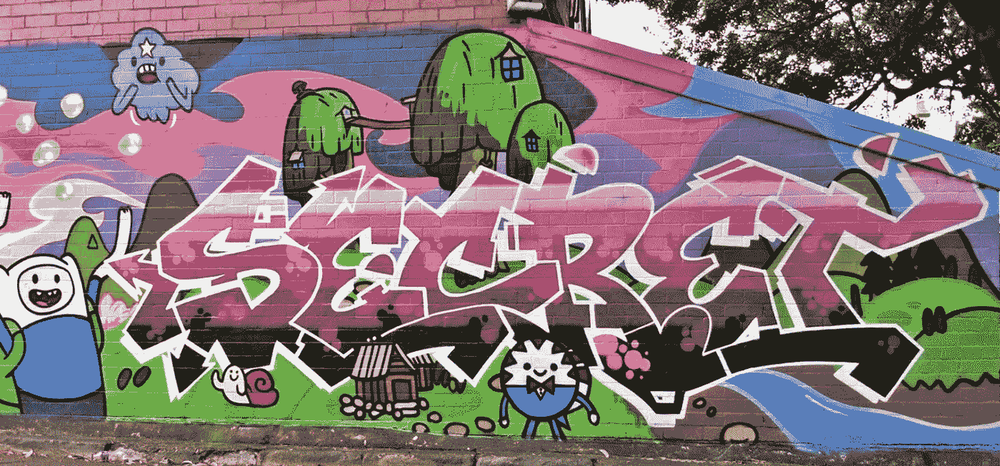

# 理解基本的 Kubernetes 概念 IV —秘密和配置图

> 原文：<https://itnext.io/understanding-basic-kubernetes-concepts-iv-secrets-and-configmaps-2b432fe0955e?source=collection_archive---------8----------------------->

*这篇文章是关于 Kubernetes 基本概念的系列博客文章的第四篇。在第一篇中，我* [*解释了容器、标签和副本集*](https://blog.giantswarm.io/understanding-basic-kubernetes-concepts-i-introduction-to-pods-labels-replicas/) *的概念。在第二篇* [*中我们谈到了部署*](https://blog.giantswarm.io/understanding-basic-kubernetes-concepts-using-deployments-manage-services-declaratively/) *。第三篇文章* [*解释了服务概念*](https://blog.giantswarm.io/basic-kubernetes-concepts-iii-services-give-abstraction/) *，现在我们来看看秘密和配置图。在第五篇也是最后一篇文章中，我们将讨论* [*守护进程集和*](https://blog.giantswarm.io/understanding-basic-kubernetes-concepts-v-daemon-sets-and-jobs/) *任务集。*

[12 因子 app 方法论](http://12factor.net/)的第三个因子叫做[配置](http://12factor.net/config)，描述了为什么要在环境中存储配置。这是基于这样一个事实，即应用程序的配置可能会在不同的环境(例如开发、试运行、生产等)之间发生变化。)并且您希望您的应用程序是可移植的。因此，您应该将配置存储在应用程序本身之外。

现在有了 Docker 和容器，这意味着我们应该尽量将配置放在容器映像之外。当处理敏感信息，如密码、密钥、身份验证令牌时，这就更有必要了，因为我们可能不希望它们出现在注册表中，即使该注册表可能是私有的。

在 Docker 中，我们将使用`[--env](https://docs.docker.com/engine/reference/commandline/run/#/set-environment-variables-e-env-env-file)` [或](https://docs.docker.com/engine/reference/commandline/run/#/set-environment-variables-e-env-env-file) `[--env-file](https://docs.docker.com/engine/reference/commandline/run/#/set-environment-variables-e-env-env-file)`来实现这一点，无论我们是处理敏感信息还是简单配置。

在 Kubernetes 中，我们为这些用例提供了两个独立的原语。第一个是*机密*，顾名思义是用来存储敏感信息的。第二个是 *ConfigMaps* ，可以用来存储一般配置。这两者在用法上非常相似，并且支持多种用例。

# 秘密

秘密可以(也应该)用于存储少量(每个小于 1MB)敏感信息，如密码、密钥、令牌等。Kubernetes 自动创建和使用一些秘密(例如从 pod 访问 API)，但是您也可以轻松地创建自己的秘密。

使用秘密非常简单。您可以在 pod 中引用它们，然后可以将它们用作卷中的文件或 pod 中的环境变量。请记住，您的 pod 中需要访问机密的每个容器都需要显式地请求它。逃生舱里没有秘密共享。

还有一种特殊类型的秘密叫做`imagePullSecrets`。使用这些方法，您可以将 Docker(或其他)容器图像注册登录传递给 Kubelet，这样它就可以为您的 pod 提取私有图像。

当更新已经运行的 pod 使用的秘密时，你需要小心，因为运行的 pod 不会自动提取更新的秘密。您需要显式地更新您的 pods(例如使用部署的滚动更新功能，在本系列的第二篇博文[中有所解释)。](https://blog.giantswarm.io/understanding-basic-kubernetes-concepts-using-deployments-manage-services-declaratively/)

进一步记住，您在一个特定的[名称空间](http://kubernetes.io/docs/user-guide/namespaces/)中创建一个秘密，并且只有相同名称空间中的 pod 可以访问该秘密。

机密保存在 tmpfs 中，并且只保存在运行使用这些机密的 pod 的节点上。tmpfs 防止秘密在节点上停留。然而，它们是以明文形式在 API 服务器之间来回传输的，因此，确保在用户和 API 服务器之间以及 API 服务器和 Kubelets 之间有 SSL/TLS 保护的连接(默认情况下，巨型集群确实启用了这两种连接)。

# 配置映射

配置映射类似于机密，只是它们被设计为更方便地支持使用不包含敏感信息的字符串。它们可以用来以键值对的形式存储单个属性。但是，这些值也可以是整个配置文件或 JSON blobs，以存储更多信息。

该配置数据可以用作:

*   环境变量
*   容器的命令行参数
*   卷中的配置文件

配置映射的良好用例是存储 redis 或 prometheus 等工具的配置文件。这样，您就可以更改这些组件的配置，而不必重新构建容器。

与 secrets 概念的不同之处在于，配置图实际上是在不需要重启使用它们的 pod 的情况下更新的。但是，根据您如何使用所提供的配置，您可能需要重新加载配置，例如，使用 API 调用 prometheus 进行重新加载。

# 更便携的容器

一旦使用了 Secrets 和 ConfigMaps，就很容易区分开发、测试和生产等环境。您可以使用不同的秘密和配置来为各自的环境配置您的容器。

这两个概念还使您的容器更加通用，因为它们排除了一些细节，并允许不同的用户以不同的方式部署它们。因此，您可以在团队之间甚至在您的组织之外促进更好的重用。

秘密(在某些用例中也包括配置图)在与其他团队和组织共享时尤其有用，甚至在公开共享时更有用。您可以自由共享您的图像(和清单)，甚至可以将它们保存在公共存储库中，而不必担心任何特定于公司的数据或敏感数据被公开。

由 [Puja Abbassi](https://twitter.com/puja108) : 开发者倡导者@ [巨虫群](https://twitter.com/giantswarm)撰写