# 了解 Docker 图像标签并将图像发布到 Docker Hub

> 原文：<https://itnext.io/understanding-docker-image-tags-and-publishing-images-to-docker-hub-b7a4f900f201?source=collection_archive---------0----------------------->

## Docker: Docker 标签和 Docker Hub

## 在本课中，我们将讨论如何创建和管理与 Docker 图像相关的标签。然后，我们将向 Docker Hub 发布一个示例 Docker 映像，并在另一台机器上使用它。

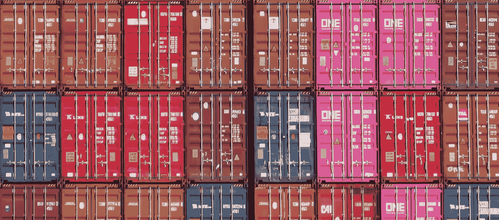

(来源:[**unsplash.com**](https://unsplash.com/photos/N93F-Ylput4))

在 [**之前的课程**](https://medium.com/sysf/docker/home) 中，我们学习了 Docker 图像的剖析，Docker 容器如何工作，如何从 Docker 文件创建 Docker 图像，并了解了 Docker 图像的一些特征。然而，我们并没有专注于与世界分享一个码头工人的形象。在这节课中，我们将学习 Docker 图像标签。

在本课中，我们将创建一个简单的 Docker 映像，当从控制台创建容器时，它会将版本号打印到控制台。该应用程序的源代码位于 [**this**](https://github.com/course-one/docker-version-app) GitHub 存储库中。

```
**docker-version-app/** 
├── .dockerignore
├── .gitignore
├── Dockerfile
└── version.txt
```

我们的 Docker 图像将看起来非常简单。我们将有一个 Dockerfile 和包含版本字符串的`version.txt`文件。Dockerfile 具有打印`version.txt`文件内容的`CMD`指令。由于这个操作不需要复杂的设置，我们将使用`[alpine](https://hub.docker.com/_/alpine/):3.12.2`图像作为 Docker 图像的父图像。

(来源:[gist.github.comT21](https://gist.github.com/thatisuday/285e6478873454fcf029452600728d49))

现在来说说打造 Docker 形象。在前面的课程中，我们学习了如何创建 Docker 映像，我们在构建上下文所在的`PATH`目录中使用了`$ docker build PATH`命令。除非我们在这个命令中使用了`--file`或`-f`标志，否则我们的 Dockerfile 必须存在于这个目录中。所以让我们创建一个 Docker 图像。

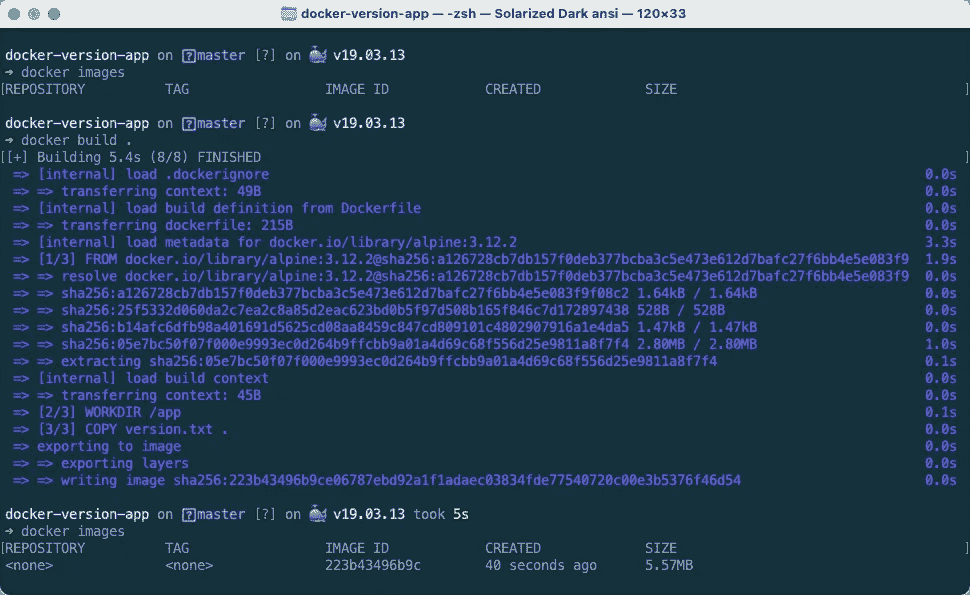

$ docker 构建

最初，我们没有本地下载的任何 Docker 映像。一旦我们运行了`$ docker build`命令，docker 就会从 Docker 注册表中取出父映像( *docker.io* )，并通过读取 Docker 文件中的指令来构建映像。当我们再次运行`$ docker images`命令时，我们看到 ID 为`223b43496b9c`(在 `*IMAGE ID*` *列*中指定的*)的图像。我们可以在像`$ docker run <id>`或`$ docker rmi <id>`这样的命令中使用这个 ID 来对这个图像执行一些操作。*


$ docker 运行

现在让我们把注意力集中在`REPOSITORY`和`TAG`列上。`REPOSITORY`列显示与 Docker 图像相关联的**名称**，而`TAG`显示与 Docker 图像相关联的**标签**。

把 Docker 映像想象成一个第三方(*依赖*)包。就像包必须有唯一的名称和版本一样，因为 Docker 映像可以公开共享，`REPOSITORY`和`TAG`列做了同样的工作来标记 Docker 映像，以便用户可以从 Docker 注册表下载正确的映像和适当的版本。

存储库名称可以是`<name>`或`<username>/<name>`的形式，其中`<name>`是您的 Docker 映像的唯一名称，而`<username>`是您在 Docker Hub 上的帐户用户名。 [**Docker Hub**](https://hub.docker.com/) 是公开或私下分享 Docker 图片的公共网络平台。如果您想在 Dockerhub 上共享图像，那么您的 Docker 图像必须具有`<username>/<name>`格式的存储库名称。

`TAG`列值显示与 Docker 图像相关的标签。该值没有约定的格式。这应该是为了区分同名的 Docker 图像，因此你可以遵循任何你喜欢的格式，但我通常会使用 [**语义版本**](https://www.geeksforgeeks.org/introduction-semantic-versioning/) 格式，如`1.0.0`。

如果您看到与我们的 Docker 图像相关联的存储库和标签，那么这两列都会显示`<none>`。原因是，在运行`$ docker build`命令时，我们还没有为这些列指定值。

> *💡*带有`<none>`名称的 Docker 图像称为**悬空图像**。您可以使用带有`$ docker images`的`--filter "dangling=true"`标志来列出本地机器上出现的所有悬挂图像。

为了给图像的存储库和标签指定一个值，我们在`$ docker build`命令中使用了`--tag`或`-t`标志。该标志的值的格式是`<repository>:<tag>`。如果我们不考虑`:<tag>`部分，Docker 将隐式使用`latest`部分的值。

> *💡*标志`--tag`使它变得非常混乱，因为我们不仅指定了`TAG`列的值，还指定了`REPOSITORY`列的值。这就是为什么`<repository>:<tag>`有时被称为标签或名称，所以如果这让你感到困惑，请原谅我。

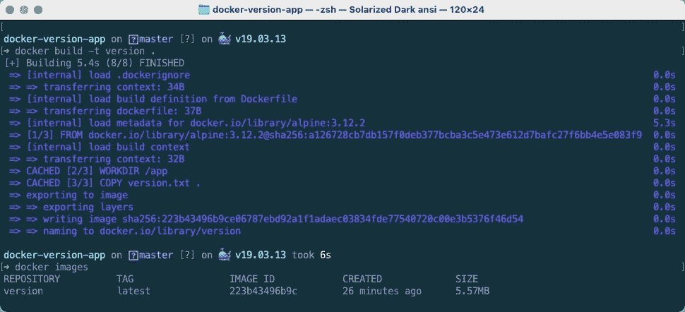

$ docker 构建

这一次，我们使用带有`$ docker build`命令的`-t version`标志来构建一个新的图像。现在，当我们列出图像时，它显示了一个 Docker 图像，其 ID 与我们之前的 ID 相同，但值为`REPOSITORY`和`TAG`值为`latest`。Docker 使用`latest`值表示`TAG`，因为我们在`-t`值中没有提到。

因为 Docker 图像的`IMAGE ID`是通过分析 Docker 图像的内容而生成的**，所以新图像接收我们之前拥有的悬空图像的相同 ID，因为两个图像具有相同的内容。然而，由于悬挂图像可能只被其 ID 引用，现在我们有了一个具有相同 ID 的新的非悬挂图像，所以它被移除了。**

> *💡*注意`CREATED`栏显示的是`26 minutes ago`，这意味着我们并没有真正创建一个新图像。它仍然是旧的图像，但是有一个合适的名称(repo:tag)。如果我们试图用完全相同的内容构建一个新的图像，同样的逻辑也适用。

让我们用适当的存储库和标记值构建另一个图像。让我们使用`1.0.0`作为标记值来表示我们将要构建的图像是此类图像的第一个版本。

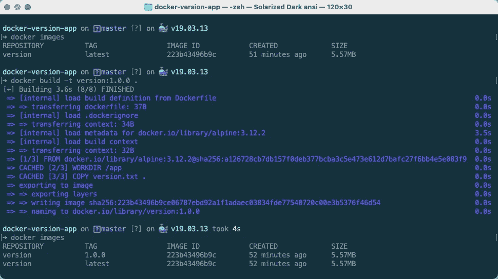

$ docker 构建

使用`-t version:1.0.0`标志，我们创建了一个具有`TAG`值`1.0.0`的新 Docker 图像。但是，如果您看到`IMAGE ID`列，它也引用了旧图像，因为图像的内容仍然相同。

当在诸如`$ docker run <image>`或`$ docker inspect <image>`的命令中引用 Docker 图像时，我们可以使用图像的名称而不是其 ID 作为`<image>`值。使用图像名称时，`<image>`值的通用格式是`<repository>:<tag>`，与`--tag`相同。

例如，`$ docker [inspect](https://docs.docker.com/engine/reference/commandline/inspect/) version:1.0.0`将显示 ID 为`223b43496b9c`的图像的信息。如果我们省略`:<tag>`部分，默认情况下会替换为`:latest`。

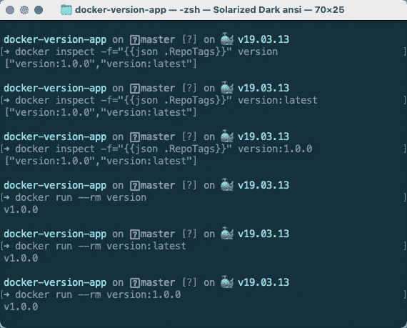

$码头检查/ $码头运行

现在让我们通过用`v1.0.1`替换`v1.0.0`文本来修改`version.txt`文件的内容，并创建一个新的构建。

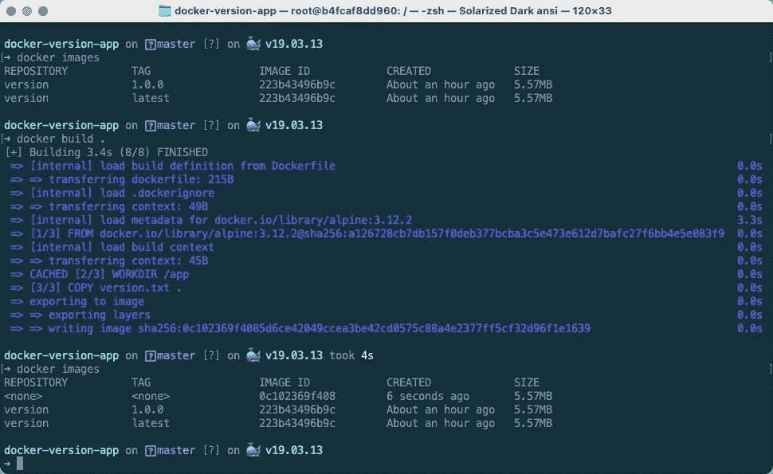

$ docker 构建

既然我们正在构建的 Docker 映像的内容与旧的不同，那么`IMAGE ID`也会有所不同。由于我们没有为`--tag`标志提供值，Docker 创建了一个悬空图像。这一次，让我们为图像提供一个合适的名称。

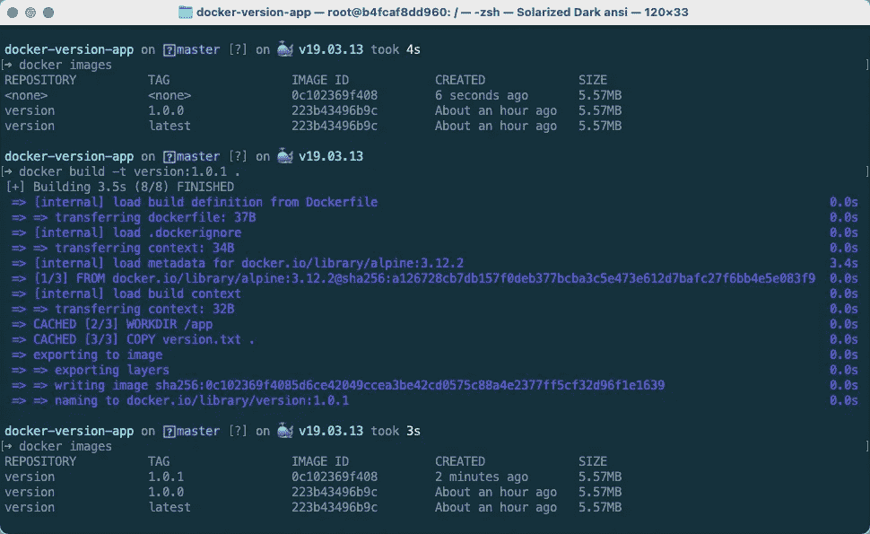

$ docker 构建

这一次，我们将图像命名为`version:1.0.1`。但是，看到带`latest`标签的图，还是指的老 build。这是因为 Docker 世界中的`latest`并不意味着图像的最新版本，这就是为什么它可能会误导新人。让我们看看问题。

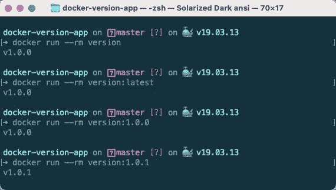

$ docker 运行

当我们从`version`图像(`*version:latest*`*)创建一个容器时，我们通常会期望以最新的(*最近的*)图像为目标。但是，对于 Docker 来说，`latest`只是一个默认标签，对它来说并没有更多的意义。所以`version:latest`标签和`version:1.0.0`或者`version:bla-bla`没有什么不同的意思。*

*但是对于我们这些开发者来说，`latest`就是最近的意思。因此，我们需要确保我们的新图像有`latest`标签。到目前为止，我们了解到标签只是一个**标签，我们分配给图像**，以便我们可以更自然地识别 Docker 应用程序的不同版本(*具有相同的名称*)。一个标签必须指向一个 Docker 图像，但是一个 Docker 图像可以有许多标签。*

*所以让我们用`version:latest`标签重建之前的图像。*

*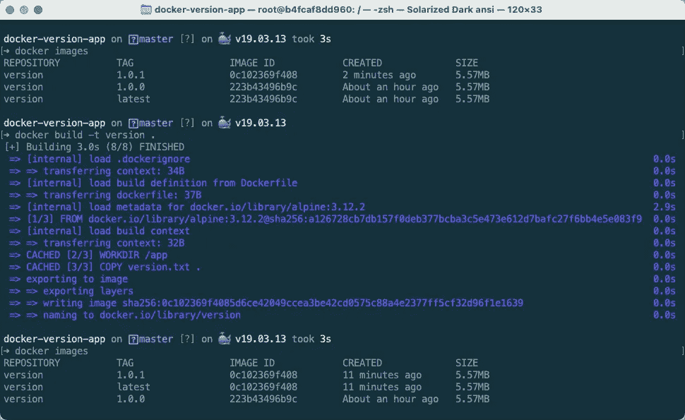*

*$ docker 构建*

*在上面的例子中，我们构建了一个名为`version:latest`的新图像(*而没有修改内容*，尽管我们省略了`:latest`部分，以便 Docker 可以施展它的魔法。由于`version:latest`标签已经存在，Docker 将简单地将`version:latest`标签指向 ID 为`0c102369f408`的图像。*

*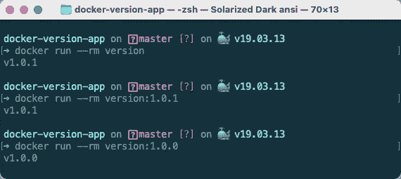*

*$ docker 运行*

*现在，当我们从`version`图像(`*version:latest*` *隐式*)创建一个容器时，我们找到了最近的图像。这证明了管理最新图像的责任落在了我们开发人员身上。*

*由于标签可以很容易地移动，Docker 给了我们`$ docker tag`命令来创建一个标签，而不必构建带有`--tag`标志的图像。*

```
*$ docker tag <image> <repo>:<tag>*
```

*`<image>`是我们希望新标签引用的图像。我们可以使用这个值的图像 ID 或图像的`<repo>:<tag>`值，其中`:tag`部分是可选的，它将默认为`:latest`。对于命令的`<repo>:<tag>`值，我们可以放任何我们想要的东西。这里`:<tag>`部分也是可选的，它将默认为`:latest`。*

*让我们通过修改`version.txt`文件中的值来创建一个版本为`1.0.2`的新构建。但是这一次，我们将使用`$ docker tag`命令来移动`version:latest`标签。*

*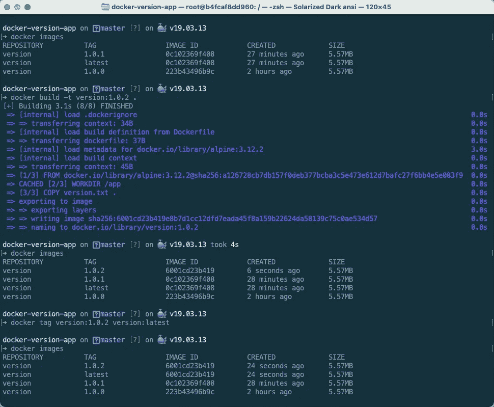*

*$ docker 构建*

*从上面的结果可以看出，新的 Docker 图像具有名为`version:1.0.2`的`6001cd23b419` ID。由于`version:latest`标签指向了一个更早的图像，我们不得不重新定位它。使用`$ docker tag`命令，我们已经手动将其重新定位，指向新版本。*

*由于 Docker 标签只是简单的标签，所以删除标签并不会真正删除图像，除非它是引用图像的最后一个标签。我们没有特殊的命令来取消 Docker 图像的标记，我们使用相同的旧的`$ docker [rmi](https://docs.docker.com/engine/reference/commandline/rmi/)`命令来删除标记。*

*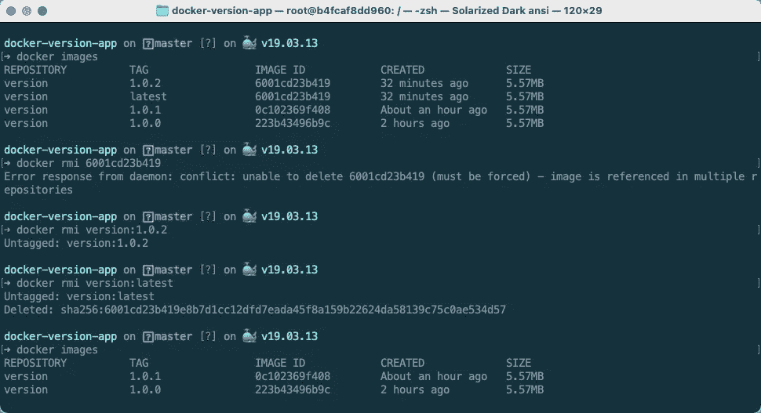*

*$ docker rmi*

*仔细观察上面的命令及其输出。我们有一个 ID 为`6001cd23b419`的 Docker 图像，有两个标签指向它。因此，除非使用`-f`或`--force`标志，否则用`$ docker rmi <id>`命令移除该图像不起作用。*

*`$ docker rmi version:1.0.2`命令只显示 ID 为`6001cd23b419`的未标记(*移除了标记*)图像。现在这个图像只剩下一个标签(`*version:latest*`)，`$ docker rmi version:latest` ( `*:latest*` *是可选的*)删除标签和图像。*

# *将图像发布到 Docker Hub*

*Docker Hub 是共享 Docker 图像的公共存储库。当您运行`$ docker pull <image>`命令或使用 Docker 文件中的`FROM <image>`指令时，Docker 默认会在 Docker Hub 上查找图像(如果不在本地则为*)。**

*要在 Docker Hub 上共享图片，我们需要一个 Docker Hub 帐户。所以你应该在 https://hub.docker.com 注册，并使用一个不尴尬的用户名，因为这很重要。我在 Docker Hub 上的用户名是`thatisuday`，所以我想在 Docker Hub 上发布的任何图片都将以前缀`thatisuday/`开头，这意味着当我标记一张图片时，它将是`thatisuday/<repo>:<tag>`。*

*一旦我们注册，我们需要设置一个存储库。一个存储库就像一个 GitHub 存储库，它包含同一个图像的许多版本(*标签*)。点击`Repositories`链接，然后点击`Create Repository`按钮。*

*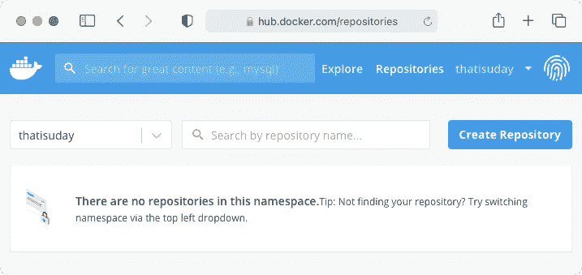*

*(Docker 存储库)*

*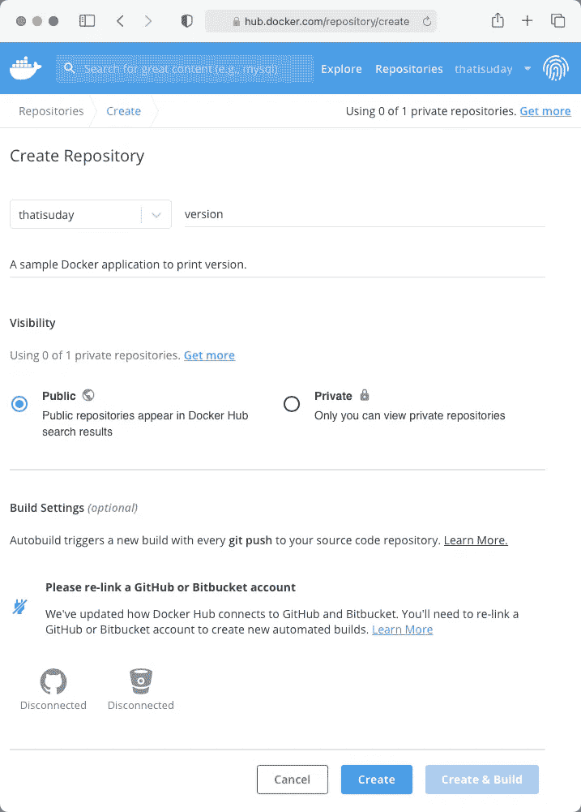*

*(创建新的存储库)*

*如果您想将存储库设为私有，请选中`Private`单选按钮。填写完所有信息后，点击`Create`按钮创建存储库。之后，您应该会看到如下页面。*

*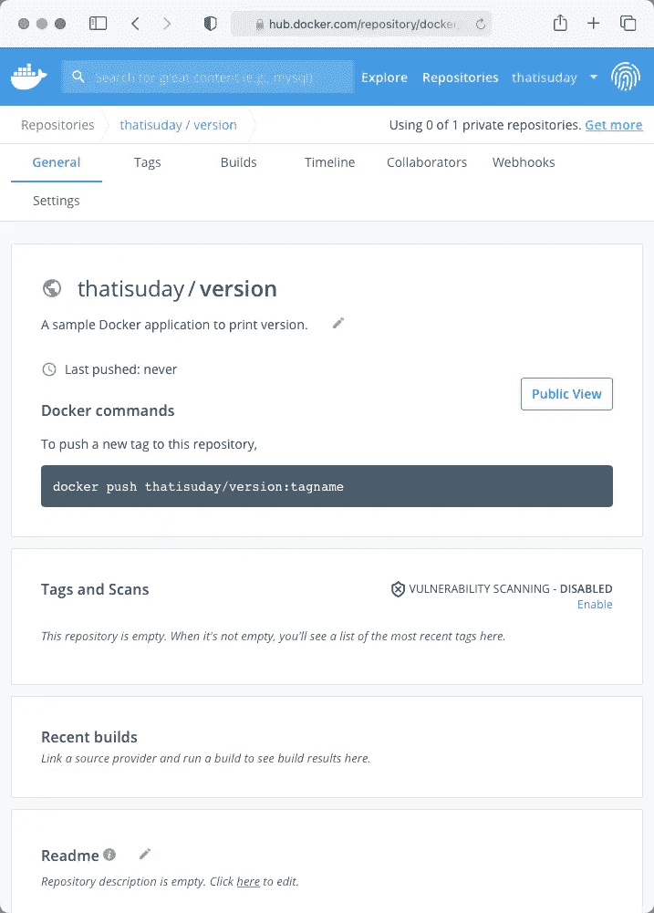*

*(版本存储库)*

*在上面的例子中，我们将存储库命名为`version`。现在，我们只需一个命令就可以将我们的 Docker 映像发布到 Docker Hub 上的这个存储库中。然而，在我们这样做之前，我们还需要处理一些事情。*

```
*$ docker push [OPTIONS] NAME[:TAG]*
```

*我们使用`$ docker [push](https://docs.docker.com/engine/reference/commandline/push/)`命令将 Docker 映像从本地机器发布到 Docker Hub。如前所述，在将 Docker 映像推送到 Docker Hub 时，标记名非常重要，因为没有其他方法可以告诉 Docker 将映像推送到哪个存储库。因此，当我们推送名为`thatisuday/version:tag`的 Docker 图像时，Docker 假设我们想要将图像推送到用户名为`thatisuday`的用户的`version`存储库。*

*因为任何匿名的人都可以恶意地将 Docker 图像发布到任何人的存储库中，所以`$ docker push`命令需要事先授权。为此，我们使用`$ docker [login](https://docs.docker.com/engine/reference/commandline/login/)`命令。该命令要求输入用户名和密码来登录您的 Docker Hub 帐户。*

**

*$ docker 登录*

*一旦我们看到`Login Suceeded`消息，我们就可以发布图像。但是首先，我们需要一个带有适当标签的图像。因此，让我们从早期的构建中创建一个新的标签来满足 Docker Hub 标准。*

*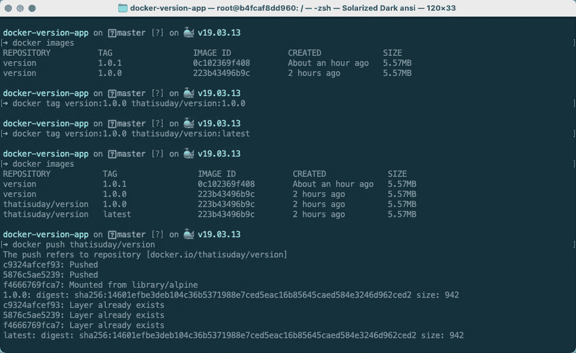*

*$ docker 推送*

*首先，我们创建了两个新标签，即。ID 为`223b43496b9c`的图像中的`thatisuday/version:1.0.0`和`thatisuday/version:latest`，存储库名称为`thatisuday/version`，我们在`$ docker tag`命令中使用`version:1.0.0`名称来引用它。*

*当我们执行`$ docker push <username>/<repo>:<tag>`命令时，**只有名为`<username>/<repo>:<tag>`的标签** ( *图像*)被推送到 Docker Hub。如果我们省略`:<tag>`部分，**名为`<username>/<repo>`的所有标签**都会被推送。因为在我们的例子中我们省略了`:tag`部分，所以`1.0.0`和`latest`标签都将被推送。*

*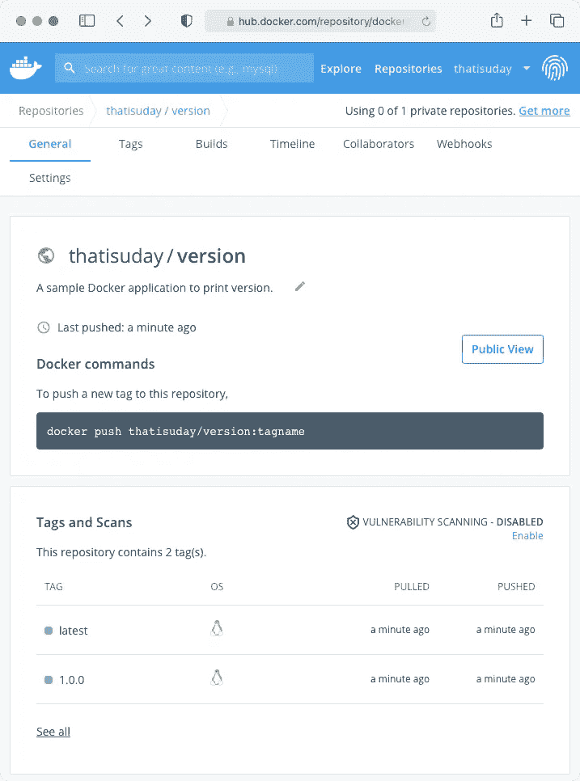*

*我们可以通过查看`Tags and Scans`部分下发布的标签来确认这一点。我们可以看到`latest`和`1.0.0`标签在那里。现在我们已经发布了我们的第一个 Docker 图像，让我们来尝试一下。我更喜欢另一台安装了 Docker 的机器来下载和播放我们的 Docker 映像，但这真的没有必要。我们可以使用一个集装箱。*

## *码头工人*

*可以在 Docker 容器中运行 Docker 引擎。`[docker:dind](https://hub.docker.com/_/docker)` ( *dind 代表 docker-in-docker* )图像让我们创建一个安装了 docker 的容器。我们可以从这个映像创建一个容器，并使用 Docker 命令。*

*让官方的`docker:dind`图像工作起来有点麻烦，你可以按照 [**这个**](https://hub.docker.com/_/docker) 页面的设置说明进行操作。但是，此图像基于现在已经过时的[**jpetazzo/dind**](https://github.com/jpetazzo/dind)图像。然而，它仍然工作，我将用它来启动一个 docker-in-docker 容器。想了解更多 docker-in-docker，关注 [**这篇**](https://www.docker.com/blog/docker-can-now-run-within-docker/) 的帖子。*

```
*$ docker run --rm --privileged -it jpetazzo/dind*
```

*通过运行上面的命令，我们从 Docker Hub 中拉出了`jpetazzo/dind`映像，并从中运行了一个容器。一旦容器启动并运行，它将把我们放在一个 shell 中，我们可以像在本地主机上一样运行 Docker 命令。*

*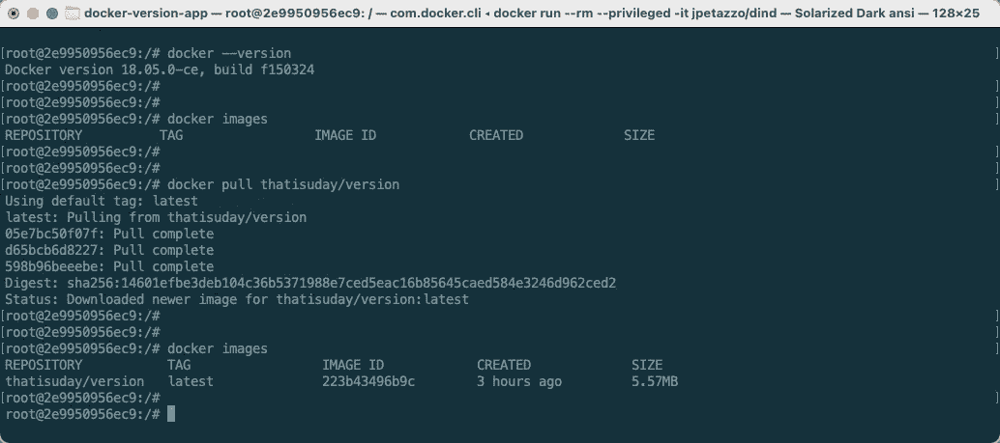*

*(DIND 集装箱)*

*要从 Docker Hub 下载 Docker 映像，我们使用`$ docker [pull](https://docs.docker.com/engine/reference/commandline/pull/)`命令。`$ docker pull thatisuday/version`命令将从用`thatisuday`用户名标识的账户的`version`存储库中提取`version:latest`图像。如果我们使用`$ docker pull thatisuday/version:1.0.0`，它将提取带有标签`1.0.0`的图像，尽管在我们的例子中它会指向同一个图像。*

**

*$ docker 运行*

*`$ docker run thatisuday/version`命令在本地查找`thatisuday/version:latest`图像。如果它不能在本地找到它，它将被动态下载，然后从它创建容器，这就是为什么前面的步骤不是真正必要的。我们可以通过查看控制台中的`v1.0.0`输出来验证`thatisuday/version:latest`图像是`1.0.0`(忽略其他 `*INFO*` *行*)。*

> **💡*如果 Docker Hub 存储库没有带`:latest`标签的图像，那么`$ docker run thatisuday/version`将导致错误。因此，有必要使用`latest`标签，除非你的用户消息灵通。*

*让我们创建一个新的标签`thatisuday/version:1.0.1`，它指向本地机器上的`version:1.0.1`图像。让我们也移动`thatisuday/version:latest`来点这个图像。然后，我们会将新创建的标签推送到 Docker Hub 存储库。*

*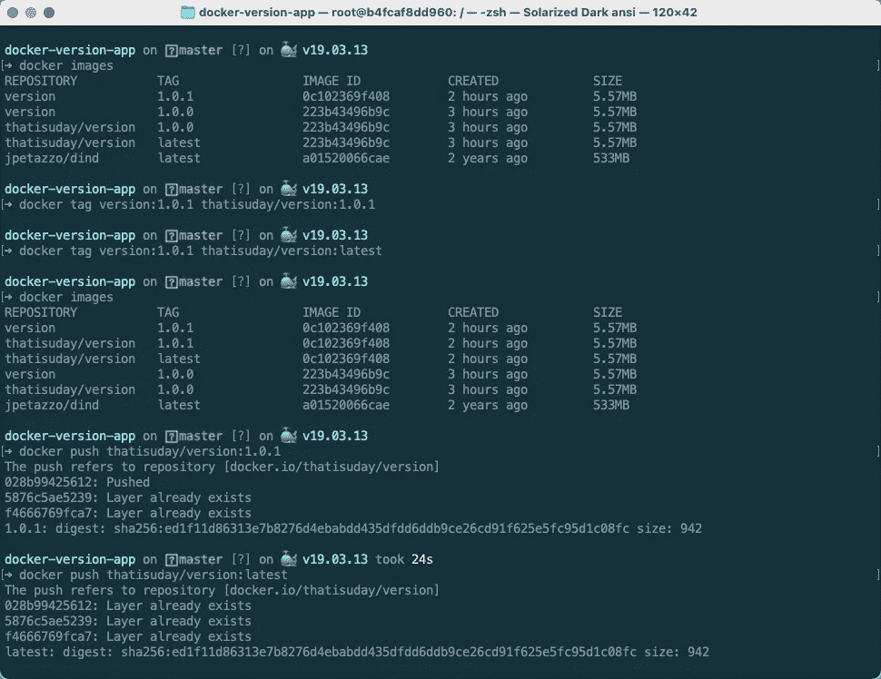*

*$ docker 推送*

*这次我们推送的是特定的标签，而不是`thatisuday/version`图片的所有标签。由于`1.0.0`和`1.0.1`图像之间只有微小的差异，Docker 只推送图像中新的图层。由于`latest`和`1.0.1`标签引用相同的图像(*因此是相同的层*，没有新的层被推送给`latest`标签。*

*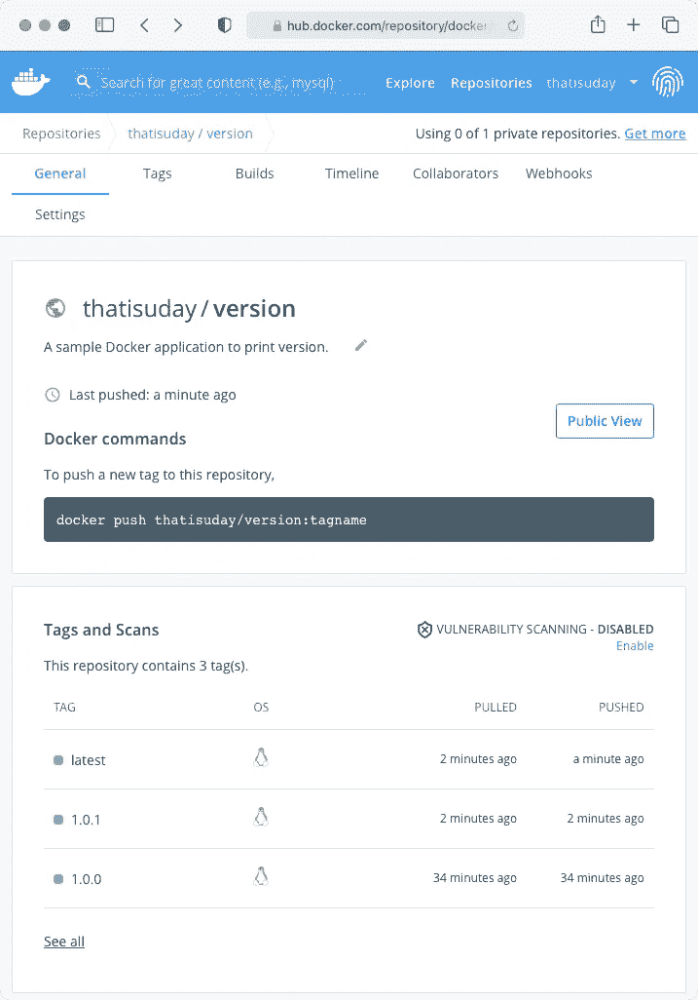*

*当我们推送存储库中已经存在的标签时，它将被分配给新推送的图像，正如我们在上面的`latest`标签中看到的。*

*现在让我们回到我们的 DIND 容器，再次运行`$ docker run thatisuday/version`命令。你期望什么样的结果？*

**

*$ docker 运行*

*因为我们已经有了`thatisuday/version:latest`图像，Docker 不会再从注册表中取出它，这就是为什么我们仍然会看到`v1.0.0`输出。为了下载更新的版本，我们需要使用`$ docker pull`命令再次拉这个标签(*图像*)。*

*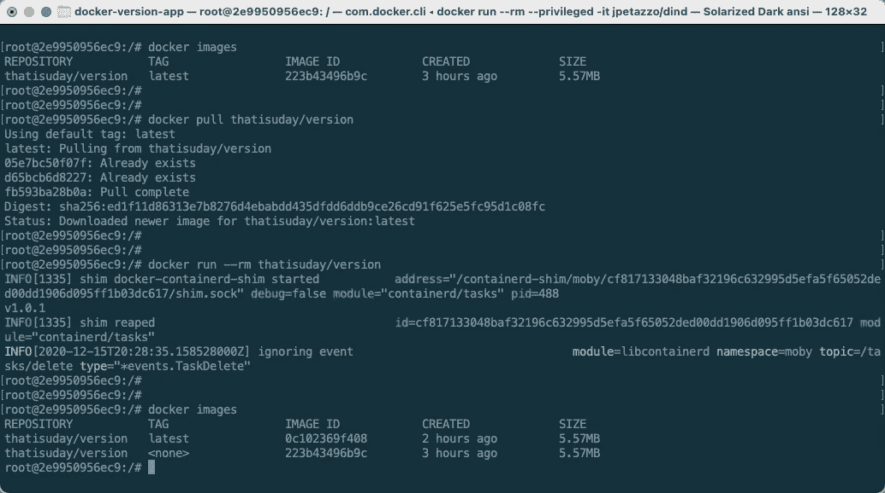*

*$码头工人拉动*

*现在，当我们拉动`thatisuday/version:latest`标签时，原来有`latest`标签的旧图像变得摇摆不定。但是现在我们可以看到从`thatisuday/version:latest`图像创建容器时的`v1.0.1`输出。*

## *提示和技巧*

*   *如果您想从 Docker Hub 中删除一个标签或存储库，您应该能够从存储库的`Tags`部分执行此操作。*
*   *如果您想要发布所有存储库的所有标签，使用带有`$ docker push`命令的`--all-tags`或`-a`标志。*
*   *如果您将存储库设为私有，那么您应该向存储库添加成员，他们将从存储库的`Collaborators`部分下载您的图像。他们需要使用`$ docker login`命令登录，然后才能使用`$ docker pull`命令。*
*   *如果您想私下共享 Docker 图像，您可以使用`$ docker [save](https://docs.docker.com/engine/reference/commandline/save/)`命令将 Docker 图像保存为 tarball 文件。稍后，有人可以使用`$ docker [import](https://docs.docker.com/engine/reference/commandline/import/)`命令从这个 tarball 文件或指向这个 tarball 的 URL 导入 Docker 图像。*

**

*([**【thatisuday.com】**](http://thatisuday.com)/[**GitHub**](https://github.com/thatisuday)/[**Twitter**](https://twitter.com/thatisuday)/[**stack overflow**](https://stackoverflow.com/users/2790983/uday-hiwarale)**/[**insta gram**](https://www.instagram.com/thatisuday/))***

******