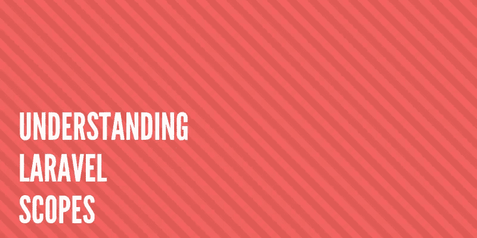

# 了解 Laravel 范围

> 原文：<https://itnext.io/understanding-laravel-scopes-a3d1f9030d51?source=collection_archive---------0----------------------->



我第一次真正体验 Laravel scopes 是在我最近做的一个项目中。我们偶然发现了一个问题，两个模型在数据库中使用同一个表。

每个模型代表不同类型的内容页面。这两种模型在很大程度上以相同的方式工作，但也有一些不同之处。两个模型中的一个可能会被用户喜欢，另一个则不会。这些类型的内容在前台显示的方式也完全不同。

我们在数据库表中添加了一个*类型*字段，以区分不同类型的内容页面。

当通过口才查询数据库时，我们必须确保每个模型只检索数据库中相应类型的数据。这是 Laravel scopes 引入项目的地方。

## 什么是示波器？

作用域是模型中的一种方法，它能够将数据库逻辑添加到模型中。

> 作用域允许将数据库逻辑封装到一个模型中，从而能够重用查询逻辑

## 全局范围

全局范围允许您向模型上的所有查询添加约束。通过这种方式，您可以确保给定模型上的每个查询都有一定的约束。您可以通过运行以下命令来创建全局范围:

```
php artisan make:scope MessageScope
```

这将在 *app/Scopes* 文件夹中创建 *MessageScope* 类。回到我在本文前面描述的例子，这是 *MessageScope* 的样子。

在创建范围之后，我们应该将它添加到我们的模型中。这可以通过覆盖 *boot* 方法来实现。这导致该模型上的每个查询都得到*，其中 type='message'* 作为约束。

## 匿名全局范围

如果你有简单的作用域，不需要它们自己的类，你可以使用闭包来定义一个匿名的全局作用域。这也在模型的 *boot* 方法中完成。上一个示例中的 *MessageScope* 类可以重写为一个匿名全局范围:

## 删除全局范围

如果您想在没有全局范围的情况下执行某个查询，则可以删除全局范围。

有两种方法可以移除全局作用域，具体取决于它是否是匿名全局作用域。

要删除一个全局作用域，可以调用不带 global scope 的*方法，将作用域的类名作为参数。*

```
Message::withoutGlobalScope(MessageScope::class)->get();
```

对于匿名全局作用域，您可以调用相同的方法，但是将匿名全局作用域的名称作为第一个参数。

```
Message::withoutGlobalScope('type')->get();
```

使用没有全局作用域的*方法也可以移除多个全局作用域。*

## 本地范围

局部作用域使得它能够定义容易重用的公共约束集。例如，如果我们只想获取发布的消息，这就很方便了。

在定义了一个或多个局部范围之后，可以通过调用模型上的 scope 方法来使用它们。范围方法的链接是可能的。

```
$messages = Message::published()->orderBy('created_at')->get();
```

> 当调用 scope 方法时，不需要添加前缀`scope`

## 动态本地范围

动态局部作用域的工作方式与普通局部作用域完全相同。唯一的区别是动态局部作用域接受参数。

调用范围时，可以传递参数:

```
$messages = Message::isHighlighted(true)->orderBy('created_at')->get();
```

现在我们已经了解了所有不同类型的示波器，我希望您在 Laravel 中获得了一些关于示波器的新知识。一定要看看我的其他帖子，我的很多内容都是关于 Laravel 的。如果您有任何反馈、问题或希望我写另一个与 Laravel 相关的主题，请随时留下您的评论。