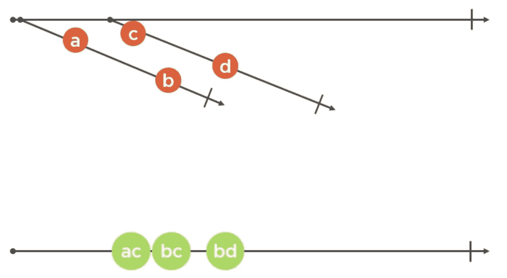
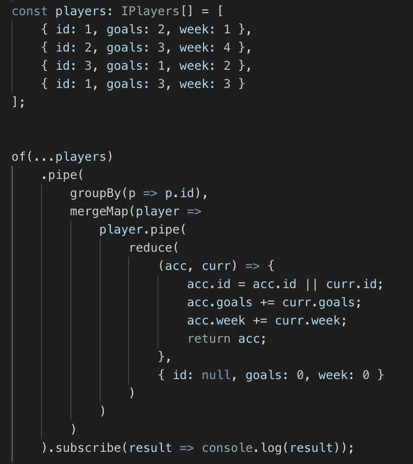

# 了解 RxJS 运算符

> 原文：<https://itnext.io/understanding-rxjs-operators-ea4bc93d56e?source=collection_archive---------2----------------------->

嘿伙计们。我今天来讲讲 [RxJS](http://reactivex.io/) 算子。我希望，在这篇文章结束时，你能意识到主要的区别以及如何/何时使用它们。😊

# 介绍

如你所知，RxJS 为我们的 Angular 应用程序带来了许多伟大的功能，我真正喜欢它的一点是它对主题的支持——你可以在这里[阅读](/understanding-rxjs-subjects-386605ad2bdb)。

在本文中，我们将重点关注 RxJS 为我们提供的一些操作符。我们将分组浏览，尽可能组织信息😊。

# 错误处理

有许多操作符可以帮助我们处理流中的错误。让我们来看看其中的一些。

→ **catchError** :它允许我们的代码在源程序中出现错误时得到通知，并通过传递错误或发出另一个可观察到的错误做出反应。在这两种情况下，它都可以防止流中出现意外或未处理的中断。

→ **throwIfEmpty** :如果我们的源完成了，但没有发出任何东西，这个操作符会强制认为这是一个错误。我知道，没有说我们的源必须在它完成之前发射一些东西，但是这个操作符给了我们这个能力。

这里我们明确地建立了一个空的可观察对象。我们通过管道传递它，throwIfEmpty，当我们运行它时，我们得到错误消息，说“序列中没有元素”。这意味着，如果我们的源没有发出任何值，我们将认为这是一个错误。

→ **重试**:对于像 HTTP 请求这样可能由于网络问题而失败的事情来说，这非常简单和有用。如果我们的源出现错误，这个操作符允许我们继续并重新订阅重试，最多重试一定次数。你必须记住，它始于那个可观察的起点。

# 过滤到多个结果

通常，当处理流时，我们不需要或者不想处理每个值。所以，这就是运营商的用武之地。它们让我们根据我们指定的标准将流过滤为项目的子集。

→ **跳过**:我们必须提供一些我们不关心的值，这个数字将从源可观测值的开始被过滤掉。

在这个例子中，我们发出 5 个值，通过 skip，我们告诉我们要忽略前 3 个值。这意味着我们将在输出中得到值 4 和 5。

→ **skipWhile** :允许我们评估来自源的值，并使用它们来确定我们是否应该跳过。这是一次性的决定。意味着一旦所提供的谓词函数的计算结果为 false，之后的每个值都会被接受并发送给订阅者。

在这里，我们希望我们的值小于 4。因此，我们的条件在位置 2(值 4)变为假，我们停止跳过值。现在，我们知道我们的输出将是 4，2，1 和 6。

→ **取**:是 skip 的反义词。这里我们提供一个数字值作为参数，这是从源接受并传递给订阅者的项目数。

在这个例子中，我们将在输出中得到 2 和 3。

→ **独特的**:允许我们从流中消除重复。有几种方法可以做到这一点。如果我们不提供任何参数，那么它将排除所有的重复。如果我们提供一个函数，它将使用该函数来确定重复意味着什么。该函数将按顺序接收从源可观察对象发出的每个值，然后返回一个可能修改的值，该值用于比较以确定唯一性。

在这里，我们将只获得源中唯一的值。所以，我们得到了数字 1，2，3 和 4。

→ **distinctUntilChanged** :这与普通 distinct 略有不同，因为它只会将从可观测源发出的新值与前一个值进行比较。如果它们不同，新值将被传递。如果它们相同，新值将被删除。在这种情况下，该值是否在 immediately 值之前发出并不重要，因为回看窗口仅为 1。

你知道这里的产量吗😊？我们将获得第一个 2 的输出，然后跳过接下来的两个 2，因为值没有改变。发射 3 是因为它不同于 2。所以，最后的输出会是:2，3，1，2，1。

→ **过滤器**:允许我们随心所欲地从源可观测值中剔除值。我们需要提供一个谓词函数来进行比较。

我们可以指定任何我们想要的比较函数。它将接收我们的源的每个值，并通过我们指定的过滤函数传递它。如果该函数返回 true，那么该值将被传递给我们的订户。如果它返回 false，那么这个值将被删除。在这种情况下，我们的输出将是:3，1，1，1。

# 过滤成一个结果

现在，我们将看看让我们过滤来自源可观测值的运算符。但是，这些操作符将源限制为一个值。

→ **first** :仅从源发出第一个值，并取消订阅。

在这种情况下，它将输出值 2。注意，我们也可以像在 filter 上一样传递一个函数。

→ **元素 At** :让我们只发射从指定位置可观察到的源的值。

这非常简单，所以这里的输出将是 1。

→ **find** :只允许将导致谓词函数为真的值的第一个实例传递给订阅者。一旦传递了第一个值，源可观察对象就被取消订阅。因此，不会发出额外的值。

符合我们标准的第一个值是 5，这个值将是我们在这个场景中的输出。

→ **单曲**:也许，这和你所期待的会有一点点不同。它放射出树事物之一: ***真*** ， ***错*** ， ***未定义*** 。

> **真**:它有且只有一个值符合我们的标准。

> **错误**:如果有多个值导致谓词函数返回 true。

> **未定义的**:如果源发出值，但没有一个导致谓词为真。

# 分组可观测量

当我们有多个源观测值，并且我们想把它们作为一个单独的流集合在一起并发出它们的值时，这是很有用的。

→ **combineAll** :以一个可观测值为源，当内部任意一个可观测值发出时，从每个可观测值发出最新值。

在上图中，当**‘a’**发射时，什么也没有发生，因为另一个可观测物还没有发射。当**‘c’**发射时，用户接收到每个源发射的最新值:**‘a’**和**‘c’**。当**‘b’**发射时，每个的最新值是**‘b’**和**‘c’**。最后当**‘d’**发出时，最新值为**‘b’**和‘d’。

→ **concatAll** :发出每个源可观测值的所有值，在开始下一个之前结束一个可观测值。

在我们的例子中，我们有两个不同的数组:工作日和周末。然后我们将它们连接在一起。为了做到这一点，我们建立了我们的可观测量和管道，通过连接，即使周末可观测量基本上同时发射，工作日将首先发射。在这种情况下，我们的输出将是:星期一、星期二、星期三、星期四、星期五、星期六和星期天。这就是 concatAll 带给我们的，将多个源组合成单个输出的能力。

# 分组值

从可观测值中得出的值是一次一个地发出的。然而，有时我们需要在团队中使用这些价值观。

→ **groupBy** :它根据我们作为参数提供的条件组织来自源可观测值的值。

在这里，我们订阅我们的播放器集合，我们通过 groupBy 管道，指定 id 作为我们想要 groupBy 的属性。因此，我们将把我们所有的球员作为单独的观察对象，按 id 分组，传入 mergeMap。然后，使用 reduce，我们将按 id 遍历并合计所有目标和周数，这样，我们将有一个条目，将所有信息合并到每个 id 的一个条目中。我们的输出将是这样的:

→ **成对**:成对分组数值。例如，这对于比较发出的值很有用。

这将给我们来自源的值，作为两个值的数组，像这样:[1，2] [3，4]。

→ **toArray** :收集所有的值，将它们填充到一个数组中，并将它们传递给任何订阅者。toArray 不会发出任何东西，直到源关闭，然后数组作为单个值到达。

我们还使用了 take 操作符。你知道这种情况下的输出吗？如果你的答案是:[0，1，2，3]，那么恭喜你，你答对了😊。

# 价值转换

在某种程度上，这些操作符中的每一个都从源可观察对象获取输出，并在将其传递给订阅者之前修改或替换该值。

→ **concatMap** :获取每个输入值，并将其作为参数传递给提供给操作员的函数。然后将函数的结果传递给订阅者，并处理来自源的下一个值。

在这个例子中，我们将得到以下输出:1，2，2，4，3，6，4，8。这意味着我们得到每个值，然后每个值乘以 2。

→ **defaultIfEmpty** :允许我们指定一个要从源发出的值，如果它完成时没有发出任何值。

这里我们有一个空的可观察对象，我们通过 defaultIfEmpty 管道传递它。注意，当我们使用一个空的可观察值时，我们提供给这个操作符的任何值都是将要提供给订阅者的。在本例中为“-1”。

→ **图**:可能是 RxJS 里最受欢迎的单一运营商。它允许我们从一个源中获取每一个值，并通过我们提供的函数来运行它。那么从该函数返回的值就是发送给订阅者的内容。

在这种情况下，我们的输出将是:1，4，9，16。

→ **减少**:仅发出最终累计值。从源中获取每个值，并将其顺序传递给我们提供的函数，正如我们在 **groupBy 示例**中看到的。该函数还接收对该函数的所有先前调用的累积结果。然后，它返回一个值，该值用作下一次调用该函数的累积结果。Reduce 直到源 observable 完成后才发出，这时它会将最终的累积值发送给订阅者。

→ **mergeMap** :首先我要警告你，这个操作符也叫 flatMap，所以你会看到两个名字都用了。平面图是作为 mergeMap 的别名从 RxJS 源中导出的。所以，不管我们用哪个名字，它都运行完全相同的代码。我们使用这两者之一来展平内部可观察对象，但是想要手动控制内部订阅的数量。如果一次只有一个内部订阅处于活动状态，我们必须使用 switchMap。

→ **switchMap** :每次我们的信号源发射时，我们都会订阅一个新的可观测值。我们订阅的新观察值是由我们传递给 switchMap 的工厂函数生成的。

# 其他有用的运算符

→ **tap** :这个操作符很简单，它接收从源发出的每个值，让我们采取行动，然后将相同的值传递给其他操作符或订户。我们采取的行动通常是某种类型的副作用，是典型数据流之外的东西。以某种方式记录值是很常见的，但它实际上可以是任何东西。

→ **count** :简单地等待一个源观察完成，然后它就发出来自源的值的总数。从 source 实际发出的任何值都不会传递给订阅者，它们只接收总计数。

# 结论

希望这篇文章对你有所帮助。因此，请随意使用它作为快速复习资源。
请记住，您也可以(或必须)看一下[官方 RxJS 文档](https://rxjs-dev.firebaseapp.com/api)，在那里您可以找到大理石图和更多示例，甚至是本文中没有涉及的一些操作符。