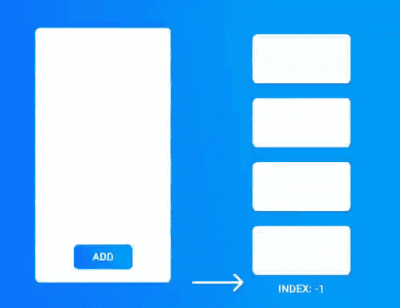

# Riverpod 在颤动时的撤销/重做机制

> 原文：<https://itnext.io/undo-redo-mechanism-with-riverpod-in-flutter-6fc15ef87b1a?source=collection_archive---------4----------------------->

## 实现撤销-重做机制是多么容易的故事

在本文中，您将看到 Hansel 和 Gretel 是如何在森林中实现堆栈列表的开发人员！

好奇？让我们开始吧！

## 理论

## 想法很简单！

1.  创建一个列表和一个索引
    (我的意思是，我们创建一个森林和，Hansel 和 Gretel)
2.  在每一次改变中，向列表中添加新的状态并增加索引
    (我们在森林中前进，每走一步都会留下碎屑)

## 就是这样！

—等等..就这样？！...

—撤销-重做实现呢？你不告诉我们怎么做吗？

我们已经实施了！不是吗？

为了回去，只要跟着崩溃就行了！

*   `undo`:降低指数(追踪碎片)
*   `redo`:增加索引(从停止的地方继续)
*   `reset`:清空列表，设置索引 0(收集所有碎片，回到你开始的地方)

如果你已经受够了这个愚蠢的故事，让我们看看代码！

# 实践

正如你看到的那样

*   我们有一个名为`_history`的列表来存储我们的历史中的每一个变化
*   我们有一个名为`_undoIndex`的索引，可以在`_history`中来回移动

剩下的就不言自明了，所以我就交给你了。

现在让我们看看我们的通知程序。

## 如你所见，我们只需要 2 个排列就可以使用`HistoryMixin`

*   将 `with HistoryMixin<T>`添加到您的`StateNotifier`中
*   在`constructor`中初始化您的值

## 你已经准备好了！

现在不需要任何配置就可以使用`undo`、`redo`和`reset`方法！

当然，这个历史 mixin 可以改进，并增加更多的功能，如最大历史长度，但我只是想指出心态。剩下的，就交给你们了。你真棒！！

## GitHub 项目

你抓住了重点，但仍然需要一个完整的例子？

 [## GitHub-IIS prey/history _ mixin _ example

### 一个新的颤振项目。这个项目是颤振应用的起点。一些帮助您入门的资源…

github.com](https://github.com/iisprey/history_mixin_example) 

## 感谢您的阅读！

那是一篇很长的文章，而你大老远跑来这里！你太棒了！请不要忘记鼓掌(也可能你不知道鼓掌可以达到 50 次，只是在你走的时候点击)