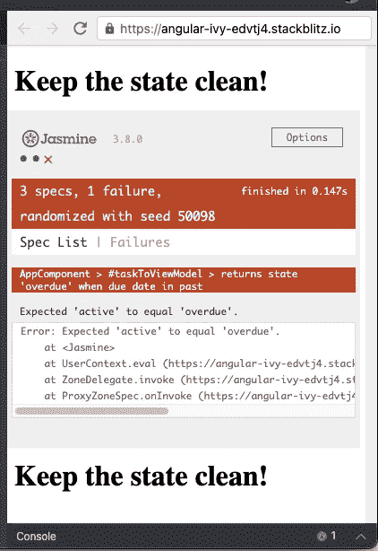

# 不稳定的单元测试？避免状态修改！

> 原文：<https://itnext.io/unstable-unit-tests-avoid-state-modification-b944f88f7948?source=collection_archive---------4----------------------->

随着时间的推移，不稳定的测试会破坏团队对测试的信任。一旦只有少数测试偶尔失败，很容易重新运行 CI 并忽略它们。随着时间的推移，只会更多。这会导致测试运行失败，而不会被认为是错误的信号。此外，工程师会因为花时间解决测试失败而损失一些生产力。

通常，测试执行顺序是随机的，除非您更改了测试运行程序的配置。随机排序有助于发现应用程序代码和测试中的错误。随机测试执行顺序的一个结果是需要确保测试下的状态在每次执行时完全相同。这是一件很明显要处理的事情，对吗？虽然在测试之间使用相同的模拟很容易被忽略。

让我们探索一个简单的角度项目，用相同的方法进行两次测试。

测试“在到期日过去时返回状态‘过期’”(姑且称之为“过期测试”)只是调用被测方法“taskToViewModel”提供“taskDtoMock”。它依赖于“taskDtoMock”来获得过去的到期日。

测试“当到期日在未来时返回状态‘活动’”(我们称之为“活动测试”)需要到期日在未来。这个测试不依赖于“taskDtoMock”的到期日。该测试通过将日期指定为一个非常遥远的日期来确保该日期是未来的日期。

你觉得呢，这两个测试会不会通过？“主动测试”总是会通过的。“过期测试”偶尔会通过，真烦人！您可能已经猜到，如果“主动测试”在“过期测试”之前运行，它会将模拟的到期日期更改为一个遥远的未来。“过期测试”失败是因为日期实际上是在未来，而不再是在过去。

## 如何避免？

你可以考虑两种方法:首先恢复模仿或者避免模仿的变异。

我发现做那些以后应该恢复原状的事情并不是最佳选择。更重要的是，如果您的测试运行人员可以并行运行测试，测试仍然会偶尔失败。

首先避免这些变化会更健壮。这真的很容易做到！简单的克隆就可以了:

这样,“taskDtoMock”将保留“dueDate”值，并且该测试不会影响其他测试的结果。

当然，状态修改不是测试不稳定的唯一原因。在接下来的文章中，我将展示其他可能的问题和处理方法。

测试愉快！