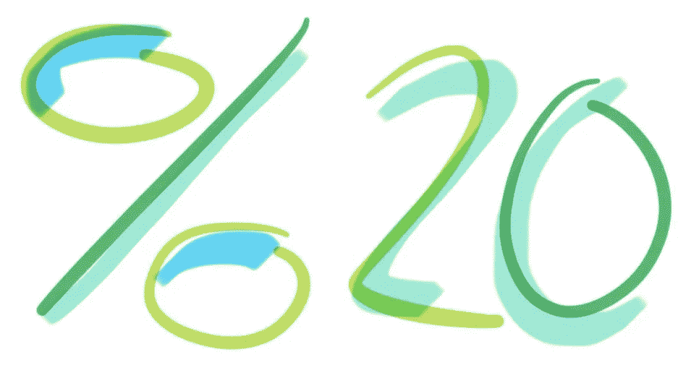

# URI.escape 已过时。对查询字符串进行百分比编码

> 原文：<https://itnext.io/uri-escape-is-obsolete-percent-encoding-your-query-string-cd998c4e847c?source=collection_archive---------5----------------------->

你在你的 Ruby 2.7.0 项目中遇到过这样的警告吗？

`warning: URI.escape is obsolete warning: URI.encode is obsolete`

找出如何修复它！

# 一点历史

Ruby 2.7.0 在调用`URI.escape`或者它的别名`URI.encode`时会显示一个警告。这看起来像是一个新的弃用，但事实是，这些方法已经被标记为过时...[10 年过去了](https://github.com/ruby/ruby/commit/238b979f1789f95262a267d8df6239806f2859cc)！如果您想知道为什么以前从来没有遇到过这个警告，这里有一个答案:以前只有当您以详细模式运行您的脚本时它才会显示，而这种情况最近才发生了变化。

# 那么，为什么`URI.escape`已经过时了呢？

“逃离 URI”这个概念的麻烦在于，URI 由许多组件组成(像`path`或`query`，我们不想以同样的方式逃离它们。例如，在 URI 的末尾出现一个`#`字符是没问题的(当它被用作通常所说的锚，或者在 URI 的说法中是一个`fragment`组件)，但是当同一个`#`是用户输入的一部分时(比如在一个搜索查询中)，我们希望对它进行编码以确保正确的解释。类似地，如果查询字符串值包含其他保留字符，如`=`或`&`，我们*确实*想要对它们进行转义，这样它们就不会被错误地解释为分隔符，就好像它们被用作保留字符一样。

`URI.escape`依赖于对整个字符串的一个简单的`gsub`操作，不区分不同的组件，没有考虑到上面提到的复杂性。

# 怎么修？

由于我还没有找到一个现有的解决方案，当给定一个完整的 URI 字符串时，它可以解释不同的组件，并以自己希望的方式应用不同的转义规则，所以我的建议是分别对不同的组件进行编码。最常见的(也是最敏感的)用例可能是在`query`组件中对查询字符串进行编码，所以我将重点讨论这种情况。Ruby 的`URI`模块本身提供了两个方便的方法来帮助我们实现这个目标！

# 对查询字符串进行百分比编码

## `URI.encode_www_form_component(string, enc=nil)`

这个方法将对每个保留字符进行百分比编码，只保留`*, -, ., 0-9, A-Z, _, a-z`不变。还用`+`代替空格。示例:

如您所见，我们现在可以安全地用这种方式转义的值构建查询字符串。但是如果这看起来像是太多的手工工作，有一种简便的方法可以为您处理整个查询。介绍…

界面略有不同。它采用一个`Enumerable`(通常是嵌套的`Array`或`Hash`)并相应地构建查询。它在内部使用`.encode_www_form_component`，所以编码规则保持不变。区别在于你使用的方式。示例:

很简单，不是吗？

# Rails 项目？

## `Hash#to_query`

(又名`Hash.to_param`)

Rails 用这个方便的方法扩展了`Hash`类。它将以正确的格式返回一个查询字符串，并根据需要对其值进行正确编码。

(注意它也是如何按字母顺序对键进行排序的。)

您还可以向该方法传递一个可选的名称空间，它会将键名包含在返回的字符串中，产生类似于`search[q]="how to speed up your CI?"`的格式(但显然是百分比编码的):

# 总结

我希望这篇短文能消除您对在 URI 使用字符串编码的任何困惑。如果您在您的 Ruby/Rails 项目中使用任何其他方式来处理百分比编码，请在评论中告诉我们！

如果您的项目正在与缓慢的 CI 构建作斗争，请查看[backpack Pro](https://knapsackpro.com/?utm_source=medium&utm_medium=blog_post&utm_campaign=uri-escape-is-obsolete-percent-encoding-your-query-string)，它可以帮助您解决这个问题。

*原载于* ***沙迪雷塞克*** *于 2020 年 1 月 19 日*[【https://docs.knapsackpro.com】](https://docs.knapsackpro.com/2020/uri-escape-is-obsolete-percent-encoding-your-query-string)**。**