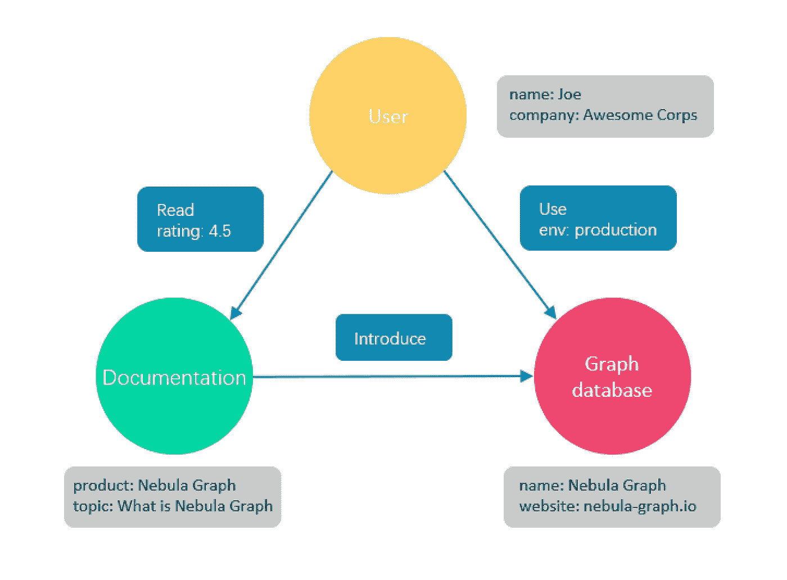
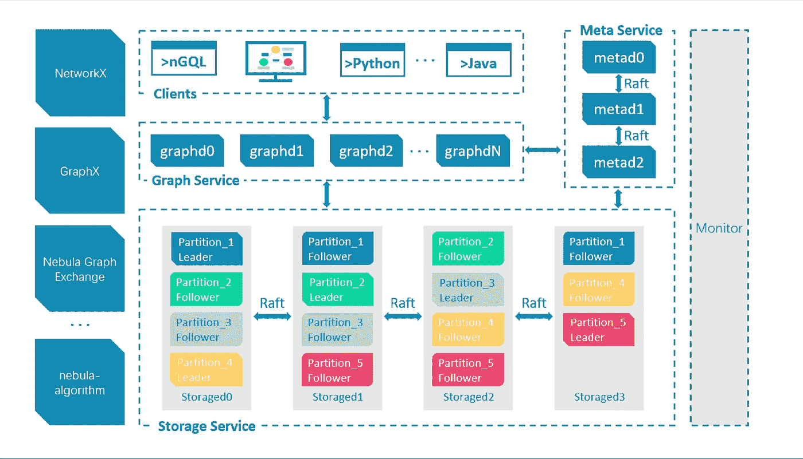
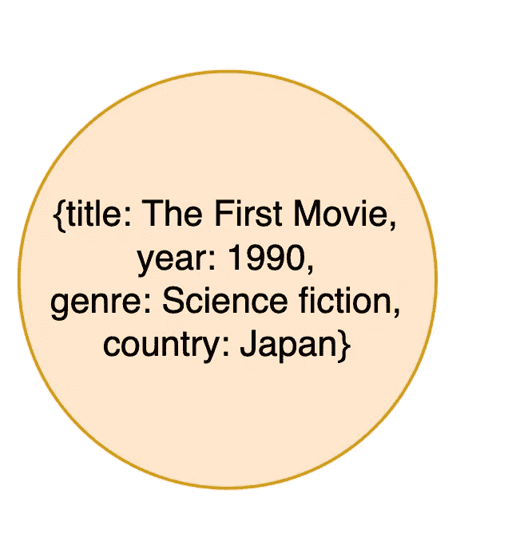
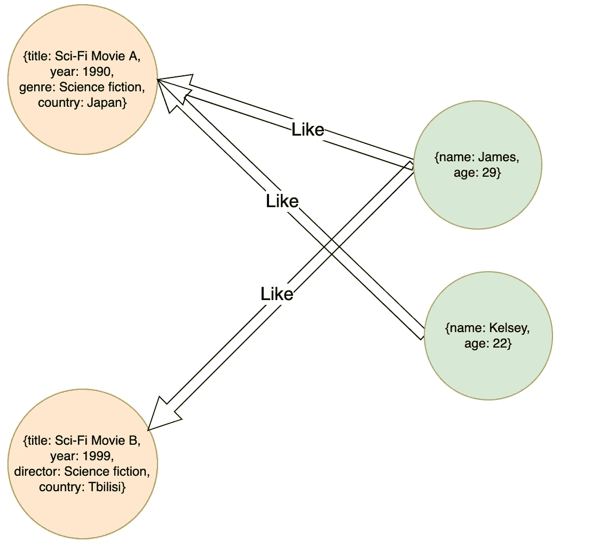
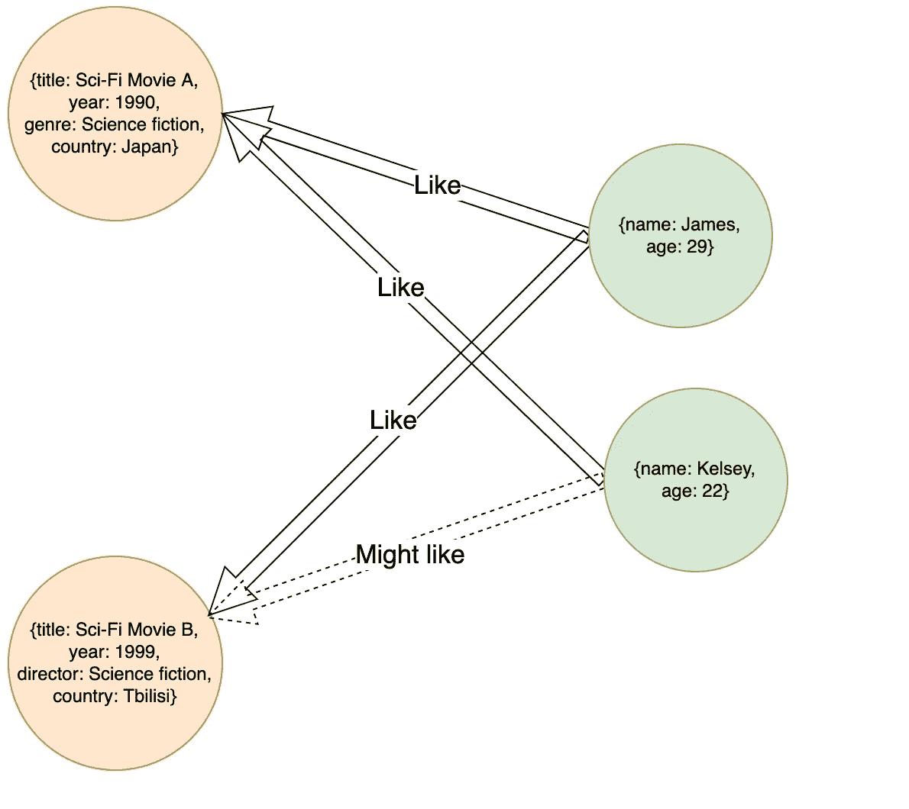

# 实时推荐中图数据库的用例

> 原文：<https://itnext.io/use-cases-of-graph-databases-in-real-time-recommendation-db222a8b2c83?source=collection_archive---------2----------------------->

实时推荐是零售行业非常热门的话题。实时推荐的目标是在用户在电子商务网站上搜索产品后，立即为用户提供个性化推荐。这是一项具有挑战性的任务，因为用户还没有决定他们想要购买哪种产品，所以需要深入了解他们的偏好和行为。

为了实现这一目标，实时推荐系统需要能够以接近实时的速度处理大数据。实时系统通常被用作电子商务网站或移动应用的一部分，它们可以根据用户当前正在做的事情推荐产品。例如，如果一个电子商务网站正在销售鞋子，当用户查看“男式运动鞋”页面时，它可能希望向用户显示不同款式的鞋子。

图技术是实时推荐的好选择。它有能力预测用户行为，并据此提出建议。像 NebulaGraph 这样的图形数据库提供了一个灵活的数据模型，允许您表示实体之间的任何类型的关系。这不仅包括典型的“产品”和“用户”关系，还包括对您的应用程序很重要的任何其他关系。例如，您可以使用图形数据库来表示复杂的用户分组(如“朋友”)或产品类别(如“书籍”)。只要两个实体之间有一条边，就可以使用图形技术。

表示任何一种关系的能力也使得图形数据库比关系数据库更具表现力。例如，如果有大量兴趣相似但属于不同组的用户，那么在关系数据库中，这可能意味着每个组有一个单独的表，然后在查询时将它们连接到一个大表中。相比之下，在图形数据库中，每个用户都有可能在不同的组中拥有代表其兴趣的多条边。

# 什么是图形数据库？

图形被认为是说明两个事物之间关系的图表。因此，可以假设图形数据库是用于理解数据之间关系的数据库。

图形数据库与大多数人熟悉的传统关系数据库管理系统(RDBMSs)不同。RDBMSs 将数据存储在一个由列和行组成的表中，这些列和行之间几乎没有关系。

图形数据库从根本上设计为关注数据集之间的关系。因此，它们需要更强大、更专业的处理能力。因此，像 NebulaGraph 这样的图形数据库使用复杂的设计和架构。

图形数据库旨在揭示许多大数据集之间的重要关系。换句话说，它可以将多个数据集之间的点连接起来，否则这些点可能会被闲置在仓库中。并且图形数据库已经被广泛用于这种目的。

# 什么是实时推荐系统？

推荐系统用于预测客户偏好，并为他们提供他们可能喜欢的产品或服务。它通过为客户提供个性化建议，帮助公司降低成本和增加收入。

推荐系统用于各种行业，包括零售、媒体和娱乐、旅游和公共部门。

例如，网飞使用一种算法，根据你以前看过的内容推荐电影。亚马逊使用推荐来帮助购物者找到他们可能有兴趣购买的新产品。脸书使用自己的算法，根据你的兴趣和喜好向你展示相关广告。

# 为什么要使用 NebulaGraph 进行实时推荐？

[NebulaGraph](http://nebula-graph.io) 是一个高性能的线性可扩展图形数据库，可通过无共享分布式模型使用。在几个真实的生产环境中，数据挖掘和技术性能已经被证明比竞争图形数据库的性能高出数倍。

NebulaGraph 背后的目标是释放指数级增长的互联数据的力量。

NebulaGraph 安全地处理至少两倍于任何竞争图形数据库大小和速度的数据集

*   它是唯一一个可以存储和处理数十亿个数据点以及数万亿个关系连接的数据库
*   NebulaGraph 旨在实现无中断的可扩展性和恢复，确保最佳的业务连续性

# 图表技术在推荐中的应用

推荐系统旨在根据用户的口味和偏好为用户提供个性化的推荐。例如，用户的特征可以通过他们对电影和书籍的偏好或者他们在电子商务网站上的购物习惯来表示。有两种主要类型的推荐系统:1)协同过滤方法和 2)基于模型的方法。

诸如 KNN 的协作过滤方法可以在不知道电影和用户的属性的情况下预测电影评级。为了应对这一挑战，图分解方法将基于模型的方法与协作过滤方法相结合，以在评级记录稀疏时提高预测准确性。

图分解方法已经广泛应用于许多在线推荐系统中。图分解是一种基于图的模型，可用于表示用户偏好以及用户、项目和属性之间的关系。图分解的目标是从用户评级和推荐中提取潜在的特征，以便这些特征可以用于以无监督的方式预测用户的偏好。

图分解是通过将原始数据集分解成更小的数据集或聚类来完成的。这个过程可以使用图形数据库来完成，因为它们被设计成支持高度连接的数据结构和数据点之间的关系。

# 如何用 NebulaGraph 搭建推荐系统？

如果你想建立自己的推荐系统，有许多不同的方法可以采用。最流行的一种方法是使用像 NebulaGraph 这样的图表数据库。本节将介绍如何使用图形数据库构建推荐系统。

**定义数据模型**

在这一步，我们为我们的推荐系统定义数据模型。我们需要定义的第一件事是可以推荐什么类型的数据。例如，我们想要推荐电影，所以我们将使用电影作为我们的实体。第二件事是关于一部电影我们需要什么样的信息？例如，如果你正在为书籍建立一个推荐系统，也许你需要知道它属于什么类型或者它是用什么语言写的。但是在我们的例子中，我们需要的只是标题、发行年份、类型和国家。所以我们的电影实体是这样定义的:

‍

‍

**定义关系**

接下来我们要做的是定义电影和用户(或人)之间存在什么类型的关系。电影和用户之间存在两种类型的关系:用户喜欢电影和用户看过电影(或用户没看过电影)。在这个例子中，我们将把它简化为用户喜欢的电影。

现在想象两个用户 James 和 Kelsey，他们都是科幻电影 A 的粉丝，这部电影有一种科幻类型。詹姆斯也喜欢科幻电影 B，但是凯尔西没有看过，所以我们不知道凯尔西喜不喜欢。

但是使用这种数据的图形建模，我们可以很容易地发现凯尔西可能喜欢科幻电影 B。推荐系统会向凯尔西推荐科幻电影 B，因为詹姆斯——他和凯尔西喜欢相同的东西——喜欢科幻电影 B

**做推荐**

有一些图形算法可以用来在图形数据库中提出建议。

**page rank 算法**:[page rank 算法](http://pi.math.cornell.edu/~mec/Winter2009/RalucaRemus/Lecture3/lecture3.html)用于对搜索结果中的网页进行排名。该算法的目的是确定当有人搜索 Google 或任何其他主要搜索引擎时，应该首先显示哪些网页。

PageRank 背后的基本思想是，如果你链接到另一个页面，那么这个页面比你自己的页面更重要。因此，如果你链接到一个关于买鞋的页面，而其他人链接到你的买鞋网站，那么这个人会认为你的网站比它实际上更重要。

如果每个人都链接到同一个网站，那么链接最多的人会得到更多的权重。

继续以电影为例，在观看电影时，人们可以继续观看相似类型的电影(从而跟随他们最期待的旅程)，或者跳到完全不同类型的随机电影。事实证明，这正是谷歌使用 *PageRank* 算法对网站进行人气排名的方式。

一个网站的受欢迎程度是通过它指向的链接数量(以及被引用的链接数量)来衡量的。在我们的电影用例中，流行度是随着给定电影与其所有邻居共享的哈希数而建立的。

**协同过滤:**协同过滤(CF)是一种基于关于用户、项目及其联系的信息的推荐系统的方法。通过查看用户附近的邻居和他们的兴趣来进行推荐。因为他们相似，所以假定他们有共同的兴趣。

阅读更多:[用协同过滤构建推荐引擎](https://realpython.com/build-recommendation-engine-collaborative-filtering/)

# 结论

总之，使用图数据库来构建实时推荐系统是值得的。由于图数据库被很好地设计来表示推荐系统中用户和产品之间的关系，所以它们可以用来构建实时推荐系统。图形数据库支持强大的数据分析，这使得它在构建需要考虑不同偏好的用户和产品的推荐系统时非常有用。