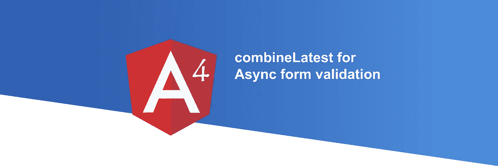

# 在 Angular4 中使用 combineLatest 进行异步表单验证

> 原文：<https://itnext.io/using-combinelatest-for-async-form-validation-in-angular4-8c9804f48892?source=collection_archive---------1----------------------->



如果您需要验证一个值依赖于其他表单输入的表单输入，该怎么办？如果验证本身依赖于 XHR 请求呢？

[*点击这里在 LinkedIn* 上分享这篇文章](https://www.linkedin.com/cws/share?url=https%3A%2F%2Fitnext.io%2Fusing-combinelatest-for-async-form-validation-in-angular4–8c9804f48892)

Angular 使 Observables 和 RXJS 变得简单。Angular 的 reactiveForms 返回每当表单的输入值改变时发出的可观察值:

```
let input1$ = this.form.controls.input1.valueChanges;
let input2$ = this.form.controls.input2.valueChanges;
let input3$ = this.form.controls.input3.valueChanges;
```

在这个例子中，我将特别观察三个表单输入。这是必要的，因为我需要验证的值取决于这三个输入。例如，验证车辆在城市中从一个地址到另一个地址的行驶时间。我想要验证的值是旅行时间(输入 1)。源地址的值是输入 2，目的地址的值是输入 3。

**首先，让我们创建一个每当我们的表单输入改变时发出的可观察对象**。通过将“combineLatest”与我上面获得的三个可观察值一起使用，我可以创建一个可观察值，当这三个输入中的任何一个发生变化时，它都会发出一个值，并始终提供它们的最新值。

```
combineLatest(input1$, input2$, input3$)    
.do(([input1, input2, input3])=>{
  this.form.controls.input1.clearAsyncValidators();
})  
.debounceTime(500)    
  .subscribe(([input1, input2, input3]) => {        
    if (!input1 || !input2 || !input3) return null;        
    let request = {        
      input1,        
      input2,        
      input3    
    }     
    const inputValidatorFn = this.getValidatorFn(request);                  
    this.form.controls.input1.setAsyncValidators(inputValidatorFn);         
    this.form.controls.input1.updateValueAndValidity();    
  });
```

然后我订阅这个可观察的，在去抖动它的广播速率之后，这样我只在用户停止输入时得到通知。我的订阅为我提供了我需要的三个最新值。 **clearAsyncValidators** 方法是为了防止 XHR 请求在用户停止输入之前被发送。

因为正在讨论的验证发生在服务器上，所以我们可以利用 Angular 的 **setAsyncValidators** 函数。它接受一个类型为 **AsyncValidatorFn** 的参数。这种类型的函数可以返回承诺或可观察值，当没有验证错误时，该值解析为 null，或者解析为描述验证错误的对象。因此，我们构造了一个类型为 **AsyncValidatorFn** 的函数，它将向服务器发出一个 XHR 请求，并返回一个判断，之后它将使用 null 进行解析，或者使用一个表示验证错误的对象进行解析。

```
private getValidatorFn(request): **AsyncValidatorFn** {    
 return ( control: FormGroup ) => {        
   return new Promise((resolve, reject) => {                            
    this.someService.validateTravelTime(request)                 
     .subscribe((serviceResponse) => {                    
       let response = serviceResponse.json();                    
       if( response && response.data.valid ) return resolve(null);                     
       if( response && !response.data.valid ) {               
         resolve({ err : response.data.errorDescription })                                 
       }                  
     })                
     .catch(err=>handleError(err));        
   })    
  }
}
```

我们上面的验证器函数利用了一个发出实际 XHR 请求的服务。当 XHR 请求满足时，服务返回一个发出响应的可观察对象。

每当任何输入发生变化(输入 1、输入 2 或输入 3)时，我们将获取它们的最新值，创建一个新的请求对象，然后创建一个类型为 **AsyncValidatorFn、**的新函数，然后我们将它传递给 Angular 的 **setAsyncValidators** 方法，该方法专门将这个异步验证器附加到输入 1。因此，每次输入发生变化(输入 1、输入 2 或输入 3)时，我们都会异步检查输入 1 的有效性。

最后，我们使用:

```
this.form.controls.input1.updateValueAndValidity();
```

这将在我们的异步验证器就位后触发验证检查。

完整代码: