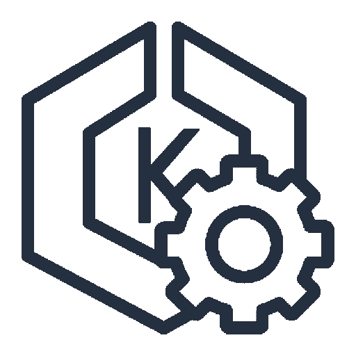

# 使用 KinD 运行 EKS-D

> 原文：<https://itnext.io/using-kind-to-run-eks-d-c4603d3d7f83?source=collection_archive---------3----------------------->



2020 年 12 月，亚马逊发布了 EKS-发行版，这是一个可以在各种不同环境下运行的 Kubernetes 发行版，包括内部环境。这个发行版经过了 AWS 的实战测试，包含了 EKS 使用的所有安全补丁和更新，为您提供了安全、可复制的 Kubernetes 版本。介绍 EKS-D 的博客包括几个构建 EKS-D 集群的资源。在这篇博客中，我将描述如何在 Docker (KinD)中使用 Kubernetes 在您的本地机器上运行 EKS-D。KinD，如 Minikube 和 Microk8s，是在本地机器上托管 Kubernetes 的一种方式，只是它不需要额外的驱动程序或虚拟机。我个人发现它对于构建不同解决方案的原型非常有用。

第一步包括从 Kubestack 创建一个 [kbst/kind](https://github.com/kbst/kind-eks-d) 项目的分支。一旦项目被分叉，用环境变量更新根目录中的`Makefile`，例如，您想要使用的构建的`RELEASE_BRANCH`、`VERSION`和`SOURCE_URL`。

```
RELEASE_BRANCH = 1-20
VERSION := v$(subst -,.,$(RELEASE_BRANCH)).4
SOURCE_URL = [https://distro.eks.amazonaws.com/kubernetes-${RELEASE_BRANCH}/releases/1/artifacts/kubernetes/${VERSION}/kubernetes-src.tar.gz](https://distro.eks.amazonaws.com/kubernetes-${RELEASE_BRANCH}/releases/1/artifacts/kubernetes/${VERSION}/kubernetes-src.tar.gz)
GIT_SHA := $(shell echo `git rev-parse --verify HEAD^{commit}`)
IMAGE_NAME = public.ecr.aws/jicowan/kind-eks-d
TEST_IMAGE = ${IMAGE_NAME}:${GIT_SHA}
```

在本例中，我使用的是 Kubernetes v1.20.4。我还将生成的容器映像推送到 ECR public。你可以在 https://distro.eks.amazonaws.com/#releases 找到可用版本列表。要获得发布的`SOURCE_URL`，下载发布清单并运行下面的`yq`查询:

```
yq eval '.status.components.[] | select(.name="kubernetes") | .assets.[] | select(.name=="kubernetes-src.tar.gz")' ./kubernetes-1-20-eks-1.yaml
```

输出应该如下所示:

```
archive:
  sha256: 7b642868c905e41a93beded9968d2c48daef7ecd57815bf0f83ca1337e1f6176
  sha512: 095e57e905a041963689ff9b2d1de30dd6f0344530253cccd4e3d91985091cc37564b95f45c1ed160129306d06f5d2670feb457cbb01e274f5a0c0f3c724f834
  uri: [https://distro.eks.amazonaws.com/kubernetes-1-20/releases/1/artifacts/kubernetes/v1.20.4/kubernetes-src.tar.gz](https://distro.eks.amazonaws.com/kubernetes-1-20/releases/1/artifacts/kubernetes/v1.20.4/kubernetes-src.tar.gz)
description: Kubernetes source tarball
name: kubernetes-src.tar.gz
type: Archive
```

验证`SOURCE_URL`与`[yq](https://mikefarah.gitbook.io/yq/)`输出中的 URI 匹配。确保保持`RELEASE_BRANCH`和`VERSION`变量不变，因为它们将由您之前指定的值填充。

如果像我一样，您想将图像推送到您自己的注册表中，您将需要更新 GitHub actions 下的`main.yml`文件。当我将生成的图像推送到 ECR 时，我需要用我的 AWS 访问密钥 ID 和密钥的环境变量更新 Docker 登录部分。GitHub actions 将使用这些秘密向 ECR public 认证。

```
- name: Docker login      
  uses: docker/login-action@v1      
  with:        
    registry: public.ecr.aws        
    username: ${{ secrets.AWS_ACCESS_KEY_ID }}        
    password: ${{ secrets.AWS_SECRET_ACCESS_KEY }}      
  env:        
  AWS_REGION: us-east-1
```

在保存您的更改之前，为`AWS_ACCESS_KEY_ID`和`AWS_SECRET_ACCESS_KEY`创建 GitHub secret。如果你不熟悉如何创建 github 秘密，请参考[https://docs . GitHub . com/en/actions/reference/encrypted-secrets](https://docs.github.com/en/actions/reference/encrypted-secrets)。当你保存更改`main.yml`时，它将触发一个工作流，该工作流将构建并推送你的图像到你的注册表中。

接下来，为 KinD 创建一个名为`kind-eks-d-v1.20.conf`的配置文件，如下所示:

```
kind: Cluster
apiVersion: kind.x-k8s.io/v1alpha4
name: eks-d-1-20
nodes:
- role: control-plane
  image: public.ecr.aws/jicowan/kind-eks-d:4e13a3f38c26a14e6a333fc7b8246c02ac4b33b2
- role: worker
  image: public.ecr.aws/jicowan/kind-eks-d:4e13a3f38c26a14e6a333fc7b8246c02ac4b33b2
```

请注意，您可能需要使用您的图像的 URI 来更新图像，尽管您可以免费使用我推送到 ECR public 的图像。

最后，通过执行以下命令创建一个 KinD 集群:

```
kind create cluster --config ./kind-eks-d-v1.20.conf
```

大约 3-5 分钟后，您将有一个 EKS D 集群运行在您的本地机器上！