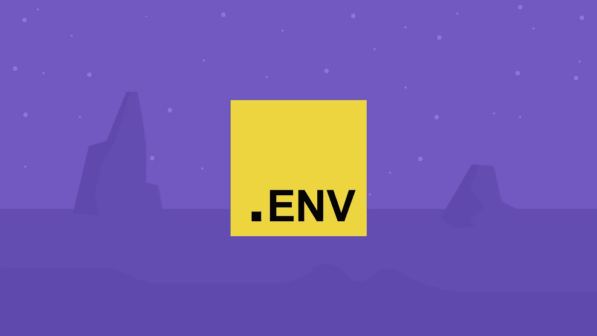

# 使用多个。Nuxt 中的 env 文件

> 原文：<https://itnext.io/using-multiple-env-files-in-nuxt-15703d7535f3?source=collection_archive---------2----------------------->



来源:[火箭座](https://blog.rocketseat.com.br/variaveis-ambiente-nodejs/)

关于`.env`的正交性以及如何使用`dotenv`模块有很多说法，但在 IMO 看来，它并不适用于 SPA 应用程序，这些应用程序是在部署之前构建的。我目前从事的项目是在谷歌云引擎上托管的，我必须在部署它之前构建我的 Nuxt 应用程序。让多个`.env`文件应用于我使用的`development`和`production`应用对我来说是有意义的，因为我没有专门的自动化 CI 流程，我可以有一个单独的`.env`文件。

所以，这是你能做的。

1.  **安装**

```
yarn add dotenv
```

2.**创建**

创建一个模块，该模块将根据当前的`NODE_ENV`值加载正确的`.env`文件。

**3。将** `**config.js**` **载入** `**nuxt.config.js**`

在本例中，我们使用条带模块，并根据当前环境使用`.env`值。

然后，您可以向 nuxt 配置添加额外的`env`属性，以声明在您的公共组件中使用的 env 变量。

[**4。创建您的**](https://gist.github.com/hypeJunction/ccff1e119c7357f381c9ef4a124f4d60.js) `[**.env**](https://gist.github.com/hypeJunction/ccff1e119c7357f381c9ef4a124f4d60.js)` [**文件**](https://gist.github.com/hypeJunction/ccff1e119c7357f381c9ef4a124f4d60.js)

现在，为每个环境创建一个. env 文件并填充值。Nuxt 在两个`NODE_ENV`环境下运行:`development`和`production`。因此，为生产环境创建`.env`文件，为开发环境创建`.env.development`文件。

我也鼓励你创建一个`env.example`文件，记录你的应用程序中使用的所有值。因为你不会想把你的。env 文件有一个示例文件，通过将它们复制/粘贴到正在进行构建的服务器上，可以更容易地创建`.env`文件。