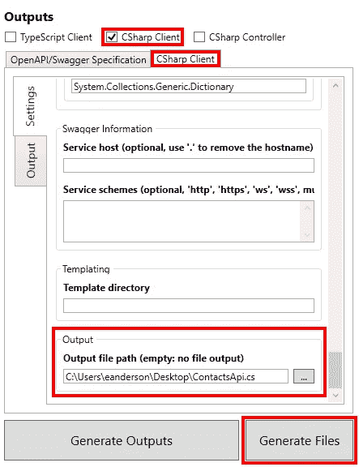

# 使用 NSwag 为 ASP.NET 核心 3 生成 C#客户端类

> 原文：<https://itnext.io/using-nswag-to-generate-c-client-classes-for-asp-net-core-3-173fb18dd508?source=collection_archive---------3----------------------->

这篇文章将使用 NSwag 提供的工具之一来生成 C#客户端类，以提供对 API 的访问。虽然 NSwag 工具提供了多种发现 API 定义的方法，但我们将使用该工具从 OpenAPI/Swagger 规范中生成 C#类。

有关如何使用 NSwag 为您的 API 提供 OpenAPI/Swagger 的详细信息，请查看我的[Swagger/open API with NSwag and ASP.NET Core 3](https://elanderson.net/2019/10/swagger-openapi-with-nswag-and-asp-net-core-3/)帖子。如果你需要一个 API 来玩，你可以从这个 [GitHub repo](https://github.com/elanderson/ASP.NET-Core-Basics-Refresh/tree/14d130df7102c0603d532a2aef4d459292359b9d) 获得我在文章中使用的 API。如果您从 GitHub 获取示例 API，并不是说它使用了实体框架核心和 SQLite，这意味着您需要创建相关的数据库。如何做到这一点的细节可以在我的[ASP.NET 核心 3:将实体框架核心添加到现有项目](https://elanderson.net/2019/11/asp-net-core-3-add-entity-framework-core-to-existing-project/)帖子的创建和应用初始迁移部分找到。

## 示例客户端应用程序

对于这个例子，我们将使用。NET CLI，在您希望创建应用程序的目录下，从您最喜欢的终端应用程序中使用以下命令。

```
dotnet new webapp
```

## NSwag 客户端生成

NSwag 为客户端生成提供了多种选项，包括 CLI 选项、代码和 Windows 应用程序。这篇文章将使用名为 NSwagStudio 的 Windows 应用程序。从[这里](http://rsuter.com/Projects/NSwagStudio/installer.php)下载并安装 NSwagStudio。

接下来，确保您的 API 正在运行，并获取其 OpenAPI/Swagger 规范 URL 的 URL。例如，我正在使用我的 API 的本地实例，我需要的 URL 是[https://localhost:5001/Swagger/v1/swagger.json。](https://localhost:5001/swagger/v1/swagger.json.)如果您正在使用 Swagger UI，您可以在 API 标题下找到指向您的 Swagger . JSON 的链接。


现在我们有了 API 的 OpenAPI/Swager 规范 URL，我们正在处理 open NSwagStudio。应用程序将打开，并带有一个准备就绪的新文档。我们需要设置几个选项。首先，我们想使用 NetCore30 **运行时**。接下来，选择 **OpenAPI/Swagger 规范**选项卡，并在**规范 URL** 框中输入您的 API 规范 URL。


在**输出**部分勾选 **CSharp 客户端**复选框，然后选择 **CSharp 客户端**选项卡。正如你从下面的截图中看到的，有很多选项可以调整。对于这个例子，除了**名称空间**和**输出文件路径**之外，我们对它们都采用默认设置，前者我设置为 ContactsApi，后者只有在使用**生成文件**选项时才需要。单击**生成文件**按钮，NSwagStudio 将创建一个文件，其中包含访问在输入部分选择的 OpenAPI/Swager 规范中描述的 API 所需的所有代码。



注意，如果您想在与设置相同级别的**输出**选项卡中查看生成的代码，可以使用**生成输出**按钮。

## 使用从示例项目中生成的客户端

在示例项目中，我创建了一个 Api 目录，并将使用 NSwagStudio 创建的 **ContactsApi.cs** 放在那里。用 NSwagStudio 生成的文件预计 JSON.NET 会出现，所以示例项目将需要对[微软的引用。AspNetCore . MVC . newtonsoftjson](https://nuget.org/packages/Microsoft.AspNetCore.Mvc.NewtonsoftJson)nu get 包。

现在该项目在 **Startup** 类的 **ConfigureServices** 函数中引用了 JSON.NET，我们需要告诉应用程序通过依赖注入使 JSON.NET 可用，并做如下更改。

```
services.AddRazorPages()
        .AddNewtonsoftJson();
```

现在为了测试客户端，我在 **Index.cshtml.cs** 文件中使用了下面的 **OnGet** 函数。

```
public async Task OnGet()
{
    using (var httpClient = new HttpClient())
    {
        var contactsClient = new ContactsClient(httpClient);
        var contacts = await contactsClient.GetContactsAsync();
    }
}
```

请注意，以上内容只是为了展示生成的客户端可以工作，并不意味着是生产级的示例。对于更多的生产级场景，请确保并遵循微软关于 [HTTP 客户端使用](https://docs.microsoft.com/en-us/aspnet/core/fundamentals/http-requests?view=aspnetcore-3.0)的指导。

## 包扎

NSwag 的客户端生成似乎是一种开始使用 API 的简单方法。我不确定 CLI 是否会提供更多关于如何生成客户端代码的选项，是否支持 HTTPClientFactory 和强类型 HTTP 客户端。这将是我在以后的文章中可能会探索更多的东西。

*原载于* [*埃里克·安德森*](https://elanderson.net/2019/11/using-nswag-to-generate-c-client-classes-for-asp-net-core-3/) *。*