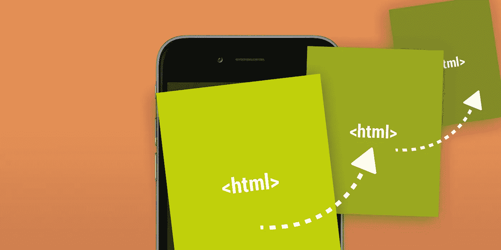
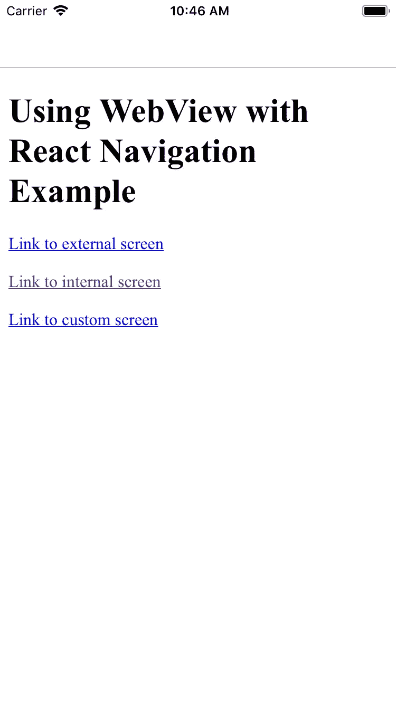

# 将 WebView 与 React 导航结合使用

> 原文：<https://itnext.io/using-webview-with-react-navigation-43344217111e?source=collection_archive---------0----------------------->



我最近一直在做一个 React 原生应用，它有一些有趣的需求。它内置于 Expo 中，具有 React 导航功能，内容存储在外部服务器上，并通过 WebView 显示在应用程序中。

到目前为止一切正常

然而，外部 html 文件中的链接有三种可能的结果——要么在浏览器中打开(标准`Linking.getUrl`)，在应用程序中作为新的 StackView 屏幕打开(`StackActions.push({ routeName: 'ScreenName'})`)，或者最棘手的是，打开堆栈导航器中定义的不同屏幕(`navigation.navigate('CustomScreen')`)。

# 初始设置

让我们从设置一个基本的 StackNavigator 和一个显示它的屏幕开始

```
import React from 'react';
import { View } from 'react-native';
import { createAppContainer, createStackNavigator } from 'react-navigation';// SCREENS
import WebViewScreen from 'WebViewScreen';const MyStack  = createStackNavigator({
  Landing: {
    screen: WebViewScreen,
    params: { url: '[http://www.damienmason.com/medium/react-navigation-webview.html](http://www.damienmason.com/medium/react-navigation-webview.html)['](http://www.damienmason.com/') },
  }
});const MyNav = createAppContainer(MyStack);const Medium = () => {
  return <MyNav />
}
export default Medium;
```

我们还需要制作 WebViewScreen，这是一个基本的 WebView，它从导航中提取 url，并在应用程序中显示它。我包含了加载状态，因为我认为显示 ActivityIndicator 总比什么都不显示好，即使它只需要一秒钟的加载时间。

```
import React, { Component } from 'react';
import { View, ActivityIndicator, WebView } from 'react-native';class WebViewScreen extends Component {renderLoadingView() {
    return (
      <View style={{ flex: 1, alignItems: 'center', justifyContent: 'center'}}>
        <ActivityIndicator
          size='large'
        />
      </View>
    );
  }
  render() {
    const { url }  = this.props.navigation.state.params;
    return(
      <WebView
        source={{uri: url }}
        renderLoading={this.renderLoadingView}
        startInLoadingState={true}
      />
    );
  }
}
export default WebViewScreen;
```

现在一切都像预期的那样工作——应用程序显示加载了内容的导航堆栈视图，点击链接会打开任何默认浏览器。



# 停止 WebView 的默认链接行为

接下来，我们需要中断加载过程，并检查链接，看看应该如何处理它。为此，我们将使用`onNavigationStateChange`，第一步是停止加载 webview。我们需要为 WebView 创建一个 ref，然后我们可以调用`stopLoading`

```
<WebView
  source={{uri: url }}
  renderLoading={this.renderLoadingView}
  startInLoadingState={true}
  ref={(ref) => { this.webview = ref; }}
  onNavigationStateChange={(event) => {
    this.webview.stopLoading();
  }}
/>
```

尝试重新加载应用程序，您将看到第一个问题 WebView 的初始加载算作导航更改事件。所以我们需要检查以确保`event.url`不同于我们从导航参数中加载的 url

```
<WebView
  source={{uri: url }}
  renderLoading={this.renderLoadingView}
  startInLoadingState={true}
  ref={(ref) => { this.webview = ref; }}
  onNavigationStateChange={(event) => {
    if (event.url !== url) {
      this.webview.stopLoading();
    }
  }}
/>
```

现在我们有了一个显示内容的 WebView，但是不加载任何链接。打开一个外部链接是一个简单的`Linking.openURL(event.url)`命令，但是在应用程序中作为新的屏幕打开链接有点棘手。

# 在应用程序中打开链接

这里我们需要做的第一件事是用一个新屏幕设置 StackNavigator。它使用相同的`WebViewScreen`，但是 url 参数作为一个属性提供给它

```
Internal: {
  screen: WebViewScreen,
  params: { url: props => props.navigation.state.params.url },
}
```

然后，在我们的 WebView 中，我们可以检查该 url 是否来自特定的域，并使用它来确定该链接是否应该被推送到新的`Internal`屏幕，或者以通常的方式打开。别忘了`import { StackActions } from 'react-navigation';`

```
onNavigationStateChange={(event) => {
  if (event.url !== url) {
    this.webview.stopLoading();
    if (event.url.includes('[http://www.damienmason.com'](http://www.damienmason.com'))) {
      dispatch(
        StackActions.push({
          routeName: 'Internal',
          params: { url: event.url },
        })
      )
    } else {
      Linking.openURL(event.url);
    }
  }
}}
```

我在这里使用的是`StackActions.push`而不是`navigation.navigate`,这样屏幕就会一个接一个地显示出来，即使技术上来说是同一个页面，但是输入了不同的 url

# 添加自定标题

我不会在这里说太多的细节，但是如果这是你需要的东西(对我来说，我们有一个带标题参数的自定义标题)，一个选择是在 url 的末尾添加一个标题，像`mypage.html#my_custom_page_title`，然后使用`event.url.substring(event.url.lastIndexOf('#')+1, event.url.length).replace(/_/g, ' ')`把它作为一个变量拉出来。第一部分抓取#后面的字符串，第二部分用空格替换下划线。你也可以对它进行 camelcase 或其他任何你想要的字符串操作，并把它作为一个参数反馈到下一个屏幕。

# 链接到自定义屏幕

我们需要考虑的最后一种情况是如何链接到一个自定义屏幕，内容不是来自外部 html 源，而是直接编码到组件中。我将把它放在 Medium.js 文件中进行测试

```
const CustomScreen = () => {
  return <View><Text>CustomScreen</Text></View>
}
```

有几种方法可以做到这一点，但重要的是 WebView 必须将链接视为真实的，所以它会尝试打开它并触发`onNavigationStateChange`，所以在我的例子中，我使用了`[http://local/CustomScreen](http://local/CustomScreen)`作为 html 中的 url。然后，在我的事件检查语句中，我们只需要查看它是否来自该 url，如果是，则获取链接的结尾(final /)并在导航函数中使用它

```
else if (event.url.includes('[http://local/'](http://local/'))) {
  const pageLink = event.url.substring(event.url.lastIndexOf('/')+1, event.url.length);
  navigate(pageLink)
}
```

# 又抓到你了

这将在 iOS 模拟器上按预期工作，但由于某种未知原因，它会继续加载本地 url，所以如果你导航回屏幕，它会抛出一个错误。如果您不从 WebView 导航离开，它就不会发生，我真的不知道它在做什么，但为了避免让您头疼，我只需在调度后抛出一个`this.webview.reload()`—WebView 屏幕将在堆栈导航动画发生时重新加载，这并不理想，但这是我能找到的最佳解决方案。

# 还有一个

如果你绕回原来的屏幕，你会遇到另一个恼人的问题，那就是`onNavigationStateChange`被调用了两次，这意味着内部 StackActions push 发生了两次。它似乎也忽略了`webview.stopLoading()`。我能想到的最好的解决方案是使用`[http://local](http://local)`选项链接回第一个屏幕。它没有出现在我的构建中，但它是值得注意的。如果你知道为什么会这样，请告诉我。

# 给我密码

索引. js

```
import React from 'react';
import { View, Text  } from 'react-native';
import { createAppContainer, createStackNavigator } from 'react-navigation';// SCREENS
import WebViewScreen from './WebViewScreen';const CustomScreen = () => {
  return <View><Text>Custom Screen</Text></View>
}const MyStack = createStackNavigator({
  Landing: {
    screen: WebViewScreen,
    params: { url: '[http://www.damienmason.com/medium/react-navigation-webview.html'](http://www.damienmason.com/medium/react-navigation-webview.html') },
  },
  Internal: {
    screen: WebViewScreen,
    params: { url: props => props.navigation.state.params.url },
  },
  CustomScreen: CustomScreen
});const MyNav = createAppContainer(MyStack);const Medium = () => {
  return <MyNav />
}export default Medium;
```

WebViewScreen.js

```
import React, { Component } from 'react';
import { View, ActivityIndicator, Linking, WebView } from 'react-native';
import { StackActions } from 'react-navigation';class WebViewScreen extends Component {renderLoadingView() {
    return (
      <View style={{ flex: 1, alignItems: 'center', justifyContent: 'center'}}>
        <ActivityIndicator
          size='large'
        />
      </View>
    );
  }
  render() {
    const { navigate, state, dispatch } = this.props.navigation;
    const { url }  = state.params;
    return(
      <WebView
        source={{uri: url }}
        renderLoading={this.renderLoadingView}
        startInLoadingState={true}
        ref={(ref) => { this.webview = ref; }}
        onNavigationStateChange={(event) => {
          if (event.url !== url) {
            this.webview.stopLoading();
            if (event.url.includes('[http://www.damienmason.com'](http://www.damienmason.com'))) {
              dispatch(
                StackActions.push({
                  routeName: 'Internal',
                  params: { url: event.url },
                })
              )
            } else if (event.url.includes('[http://local/'](http://local/'))) {
              const pageLink = event.url.substring(event.url.lastIndexOf('/')+1, event.url.length);
              navigate(pageLink)
              this.webview.reload()
            } else {
              Linking.openURL(event.url);
            }
          }
        }}
      />
    );
  }
}
export default WebViewScreen;
```

和外部 html 中的示例链接

```
<!DOCTYPE html>
<html>
  <head>
    <title>Using WebView with React Navigation Example</title>
    <meta name="viewport" content="width=device-width, initial-scale=1.0" />
  </head>
  <body>
    <h1>Using WebView with React Navigation Example</h1>
    <p><a href="[http://www.medium.com](http://www.medium.com)">Link to external screen</a></p>
    <p><a href="[http://www.damienmason.com/medium/react-navigation-webview-2.html](http://www.damienmason.com/medium/react-navigation-webview-2.html)">Link to internal screen</a></p>
    <p><a href="[http://local/CustomScreen](http://local/CustomScreen)">Link to custom screen</a></p>
  </body>
</html>
```

谢谢大家。我希望这对您自己的项目有所帮助。如果你需要更多的信息，请随时给我写信，或者分享你对如何处理这种工作的想法。