# 软件开发中价值驱动的技术决策

> 原文：<https://itnext.io/value-driven-technical-decisions-in-software-development-c6736f74167?source=collection_archive---------1----------------------->

2 月 13 日，我在斯德哥尔摩的 SwitchON 2020。在会议上，我第一次公开发表了我的演讲“软件开发中价值驱动的技术决策”。

在这篇文章中，我概述了这次演讲，并为演讲的三个部分提供了更多的细节和背景:

一、软件项目失败的技术原因

二。过度工程心理学

三。软件开发中的价值驱动决策

# 一、软件项目失败的技术原因

让我们从调查项目失败的技术原因开始。

我将它缩小到“技术”决策有几个原因。首先，我认为我们作为开发人员和架构师有一种倾向，认为我们的技术决策太重要了。与此同时，我们淡化或忽略了某些类型的技术决策所带来的风险。在我看来，我们并不擅长考虑:

*   我们想要得到什么？
*   我们的选择有什么弊端？
*   我们带什么上船？(即风险、维护、学习)
*   在我们所处的特定情况下，这个决定真的有意义吗？

哥本哈根 IT 大学的索伦·劳森教授撰写了一份报告[“大型政府 IT 项目中的损害和损害原因”](https://www.itu.dk/~slauesen/Papers/DamageCaseStories_Latest.pdf)。

该报告调查了丹麦一些成功或(大部分)失败的大型政府 IT 项目。

在阅读该报告时，立即给你留下深刻印象的是，索伦·劳森描述的现象和错误绝不仅仅发生在大型政府 IT 项目中。我在从 5 万 DKK 到数千万的项目中反复看到这些错误。

因此，我认为可以有把握地说，报告的调查结果比报告的标题所显示的更具普遍性。我认为许多大公司(银行、能源、零售)很高兴他们的许多项目没有受到这种程度的审查/事后检查。他们不必向股东透露这类报告。

在报告中，索伦·劳森概述了软件项目中出现的主要损害。它们的原因是什么，有什么可能的治疗方法。
不同的项目遇到不同程度的损害。
主要损坏类型及其对不同项目的影响示例如下:

## 时间

第一次伤害是*次*。即项目比最初预计的时间要长。这有几个额外的影响。不仅仅是我们花了更多的时间。它可能比预计的上市时间晚，成本降低或利润增加的时间也晚。由于项目延期，某些业务能力可能无法实现。(关于这个我推荐看独角兽项目)。它还可能导致无法履行某些义务或合规性要求。

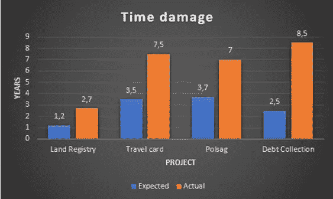

观察时间图中预期和实际之间的差异，我们看到项目在完成前增加了几年。

这对于其他损害的发生来说是一段很长的时间，对于目标景观的移动来说是一段很长的时间，或者，正如我们将在后面看到的，对于税收债务来说是足够长的时间…

## 费用

*造成的*损失可能与多种因素有关。这可能是额外的开发成本，但也可能是延迟导致的成本(额外的许可费、订阅、非自动化)。

它也可以是迁移工作或类似的工作，这些工作被认为是自动化的，但结果却需要手动处理。一个项目中有许多增加成本的因素。这不仅仅是由“错误的估计”造成的。

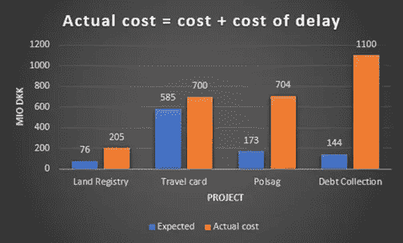

旅行卡项目旨在为丹麦 20 多家公共交通运营商引入通用的数字卡解决方案。

尽管 Travel Card 在成本参数上取得了一定的成功，但它实际上让供应商损失了 5 亿丹麦克朗，因为他们“忽略”了他们还应该提供后台系统。

时间的延迟也意味着整个项目被智能手机革命超越，这将彻底改变 it 的可能基础设施。基本上意味着当它上线时，它已经感觉过时了。如果他们转向支持智能手机的解决方案，那么预算可能不会像估计的那样接近，但总体而言，这可能是一个更好的解决方案，更容易被公共交通用户采用。

## 经营成果

损害赔偿也可以是*经营成果*。例如，确保对客户/市民或基本投资回报的一些 SLA。
也可能是这样，项目根本没有产生最初预期的机会，或者可能没有实现裁员或高培训成本。

收债项目(EFI)的目的是以集中的方式自动处理丹麦公民的涉税债务，并淘汰 300 个 bailif 职位。

债务收集有 450 种不同的复杂的税收应该收集。我就不细说导致这一项目混乱的许多不同因素了，只说一句话就够了，这是一场多么糟糕的演出。该项目不仅在 8 年后(最初估计时间的 3 倍)基本上被取消，而且不仅没有产生 300 个工作岗位的节省(它只是将他们从高技能的法警变成了高技能的办案员)。他们还决定在系统实际准备好之前实现他们的商业案例，在系统上线运行之前就让 300 个 bailifs 走人。这导致了 300 亿到 700 亿丹麦克朗的税收损失。这是试图每年节省大约 3 亿丹麦克朗的结果。由于 300 名员工从一种类型转换到另一种类型，这一节约根本没有实现。

这是一个极其令人沮丧的糟糕风险管理的例子。坚持“100%”的解决方案，而不是自动化包含 20%复杂性的 80%手工工作。

我想象有人会说这样的话:*“当你可以自动化 100%的时候，为什么只自动化 80%？”—* 没有意识到最后的 20%会增加复杂性、成本、时间等。增加 10 倍或更多。

## 可行性怀疑

当项目开始被推迟，成本增加或业务成果似乎遥不可及时，我们就冒着*可行性怀疑*损害的风险。

这种损害基本上是，整个项目的可行性，从而继续存在受到质疑。

这时利益相关者会提出这样的问题:

> 我们是在浪费金钱吗？我们是沉没成本效应的受害者吗？项目或业务目标还有救吗？

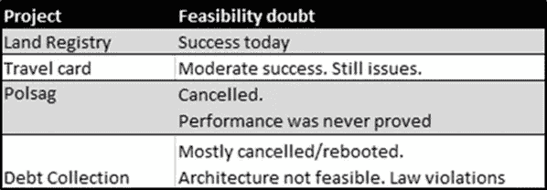

PolSag(警察案件)包含一个有趣的故事(或者有趣实际上不是正确的词)。该项目的目的是为丹麦警方建立一个新的案件处理系统。

“有趣”的是，没人能定义新系统的目的或商业案例是什么。也就是说，基本上不知道为什么要建造它。

在试点测试期间，该系统遭受了难以置信的缓慢登录时间，这给了该系统一个非常坏的印象。
当技术人员最终被允许检查配置和日志时，他们发现登录使用了一个活动目录服务器列表，而前几个并不存在。因此，30 秒的超时几次，然后尝试一个存在的。总是..
这是接近最终用户并了解他们所说的“性能不佳”的一个很好的例子。在放弃该项目时，他们还意识到，即使他们并不期待一个积极的商业案例，它的运营成本也将是原来的 5 倍…

## 可用性

这里列出的最后一个损害是可用性损害。

例如，像这样的问题:

*   这个系统到底能不能用？
*   系统是不是很难用？
*   它(非常)慢吗？
*   用户体验真的很差吗？用户会犯很多错误吗？
*   系统使用起来是不是极其繁琐？

土地登记系统由一名主题专家进行了部分定义，但大多数用户并不是土地所有权登记和该系统所能实现的其他功能的专家。所以用户基本都放弃了。在半年多的时间里，需要几个星期才能接通热线，获得使用该系统的帮助。

这是针对一个应该支持从用户开始到用户结束在 10 天内完成的系统…

## 技术决策损害原因

如果您浏览了 [excel 概述](https://www.itu.dk/~slauesen/Papers/DamageCauses_Latest.xlsx)中的 37 个主要损坏原因列表，并排除了与“技术决策”没有直接关系的原因，您基本上只剩下两个损坏原因:

*   A5:超售技术，例如 SOA、基于 web 的工作流引擎。
*   A9:没有可行的解决方案。数据丢失、性能可疑等。

这些疗法:

*   治愈 A5:检查技术:获取第二意见，询问技术用户。
*   治愈 A9:请教专家，早期 PoC。

所以很简单。*试试看*、*请教比你更懂行的人*。

描述这些原因的另一种方式是:

> 一个是没有尽职地(过度)设计，
> 
> 另一种是假设，没有尽职调查。

为了让大家对这些破坏原因有所了解，这里有几个来自土地注册项目的例子和一个来自债务收集项目的例子。

## 面向服务的架构

土地注册系统有一个非常非黑即白的 so a 需求，不仅如此，还有一个非常严格的 SOA 解释。SOA 已经被认为是一种风险，但很大程度上被忽视了，理由是“税收使用 SOA”。
这在技术上是正确的，但他们没有在生产/生活中使用它。他们实际上面临着很多挑战。

索伦·劳森深入探讨了这种严格的 SOA 需求的来源，但是正如我们在报告中读到的:

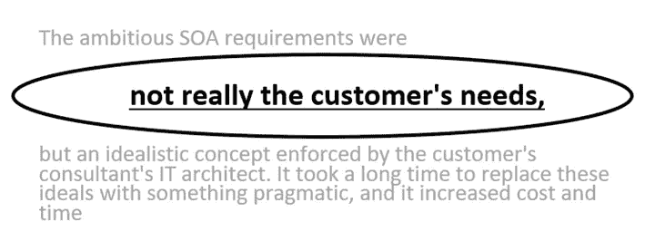

因此，SOA 是大量时间和成本损失的不必要来源。并且还可能损害可行性。

## 正常运行时间

土地登记系统有正常运行时间要求。

要求是有 99.8%的正常运行时间。这个具体的数字是从哪里来的不得而知，但是供应商进行的计算让客户知道 99.5%的正常运行时间将花费大约 500 万英镑。DKK 一年的运营。

9990 万英镑大约需要 1500 万英镑。

因此，他们实际上决定每年花费 1000 万丹麦克朗，以避免 35 小时的停机时间。我认为这已经远远超过了收益递减点。难道他们认为 35 个小时会让他们损失 1000 万？DKK？每年？

## 数据基础

在债务收集项目中，我们看到关于数据质量或数据自动处理的未经测试的假设造成了许多不同的损害:

> 原计划是该系统应该节省 300 名法警的工资，并加快收债速度。法警实际上被解雇了，每年节省大约 1 . 5 亿 DKK。然而，事实证明，大多数债务无法自动收回，要么是因为数据错误或缺失，要么是因为需要人工判断(参考文献 1)。1，第 48 页)。自动收债很快就停止了，变成了部分手动收债。大约有 300 名案件管理人员被雇用来做这件事，这抵消了节省 300 名法警的收益。”
> 
> 报告第 28 页。

数据质量差，而且需要更复杂的人工/人工判断，这一事实对业务结果、时间、成本和可行性造成了损害。这在项目早期是有可能实现的。至少在解雇 300 名法警之前…

# 二。过度工程心理学

我认为与“技术决策”导致的损害相关的罪魁祸首是过度工程。即让技术在解决方案中发挥比研究价值更大或更关键的作用。
我们相信预先选择正确的技术或架构会神奇地解决很多问题，所以我们不需要预先考虑这些问题。我们忽略了由技术或架构引入的风险，并最终忽略了基本的问题或风险，因为我们认为它已经被早期的技术选择减轻了。

在 37 个突出的损坏原因中，有 2 个与技术有关。这意味着 95%的损害原因不是由技术选择直接造成的。
(请注意，该百分比并不代表技术选择的实际影响，而是代表技术选择的绝对数量。)
通常，当技术选择对项目的成功有很大影响时，通常是负面影响。

那么，为什么我们一次又一次地失败:

*   检查技术，获得第二意见，询问技术用户

和

*   请教专家，做前期 PoC

?

或者为什么我们做得不够彻底和批判性？

为什么我们过度工程化，并因此引入风险和损害？

在我看来，我们有三个“过度工程三联症”的主要组成部分，它们是引入技术诱导风险和损害的主要元凶。

*   学习谬误，
*   引入价值/解决方案代理/替代品的趋势
*   由等量的认知偏差和博弈论现象产生的固有的过度工程偏差。

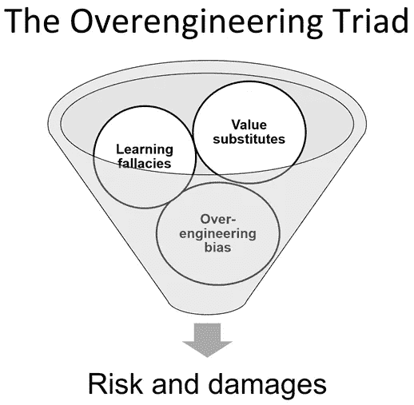

## 学习谬误

我们如何经常学到错误的教训并据此采取错误行动的最好例子之一是关于二战中英国皇家空军轰炸飞机的故事。

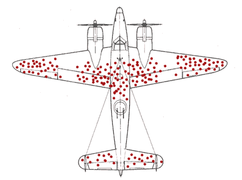

> 第二次世界大战期间，统计学家亚伯拉罕·瓦尔德在考虑如何将敌人炮火造成的轰炸机损失降至最低时，将生存偏差纳入了他的计算中。海军分析中心的研究人员对从任务中返回的飞机的损坏进行了研究，并建议在损坏最严重的地方增加装甲。
> 沃尔德指出，这项研究只考虑了完成任务后幸存的飞机——被击落的轰炸机没有出现在损害评估中。
> 返航飞机上的洞代表了轰炸机可能遭受损坏但仍能安全返航的区域。沃尔德建议海军加强返航飞机毫发无损的区域，因为这些区域如果被击中，会导致飞机失事。
> 
> 另一个例子，当第一次世界大战期间[布罗迪头盔](https://en.wikipedia.org/wiki/Brodie_helmet)推出时，严重头部受伤的战地医院收治人数急剧上升。这导致陆军司令部考虑重新设计，直到一位统计学家评论说，以前可能被某些[弹片](https://en.wikipedia.org/wiki/Shrapnel_shell)击中头部而死亡的士兵(因此从未出现在野战医院中)，现在在同样的袭击中幸存下来，因此进入了野战医院。
> 
> *——*[*https://en.wikipedia.org/wiki/Survivorship_bias*](https://en.wikipedia.org/wiki/Survivorship_bias)

在软件开发职业中，我们似乎有一些根深蒂固的学习谬误。

这些部分是由认知偏差引起的，部分是行业炒作机器造成的。

***彩票谬误***

我看到的第一个学习谬误是彩票谬误。我们认为成功的公司做了一些独特的事情，使他们在市场中获胜。

它基本上是说:“一个人赢得彩票的可能性很小，所以这个人在挑选号码时一定做了什么，以增加他获胜的机会”。

然后我们试图调查他们挑选数字的过程。以及作为开发者、架构师等。我们关注他们的技术选择和设置。请记住，即使这是一个可行的策略(弄清楚如何挑选彩票号码。提示:它不是)我们正在调查的东西代表了一小部分的损害原因。即技术选择导致的损害原因。

我们应该认识到，极有可能有人(或极少数人)会在市场中胜出。不管他们的技术堆栈、技术选择或体系结构如何，这都很容易做到。要明确这一点，许多因素促成了“在市场中获胜”，这意味着你可以采取难以置信的糟糕的技术选择，但仍然获胜。

这并不是说技术选择没有影响。这只是为了强调，它不是一个所有定义的影响。并且可能经常没有它被认为的那么重要。

*当我们谈到第一次和第二次世界大战中幸存者偏差的例子时，我们很容易看出其中的逻辑谬误。即士兵在戴头盔时受伤，意味着他们中有更多的人到达医院，因为他们先前刚刚在战场上死去。(因此没有去医院)。*

*在软件开发职业中，我们是这种偏见的受害者吗？*

*我认为我们受到两方面的打击。一个是我们关注非常成功的公司，例如 FANGS(脸书、亚马逊、网飞、谷歌、Spotify)，而不是其他 1000 家稍微成功(或者不是不成功)的软件开发组织。对于我们大多数人来说，向这些组织学习可能比向尖牙学习更好，因为这些组织代表了我们最有可能不会失败的轨迹。*

**

*【https://xkcd.com/1827/ *

*我们犯的第二个逻辑错误是模仿方家如何处理成长的痛苦，而不是他们的成功是如何创造的。*

*这是很重要的一点，因为你其实是想承受成长的痛苦。有一种说法类似于“我羡慕你的问题”，这在这里非常适用。*

*我们希望遭受成长的痛苦，我们希望能够处理它。但不是对成长烦恼的处理让你成长。这里涉及到相当多的货物养殖。我们模拟如何卸载到达的飞机。但是我们不知道如何让他们来。*

*换句话说，我们经常花时间在飞机上加固有弹孔的区域。而不是那些对成功至关重要的地方。*

*我们通过多种方式做到这一点。我们复制能够实现极大可扩展性的技术堆栈和体系结构。我们花时间规划和缓解我们预期的增长，并为此做好准备。这就彻底改变了这个问题。*

*我们花在过度工程化、学习前沿技术、给架构镀金以及做所有最佳实践上的时间，本可以花在交付 fast 和学习上。*

*这是一个机会成本的问题。我们花在计划和建设“伟大的发薪日”的时间，是我们可以用来努力实现它的时间。*

*我们甚至没有模仿我们希望发生的事情。我们模仿处理成长的痛苦，而不是诱发它们。*

****炒作与效果****

*炒作曲线是科技界一个众所周知的现象。*

*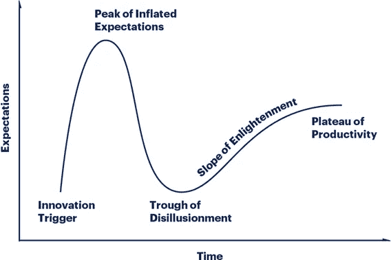*

*在膨胀的期望达到顶峰时，我们通常会受到技术、架构或范式(TAP)奇迹的猛烈攻击，远在我们理解它的无用之处之前，也远在我们理解它的实际用途之前。*

*例如，谁会想到推荐算法在制造政治极端分子和传播反科学信仰方面如此出色？*

*所以，通常当我们准备引入一个新的“龙头”时，我们通常没有资格这么做。当我们处于未知的顶峰时，我们基本上被推动着引入新的“TAP”。即在引入*TAP*的风险最高时。*

*稍后我们会看到一个图表，与此非常相似。*

*因此，一个方面是，当我们引入新的*TAP*时，这样做是非常危险的，但当我们达到生产力的稳定期时，新的*TAP*突然不再是那样了。它只是- *的龙头*。因此可能会被新的“ShinyTAP”所掩盖。*

*总结一下。当我们的项目由于未知的未知因素而非常危险时，我们最需要引入技术、架构和范例。与此同时，我们被推到了稳定的“无聊”技术和模式的对立面，因为我们害怕落后或错过“下一件大事”。我们这样做是一种全行业的旅鼠效应，人们被洗脑，觉得如果他们不跟上新潮流，他们就会变得过时。*

*幸运的是，有可能找到这种行为的相反点。许多人似乎正在恢复过度工程([http://boringtechnology.club/](http://boringtechnology.club/)或[https://thenewstack . io/Reddit-CTO-sxsw-stick-boring-tech-building-start/](https://thenewstack.io/reddit-cto-sxsw-stick-boring-tech-building-start/))*

****数值替代****

*大多数开发人员(以及普通人)都想做一些有意义的事情，而做这些事情的一种方式就是创造某种价值。*

*价值是一个非常抽象的术语，但一个基本的定义是，我们花在做某件事情上的时间，最好花在这件事情上，而不是做其他事情或什么都不做。*

*然而，通常很难确定我们到底提供了什么价值。当开发人员、团队等。离最终用户或客户太远。*

*如果发生这种情况，这些人创造价值的需求不会消失。它冒着被价值替代品满足的风险。一些具体的东西，他们可以作为他们实际提供的价值的代表。*

*大多数情况下，这些价值替代品与实际的最终用户或客户价值毫无关系。我们凭直觉知道这一点，但用“它将在长期内得到回报”或类似的担忧来反驳这一点。但是如果你已经离你创造的实际价值的接受者太远了，你怎么能评价它“从长远来看是值得的”呢？此外，评估长期利益优先于短期收益是可取的吗？更重要的是，长期收益的价值大于短期价值创造？(以及产生的股息利息)。*

****银子弹****

*在软件项目的早期，我们决定什么样的技术银弹将帮助我们为客户带来价值。我们经常夸大引入新龙头的重要性，并遵循当前的“最佳实践”(或最响亮的宣传)来应对我们所面临的系统挑战。*

*然而，在项目的这一点上，我们通常不太了解系统的实际最终用途，并且通过在项目的开始引入新的“太精通的东西”(不仅仅是熟悉或学习)，主要的副作用是在项目的一个阶段中未知的未知的更大的风险，其中我们已经有许多不确定性和大量的未知的未知。*

*但是，嘿，至少客户会很高兴他们得到了最新的 NoSql 存储技术，Eventsourcing 架构或纳米服务？对吗？*对吗？**

**我们不断地被“预测未来”我们的应用程序和系统的方法轰炸。我们受制于架构原则、框架和技术的奇迹，甚至在我们知道客户或用户需要解决什么问题之前，我们就开始引入大量针对可能永远不会到来的增长痛苦的开销。**

**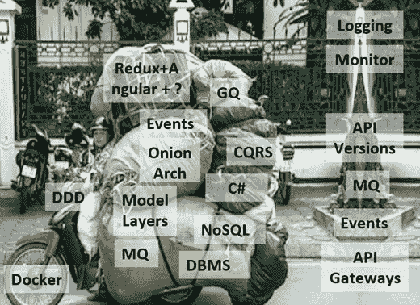**

**心态是这样的:**

> **“我可能实际上不知道客户想要什么，但如果我用这两个架构原则、这些框架和这项技术来构建它，那么当我最终理解这些原则、框架和技术时，我就有能力将系统转向客户的需求。无论如何，他们得到了一个令人敬畏的系统。”**
> 
> ***—一些过度工程化的开发者(有时是我)***

**这可能无法解决他们需要以简单和廉价的方式解决的问题，但这将是一个相当可观的景象…**

*****流程完善*****

**如果我们离我们带来的价值太远，我们也可以把“遵循过程”作为我们交付价值的证明。心态是这样的:*“我们严格遵循开发过程 X，因此我们必须为客户提供价值*”。**

**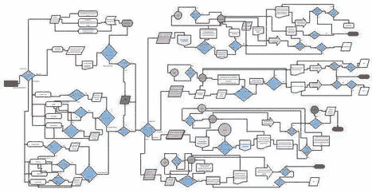**

**这不是价值。实际上，当我们不能从现实世界中接受变化的需求或环境时，情况可能完全相反，因为它与我们的过程或计划相冲突。那么更好的方法是继续遵循过程和计划，忽略现实。**

**还有其他的方法，我们可以用一些替代值来代替实际值。我们有时也会通过引入一些过于复杂和普通的东西来代替解决方案，以弥补不理解我们实际上试图解决的问题。**

**尽量确保开发人员体验到他们所花时间的实际价值。这可能不会导致完全避免价值替代品，但会增加发现和处理它们的可能性。**

## ****过度工程偏差****

**在软件开发中，我们有一个导致过度工程化的固有偏见组合。由于团队人口构成的偏差和环境，也存在博弈论现象和类似于进化稳定策略的现象。**

> **他用自信来弥补知识上的不足**

*****邓宁-克鲁格效应*****

**首先，我们作为一个行业，非常容易受到邓宁-克鲁格效应的影响。**

> **“在心理学领域，**催款**–**克鲁格效应**是一种认知偏差，在这种偏差中，人们会将自己的认知能力高估。与虚幻优越感的认知偏差有关，来源于人们无法认识到自己能力的不足。”**
> 
> ***——*[*https://en.wikipedia.org/wiki/Dunning%E2%80%93Kruger_effect*](https://en.wikipedia.org/wiki/Dunning%E2%80%93Kruger_effect)**

**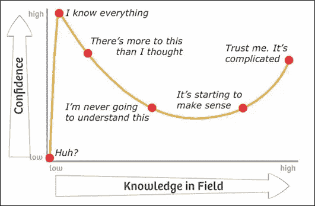**

**图表开始处的峰值被称为愚蠢山。当人们站在愚蠢山的时候，他们有一种大喊大叫和大量布道的倾向。**

**邓宁-克鲁格效应在多个层面影响着我们。它在行业层面上给我们带来了炒作曲线。炒作曲线和邓宁-克鲁格效应之间的相似之处并非巧合。这是同样的潜在偏见。在这个行业中，当我们站在愚蠢山的山顶上时，我们往往会对 TAPs 非常不满。**

**组织以非常高的信心和非常少的知识采用这些 tap。通常，不在船上的人被认为是守旧派，或者在其他方面感到羞耻。这里有一点稀缺性偏见，即如果我们错过了这个机会，就害怕错过未来的市场和机会。**

**在团队层面上，这是一种不同的动态。**

*****冒名顶替综合症*****

**在团队层面，引入新 tap 有多种原因。可以是好奇心，想要在职业上有所提高，简历或者只是尝试一些新的闪亮的东西。**

**不管动机如何，通常都是一个人或一小部分人在推动新的银水龙头。**

**软件开发职业是人们患冒名顶替综合症程度最高的职业。60%以上。**

> **冒名顶替综合征(也称为冒名顶替现象、冒名顶替、欺诈综合征或冒名顶替经历)是一种心理模式，在这种模式中，一个人怀疑自己的成就，并对被揭露为“骗子”有一种持续的内在恐惧。**
> 
> ***—***

***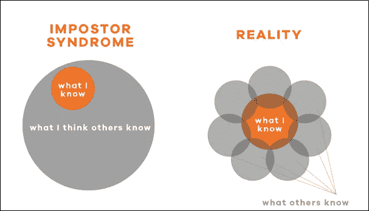***

***冒名顶替综合征意味着大多数团队成员会认为，他们认为 TAP 看起来太复杂、太冒险或太愚蠢的原因只是因为他们自己就是他们自己，没有 TAP 的支持者那么有能力。***

***更糟糕的是，作为一个局外人，很难推断人们是来自愚蠢之山还是来自实际能力的高原。***

******科技斯德哥尔摩综合症******

***邓宁-克鲁格效应和冒名顶替综合症共同作用，带来了新的闪亮而危险的水龙头。那么问题是，当事实证明我们做了一个错误的选择时，我们为什么不扔掉这个水龙头呢？***

***对此有多种解释。这是沸腾的青蛙、沉没成本谬误和某种科技斯德哥尔摩综合症的结合。***

***水龙头通常不会在一次重大事故中爆炸。通常是范围、严重性和损害不断增加的小事故。***

***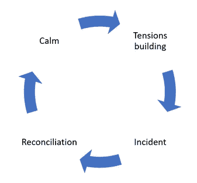***

***我们通常会看到，当我们开辟新的领域时，无论是在功能方面还是在采用方面，紧张局势都会开始加剧。随着紧张局势开始加剧，真正全面爆发事件的可能性开始增加。该事件可以是实际的生产事件，也可以是“该死的事情不能处理 X/支持 Y/启用 Z！”。***

***在任何情况下，都会发生一些事情，产生很多压力、额外的工作和普遍的“不适”。***

***我们战胜挑战、痛苦和挫折。***

***在某个时刻，我们最终站在了事件的另一边，并开始合理化它，为为什么 TAP 这样对待我们、行为或反应找借口。很多时候，我们最终会因为水龙头带来的缺点或损害而责怪自己。“我们应该知道它会表现得像…”。***

***我们到达了这种糟糕经历的另一面，更深地挖掘，增加了更多的沉没成本，在这种恶性循环的下一次迭代中，我们甚至更坚定地将水龙头带来的损害归咎于自己。更加坚定地站在我们的立场上捍卫它。***

# *****三。软件开发中的价值驱动决策*****

***我们知道什么使软件交付组织运转？***

***查看来自[devo PS State 报告](https://puppet.com/resources/report/state-of-devops-report/) / [Accelerate](https://www.goodreads.com/book/show/35747076-accelerate) 的见解，或者如果我们查看对[的研究](https://hbr.org/2017/08/high-performing-teams-need-psychological-safety-heres-how-to-create-it)是什么让[团队表现优异](https://www.goodreads.com/book/show/33517721-the-culture-code)，我们会看到一个简短的列表:***

*   ***快速交货，经常是小批量交货***
*   ***消除瓶颈、堵塞和延迟的东西。***
*   ***心理安全***
*   ***接近所提供的值***

***注意，这些都没有提到具体的技术选择。一些技术选择可以支持这些，例如，通过分离团队以消除重复出现的障碍，但这不是使团队和组织成为高绩效者的特定 TAP，或者引用 Gene Kim 的话“在市场中获胜”(尽管，在阅读了 Unicorn 项目后，我认为他可能对函数式编程有所警告)。***

***因此，我在这里的观点是，从对软件项目失败原因的研究“大型政府 IT 项目中的损害和损害原因”中，我们看到技术决策或 tap 产生影响的地方，是当它们通过过度工程或未经测试的假设危及项目时。
我们从其他研究中看到，是什么让团队和组织表现出色，这不是具体的 TAP，而是一些非常简单和精益的实践和文化方面。简单，但是很难。***

***因此，我们应该确保获得最佳的高绩效环境，避免给项目带来不必要的风险和损害。就这么简单。***

***我目前的建议是将推动人们做出价值驱动的技术决策(注意:这个列表将随着时间的推移而增长)和确保这样做的心理安全结合起来。***

> ***1.项目或产品开始时最多有 2 或 3 个“风险令牌”***

***风险标记的核心思想是约束开发团队在项目或产品中承担过多的风险。
当“风险”是一种稀缺资源时，它促使团队讨论:***

> ****“我们是宁愿冒风险 A 来获得这个值/收益 X，还是宁愿冒风险 B 来获得 Y？”****

***这鼓励了价值驱动的技术讨论的讨论，并且明确了软件开发在很大程度上是管理风险的实践。而承担风险只能是为了获得相应的价值。***

> ***2.识别、评估和消除阻碍或延迟的事情***

***这里的关键词是**评估**。
每当我们在工作中看到一些制造摩擦的事情，我们都应该评估我们试图从中获得什么。即流程/工具/无论什么想要创造什么价值？它产生的摩擦力是否大于我们实际获得的价值？
我们能否换一种方式，在没有或减少摩擦和负面影响的情况下实现这一目标？***

> *****3。当人们意见不一致时，找出他们所重视或权衡的不同，从而得出不同的结论*****

***人们可能有接近正确的推理，所以通常情况下，不同意的一方是正确的，而另一方推理不正确。这通常是因为他们对推理过程中的一些因素有不同的优先级或重要性。稍后会详细介绍。***

> *****4。确保开发者了解用户和客户*****

***请确保您的开发人员访问 Gembas，了解他们贡献价值的地方。它有助于避免价值替代品，它激励人们，并使他们能够优先考虑他们的重点，并确定低挂水果。这些因素结合起来极大地促进了创新。***

# *****我们衡量价值吗？*****

***在斯德哥尔摩，我得到了一个关于在决策过程中如何衡量价值的好问题。
这是一个很棒的问题。

通常，我们对解决方案的一些基本要求赋予什么样的价值或权重并不重要。例如可扩展性、易用性、简单性等。但是当我们概述我们选择了一个特定的解决方案而不是另一个，因为我们相信 X 是重要的，Y 比 Z 重要得多，那么我们突然有了我们能够(试图)反驳或证实的假设。这使我们更接近于针对特定情况下我们所面临的特定挑战而定制的实际客观评估，而不是基于无意识的偏见和本能反应。当探索关于使用什么解决方案的分歧的潜在原因时，这一点尤其重要。(例如，当试图确定人们对什么有不同的评价，从而得出不同的结论时)。***

***我们不仅要探索我们对解决方案的各个方面给予什么样的重视或优先考虑，以使我们相互理解。实际上，我们这样做是为了确定什么样的讨论实际上有机会改变我们的想法或澄清误解。当我们确定人们的先验假设时，这些假设可能会受到挑战，并且通常更容易通过尖峰信号或餐巾纸背面的分析来调查其有效性。它也可以激励或推动我们去询问或与比我们更有知识的人交谈。***

# *****帖子脚本*****

***在这篇文章中，我非常关注过度工程的危险。这并不意味着我不知道“工程不足”或使用“传统水龙头”的危险。我只是认为后一种危险或风险被极度夸大了，引入新的闪亮水龙头的风险和危险被轻描淡写或完全忽略了。***

***我希望这篇“简短”的文章能让你在下一次 TAP 出现或者你开始一个新项目或产品的时候，多思考一点。***

***我期待着讨论更好的细节或整体信息。请给我发一些关于反过度工程清单的建议😊***