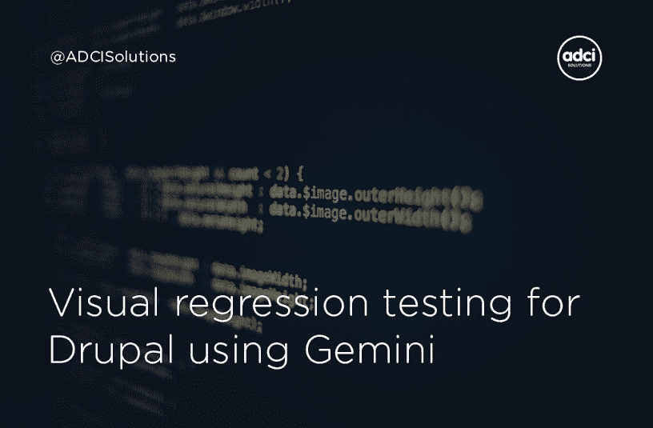

# 使用 Gemini 对 Drupal 进行可视化回归测试

> 原文：<https://itnext.io/visual-regression-testing-for-drupal-using-gemini-7b21fa39dbc9?source=collection_archive---------9----------------------->

[由 ADCI 解决](http://clc.la/drupal_gemini1)

*回归测试*允许发现由之前的变更引起的错误。这在前端尤其明显。这是一种常见的做法——当开发人员在 *CSS* 文件中做了小小的改动之后，不得不测试大量的页面。

我认为那只是浪费时间。我们应该使这些过程自动化。虽然计算机视觉和人工智能可能能够解决这个问题，但现在很难使用这样的技术。因此，我们将只比较图像。为此，需要*截图* 的原页面和修改页面。有很多工具可以让你不用手动操作。但是我更喜欢用双子座。

*Gemini* 是 Yandex 开发的可视化回归测试工具。它可以与 Chrome、Firefox、IE8+和 Opera 12+兼容。此外，它支持一些网络驱动程序:Selenium 服务器，Chrome 驱动程序，PhantomJS 和云网络驱动程序，如 BrowserStack 或 SauceLabs。

要安装，运行*这个命令:*

另外，你必须有 *WebDriver* 和 png-img 实用程序。

请特别注意配置参数。我想强调几个最重要的问题:

*   rootUrl(必需)-将被测试的网站的 Url
*   grid Url——一个用于截图的网络驱动 URL
*   截图目录—保存截图的目录
*   公差——两张截图之间的最大允许偏差
*   窗口大小—浏览器窗口的尺寸
*   截屏模式—图像捕捉模式(整页或视窗)

*Gemini* 使用. gemini.yml 文件进行配置，但是您可以通过命令行标志覆盖所有设置。

**如何与双子座共事**

一开始，你必须运行你的网络驱动。*例如*，如果你使用 PhantomJS，执行这个命令:

因为您目前没有参考图像来与下面的截图进行比较，所以您需要捕捉它们。快跑吧

并且 *Gemini* 会为你的测试生成新的参考图像。之后，您可以将它们与页面的当前状态进行比较。

如果您的测试失败， *Gemini* 将在“报告”文件夹中生成新图像，显示差异。

**如何编写双子测试**

这很容易。您需要创建一个新的测试文件(例如 test.js)并在其中定义 gemini.suite 方法。让我们看一个简单的例子:

该方法的第一个参数是您的*测试套件*的名称。然后我们描述一个我们想要测试的页面(在这个例子中是主页)，这个页面上的一个元素和一个要捕获的新状态。

**如何扩展双子座**

*Gemini* 支持插件系统，可以扩展其功能。你可以在[这个库中找到很多有用的插件。如果没有你需要的东西，写一个新的也很容易。](https://github.com/gemini-testing)

*双子座插件*只是一个 npm 包。看*这段代码*:

您需要定义一个函数来接收 *2 个参数:*一个 Gemini 对象和必要的选项。

**后记**

我希望这篇文章对你有用，现在你明白了*可视化回归测试*有多简单。你将不再需要浏览所有页面。现在你可以享受开发过程了。

*最初发布于*[ADCI 解决方案网站](http://clc.la/drupal_gemini2) *。*

**在社交网络上关注我们:** [推特](https://twitter.com/ADCISolutions) | [脸书](https://www.facebook.com/adcisolutions/) | [LinkedIn](https://www.linkedin.com/company/adci-solutions/)

 [## 书目和引文模块- Drupal 故事:一个内部人员的观点-媒体

### Drupal 是一个非常流行和知名的教育网站 CMS。非常重要的是，Drupal 拥有工具来…

clc.la](http://clc.la/drupal_gemini3)