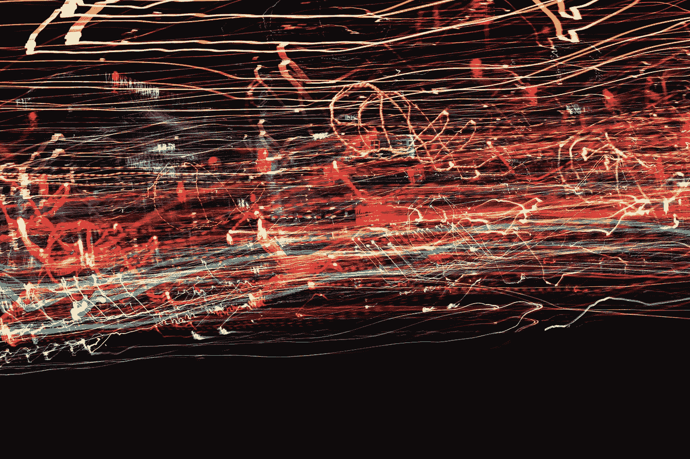

# Vue 使用状态效果

> 原文：<https://itnext.io/vue-use-state-effect-14f81a6c8d62?source=collection_archive---------2----------------------->

在 [Unsplash](https://unsplash.com?utm_source=medium&utm_medium=referral) 上 [WrongTog](https://unsplash.com/@wrongtog?utm_source=medium&utm_medium=referral) 拍摄的照片

我们都知道 [**Vuex**](https://vuex.vuejs.org) 。从一开始，这就是对生态系统的一个很好的补充。它在几十个项目中帮助管理国家。它的用途非常广泛。然而，对于小的应用程序，它可能太大太复杂，一般的流程也太混乱太复杂。过去，除此之外没有其他好的选择。所以我们习惯了，每次需要在应用程序间共享数据时，我们都使用 Vuex。

有了 **Vue 3** 和新的 **Composition API** ，我们眼前一亮。因为它对我们许多人来说都是令人敬畏的反应系统，很明显，现在我们可以[从常规组件中的组件](/rewriting-vuex-module-to-composition-api-7ccb1cd09738)共享小状态。我们开始怀疑，也许 Vuex 已经不需要了。尽管这个 Vuex 在版本 4 中被新的 API 所采用，但是现在有了 Vue 3，你仍然可以使用它，并且享受旧的良好的 Vue 状态管理。

然而，许多开发人员决定走新的道路，在他们的项目中使用 composables 来共享小的和反应性的状态。事实证明，这种方法非常方便和舒适，但由于数据对象是全局公开的，它可能会导致一些安全问题，以及 SSR 上的内存泄漏。

因为这些以及创建像 Vuex 这样不复杂的东西的意愿，没有突变、提交和数据分派，构建 [**Pinia**](https://github.com/vuejs/pinia) 的想法诞生了。因此，Pinia 是 Vue 3(复合 API)生态系统状态管理的一种新的内置思想。它提供了一个非常简单的 API，在接收方面可能类似于其他基于状态的模式化解决方案。Pinia 能够在您的应用程序中轻松地处理状态管理，它在您的项目中提供了通用和简单的数据流传输/共享。只是检查一下…并进一步阅读。

尽管 Pinia 很棒也很简单，但它给你的开发过程增加了新的抽象——新的存储、方法、流程。如果你正在构建一个小的应用程序，对它来说可能(仍然)太成熟太复杂了。这也是一个定制的解决方案，可以处理各种场景和权重。

因此，因为我是组合 API 的超级粉丝，并且摆脱了这种 Vuex 的复杂性，我也不喜欢处理这种离开基于可组合的小状态概念的方法。在此基础上，出现了这个库(composable)的想法。

总之😏— Vue Composition API 提供了一个名为 [**的东西，EffectScope**](https://vuejs.org/api/reactivity-advanced.html#effectscope) ，能够记录当前实例存在期间创建的所有效果。例如，您会发现那里的计算属性。更重要的是，这个影响范围可以在整个应用程序区域共享。然后，根据这个特性的原始 RFC，我们可以将任何附加数据附加到它上面。

这就是[**vue-use-state-effect**](https://github.com/lukasborawski/vue-use-state-effect)库创建的方式和原因。有了它，你想分享的任何形状的可组合组件都可以被包装和连接起来。用于之后的其他组件。最后，无需任何额外的抽象，您可以使用它在您的应用程序中创建可共享的状态/存储——通过带有您自己的定制逻辑的组件来处理它们。仍然保持了原生的发展流程。很棒吧？最后，为了避免数据堆积，你让*销毁*工具，你可以随时使用它。使用效果作用域创建状态的可组合性——Vue 使用状态效果。✨

现在，让我们用一些真实的例子来看看它是如何工作的。

首先，您需要——当然— [安装它](https://npmjs.com/package/vue-use-state-effect),然后我们就可以创建我们的第一个数据相关的可组合组件，其中包含一些状态和更新它的函数。

好了，我们可以导入`vue-use-state-effect`并将其用于我们新创建的 composable。那样地...请注意，这是同一个文件/组件，我只是重复它(片段)来展示导入可组合组件的下一步。

太棒了。我们刚刚创建了可以与组件一起使用的共享可组合组件。让我们创建一个并检查如何使用它。

您在这里可以看到，我们已经从 composable 中获得了状态/存储数据。父对象键被定义在我们在 composable establishing 中提供的`name`之上。我们使用 computed property 来创建 reactive 属性，以在模板中反映它。此外，我们已经传递了 update 方法和帮助，我们可以使用它和按钮一起从 UI 更新状态。现在，我们可以创建一个新页面来查看/使用保存或更新的状态。就像那样。

我们有了。就是这样。现在，您可以在整个应用程序中使用您的共享状态(composable)。最后，如果您想清除这些数据，不想在应用程序生命周期内存储太多，您可以使用`destroy`选项来处理它。这里有一个快速提示——由于异步呈现的组件(尤其是在 Nuxt 中),如果需要的话，可以用`onMounted`钩子检索重构的状态。像这样。

尽管很简单。尽管是本地的。仅此而已。不那么复杂，但对于大多数小型 Vue 应用程序来说，这可能是最好、最快、最方便的解决方案。试一试吧，现在或者你的下一个项目。

弊端？是啊。这很简单，所以你不会得到像 Pinia 甚至 Vuex 那样的结构形状和流动。你也不会在 **devtools** 中检查它，但是你有调试模式，这可能是足够的替代品(我希望)。也许你会找到更多，但不是每个人都适合，也不是每个项目都适合。这是定义平衡的标准。😋

可以从 [**npm** 注册表](https://www.npmjs.com/package/vue-use-state-effect)下载。你可以在 [**GitHub**](https://github.com/lukasborawski/vue-use-state-effect) 上找到它的资源库。有了[**stack blitz**](https://stackblitz.com/edit/vue-use-state-effect-demo)Nuxt 3 演示，你甚至不用安装它就可以在实际操作中试用。想要帮助或贡献，请为它创建一些新的 GitHub **问题**。提前感谢支持。

干杯，尽情享受。也许可以考虑给我买杯咖啡。