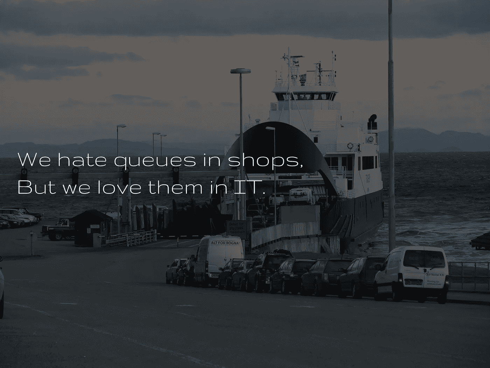
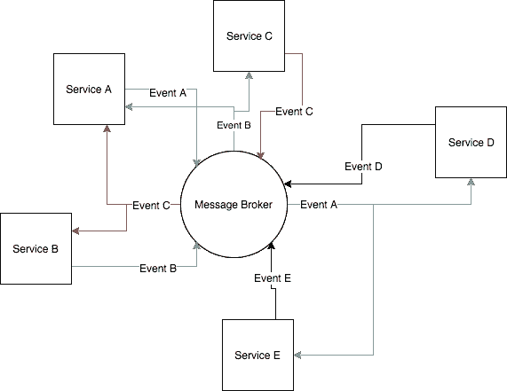
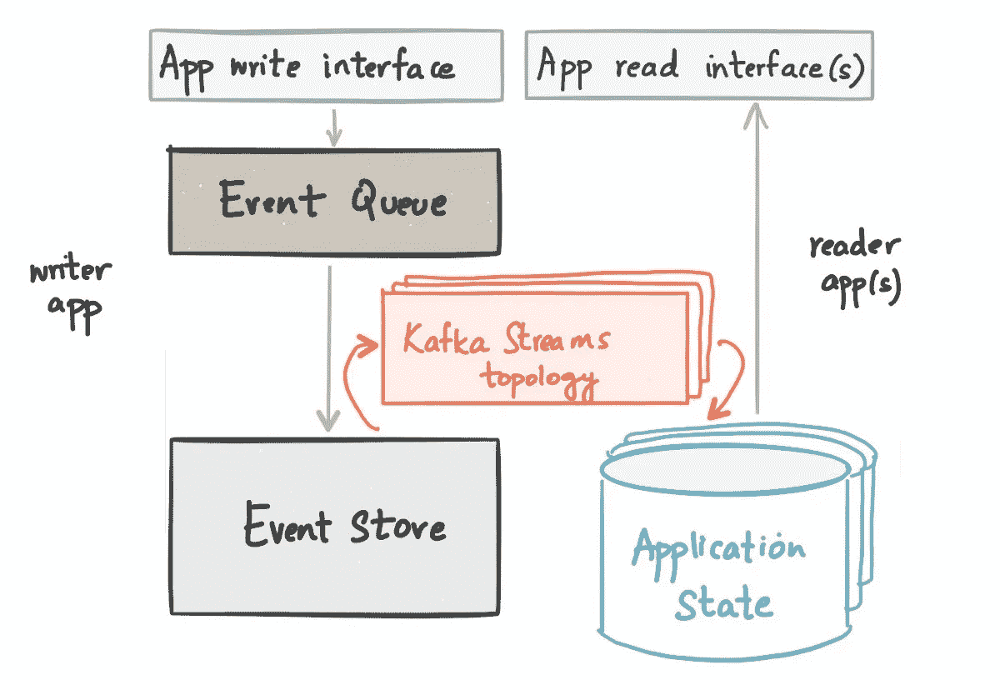
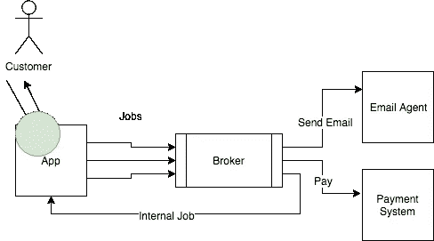

# 我们讨厌商店里排队，但我们喜欢排队

> 原文：<https://itnext.io/we-hate-queues-in-shops-but-we-love-them-in-it-933dc6952b2d?source=collection_archive---------6----------------------->



新年和它的售后服务一起到来了，我们都面临着商店里的混乱，当队列如此之长时，你甚至看不到收银员…但是让我们积极地思考一下，谈论一下 IT 世界中的队列，因为它们绝对是神话般的！

[*点击这里在 LinkedIn* 上分享这篇文章](https://www.linkedin.com/cws/share?url=https%3A%2F%2Fitnext.io%2Fwe-hate-queues-in-shops-but-we-love-them-in-it-933dc6952b2d)

## 我说的是什么队列&为什么我应该使用它们？

有很多服务提供排队功能(消息代理)，我玩过很多 RabbitMQ、ZeroMQ、ActiveMQ、Kafka，可以肯定地说，它们都有各自的优点和缺点。这个术语背后的思想是为事件驱动/事件源/发布/订阅/异步架构提供一种机制。我将在后面介绍所有这些内容，所以如果您不理解其中一些内容的意思，请不要担心。消息代理技术为构建可伸缩的高可用性解决方案打开了一个全新的“世界”,但是，请记住，这也将为您的系统带来更多的复杂性，所以要明智。

## 在哪里使用队列？

几乎无处不在:)您可以使用代理机制来并行化任何工作，您可以将它用作 SOA 之间的通信方式，您可以将它用作额外的日志存储。您甚至可以将它用于异步日志记录。你可以自己说出问题的名称，并会发现排队可以很好地解决问题。

## 如何使用队列？

要回答这个问题，我们需要了解我之前提到的它的所有一般用法。我会努力给你足够的知识，让你能够理解它在你的系统中最适合的地方&并且能够自己找到所有其他的答案。但是我也很乐意回答评论中的所有问题！

## **事件驱动/发布订阅架构**

有人说 REST 快死了，有人说这是微服务交流唯一最好的方式。我认为我们应该更加开放地将正确的技术用于正确的目的。总有一些地方需要通用的 API，REST 是一个非常好的领域分离工具，也是一个很好的处理数据的交流工具，但是事件驱动架构可以让你的应用程序发展壮大！

这个概念背后的想法是，有发布者，发布(显然)事件，也有消费者，消费(不，认真地)这些事件并做出反应。很简单，不是吗？这种方式不仅改变了沟通方式，也改变了思维方式。我们停止推送(发送 API 调用以获取一些信息并检查是否发生了什么)，我们开始拉取(等待发生什么)。这种交流方式与人们的合作方式更加相似和自然。



发布和订阅的总体思路

还记得电影中那些在旅途中问“我们到了吗？还没？”几百次？好吧，这就是你的服务在发送 API 调用来检查 x 的状态时所做的事情。你，作为一个车手，在第十回合后会发疯的。幸运的是，机器没有情感(我希望天网没有看到这篇文章)，所以它们不能只给你一个 JSON 响应:

```
{
  "message": "NO, SHUT UP!"
}
```

通过一直调用你的 APIs 你明显地给你的服务增加了不必要的数量/流量，增加了处理器时间，弄乱了日志，等等。你也把你的服务当成一个孩子，他不能等待和倾听。

这就是事件驱动架构的用武之地。每个网络服务只是监听他们需要和想要的事件。你的应用不需要监听所有发生的事情，只需要监听它想知道的事情。只有在有事发生时才做出反应。这种方法减少了不必要的调用，改进了监控系统的方式，并提供了更好的关注点分离。你的服务做了一些事情——让它告诉你(抛出一个事件)然后忘记，它不应该真的关心接下来会发生什么，每个感兴趣的人——都会倾听并做出反应。即使没有人听它做了什么——不要担心，你只是为增长创造了灵活性，你知道事件就在那里，你可以听。

为了获得事件驱动架构的所有好处，我会使用 Kafka 或 RabbitMQ，因为它们很容易安装和使用。

## 事件源

事件源是事件驱动架构的下一层，与领域持久性和状态更相关。我们习惯了在数据库中更新我们的实体。但是，如果我们需要知道这个实体到底发生了什么，以及是谁在何时发生了变化呢？

嗯，是的，你可以创建一个历史表/集合，存储所有的行动了。事件源有相同的概念，但是它使用事件，这也更自然。基本上，您使用事件序列来构建您的域。假设你去一家杂货店，推着一辆购物车。你加入牛奶，奶酪，然后决定去脱脂牛奶，所以把普通牛奶拿出来，把脱脂的放进去，然后使用你的储蓄卡，你已经收集了 1000 点积分，可以用它作为 1，然后你添加另一张优惠券，它给你奶酪的折扣。这是一个非常基本的例子，说明如何构建事件源模型。你可以得到发生在它身上的所有事件，并得到订单的最终状态。您还可以“回滚”并获得一些特定的状态，或者查看何时发生了什么。



事件采购背后的理念(图片取自 Confluent.io)

当然，事件源引入了新层次的复杂性，但使您与实体的工作变得非常自然。你还需要一段时间来协调和理解不同事件的含义以及它们对给定领域的影响，但你也有很多好处。

为此，我建议您深入研究 Kafka，因为它提供了强大的事件源功能，甚至有自己的 HA 健壮持久层。

## 异步/排队

最后，但同样重要的是，我想讨论的主题是异步/排队作业。我之前提到的所有技术都非常适合这个目的，它使您的应用程序更加健壮。

比方说，你创建了一个类似于优步的平台，但用于按需理发(不知道为什么我首先想到这个)。因此，客户填写他们想要的信息，所有额外的信息(假设他们以未注册用户的身份填写表格)，然后点击“预订”按钮。

接下来会发生什么？

*   应用程序创建预订
*   应用程序创建一个用户并发送确认电子邮件
*   应用程序将此用户附加到此预订
*   应用程序向客户发送关于预订的电子邮件
*   App 收取押金/付款
*   App 向所有供应商(发廊)发送信息
*   App 返回给客户其预订的参考号

Eemm..太多了！这可能会花费大量的时间，因此客户会等待几秒钟，看着旋转器，等待响应。不是最好的体验不是吗？使用异步作业，您可以将此流程更改为:

*   应用程序使用参考号创建预订
*   App 将此参考编号返回给客户

就是这样。生成一个参考号需要几毫秒的时间，这实际上是客户此时需要的一切。在后台，你的应用程序将向队列发送消息来完成剩下的工作:发送电子邮件，通知供应商，处理付款，创建用户并附加它，然后特定的工人将完成他们的工作。



绿色部分—是必须同步完成的最小部分，其他部分通过异步作业完成

当然，您不能异步地做所有的事情，因为在幕后有更复杂的逻辑，有时您需要在流程中有一些顺序，然后您才能“确认”流程。但是，作为一个例子，仅仅移动使用异步作业发送电子邮件的过程在过去就为我节省了 800 秒，因为它花费了相当多的时间来生成电子邮件 html 内容(是的，它非常复杂，但是设计非常好的电子邮件)，所以只要考虑一下您的流程中现在不需要发生的领域，并通过异步作业来完成它们！

总之，我想说的是，这项技术不是火箭科学，也不会解决您的所有问题，但是了解它并将其视为发展您的应用程序的方法之一是非常重要的。

您在自己的平台中使用过任何提到的原则/技术吗？如果是，你面临过哪些好处和坏处/问题？

谢谢你。