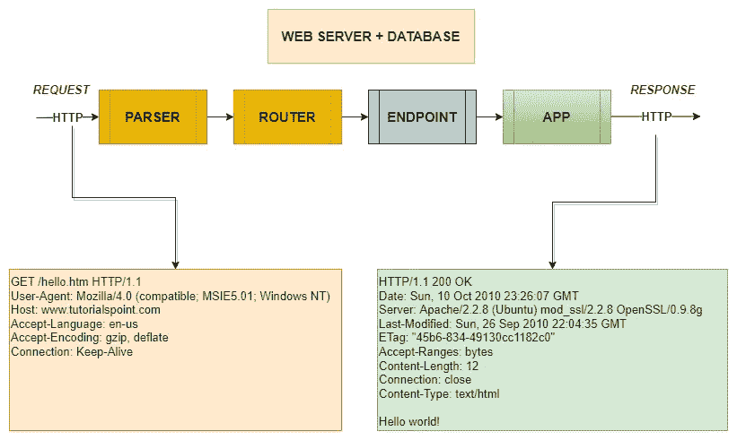
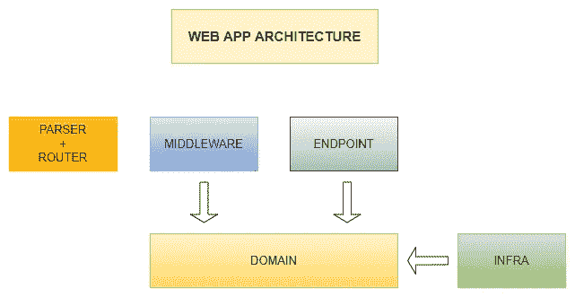

# 带有 Razor 页面的 Web 应用程序—架构

> 原文：<https://itnext.io/web-apps-with-razor-pages-architecture-8def2c6ac66a?source=collection_archive---------4----------------------->

[系列目录](https://medium.com/@kumar_vvr/web-apps-with-razor-pages-f0d3f92a0573)

# **应用架构**

在我们开始使用 Razor Pages 开发 web 应用程序之前，让我们对 web 应用程序、它们的基本工作方式以及如何最好地构建我们的应用程序有一个大致的了解，这样我们就有了一个良好的基础，可以在应用程序的复杂性和规模不断增加的情况下表现良好。

# Web 应用程序的关键组件

以下是 web 应用程序的关键 ***构造*** 。

**HTTP 请求/响应**:HTTP 中的“P”是“协议”，这是一种奇特的说法——“让我们都同意以一种特定的方式做某事”。尽管有“超文本”这个可怕的名字，HTTP 基本上是一大块文本，遵循一套大家都同意的规则(协议)。网络上发生的所有事情，基本上都是一堆移动的文本。那么，web 应用程序就是一个理解这些 HTTP 消息(HTTP 请求或响应是打包的文本，可以被认为是消息)并知道如何响应接收到的消息的程序。例如，当你在浏览器中进入[www.google.com](http://www.google.com)时，你的浏览器会向谷歌服务器发送一条 HTTP 消息。Google 服务器运行一个 web 应用程序，该程序读取此消息，并以一个 HTTP 响应消息进行响应，该响应消息恰好包含一组 HTML 内容，您的浏览器会读取这些内容并显示为 Google 页面。HTTP 消息及其结构本身就是一个大主题。只要知道每个 HTTP 请求都有一个“方法”(GET、POST、PUT、PATCH、DELETE 是最常用的方法)并可以包含“头”(可以创建任何头，但有些是为特定功能而指定的，所有这些都是根据 HTTP 规范定义的)就足够了

**解析器**:无论你使用哪种语言、框架、范式或魔法，都必须有某种东西能够读取传入的 HTTP 消息并理解它们。因为 HTTP 中的 P 是固定的，所以实现这样的解析器很容易，大多数语言都有。它们有不同的名字(http server，http library，netlib，等等)，但是它们的功能是相同的。读取 HTTP 文本，理解消息，将其打包成一个对象，并将其发送到 web 应用程序的下一部分。

**路由器**:因为网络应用做很多事情，所以它们被划分到不同的功能区域。实际上，作为程序员，你必须将 web 应用程序划分到不同的区域。一个典型的网址如下所示

" https://www . Yahoo . com/sports/baseball/someone "

web 应用程序(每次)都会收到完整的 URL，但会剥离出*https://www.yahoo.com*，并将*/体育/棒球/某人*发送到路由器。

您必须预先配置路由器，使其了解如何处理这些信息。发生这种情况的方式是，你告诉路由器根据输入路由调用应用程序中的特定方法/对象/任何东西。

**终点**:这是乐趣或折磨的开始，取决于你的视角。端点是实际的方法(或者类实例中的方法，或者新创建的实例中的方法，存储在内存中的方法，其他服务器中的方法，选项是无限的，并且因堆栈而异),它们被赋予 HTTP 消息的解析对象。路由器负责将正确的 HTTP 请求发送到正确的端点方法。所以，本质上，一个端点包含了一个非常狭窄的焦点和目的的功能。

**App** :所有 HTTP 相关的东西(请求中的内容、路由、参数、请求类型等)通常都以端点结束。在端点中，让它们调用不知道应用程序的 HTTP / Web 部分的其他方法是一个好的做法。你可以把这个应用程序看作是你的应用程序的真正后端，上面提到的部分管理应用程序的 web 端。

# 应用程序内部

上面描述了一个典型的 web 应用程序。为了简化，我省略了所有的依赖项、框架/语言细节。

**中间件**:这只是默认方法的另一个名称，一些或所有传入的 HTTP 请求都通过这些方法。这通常采取一系列方法调用的形式，其中每个方法都有一个选项，将请求传递给链中的下一个方法，或者从自身返回一个响应。这些通常用于所有请求所需的功能。大多数框架用解析器构建一个基本的 HTTP 对象，然后通过中间件链传递它，向 HTTP 对象添加/修改信息，这样当对象到达端点时，它就拥有了该端点所需的所有数据。例如，最常见的中间件方法之一是添加发出请求的用户的唯一标识。每一个请求都需要这种功能，所以是中间件的一个很好的候选。

**域**:通常很多教程都会省略这部分。但是，一个好的设计将其功能域定义为一组抽象接口和抽象/具体服务，它们通常封装了应用程序应该做的几乎所有事情。既然我用晦涩难懂的话把你弄糊涂了，让我澄清一下。

让我们举一个电子商务应用程序的例子。你的领域将包含描述他们持有的数据(通常称为**模型**)的抽象类，比如关于产品。您的服务，不需要是抽象的，将在这些抽象类上工作，并定义业务功能(将产品放入购物车，从库存中减少产品，计算成本，等等)。如何实现抽象类是留给用户和框架的。实际上，用抽象的术语描述整个领域是构建应用程序的好方法。为什么？许多框架提供了切换实际实现的能力。为什么这样好？我会解释，而我们正在开发应用程序。

让我们扩展一下模型。模型是用于保存与应用程序相关的数据的类/对象。大多数 web 应用程序都可以简化为一组对数据片段进行操作的服务。现在，这个领域将拥有与手头业务相关的模型。因此，领域中的模型将是产品、销售、交易、供应商、客户等。这些模型不应该有任何与它们如何存储、如何创建或如何管理相关的信息。

路由器和中间件将有自己的模型。例如，存储 HTTP 消息、配置、视图所需的数据(html 输出或 JSON 数据)等的模型。还会有以数据库形式存储信息的模型。例如，产品的类别将是产品的域模型中的嵌入对象，而只是数据库记录模型中的外键引用。

不同类型模型之间的转换是 web 应用程序的重要组成部分。根据功能设计和分离模型也是非常重要的。

如果您的模型是正确的，那么推理您的应用程序的结构就变得容易多了，尤其是当它的范围和规模增加的时候。

**基础设施(数据库)**:在网络的早期，有一种类型的数据库，SQL 服务器，由甲骨文或微软这样的公司以巨大的成本在大型服务器上提供。随着网络的发展，现在，我们正处于真正的分布式计算和分布式存储的时代。

你的应用程序在给定的数据库上运行多年的日子已经一去不复返了。随着基于云的存储解决方案的易于设置和使用，以及对象存储的激增(NoSQL 数据库，如 Mongo、Cassandra 等)。)设计您的应用程序以抽象出*您的数据是如何存储的*是一个关键部分。

这也是通过抽象我们的*存储了什么*(域模型)并基于*功能*而不是*如何存储*模型来实现的。

一种简单的方法是确保将数据实际存储到存储器的服务接受抽象对象作为依赖项，并且在运行时提供实际的实现。这样，更改底层存储的范围缩小到提供新的实现。

在下一篇文章中，我们将从制作一个小的、基本的 web 页面开始，并在遵循上述原则的同时将其扩展为一个合适的 web 应用程序。