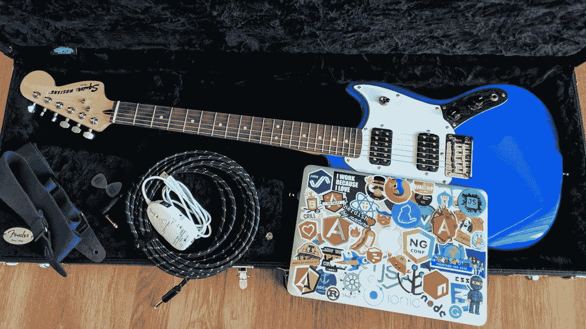
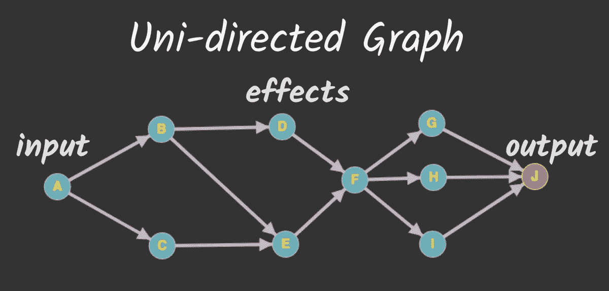
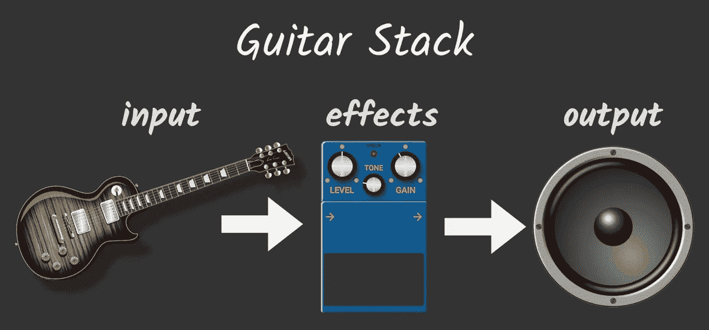

# 电吉他网络音频:如何连接乐器

> 原文：<https://itnext.io/web-audio-for-electric-guitar-how-to-connect-instrument-24352df108ae?source=collection_archive---------5----------------------->

现代网络变得越来越强大，尤其是 API 让开发者可以访问硬件。这样的 API 之一——网络音频。它为您提供了一套低级功能，让您可以在浏览器中生成或处理音乐。今天我想告诉你如何连接你的电吉他🎸(或任何其他有线连接的电子仪器，例如。低音)并控制其音量。

*这个帖子是“电吉他网络音频”系列的一部分，也可以看看其他帖子！*

# 电吉他系列的网络音频:

1.  如何连接仪器—电流
2.  [内阁仿真](https://medium.com/@bobrov1989/web-audio-for-electric-guitar-cabinet-emulation-b2a553b55f2b)

我演奏了很多乐器，包括一些非常不寻常的乐器，比如[班杜拉](https://en.wikipedia.org/wiki/Bandura)🤯，但我最喜欢的是吉他。在我十几岁的时候，我曾经在朋克摇滚乐队演奏🤘在学校和大学。我不是一个专业的吉他手，这只是我的爱好，有助于在工作之余放松和清洁我的大脑。网络音频让我将编程和音乐结合起来，所以我开始尝试它。第一个任务是如何将我的仪器连接到笔记本电脑上。

# 五金器具

在编写任何代码之前，你需要一些东西:一台笔记本电脑、一件乐器(在我的例子中是电吉他)和一个音频接口。最后一部分至关重要。当然，你可以把你的乐器直接插在电脑的音频输入上，但是它有一堆缺点。首先，它可能需要一个适配器。通常，笔记本电脑只有 3.5 毫米的插孔，但 6.4 毫米的电缆用于仪器。第二，内置声卡的质量通常不适合播放音乐——大多数情况下，制作者认为用户用它来播放音乐、电影和游戏。您应该预料到音频流的高延迟。此外，支持功能接口的最后一个论点是，内置解决方案可能会在硬输入级别受到损害。我年轻的时候也这样做过😱。

幸运的是，你只需要花 20-25 美元就可以买到一个便宜又好开始的设备。我用的是最受欢迎和相当便宜的一个——百灵达 UCG-102 吉他链接(这不是广告！).它的延迟很低，有 6.4 毫米的插孔输入和输出，通过 USB 连接，不需要任何特殊的设置就可以在 Mac 上工作(在 Windows 上，您可能需要安装`asio4all`驱动程序才能获得良好的效果)。你可以在下面的照片上看到它在我的设备中。

你可以买一些更花哨更好的东西，但这个音频接口是一个很好的开始，如果你需要它，你可以随时升级它。

您需要将您的设备连接到计算机，将仪器连接到接口。然后，您需要确保系统音频输入和输出设置是正确的。您必须选择外部声卡作为输入，选择内置声卡作为输出。

*注:如果你想使用蓝牙耳机播放，我想推荐使用唯一的有线连接，至少当我使用 Marshall MID 时，延迟是如此之大，以至于我不能播放任何东西，它们对我来说听音乐很好。这可能只是我的具体问题，但当第一次尝试使用网络音频时，尽量不要使用无线扬声器或耳机，因为它们可能会增加延迟，并使您认为网络音频 API 很慢。*

# 网络音频环境

在请求用户音频输入之前，您需要创建一个 Web 音频上下文——这是创建任何节点和使用 API 的要点。一般来说，网络音频是单个音频节点的单向图。连接和改变它们的参数，你可以创建效果管道或产生声音。该图应该有一些输入，在我们的例子中是来自吉他信号的音频流。

要产生任何噪音或声音，输入应连接到输出。通常，它是一个上下文目的地—系统中配置的输出设备。你可以把它想象成一个标准的吉他堆栈。我们有一个吉他，可以连接到一系列踏脚转盘(吉他踏板)，最后，你可以将它连接到放大器或音箱。

有时，为了便于使用，在实现任何复杂的效果之前画一个图是有帮助的。

让我们创建音频上下文，为此我们需要使用一个返回上下文的构造函数:

我的朋友 [Reactive Fox](https://twitter.com/thekiba_io) 告诉我，你可能会对没有任何用户交互的音频环境有问题，例如。点击。浏览器可以将这样的上下文设置为挂起状态；你可以在[这里](https://developers.google.com/web/updates/2017/09/autoplay-policy-changes#webaudio)详细了解。为了防止此类问题，您需要使用以下代码确保上下文处于活动状态:

*旁注:我在处理网络音频时使用过 TypeScript，它节省了我搜索文档的大量时间。不要求使用 TypeScript，但我可以说它可能会使您的生活变得更容易。*

# 请求音频流

在我们创建了一个音频上下文之后，我们准备好用`getUserMedia` API 请求用户输入。以前这个方法位于`navigator`对象上，但是规范变了，现在在`navigator.mediaDevices`上。如果您打算支持传统浏览器，请记住这一点。

默认情况下，浏览器可能会对流应用声音优化，包括回声消除、噪声抑制和自动增益控制。这些优化适用于话筒，但不适用于现场乐器。要禁用它们，您需要传递一个带有音频约束的对象，而不是`true`:

调用方法后，将要求用户允许音频输入和输出。您可以使用`Permissions API`手动请求这些权限，但是现在还不完全支持这个特性。现在，您可以检查权限状态并重置它。

*注意:* `*getUserMedia*` *用户媒体要求您的应用程序通过安全连接- HTTPS 托管。如果您的本地或部署的应用程序使用 HTTP 运行，您可能需要使用浏览器中的网站设置手动授予权限。*

好了，我们请求了一个音频流，接下来呢？我们需要创建一个媒体流源，并将该流传递给音频上下文。然而，要从扬声器中获得任何声音，我们必须将源节点连接到目的节点:

🥁…，现在你应该可以在浏览器中听到吉他的声音了——恭喜你🎉！让我们把这些放在一起:

要断开您的吉他，您需要在您的源节点上调用`disconnect`方法:

# 音量控制

我想在这篇文章中展示的最后一个基本的东西——音量控制。网络音频为我们提供了一个增益节点。它只有一个参数——增益。该参数接受任何数值。零增益表示静音，1 表示正常，音量相同。您可以使用大于 1 的值来放大原始声音；例如，值 2 将分两次提高音量。您可以使用音频上下文的工厂方法或使用构造函数来创建增益节点。这些方法的主要区别在于，构造函数允许你传递初始配置参数，同时你创建一个实例。让我们看看它的代码:

这里有几点需要解释，你可以链接连接方法，因为它们返回你在前一次调用中连接的节点。您可以将值分配给增益节点，但您可能会注意到单击值会发生变化。这些“滴答声”是离散增益变化的假象。幸运的是，Web Audio nodes 有一堆方法可以平滑地设置值:

使用这些方法，你将避免声音故障。要在用户界面中更新音量值，您需要一些控件，最适合的控件是范围输入:

您可以倾听输入的变化来更新增益值。请注意，您将需要验证(至少夹紧)和解析值，因为输入值总是一个字符串。

# 概述

如果您已经阅读了这篇文章，那么您已经学会了如何创建音频上下文、从浏览器请求媒体流、将其连接到输出以及控制其音量。如果你是弹吉他的，可以看看我搭建的[“JS Rocks”](http://js-rocks.web.app)Angular app。它有一堆现成的音箱和用网络音频创建的电吉他效果。而且，听起来还不错😎。敬请关注[下一篇文章](https://medium.com/@bobrov1989/web-audio-for-electric-guitar-cabinet-emulation-b2a553b55f2b)我将展示如何模拟一个真实的吉他音箱。用网络音频摇滚吧🤘！

*原载于*[*https://bobrov . dev*](https://bobrov.dev/blog/web-audio-for-electric-guitar-how-to-connect-instrument/)*。*