# 黄金比例的网页 UX 设计

> 原文：<https://itnext.io/web-ux-design-with-the-golden-ratio-89a503c38266?source=collection_archive---------1----------------------->

## 如何设计自然线条的网络体验

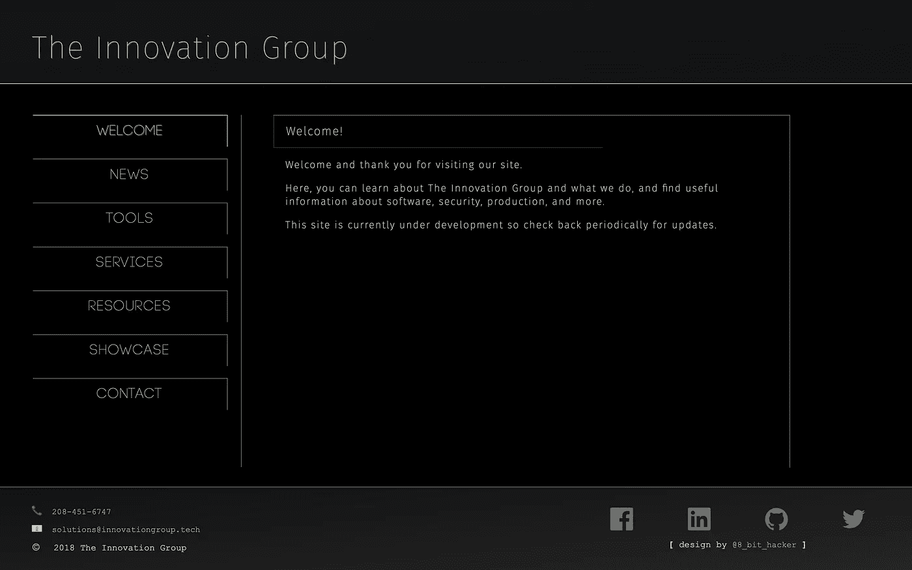

围绕[黄金比例(1.618)](https://en.wikipedia.org/wiki/Golden_ratio) 设计的概念网站截图

## 介绍

在本文中，我们将了解一下[黄金比例](https://en.wikipedia.org/wiki/Golden_ratio)，也称为***φ***或 ***φ、*** ，以及它如何应用于一个简单的响应式网页的设计。

如果你不熟悉黄金比例，也被称为神圣比例，这是一个到处出现的迷人数字，从[艺术](https://www.goldennumber.net/art-composition-design/)和[建筑](https://en.wikipedia.org/wiki/List_of_works_designed_with_the_golden_ratio)到 [DNA 双螺旋](https://www.goldennumber.net/dna/)和其他[自然的表现](https://www.mathsisfun.com/numbers/nature-golden-ratio-fibonacci.html)。

下面简单介绍一下***φ***的定义:

> **a** + **b** 之于 **a** 如同 **a** 之于 **b**
> 
> (**a**+**b**)/**a**=**a**/**b**
> 
> **φ** = 1.618…

我们不会详细讨论数字*本身，但是，我们可以通过创建一个 1366x768 的“Web 最常见”图像(仅为方便起见而选择)，然后在***x = 1366 px/1.618****处添加一条垂直的*参考线，如下所示:***

***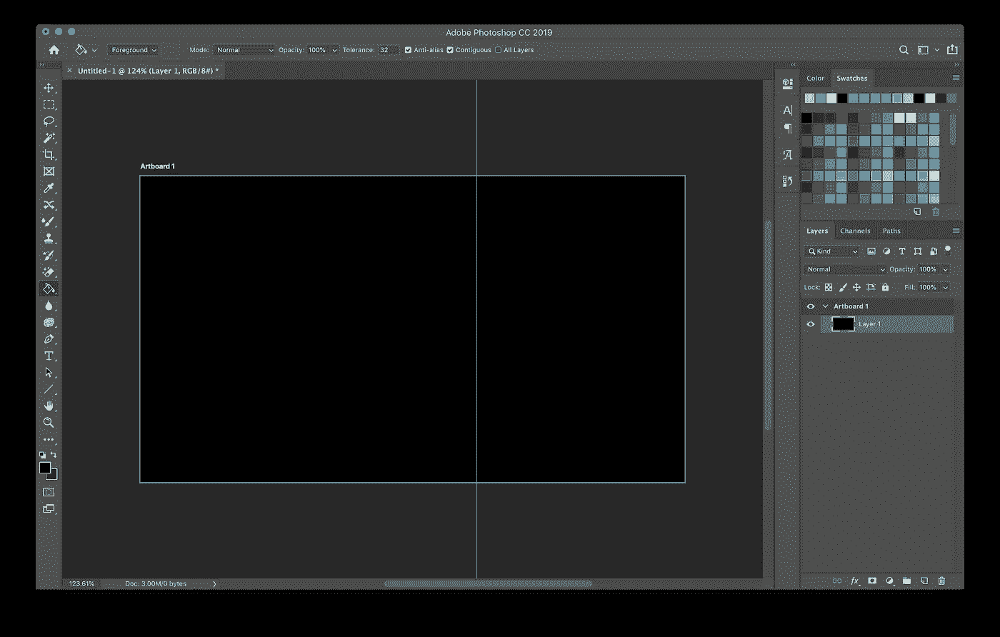***

***带有一个 ***1366x768*** 画板和一个位于 ***x = 1366 / 1.618*** 的垂直参考线的 Photoshop 截图***

***对于跟随其后的水平参考线，只需将其放置在***处，y = 768 / 1.618*** ，与我们创建前一个*的方式相同。*要延续这种模式，只需将结果继续除以 *1.618* ，比如***y₂=****(768/1.618)/1.618*等等。***

**现在我们已经有了关于***【φ***的定义以及一个简单的例子，让我们继续网站的建设。**

## **定义 HTML 结构**

**这个静态网站只包含一个 HTML 文件， **index.html:****

**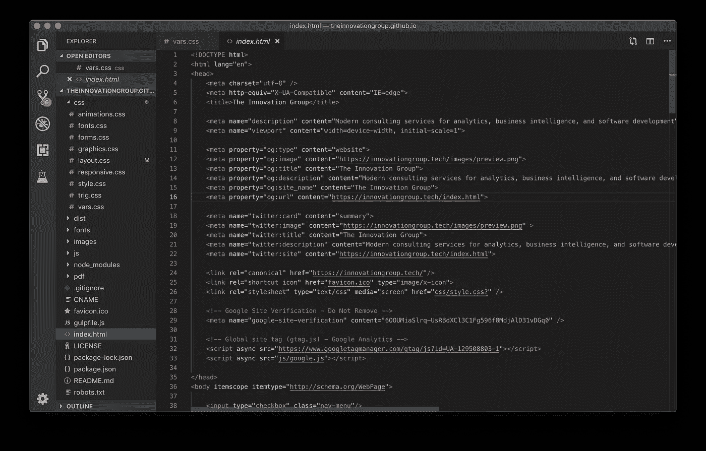**

****index.html**显示[元数据](https://en.wikipedia.org/wiki/Meta_element)、[打开图](http://ogp.me)、[推特卡](https://developer.twitter.com/en/docs/tweets/optimize-with-cards/overview/abouts-cards.html)等信息**

****头**包含通常的标题和[元](https://en.wikipedia.org/wiki/Meta_element)标签，一些[打开图](http://ogp.me)和[推特卡](https://developer.twitter.com/en/docs/tweets/optimize-with-cards/overview/abouts-cards.html)信息，以及各种用于分析的东西。什么是*没有发现*这里是引用主**。js** 文件，它被加载到 HTML 文件的末尾，靠近**页脚**，以允许 DOM 解析器首先处理 HTML，而不必依赖处理程序。这当然是一个简单的例子，还有其他方法来处理装载**。js** 文件(这是其中之一)。**

**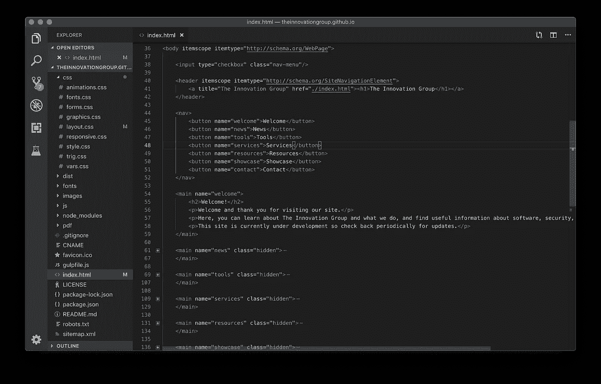**

****index.html**显示了带有**头部**、**导航**和**主**元件的**主体****

**在本文档的**主体**中，我们发现了一个**输入**复选框、**标题**、**导航**和一些**主**元素，它们中的大部分在默认情况下是隐藏的，为了清晰起见，在截图中被折叠起来。**正文**和**标题**还包含[schema.org 微数据](https://schema.org/docs/gs.html)以帮助搜索引擎、社交媒体网站和其他系统正确呈现丰富的内容预览。**

**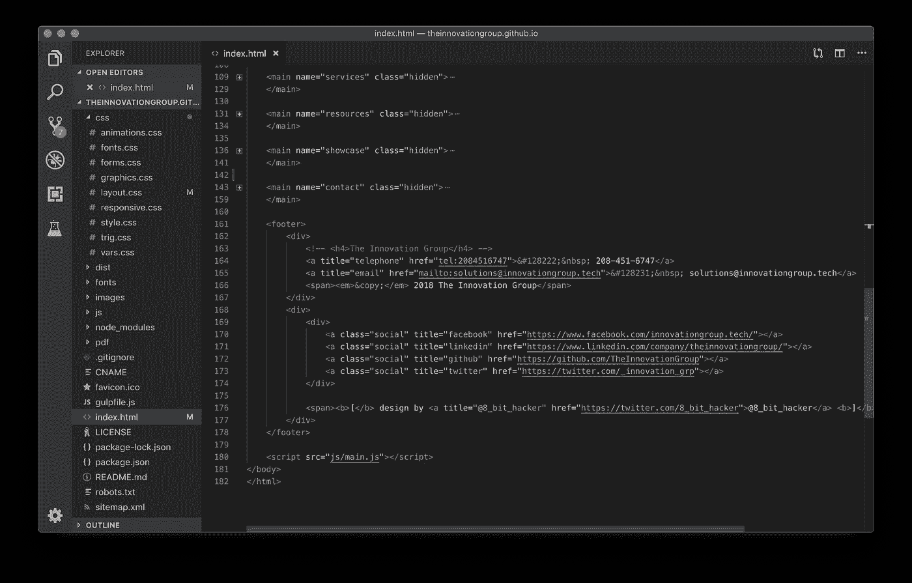**

****index.html**显示**页脚**和**脚本**标签**

**在**index.html**的末尾，我们找到了通常的**页脚**，上面有版权和联系信息，后面是加载 **js/main.js** 的**脚本**标签。我们的 HTML 就是这样，为了清晰和高效，它尽可能保持干净。接下来，我们将看看这个网站的 CSS。**

## **定义 CSS 导入、字体和变量**

**对于这个概念网站，为了简单起见，我选择使用纯 CSS3，并真正感受一下当前规范中可用的功能。我考虑过开发一个精简的预处理器和轻量级语法来增加 CSS3 中可用的特性，但是这将是将来另一个项目的主题。**

**下面是主 CSS 文件 **css/style.css、**以及 **css/fonts.css** 的外观:**

**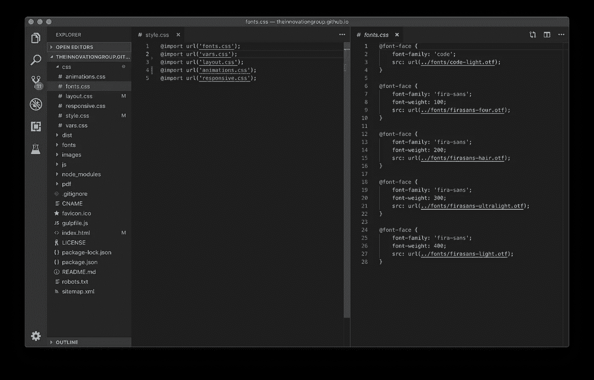**

****带导入的 css/style.css** ，带字体定义的 **css/fonts.css****

**有五个**导入**语句来导入实际的项目 CSS，上面截图中打开了其中一个。接下来是 **css/vars.css** :**

**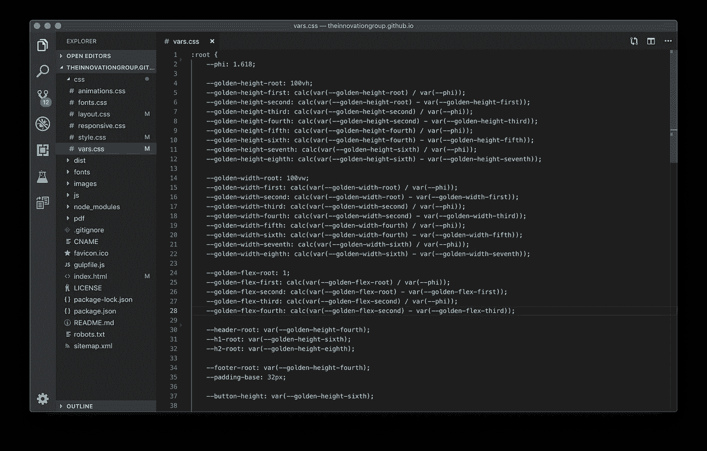**

****css/vars.css** 带有用于计算尺寸的 CSS3 特性[变量](https://developer.mozilla.org/en-US/docs/Web/CSS/Using_CSS_custom_properties)和 [calc](https://developer.mozilla.org/en-US/docs/Web/CSS/calc) ()**

**这里我们定义了一组变量，从熟悉的数字 *1.618* 开始，我们将使用它来计算其余的指标。变量 **- golden-height-root** 和 **- golden-width-root** 分别被设置为值 ***100vh*** 和 ***100vw*** ，并按照我们之前介绍的模式执行一系列计算，其中我们一直将之前计算的结果除以 *1.618* ，直到我们得到足够的值。对于将与 [flexbox](https://css-tricks.com/snippets/css/a-guide-to-flexbox/) 一起使用的变量，也做了同样的事情，对于高度和宽度计算，停止在八步，对于 flexbox，停止在四步。**

**此外，还定义了一些根度量，供以后设置页眉、页脚和其他元素的高度时使用。接下来，让我们看看文件的其余部分:**

**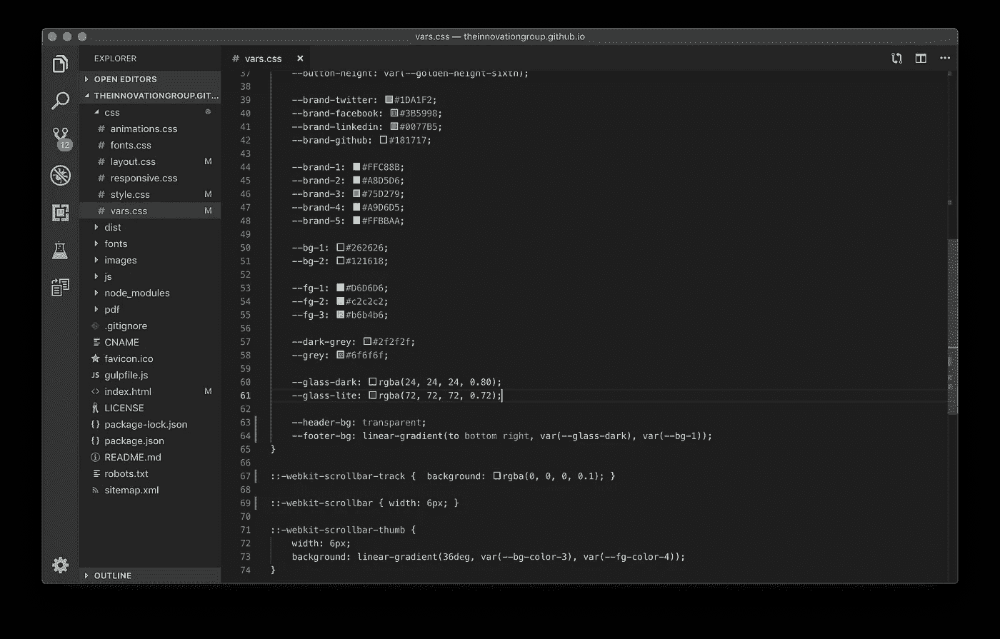**

****css/vars.css** 显示品牌颜色、背景和滚动条样式**

**css/vars.css 中还有社交网络和本地品牌颜色、前景和背景颜色以及 webkit 滚动条覆盖的定义。以上总结了我们的变量定义，接下来让我们看看布局。**

## **定义页面布局 CSS**

**接下来是定义大部分实际 UX 的文件， **css/layout.css** :**

**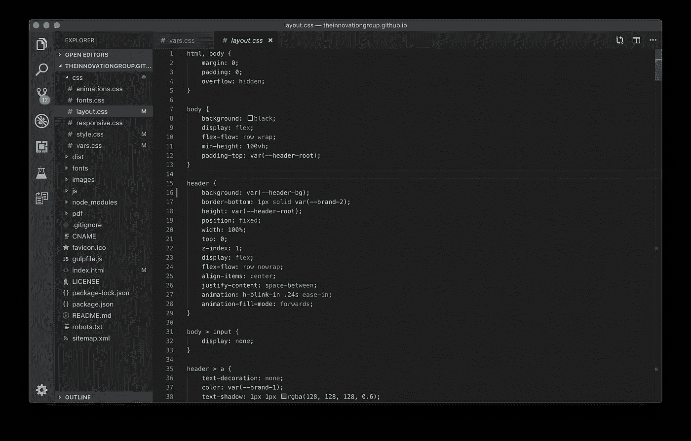**

****css/layout.css** 定义基本屏幕布局**

**这个网站大量使用了 flexbox，它提供了一组强大的选项来定义子元素如何在它们的父容器中绘制。**主体**被配置为在单个行中显示 flex 子元素，而**标题**(也是**主体** ) 的子元素)被设置为覆盖其默认行为，而是扩展到屏幕的整个宽度，并将其自身附加到最顶端。**

**还有一个关于 *h-blink-in* 的参考，我们将在后面和这个网站上使用的一些其他动画一起研究。还要注意，我们将属性 *animation-fill-mode* 设置为 *forwards* ，这使得动画结果在到达结尾时保持不变，而不是重置回开始。**

**在上面的 **css/vars.css** 中，**正文**填充和**页眉**高度都被设置为 **-页眉-根，**先前被设置为 **-黄金高度-第四位**。这就是**标题**在现代浏览器上的呈现方式:**

**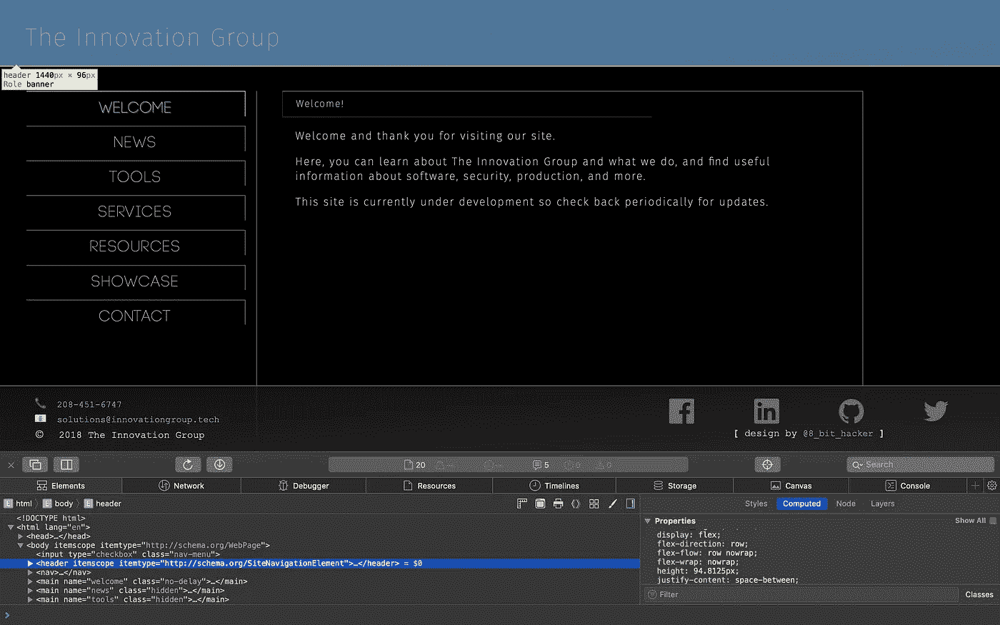**

**带有**标题**及其一些计算属性值的屏幕截图**

****标题**占据了屏幕顶部的一个很好的部分，并在各种屏幕分辨率之间缩放，完全不同于例如 48px 的固定高度的标题，后者将根据屏幕大小随机具有不同的比例，从“Web Most Common”高度的 1/16 到 2017 年 13 英寸 MacBook Pro 高度的 1/32。有时固定尺寸是首选，但这提供了一个处理比例的好例子。**

**接下来，同样在 **css/layout.css** 中，我们有了**导航**菜单的样式:**

**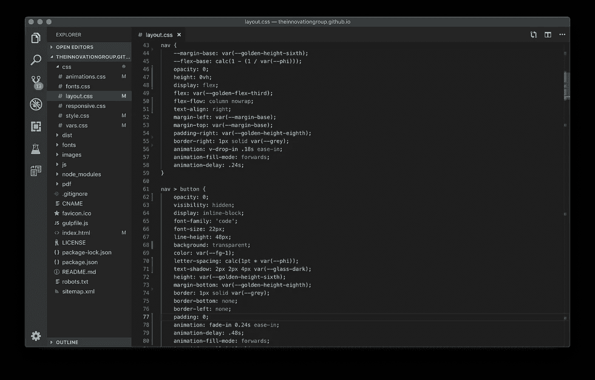**

**显示导航菜单样式的 css/layout.css**

**在 **nav** 选择器中，我们有一个新变量叫做 **- margin base** ，它被设置为， **- golden-height-sixth** ，的值，上边距和左边距被设置为这个值。注意，这个上下文中的“第六”是指被 *1.618、*除的系列中的第六步，而不是某物的六分之一。将 **flex** 属性设置为 **- golden-flex-third，**取数字*(*max*值)并除以 *1.618* ，然后取该结果并再次除以 *1.618* ，并再次重复该过程以获得最终值。这导致了一个 **nav** 菜单，它占据了屏幕的一个区域，这个区域沿着自然的线条按比例缩放，而不是像 25%或 33%这样的任意值——或者更糟，随机放置而不考虑它如何适应大画面。此外，我们还有一些动画，比如菜单上的*v-切入*和导航按钮上的*淡入*。*动画延迟*属性分别设置为. 24 秒和. 48 秒。***

**以下是 WebKit 中导航菜单的呈现方式:**

**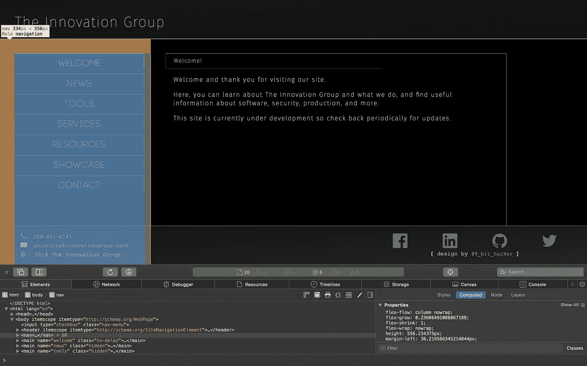**

**显示**导航**菜单和计算属性值的屏幕截图**

**这个 **nav** 元素可以很好地随屏幕缩放，一直到在 **css/responsive.css** 中设置的移动断点，我们稍后会讲到。接下来，我们将查看**主**元素及其子元素的样式属性:**

**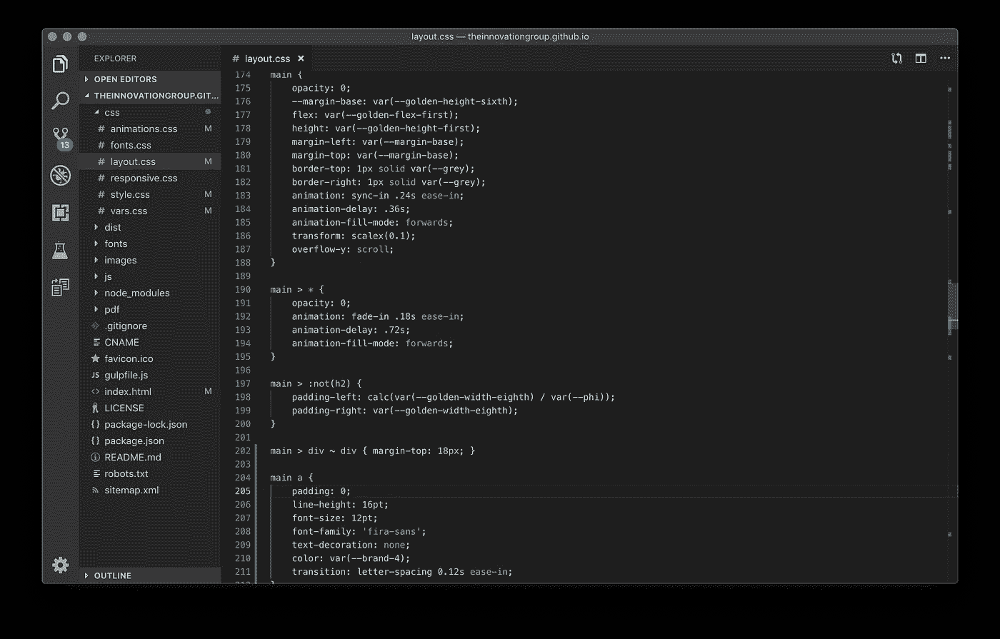**

****css/layout.css** 显示 **main** 及其一些子节点的选择器**

****主**选择器有一些事情正在进行。设置为 **- golden-flex-first** 值的 **flex** 属性将导致元素占据一个宽度等于 *(100% / 1.618)* 的空间。和之前的 **nav** 一样，这个元素的 **- margin-base** 也被设置为 **- golden-height-sixth、**的值，上边距和左边距也被设置为这个值。您可能已经注意到，对于**导航**和**主**元素，高度因子用于设置水平和垂直边距。这是一个个人选择，给填充一个正方形的外观，而不是在宽屏幕上有一个巨大的左填充。这表明了判断的使用，而不是严格遵循规则，在某些时候，增加的精度实际上降低了最终产品的质量。这里的关键是要知道什么时候应用逻辑规则，什么时候允许有喘息的空间。**

**下面是**主**元素的呈现方式:**

**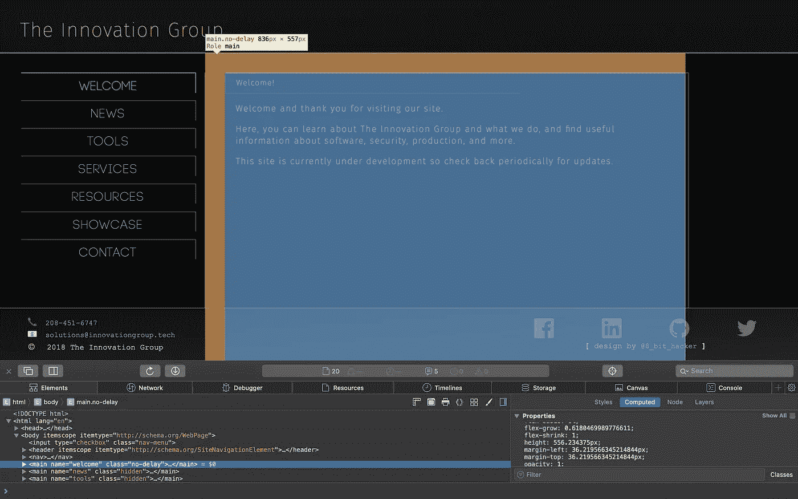**

****main** 元素的屏幕截图——注意 **main** 右边有意未使用的区域**

**按照设计，**主**元素不会延伸到屏幕的最右侧。这是因为 **nav** 元素没有被配置为使用屏幕的剩余部分减去 **main** 元素，这将导致一个更宽的菜单，看起来有些混乱。因此，菜单的大小缩小了一步，将额外的空间留在右边，使内容与屏幕中心对齐。右边的区域可能是某种社交互动、指标或任何其他东西的侧边栏，未来可能会是这样，但现在它被设计为空白。最后但并非最不重要的是**页脚**，它类似于页眉，但占据屏幕底部:**

**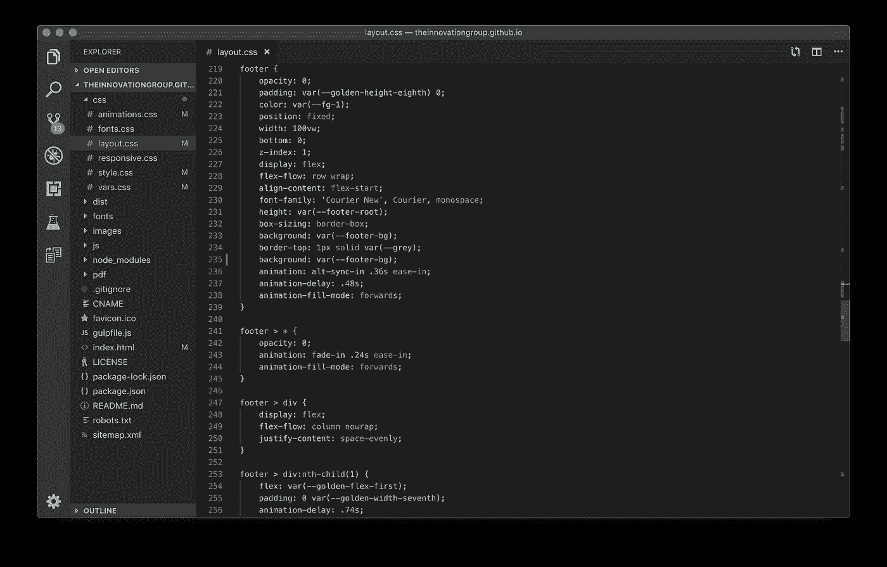**

****css/layout.css** 显示**页脚**选择器和子选择器**

****页脚**实际上只是**页眉**的一个副本，已经更新了新的背景样式和各种元素的容器，如版权信息和社交网络链接。注意选择器 ***页脚>div:n-child(1)***，它选择第一个 **div** ，它是**页脚的直接子节点。****

**这个特殊的 **div** 元素的 **flex** 值为 **- golden-flex-first，**，由于它的父元素占据了屏幕的整个宽度，这个元素的宽度为 *(100% / 1.618)* ，占据了**页脚**的大部分。**

**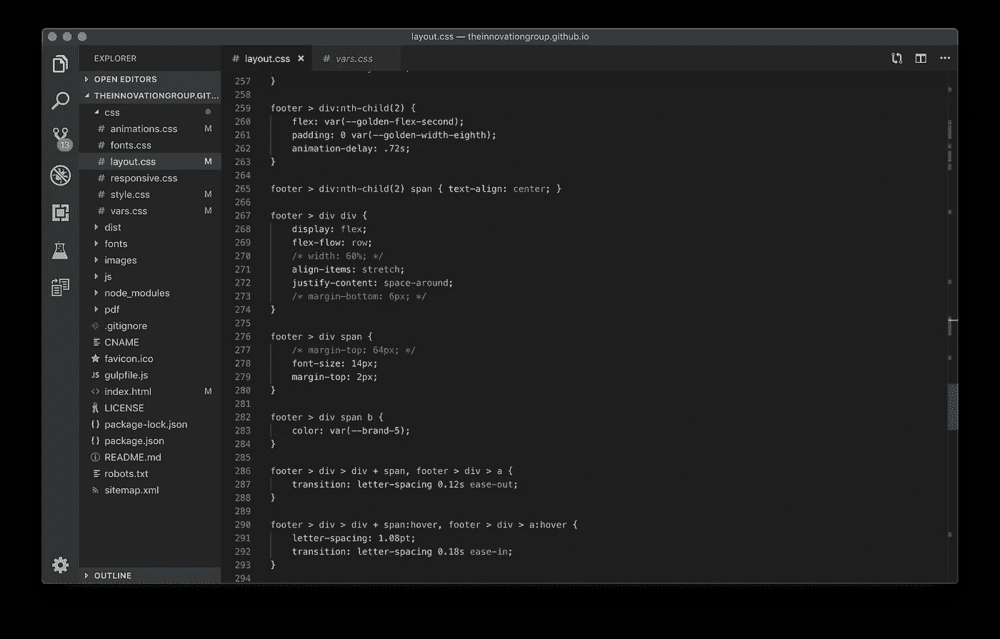**

****css/layout.css** 带有选择器，用于**页脚**的各个子节点**

**第二个 **div** 的 **flex** 值为 **- golden-flex-second，**的宽度为*100%-【100%/1.618】*，这是**页脚**的较小子部分。有各种各样的属性设置，用于居中页脚内容和在悬停时启用过渡，等等(包括一些不在屏幕截图中的样式)。**

**下面是**页脚**的渲染方式:**

**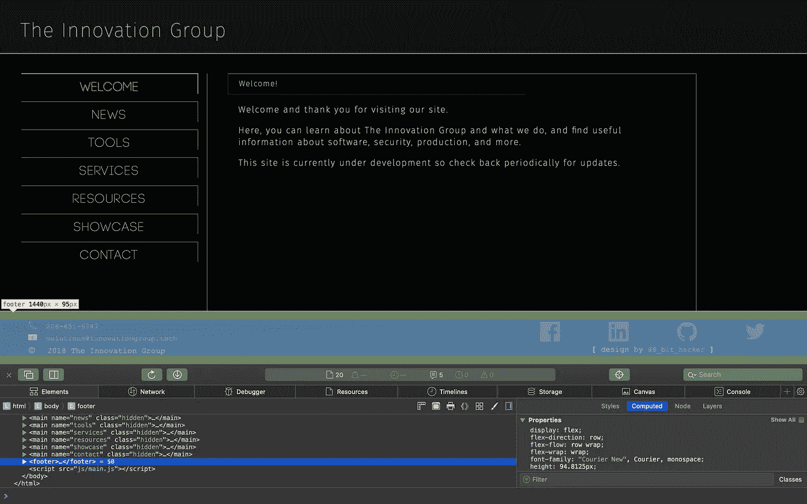**

****页脚的截图—** 基本上是**页眉**的修改副本**

****页脚**将社交媒体按钮等间距放置在屏幕较小的黄金区域的右侧，而联系信息则被绘制在左侧较大区域的左边缘。**

**这涵盖了 HTML5 和 CSS3 中定义的页面的基本结构。现在让我们来看看一些响应覆盖，以一种移动友好的方式在屏幕上重新绘制这些相同的组件。**

## **定义响应式 CSS**

**今天，一个网站或多或少地被期望在智能手机和平板电脑上至少能正确地呈现，而不是被固定在 *1280x1024* 或开发者的显示器那天碰巧的任何分辨率。**

**虽然期望一个响应迅速的网站在 100%的时间里完美地呈现而没有错误或故障是不现实的，但是尽可能好的目标通常会导致一些在大多数时间里足够好的东西。让我们来看看我们的下一个文件， **css/responsive.css:****

**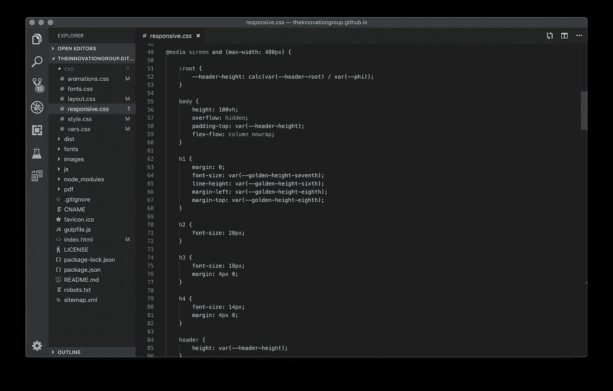**

****css/responsive.css** 显示电话断点**(最大宽度:480px)****

**文件 **css/responsive.css** 有点长，并且包含了这个网站以前版本中一些未使用的选择器，所以我们不会深入这个文件，但是我们会浏览一些基本概念。为了更深入的了解，看看 [GitHub](https://github.com/TheInnovationGroup/theinnovationgroup.github.io) 上的源代码，点击查看网站[。](https://innovationgroup.tech)**

**与标准全屏风格相比，这里存在一些关键的区别。最初的**标题**高度被 *1.618* 细分，一些内容如页边距和字体大小被更新。接下来，我们来看看手机菜单按钮:**

**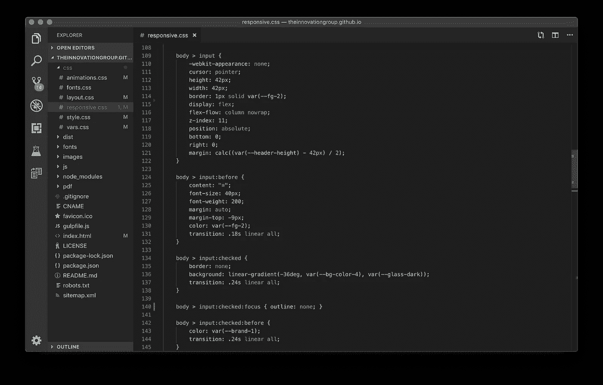**

****css/responsive.css** 使用**主体>输入**选择“汉堡”按钮**

**这里特别感兴趣的是创建移动汉堡包菜单按钮的样式。这是通过复选框**输入**实现的，该复选框直接位于**主体**元素之下，在比 *480px* 宽的屏幕上不可见。勾选后，该复选框“按钮”会显示**导航**:**

**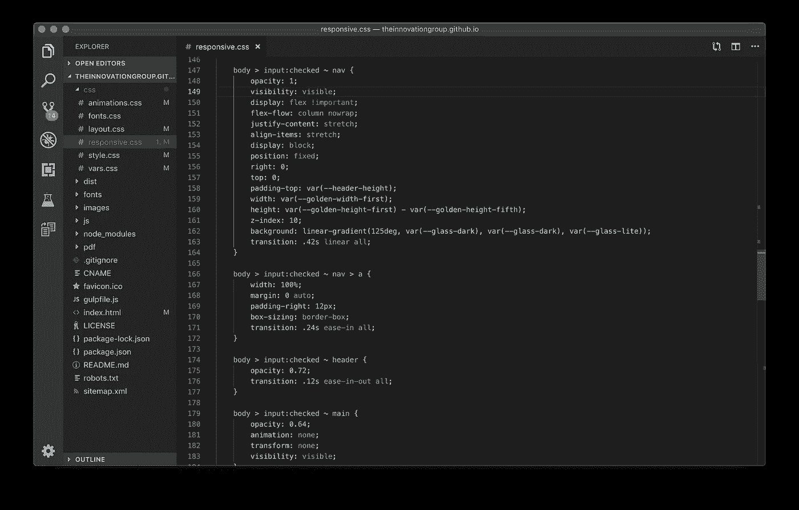**

****css/responsive.css** 带选择器**主体>输入:已检查~导航****

**CSS 选择器**body>input:checked ~ nav**将选择一个 **nav** 元素，该元素是菜单【button】**input**元素的[通用同级](https://developer.mozilla.org/en-US/docs/Web/CSS/General_sibling_combinator)，当 input 元素*被 checked，*并应用在屏幕上绘制移动菜单所需的各种样式。同样，flexbox 用于定位菜单中的项目。这是手机菜单在手机大小的设备上呈现的样子:**

**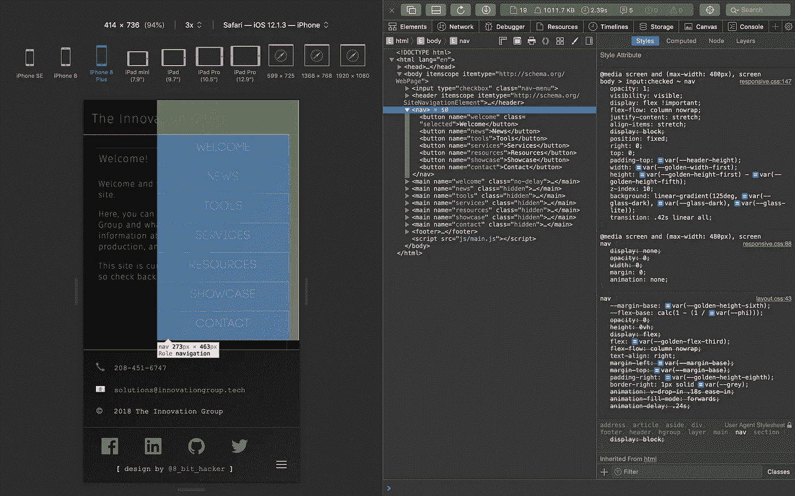**

**带有选择器**主体>输入的移动**导航**菜单截图:已检查~导航****

**当点击汉堡菜单时，屏幕上会出现**导航**菜单，显示菜单按钮。同样，使用类似的方法，移动**页脚**被垂直拉伸以显示社交按钮，当屏幕上的任何内容被点击时，它会折叠回到正常状态，我们将在稍后详细研究。**

## **定义 CSS 动画**

**我们今天最后的 CSS 文件是自描述的 **css/animations.css** 文件:**

**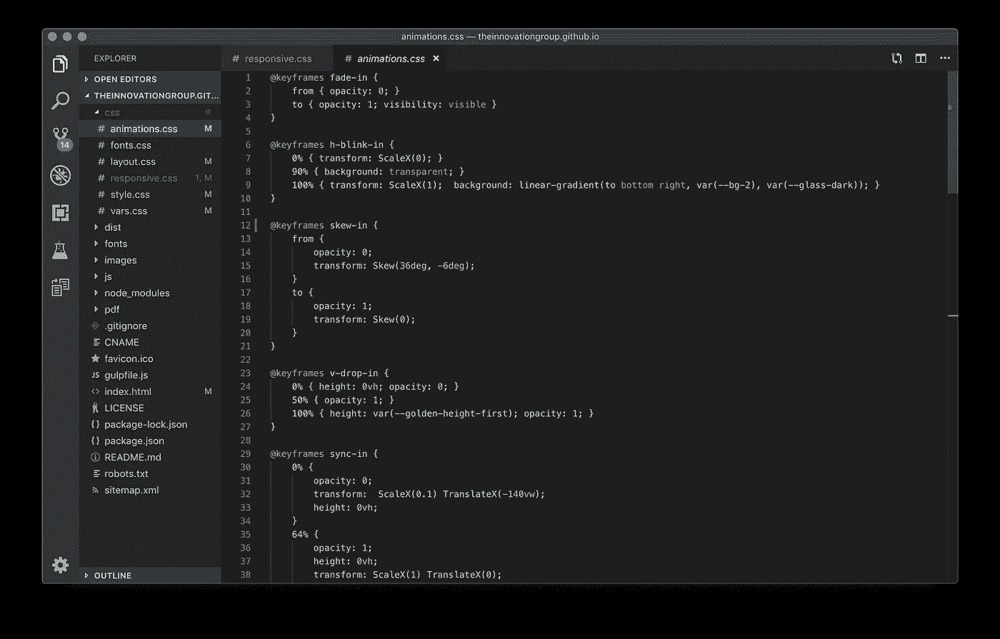**

****css/animations.css** 带各种动画**关键帧****

**我们不会对这个网站上的动画做太深入的研究，但是不管怎样，这些动画并不多，概念也很简单。在我们的动画工具箱中，我们有一些单独的动画，如*淡入*和*h-闪现，*，每个动画控制页面不同组件的动画。这些动画中的大多数都使用了这样的样式，例如，元素的**不透明度**或**高度**将被设置为 **0** 并在整个动画周期中更新，有效地在屏幕上用闪烁的闪光或其他效果绘制元素。许多效果与累积的*动画延迟*值交错，例如*. 24 秒*或*. 36 秒*，这使得屏幕元素看起来像是一个接一个地快速连续绘制，产生了例如逆时针绘画效果，就像我们的[网站这里的](https://innovationgroup.tech)一样。**

**这就结束了我们对这个网站的 CSS 的概述。接下来，我们将看看控制页面部分的加载和隐藏的 JavaScript。**

## **创建导航 JavaScript**

**作为一个小型静态网站，除了处理页面部分显示的小型控制器之外，没有太多的 JavaScript。让我们来看看这个项目中的一个 JS 文件， **js/main.js:****

****

****main.js** 用它的两个方法， **init()** 和 **on_click_nav()****

**这个特定网站上的 JS 文件有两个方法， **init()** 和 **on_click_nav()** 。 **init()** 函数检索对导航按钮和页面部分的 DOM 引用，并将一个事件处理程序绑定到每个按钮，该事件处理程序将导致在单击一个按钮时调用 **on_click_nav()** ，从而导致控制器移除**。从当前选中的按钮中选择**类并将其应用于点击的按钮，同时隐藏当前可见的**主**元素并显示最近选中的元素。**

## **结论**

**黄金比例是一个有用的设计概念，可以应用到网页设计中，通过一些基本的计算来提供一组基本的度量标准。这个例子恰好是一个简单的网站，但是这些概念适用于一般的设计，并且这种格式可以通过简单地将屏幕尺寸除以 *1.618 而适用于移动应用和其他基本用途。***

**我希望你喜欢这篇文章，并发现它很有用。感谢阅读！**

> **肯尼斯·雷利( [8_bit_hacker](https://twitter.com/8_bit_hacker) )是 [LevelUP](https://lvl-up.tech/) 的 CTO**