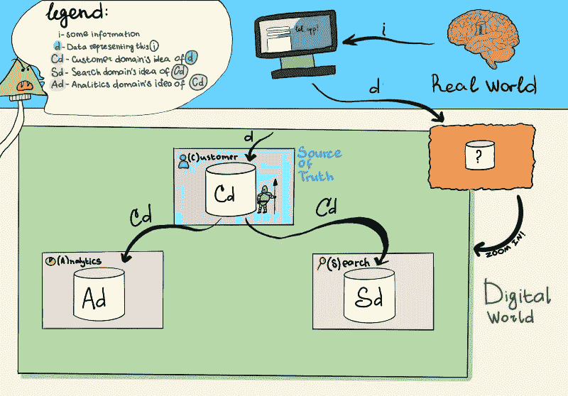
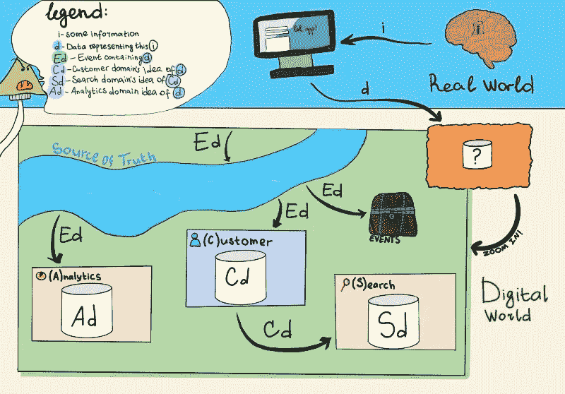

# 什么数据存储—关于选择正确数据存储的想法

> 原文：<https://itnext.io/what-data-store-96e4dade4624?source=collection_archive---------4----------------------->

你好你好。你知道吗，有时候我认为数据、数据结构和数据库是软件开发中最无聊的部分。那些日子里，我比现在更加愚蠢。但这并不意味着我不再是个傻瓜。事情是这样的，尽管我从来没有成为数据主题的超级专家，但我最终花了足够的时间在数据(相当)密集的分布式系统上工作，意识到理解数据结构和数据存储是多么重要。在我们开始之前，有一件事—当我在这篇博文中谈到“系统”或“应用程序”时，我指的是面向服务的分布式系统。我还以某种方式假设这个系统的大部分托管在云中。算是吧。

非常聪明的几维鸟将会修复这个混乱的仓库

## 开场白——何必呢？

所以让我从不久前的地方说起。信不信由你(最好相信)，我是个无知的混蛋。尽管我大部分时间都在系统上工作，致力于存储、转换和解释信息，但我仍然专注于算法，并将数据视为处理用户输入的结果。然后，感谢我周围的一些人，我知道了一些我过去用代码解决的问题可以通过应用一个好的数据设计来完全避免。然而，事实并非如此。我做了更深入的研究，在一些会议演讲、科技文章、YouTube 视频和激烈的闲聊之后，我意识到，由于我的智能算法，数据不仅仅是数据库中的一堆数据。了解数据很重要，它是一个旅行者，有一个离开的家和一个要去的目的地。这两者都不是你的数据存储。

这是我试图向那些和以前的我一样，仍然相信一个 SQL 数据库可以完成任何任务的人伸出援手。

## 第 1 章—数据来源

那么，现在数据从何而来——没人问。我来回答。最常见的是，它来自有史以来最古老、最复杂的数据库(某种程度上)——人脑。我认为大脑是分布式系统的一部分。想想看，我们的大脑是一台复杂但不完美的计算机，我们每天都在使用它。只有当我们需要用我们大脑中的数据做一些事情，和/或从其他人的大脑中访问数据时，我们才开始处理应用程序，连接数字数据存储。离开后，某人的大脑数据不会立即出现在我们的系统中。它会经过几个节点——比如我们系统的 UI (CLI、网站、客户端等)。)，路由器和缓存，然后到达分布式应用程序的后端。在整个过程中，数据从一种形式转换成另一种形式，以适应每个系统临时存储数据的方式。所有这些数据存储——某人的大脑、客户机的磁盘和内存、路由器的缓存——它们存在于某个地方。然而，由于我们对它们没有太多的控制，我们往往会忘记它们有。他们不在我们的控制之下，因此无论如何都不是我们的问题。当数据最终到达我们的领域时，情况就变了。

## 第 2 章—处理数据

数据处理很重要等等

既然我们对某些数据拥有全部控制权和责任，我们应该问自己的第一个问题是——我们该如何处理这些数据？顺便说一下，我想我们需要把它储存起来以备将来使用，否则这篇博文的意义何在？不过，处理数据似乎相当简单。我们只是把它，如果需要的话，丰富或删节，并永久地(稍微)存储在我们的系统中。一个有趣的事实是——尽管这条信息来源于人类大脑内部，然后经过一系列转换，到达我们的服务器，这是数据首先到达的永久数据存储，我们将把它视为真理的最终来源。对我们来说，这是事物的初始状态，公理。我们需要有效地存储这个终极真理。首先，我们需要快速写入，以便我们可以在客户端的网络连接被切断之前返回一个写入确认。其次，我们需要完整地捕获数据，这样我们就可以与系统的其他部分(微服务)共享数据。这意味着我们将把它放入的存储必须具有良好的可伸缩性，并且即使在存储大量数据时也要保持高性能。第三，理想情况下，我们需要能够几乎实时地捕获和公布存储在该数据库中的信息发生的变化。所有这些都使得 NoSQL 数据存储(如 DynamoDB 或 MongoDB)成为非常好的选择。它们都支持极快的读写速度、良好的可伸缩性，并通过更改流提供对数据更改的实时访问。另一个不错的选择可能是一个流处理平台——比如 Apache Kafka——我也认为它是一个数据存储。我一会儿再回到这个话题，好吗？在我看来，数据处理部分到此结束。我们接收它，并储存它。现在是时候决定我们从现在开始用新获得的数据做这件事了。

## 第 3 章——分享是关怀

通常我们收集数据是有原因的。我们的系统是一个工厂，将原始数据处理成具有商业价值的东西。重点是——我们希望很好地利用我们已经获得的信息，为此，我们需要让构成我们分布式应用的各种子系统(当然，我主要指的是微服务)能够访问这些信息。那些不直接接收进入真实来源的原始数据的微服务可能仍然有兴趣获得一些数据，因此他们可以将其与他们领域的数据合并(例如，将客户的地址添加到客户居住的位置列表中)，或者构建他们自己的解释(例如，来自销售和会计潜在客户的同一个人会看起来不同)。不同的微服务对数据可用性有不同的要求。为了更好地满足这些要求，您需要明智地选择将哪些数据存储用于哪些微服务。例如，搜索微服务肯定会受益于使用搜索索引，如 Elasticsearch。而会计微服务迫切需要分类账数据库，等等。将一种类型的数据库用于所有事情听起来确实很方便，而且在非常早期的阶段可能确实有意义。然而，通过在开始时为您节省一些时间，它会在以后将沉重的技术债务放在您的肩上。迁移成本可能会超过最初的实现成本，因此您需要选择合适的时机将您的整体数据库发展成更灵活的东西。没有完美的解决方案，但是这已经是昨天的新闻了。

## 第三章——真理的来源。回顾。

关于“真理之源”存储系统的一件事是，它对于您的系统的可操作性是多么重要。您捕获和保存的数据最初会影响系统的状态。如果它消失了，就没有办法恢复了(假设它在所有备份中永远丢失了)，因此您需要确保尽早捕获它，并且捕获得很好。这不适用于基于原始数据生成的数据。在完全丢失这个“第二层”数据存储的不太可能的情况下，您仍然可以(理想地)使用“事实的来源”来重建它们。这一事实使得数据流成为“真实来源”存储的一个有吸引力的候选者。Kafka 或 Kinesis 等数据流的最大优点是能够重播您的事件，然后通过重播最新事件，从任何备份中将您的其他微服务恢复到最近的状态。是的，你仍然需要备份。谈到事件保留，[有些人可能会说](https://m.youtube.com/watch?v=JHGkaShoyNs)你永远不需要删除它们。这不仅听起来有点争议——尽管不是不合理的——例如，对于 Kinesis 来说也是不可能的。Kinesis 的最长消息保留期为 7 天。然而，由于这是“真实的来源”类型的数据，我们希望在系统的生命周期内将它保存在系统中。如果我们将进入流的每条消息保存在一个单独的数据库中，那么这是可行的，这样即使在原始消息从流中删除后，我们也可以访问它。请注意，在这种情况下，我们可能会认为“真理的来源”只是一个容器，用于存放从外部世界发送给我们的原始数据。我们只需要在另一个微服务需要该数据时从其中读取数据——要么为新数据库创建记录，要么在崩溃后恢复现有数据库。

## 第 4 章——永无止境的旅程

信息一旦离开某人的大脑，就永远不会停止传播。最终，您的应用程序接受、存储和处理数据只是为了创建更多的数据。这个旅程永远不会结束。信息将像一条小溪一样，分支成更小的溪流，形成湖泊和冰川，并在某一点上汇入全球信息海洋中的海洋。这听起来可能过于诗意，但我忍不住这样想。另一个让我忍不住的想法是，构成信息流的数据有太多的形式，也有太多的用途。因此，它有如此多的不同要求，因此认为可能有一个完美的解决方案可以满足我们所有存储系统需求的想法太天真了。

## 收场白

在这篇博文的开始，我对你们所有人都很诚实，我说过:“我不是专家”。我建议您阅读和听取专家的意见，以拓宽您对何时、为何、何地以及使用何种数据存储的理解。关于这个主题的必读书籍是[马丁·克莱普曼](https://twitter.com/martinkl)的[设计数据密集型应用](https://dataintensive.net)。Amazon 有一些描述 DynamoDB 良好实践的文档。AWS 的里克·霍利汉也在 re:Invent 上发表了关于 DynamoDB 设计模式的精彩演讲，比如 2018 年的这个。我敢肯定，互联网上有一些很棒的文章，涵盖了来自竞争云的替代方案。我也鼓励你学习更多关于流的知识。软件工程日报播客有几集他们和专家讨论卡夫卡。有一集叫做[卡夫卡数据管道](https://softwareengineeringdaily.com/2019/09/23/kafka-data-pipelines-with-robin-moffatt/)，我觉得特别有趣。它的主题有点接近我这次试图向你们传达的内容。然而，一些适当的学习材料也会有所帮助。最后但同样重要的是——弹性搜索。哦，你可以在网上找到很多关于它的信息。除了他们的[官方指南](https://www.elastic.co/guide/index.html)，我不知道还有什么可以推荐的。Elasticsearch 是一项非常强大的技术，所以如果你仍然不确定你的项目是否能从中受益——我建议试试 Udemy 或 Pluralsight 上的好课程。

就是这样。我已经说过了。谢谢，下次再见。XOXO。再见👋。