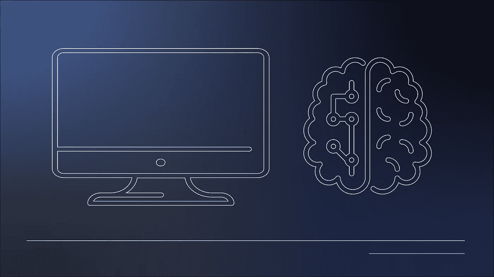

# 什么是脑机接口？

> 原文：<https://itnext.io/what-is-a-brain-computer-interface-20cb9edd4130?source=collection_archive---------3----------------------->

计算机显示器和电子人脑的示意图

## 用思想控制机器的介绍

## 介绍

自从计算机时代开始，人类就一直在寻找更新更有效的方法将信息输入计算机，并用指令来指挥它。[最早的计算机](https://en.wikipedia.org/wiki/ENIAC)使用了大量的电线、旋钮和开关——在一个乏味而耗时的过程中，这意味着数周的算法设计和数天的手动设置，而今天的计算机只用几行代码就能完成。

随着时间的推移，许多[人机界面设备](https://en.wikipedia.org/wiki/Human_interface_device)被发明出来，以方便用输入数据控制机器。我们在日常生活中使用的一些常见设备包括键盘、鼠标、触控板、触摸屏和游戏控制器等等。其他更专业的例子包括艺术家的数字化平板、飞行和驾驶模拟的控制表面以及游戏控制台的运动控制输入。

在所有令人难以置信的将信息输入计算机的酷方法中，没有什么比只用人脑(或任何大脑)而不用其他任何东西来控制计算机更能唤起对高科技未来的憧憬了。在本文中，我们将了解这项令人惊叹的技术背后的一些科学原理，并看看开发人员如何立即开始试验它。

## 电磁大脑

大多数人都会熟悉[脑电图](https://en.wikipedia.org/wiki/Electroencephalography) (EEG ),因为它被广泛应用于它发展的医疗行业。但是这是如何工作的呢？简而言之，大脑中的单个[神经元](https://en.wikipedia.org/wiki/Neuron)包含[离子泵](https://en.wikipedia.org/wiki/Ion_transporter)，离子泵用于沿着[神经纤维](https://en.wikipedia.org/wiki/Axon)向目标接受者诱导电脉冲。来自这些脉冲的电流在任何给定的时间点在头皮的各个点上产生电压差，使用电极以及[差分放大器](https://en.wikipedia.org/wiki/Differential_amplifier)和[模数转换器](https://en.wikipedia.org/wiki/Analog-to-digital_converter)读取该电压差，然后以一定的速率采样(临床脑电图为 256Hz 至 512Hz，研究应用中高达 20kHz)。然后对产生的信号进行信息分析。

一秒的脑电信号— [CC BY-SA 3.0](https://commons.wikimedia.org/w/index.php?curid=473210)

医生使用这些信息来识别患者的癫痫和其他疾病，其他重要的用例包括更深入地了解大脑的研究，这为医生提供了更多信息，等等。

这种脑波信息被分为*节律活动*和*瞬变、*然后进一步分为对应不同功能的频段，从睡眠周期到传感器输入和电机控制。

## 开发脑机接口

阅读和处理大脑信号的技术已经很容易为业余爱好者和专业开发人员所用，他们利用像 OpenBCI 这样的公司的开源硬件和软件设计，open BCI 提供免费软件和 3D 打印耳机设计，此外还出售 EEG 耳机和其他生物传感电子设备等硬件。

OpenBCI 网站上有一些教程，介绍如何使用他们的几个电路板以及捕捉基本动作的事件数据，如眨眼、咬紧下巴和其他简单的手势。此外，一旦电路板启动并运行，并使用教程中的 GUI 应用程序捕捉信息，就可以下载一个 SDK 来帮助使用该平台。[数字信号处理](https://en.wikipedia.org/wiki/Digital_signal_processing)的工作知识很有帮助，尤其是在构建高级应用程序或需要更精细细微控制的应用程序时。

除了 OpenBCI 之外，还有其他脑机接口设备和相应设计的提供商，其中许多都在本页的[中列出。](https://github.com/NeuroTechX/awesome-bci)

## 潜在应用

这项技术的潜在应用仅仅受到想象力的限制。一个令人惊讶的例子是[大脑控制的假肢](https://www.uchicagomedicine.org/forefront/neurosciences-articles/2018/october/neuroscience-researchers-receive-grant-to-develop-brain-controlled-prosthetic-limbs)，例如，它使失去一只手或一条腿的人恢复了可工作的活动水平。这个人将拥有一个功能齐全的机器人肢体，可以支撑重量，保持平衡，提供灵活性和灵巧性，甚至可以熟练地操纵小零件或其他物品，而不仅仅是一个没有主动力的哑假肢。当然，这可以一直扩展到为可能完全不能活动的人提供完全的活动能力。

这项技术的其他用途包括遥控机器人或其他物体，这些物体可能需要比只用手臂和腿更精细的控制，此外还有智能设备，例如，可以读取佩戴者的意图，并根据需要通过改变平视显示器的输出做出相应的响应。此外，电脑游戏和虚拟现实的潜在价值是深远的。

不幸的是，滥用的可能性也相当明显，因为我们现在直接从大脑本身收集数据，不需要人类驾驶控制器的任何运动动作。在这项技术上开发应用程序时使用的安全和责任级别应该满足最高的标准和期望，并且还需要类似于面部识别的法规来防止公司和政府滥用这项技术(他们会尝试)。

## 结论

雨-计算机界面是一项令人兴奋的、令人难以置信的强大新技术，它正在彻底改变我们使用计算机和机器的方式。能够在自由活动手脚的同时控制某物的想法确实令人难以置信，并将对建筑、电脑游戏、军事、太空探索等行业产生深远的影响。看到这种新技术和未来设备以及由此产生的其他东西会令人兴奋。

我希望你喜欢这篇文章。感谢阅读！

~ [8_bit_hacker](https://twitter.com/8_bit_hacker)