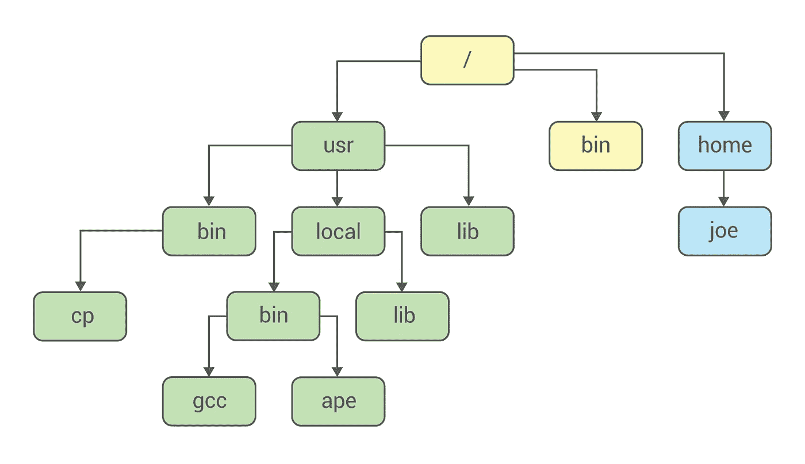
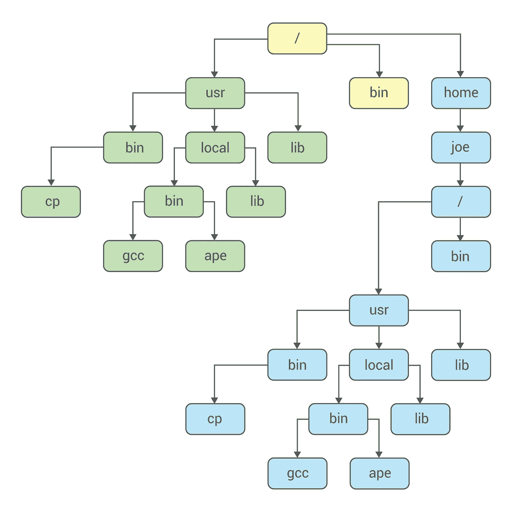

# 什么是:ch root—Linux 中的系统调用和实用程序

> 原文：<https://itnext.io/what-is-chroot-the-system-call-and-utility-in-linux-19d8bdf5c599?source=collection_archive---------3----------------------->


`chroot()`是在 1979 年被添加到第 7 版 Unix 中的，用于文件系统隔离。

事实上，它是整个当前容器化思想的前身，只是现在使用了名称空间和 cgroups，而早期的 chroot 用于创建一个与主机隔离的环境，例如，可以用于测试目的。

另外， *ch* 和 *root* 是(文件系统的) *change* 和 *root* 的“缩写”。

## Linux 文件系统树

Linux 中的目录树通常看起来像 next(参见[文件系统层次标准](https://en.wikipedia.org/wiki/Filesystem_Hierarchy_Standard)):



```
$ tree -d -L 1 /
/
├── bin -> usr/bin
├── boot
├── data
├── dev
├── etc
├── home
├── lib -> usr/lib
├── lib64 -> usr/lib
├── lost+found
├── mnt
├── opt
├── proc
├── root
├── run
├── sbin -> usr/bin
├── srv
├── sys
├── tmp
├── usr
└── var
```

`chroot()`允许创建一个嵌套文件系统树，可通过下图演示:



下面我们将通过一些 C 代码的例子来仔细看看`chroot()`，以及`chroot`实用程序及其在操作系统中的用法。

## `chroot()`-Linux 系统调用

因此，chroot 旨在通过更改文件系统的根目录来限制对文件系统的访问。

也就是说，不是像这样的目录结构:

```
$ tree -d -L 1 /
/
├── bin -> usr/bin
├── boot
├── data
...
├── tmp
├── usr
└── var
```

一个进程将只看到那些被传递给`chroot()`的参数限制在顶层的。

让我们创建下一个要使用的目录，例如:

```
$ mkdir -p /tmp/chroot/{1,2,3,4}
```

让我们用 C 语言编写下一段代码:

```
#include <stdio.h>
#include <unistd.h>
#include <dirent.h>

int main(void) {

    // check path before chroot()
    char t_cwd[PATH_MAX];
    getcwd(t_cwd, sizeof(t_cwd));
    printf("Current dir before chroot(): %s\n", t_cwd);

    // do chroot()
    chdir("/tmp/chroot/");
    if (chroot("/tmp/chroot/") != 0) {
        perror("chroot /tmp/chroot/");
        return 1;
    }

    // check path path after chroot()
    char a_cwd[PATH_MAX];
    getcwd(a_cwd, sizeof(a_cwd));
    printf("Current dir after chroot(): %s\n", a_cwd);

    // point dr struct to the "root"
    struct dirent *de;
    DIR *dr = opendir("/");  

    // run readdir() and list "root"'s content
    while ((de = readdir(dr)) != NULL)  
        printf("%s\n", de->d_name);  

    // try to open /etc/passwd from a "host" filesystem
    FILE *f;
    f = fopen("/etc/passwd", "r");

    if (f == NULL) {
        perror("/etc/passwd");
        return 1;
    } else {
        char buf[100];
        while (fgets(buf, sizeof(buf), f)) {
             printf("%s", buf);
        }
    }

    return 0;
}
```

这里它将:

*   调用`chroot()`前检查当前路径
*   呼叫`chroot()`
*   再次检查当前路径
*   获取“根”内容
*   尝试打开“真实”文件系统上的`/etc/passwd`文件

构建它:

```
$ gcc chroot_example.c -o chroot_example
```

并运行检查(由于`chroot()`只能由 root 使用，因此`sudo`):

```
$ sudo ./chroot_example
Current dir before chroot(): /home/setevoy/Scripts/C
Current dir after chroot(): /
.
..
4
3
2
1
/etc/passwd: No such file or directory
```

`chroot()`本身是在内核的`[open.c](https://elixir.bootlin.com/linux/v5.0.3/source/fs/open.c#L519)`文件中定义的:

```
SYSCALL_DEFINE1(chroot, const char __user *, filename)
{
  return ksys_chroot(filename);
}
```

并将返回`[ksys_chroot()](https://elixir.bootlin.com/linux/v5.0.3/source/fs/open.c#L486)`:

```
int ksys_chroot(const char __user *filename)
{
  struct path path;
  int error;
  unsigned int lookup_flags = LOOKUP_FOLLOW | LOOKUP_DIRECTORY;
retry:
  error = user_path_at(AT_FDCWD, filename, lookup_flags, &path);
  if (error)
    goto out;

  error = inode_permission(path.dentry->d_inode, MAY_EXEC | MAY_CHDIR);
  if (error)
    goto dput_and_out;

  error = -EPERM;
  if (!ns_capable(current_user_ns(), CAP_SYS_CHROOT))
    goto dput_and_out;
  error = security_path_chroot(&path);
  if (error)
    goto dput_and_out;

  set_fs_root(current->fs, &path);
  error = 0;
dput_and_out:
  path_put(&path);
  if (retry_estale(error, lookup_flags)) {
    lookup_flags |= LOOKUP_REVAL;
    goto retry;
  }
out:
  return error;
}
```

它将依次调用流程的`[set_fs_root()](https://elixir.bootlin.com/linux/latest/source/fs/fs_struct.c#L14)`:

```
void set_fs_root(struct fs_struct *fs, const struct path *path)
{
  struct path old_root;

  path_get(path);
  spin_lock(&fs->lock);
  write_seqcount_begin(&fs->seq);
  old_root = fs->root;
  fs->root = *path;
  write_seqcount_end(&fs->seq);
  spin_unlock(&fs->lock);
  if (old_root.dentry)
    path_put(&old_root);
}
```

你可以在这里> > 和[这里> > >](https://stackoverflow.com/a/28128030/2720802) 找到好的 syscalls 描述。

## `chroot`-Linux 实用程序

要在 Linux 中创建一个隔离空间，您可以使用`chroot`实用程序:

```
$ which chroot
/usr/bin/chroot
$ file /usr/bin/chroot
/usr/bin/chroot: ELF 64-bit LSB pie executable, x86-64, version 1 (SYSV), dynamically linked, interpreter /lib64/ld-linux-x86-64.so.2, for GNU/Linux 3.2.0, BuildID[sha1]=f3861107940247a67dbbf6343fa5ff1c1c70305c, stripped
```

让我们用一个隔离的文件系统为我们的“监狱”创建一个目录:

```
$ cd /tmp/
$ mkdir changed_root
```

实际上，`chroot`实用程序将调用同一个`chroot()`系统调用——让我们用`[strace](https://rtfm.co.ua/linux-strace-otslezhivaem-vypolnenie-processa/)`检查一下:

```
$ sudo strace -e trace=chroot chroot changed_root/
chroot("changed_root/")                 = 0
chroot: failed to run command ‘/bin/bash’: No such file or directory
+++ exited with 127 +++
```

*'/bin/bash ':没有这样的文件或目录*错误是因为在这个新环境中没有`/bin`目录和`bash`可执行文件。

同样，如果尝试调用任何其他程序，也会返回这样的错误:

```
[setevoy@setevoy-arch-work /tmp]  $ which ls
/usr/bin/ls
[setevoy@setevoy-arch-work /tmp]  $ sudo chroot changed_root /usr/bin/ls
chroot: failed to run command ‘/usr/bin/ls’: No such file or directory
```

让我们修复它——在我们的`/tmp/changed_root`中创建`/bin`目录，并从这个“容器”内的一个“主机”中复制`bash`文件:

```
[setevoy@setevoy-arch-work /tmp]  $ mkdir changed_root/bin
[setevoy@setevoy-arch-work /tmp]  $ cp /bin/bash changed_root/bin
[setevoy@setevoy-arch-work /tmp]  $ file changed_root/bin/bash
changed_root/bin/bash: ELF 64-bit LSB pie executable, x86-64, version 1 (SYSV), dynamically linked, interpreter /lib64/ld-linux-x86-64.so.2, for GNU/Linux 3.2.0, BuildID[sha1]=357034d1736cd97d2c8f8347045250dbd0de998e, stripped
```

再试一次:

```
[setevoy@setevoy-arch-work /tmp]  $ sudo chroot changed_root /bin/bash
chroot: failed to run command ‘/bin/bash’: No such file or directory
```

好吧。

但现在是因为没有必要的库而导致的— `chroot`就是说不出来这个。

检查`bash`与`[ldd](http://man7.org/linux/man-pages/man1/ldd.1.html)`的相关性:

```
[setevoy@setevoy-arch-work /tmp]  $ ldd /bin/bash
linux-vdso.so.1 (0x00007ffe37f16000)
libreadline.so.8 => /usr/lib/libreadline.so.8 (0x00007f39b13d2000)
libdl.so.2 => /usr/lib/libdl.so.2 (0x00007f39b13cd000)
libc.so.6 => /usr/lib/libc.so.6 (0x00007f39b1209000)
libncursesw.so.6 => /usr/lib/libncursesw.so.6 (0x00007f39b119a000)
/lib64/ld-linux-x86-64.so.2 => /usr/lib64/ld-linux-x86-64.so.2 (0x00007f39b153f000)
```

在我们新的工作目录中再创建两个目录— `/lib`和`/lib64`:

```
[setevoy@setevoy-arch-work /tmp]  $ mkdir changed_root/usr/lib changed_root/lib64
```

并复制 libs 文件:

```
[setevoy@setevoy-arch-work /tmp]  $ cp /usr/lib/libreadline.so.8 changed_root/usr/lib/
[setevoy@setevoy-arch-work /tmp]  $ cp /usr/lib/libdl.so.2 changed_root/usr/lib/
[setevoy@setevoy-arch-work /tmp]  $ cp /usr/lib/libc.so.6 changed_root/usr/lib/
[setevoy@setevoy-arch-work /tmp]  $ cp /usr/lib/libncursesw.so.6 changed_root/usr/lib/
[setevoy@setevoy-arch-work /tmp]  $ cp /lib64/ld-linux-x86-64.so.2 changed_root/lib64
```

再次运行`chroot`:

```
[setevoy@setevoy-arch-work /tmp]  $ sudo chroot changed_root/
bash-5.0#
```

现在我们有了在这里运行的`bash`和它所有的内置函数:

```
bash-5.0# pwd
/
```

但是很明显——没有其他外部实用程序可以在这里工作:

```
bash-5.0# ls -l
bash: ls: command not found
```

这可以用我们为`bash`所做的同样的方法来修复:

```
[setevoy@setevoy-arch-work /tmp]  $ which ls
/usr/bin/ls
[setevoy@setevoy-arch-work /tmp]  $ cp /usr/bin/ls changed_root/bin/
[setevoy@setevoy-arch-work /tmp]  $ ldd /usr/bin/ls
linux-vdso.so.1 (0x00007ffdebbf5000)
libcap.so.2 => /usr/lib/libcap.so.2 (0x00007fa5b147d000)
libc.so.6 => /usr/lib/libc.so.6 (0x00007fa5b12b9000)
/lib64/ld-linux-x86-64.so.2 => /usr/lib64/ld-linux-x86-64.so.2 (0x00007fa5b14d8000)
[setevoy@setevoy-arch-work /tmp]  $ cp /usr/lib/libcap.so.2 changed_root/usr/lib/
```

其他库已经被复制，所以让我们再次运行`ls`:

```
bash-5.0# /bin/ls -l /
total 0
drwxr-xr-x 2 1000 1000  80 Mar 22 11:45 bin
drwxr-xr-x 2 1000 1000 120 Mar 22 11:37 lib
drwxr-xr-x 2 1000 1000  60 Mar 22 11:38 lib64
drwxr-xr-x 3 1000 1000  60 Mar 22 11:39 usr
```

## 请参见

*   [容器化机制:名称空间](https://blog.selectel.com/containerization-mechanisms-namespaces/)
*   [Linux 虚拟化— Chroot Jail](https://www.geeksforgeeks.org/linux-virtualization-using-chroot-jail/)
*   [chroot、cgroups 和名称空间——概述](/chroot-cgroups-and-namespaces-an-overview-37124d995e3d)
*   [ch root()有点令人惊讶的历史](https://utcc.utoronto.ca/~cks/space/blog/unix/ChrootHistory)
*   [chroot(2) — Linux 手册页](https://linux.die.net/man/2/chroot)
*   [系统调用剖析，第 1 部分](https://lwn.net/Articles/604287/)

*最初发布于* [*RTFM: Linux、DevOps 和系统管理*](https://rtfm.co.ua/en/what-is-chroot-the-system-call-and-utility-in-linux/) *。*