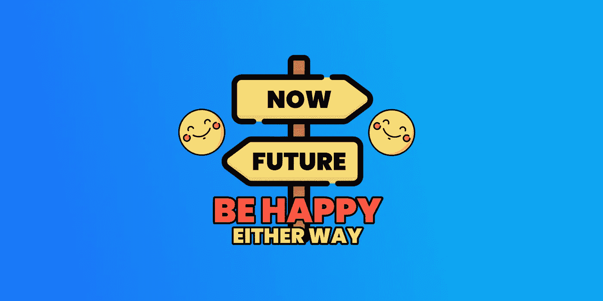

# Dart/Flutter 中的 FutureOr 是什么？

> 原文：<https://itnext.io/what-is-futureor-in-dart-flutter-681091162c57?source=collection_archive---------0----------------------->



## 什么是 FutureOr，我们为什么需要它？什么时候用？让我们深潜进去吧！

在 Flutter 文档中，你可以看到`FutureOr`的定义

## 诸如

> 表示值为`*Future<T>*`或`*T*`的类型。
> 
> `*FutureOr<int>*`类型实际上是`*int*`和`*Future<int>*`类型的“类型联合”。

它们实际上是很好的定义，但是它们到底意味着什么呢？我们为什么需要它？什么时候用？

让我用一个非常简单的例子来解释！

# 问题

让我们考虑一个带有简单获取方法的数据库服务接口

```
abstract class IDBService {
  **Future<String> fetch()**;
}
```

然后让我们从这个接口扩展两个数据库服务类。

## 消防服务

如你所知`firebase`需要异步操作

```
class FirebaseService **extends IDBService** {
  @override
  **Future<String> fetch() async => await 'data';**
}
```

## 艾滋病毒服务

但是另一方面，`hive`不需要异步操作。我们只想同步获取值

```
class HiveService **extends IDBService** {
  @override
  **String fetch() => 'data';**
}
```

但是正如你所看到的，我们不能这样定义它，因为我们的接口迫使我们让它们都异步！

既然这样，`FutureOr`来帮忙了！

# 解决办法

`FutureOr`针对这种情况给了我们一个解决方案。

我们的退货类型现在可以同时是`Future<String>`或`String`！

```
abstract class IDBService {
  **FutureOr<String> fetch()**;
}class FirebaseService extends IDBService {
  @override
 ** Future<String> fetch() async => await 'data';**
}class LocalDBService extends IDBService {
  @override
 **String fetch() => 'data';**
}
```

# 参考

 [## FutureOr 类- dart:异步库- Dart API

### 表示未来值或 t 值的类型。此类声明是内部…

api.flutter.dev](https://api.flutter.dev/flutter/dart-async/FutureOr-class.html) 

# 感谢您的阅读！

我试图尽可能简单地解释。希望你喜欢。

如果你喜欢这篇文章，请点击👏按钮(你知道你可以升到 50 吗？)