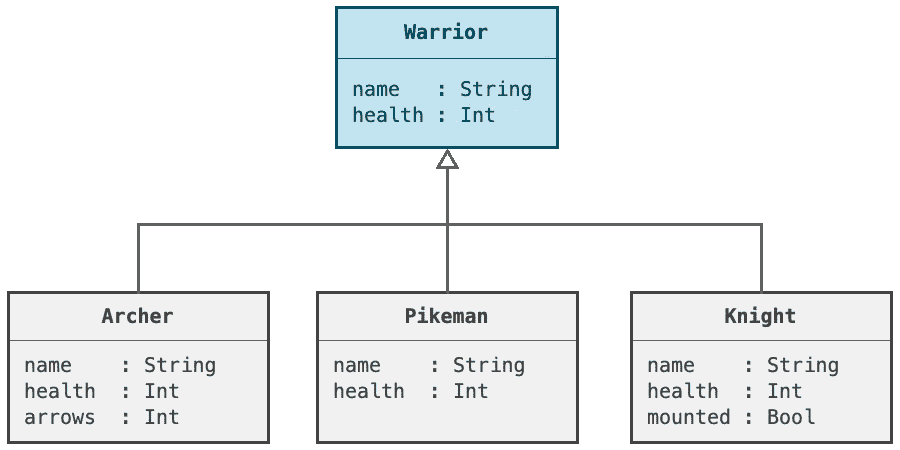
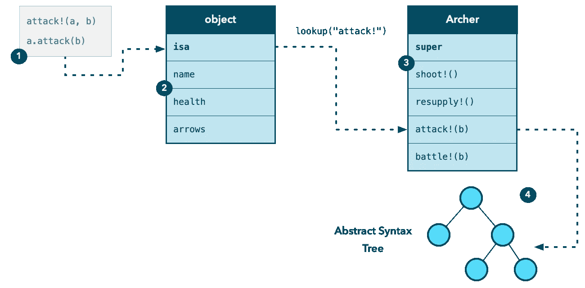
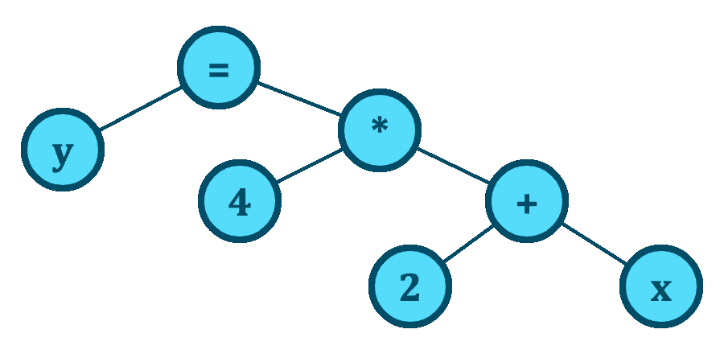
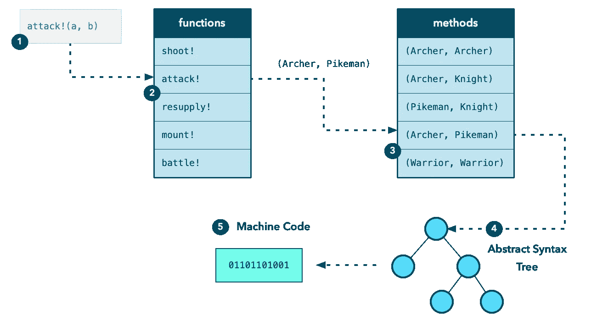
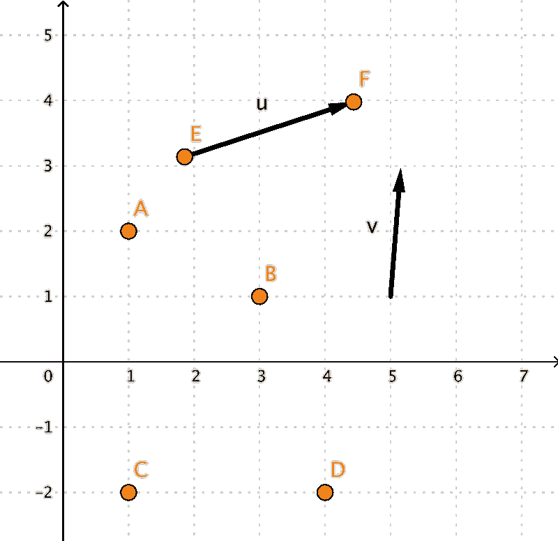

# 是什么让朱莉娅与众不同？

> 原文：<https://itnext.io/what-makes-julia-unique-f3ad184fa4a2?source=collection_archive---------0----------------------->

## 看看多重分派是如何将 Julia 与所有其他编程语言区分开来的


约翰，函数在这里，但是我们把这些方法放在哪里了？

多重分派是 Julia 编程语言的杀手锏，但不幸的是，很少有开发者听说过多重分派。很少有人知道它是什么或者它是如何工作的。这并不奇怪，因为很少有语言支持多重调度，而那些支持多重调度的语言也很好地解决了这个问题。因此，在我大谈特谈多重调度的神奇之处之前，我必须解释一下它到底是什么。我会给你一个提示:它与函数如何被调用有关，但是让我们退一步来阐述。

当一个程序运行并遇到一个函数调用时，它必须确定跳转到什么代码并执行。在 C 或 Pascal 等简单的过程编程语言中，这一过程非常简单。每一个函数都被实现为一个子程序，位于一个唯一的内存位置。调用这个函数只需要跳到子程序的内存地址，执行每一条指令，直到微处理器命中一条返回指令。

当处理函数指针时，事情变得有点棘手。我们跳转到的子例程可以在运行时改变，因为代码可以改变存储在函数指针中的子例程地址。为什么我要提到这些细节？因为我想传达一个想法，即调用一个函数并决定执行什么代码并不总是一件小事。

考虑在面向对象编程中调用方法的复杂性。

```
warrior.attack(knight)
```

成员函数`attack`与特定内存地址的子程序不对应。当在`warrior`对象上调用`attack`方法时，决定跳转到哪个子程序的复杂过程就开始了。我们必须确定是哪种战士在进行攻击。你可以想象不同战士的等级体系，比如弓箭手、枪兵和骑士。



具有不同属性和能力的不同战士类型的等级体系。

因为弓箭手的攻击不同于枪兵或骑士，所以每种类型都会不同地实现`attack`方法。通过一个叫做单个分派的过程，我们决定调用哪个方法。从一个低级的角度来看，我们试图确定在执行`warrior.attack(knight)`语句时要跳转到哪个子例程。

单一分派如何工作取决于我们处理的是动态类型语言还是静态类型语言。让我们关注它在动态类型语言中是如何工作的，因为我们要将这个过程与 Julia 进行比较，Julia 也是一种动态类型语言。

想象一下，我们有一个战士`a`攻击一个战士`b`。我们的第一步将是确定`a`是什么类型。在动态类型语言中，每个对象都知道它们是什么类型。例如，在 Objective-C 中，每个对象都有一个名为`isa`的字段，指向一个描述该对象类型的类对象。在下图中，我们假设战士`a`是`Archer`类的一个实例。`Archer`类包含每个实现方法的函数指针。为了找到正确的方法，我们在字典中查找关键字“attack！”。



如何使用动态类型语言中的单个分派来定位正确的代码执行(AST)

几个方法末尾的感叹号可能看起来很奇怪。不要担心，这只是 Lisp 和 Julia 中流行的用于变异函数的命名约定。它没有语义意义。

严格地说，在大多数动态语言中谈论函数指针是错误的。例如在 Ruby 中，你实际上并不指向任何带有机器码的子程序，而是通过解析方法产生的抽象语法树(AST)。Ruby 解释器解释 AST 来运行方法中的代码。



表达式的抽象语法树(AST ): y = 4 *(2+x)

我们刚刚讨论的被称为单个分派，因为我们基于单个对象来决定调用什么方法。对象`b`的类型不会以任何方式影响方法查找过程。相比之下，对于多重分派，函数调用中每个参数都在决定选择哪种方法中扮演着重要角色。我知道这听起来很奇怪，所以让我通过解释单一调度的问题来给你一个使用多重调度的动机。

# 多重派遣解决什么问题？

假设我们有一个用 Julia 代码编写的`battle!`函数。它通过调用`attack!`函数来模拟两个战士`a`和`b`之间的战斗，并根据结果向用户打印出消息。下面的大部分代码应该是不言自明的。在 Julia 中，我们使用`::`来分隔变量名和变量类型。因此，在代码示例中，`a::Warrior`告诉 Julia`battle!`函数有一个名为`a`的类型为`Warrior`的参数。

```
function battle!(a::Warrior, b::Warrior)
    attack!(a, b)
    if a.health == 0 && b.health == 0
        println(a.name, " and ", b.name, " destroyed each other")
    elseif a.health == 0
        println(b.name, " defeated ", a.name)
    elseif b.health == 0
        println(a.name, " defeated ", b.name)
    else
        println(b.name, " survived attack from ", a.name)
    end
end
```

看看代码，问自己一个简单的问题:类似的代码在 C++或 Java 中能工作吗？乍一看，这似乎是可能的。这两种语言都允许您定义多个同名但参数不同的函数。您可以编写类似下面的 Julia 代码:

```
function attack!(a::Archer, b::Archer)
    if a.arrows > 0
        shoot!(a)
        damage = 6 + rand(1:6)
        b.health = max(b.health - damage, 0)
    end
    a.health, b.health
end

function attack!(a::Archer, b::Knight)
    if a.arrows > 0
        shoot!(a)
        damage = rand(1:6)
        if b.mounted
            damage += 3
        end
        b.health = max(b.health - damage, 0)
    end
    a.health, b.health
end

function attack!(a::Knight, b::Knight)
    a.health = max(a.health - rand(1:6), 0)
    b.health = max(b.health - rand(1:6), 0)
    a.health, b.health
end
```

代码的细节并不重要。我希望你从这个代码示例中得到的是，我们已经定义了`attack!`三次。每个定义都接受不同类型的参数。在 C++和 Java 中，我们称这个函数为重载。在编译时，编译器将通过在调用点检查每个输入参数的类型来选择适当的函数进行调用。

更糟糕的是:C++编译器不可能猜出在`battle!`函数中调用哪个`attack!`函数，因为它*不知道*参数`a`和`b`的具体类型。编译器只知道两个参数都是`Warrior`类型的子类型。哪个子类型只能在代码实际运行时确定。这很糟糕，因为函数重载只在编译时有效。

在这种情况下，**多重分派**可以做一些*单一分派*和*函数重载*都不能做的事情:它可以在**运行时**根据参数`a`和`b`的类型选择正确的代码。

# 多重派遣的工作原理

还记得通过在运行时查找正确的方法，单个分派是如何工作的吗？多重派遣也是关于选择正确的方法。你刚才看到的`attack!`定义实际上不是函数定义，而是**方法定义**。要在 Julia 中定义一个`attack!`函数，您应该编写:

```
function attack! end
```

为什么没有争论？因为 Julia 函数没有参数，Julia 方法有参数。与面向对象的语言不同，Julia 中的方法附加在函数上，而不是类上。

因此，Julia 中的函数调用是通过首先查找哪个函数被调用来实现的。对于每个函数，Julia 都注册了一个方法表。从上到下搜索该表，以找到一个方法，该方法接受与函数调用站点提供的输入参数类型相匹配的参数类型。



Julia 如何使用多重分派来定位调用函数时要执行的正确代码。

Julia 是一种实时(JIT)编译语言，所以方法源代码通过几个步骤变成可执行的机器代码:

1.  当一个 Julia 文件被加载到内存中时，每个方法的源代码都会被解析并转换成抽象语法树(AST)。
2.  每个方法的 AST 存储在正确函数的正确方法表中。
3.  在运行时，当一个方法被定位时，我们首先获得 AST。AST 被 JIT 编译器转换成机器码，并被缓存以供以后查找。

这个过程实际上比我在这里展示的要复杂得多。你看，抽象语法树可以非常通用。它可以是为数字参数定义的计算。无论参数是 16 位无符号整数还是 32 位有符号整数，执行的计算都是相同的。然而，这些情况下的汇编代码看起来并不相同。因此，同一个 AST 可以产生几个机器码子程序。Julia 将为方法表中的每个案例添加一个条目。因此，方法表不限于您为其编写源代码的方法的数量。

# 是什么让朱莉娅多重派遣独一无二

每次在 Julia 中调用函数时，都会执行一次方法查找。或者说，从 Julia 开发者的角度来看，这就是所发生的事情。代码运行起来就好像每次都是这样。

在其他支持多分派的语言中，不会发生这种情况。只有以特殊方式标记的函数才使用多重分派。否则，将执行常规的函数调用。为什么其他语言限制使用多重分派？因为在茱莉亚出现之前，多重调度非常慢。

不难想象为什么多重调度会很慢。您可能需要在一个大表中进行线性搜索，而不是在固定时间`O(1)`内进行单个字典查找。函数可以有巨大的方法表。

朱莉娅是如何规避这个问题的？Julia 的设计思想是尽可能保持类型的稳定性。在 Python 或 JavaScript 等语言中，情况并非如此。字段和方法可以在运行时添加或删除。单个字段的类型可以改变。在 Julia 中，类型被设计得更加固定。当您定义复合类型时，您可以固定字段的数量及其类型。

设计选择如何影响多重分派？这意味着由 Julia JIT 编译器完成的代码分析变得更加容易。代码的行为变得更加可预测，这使得识别更多的情况成为可能，在这些情况下，当调用函数时应该定位的方法变得完全确定和可预测。记住，如果函数调用的参数类型保持不变，那么 Julia 将总是查找相同的方法。如果代码分析可以确定函数的哪些参数永远不会改变，那么 JIT 编译器可以用一个直接的函数调用来代替多次调度查找。如果代码很短，甚至可以内联。

因此，Julia 设法将开始时的性能劣势转变为性能优势。正因为如此，Julia 函数调用通常比面向对象语言中的单一调度调用要快得多。

一旦你变得像闪电一样快，多分派就可以在你的编码风格改变的任何地方使用。在 Julia 社区中，多分派的可用性对软件工程实践产生了深远的影响。

# 通过多次分派实现代码重用

面向对象语言的用户通过继承类和实现接口来重用代码，这允许人们将新代码插入到现有框架中。Julia 方法是在函数级重用。不同的开发人员都可以向相同的函数添加方法。我们不是扩展类，而是扩展函数。因为功能存在于较低的粒度级别，所以我们获得了更多代码重用的机会。

这种灵活性的一个简单例子是 Julia 标准库中定义的`show`函数。Julia 用它来显示不同上下文中的值。上下文可以是 REPL(交互式命令行)、笔记本或 IDE 环境。匹配以下两个签名的方法可以添加到`show`函数中:

```
show(io::IO, mime, x)
show(io::IO, x)
```

`io`对象代表显示值`x`的目标。`io`可能是控制台窗口、文件、文本字符串、套接字或图形显示。值`x`可以是简单的数字、日期、文本字符串或更复杂的对象，如字典或数组。

与面向对象的编程语言不同，您可以在多个维度上扩展显示功能。您可以为全新的`IO`子类型添加`show`方法，创建这些方法是为了在新的上下文中显示现有的值类型。假设我们创建了特殊类型来表示温度单位摄氏、华氏和开尔文。可以将方法添加到`show`中，以便用正确的单位显示代表温度的数字。

*注意，在 Julia 中，一行函数可以用等号定义。*

```
show(io::IO, t::Celsius)    = print(io, t.value, "°C")
show(io::IO, t::Fahrenheit) = print(io, t.value, "°F")
show(io::IO, t::Kelvin)     = print(io, t.value, "K")
```

为了理解为什么这种扩展机制如此强大，请允许我指出一些使用面向对象编程复制这种扩展机制时会遇到的问题。您可以设计一个系统，其中每个对象都必须实现一个`show`方法才能显示，但是这种选择会导致几个问题:

*   所有的类都必须用`show`方法继承一个基类。
*   每个对象将在每个`IO`对象类型上获得相同的表示。

请允许我详细说明:许多面向对象的系统最终都有过于复杂的基类。原因是您希望为每个对象支持如此多的功能:

*   在不同的上下文中可视化对象，例如在调试器中
*   用于打印或存储到文件的文本表示
*   哈希函数允许使用集合中的对象

例如，您可以在 Java 和 Objective-C 中找到这种模式。这种方法是僵化和不灵活的。如果你的基类设计错误，将会对所有依赖的代码产生严重的后果。

更不用说，如果语言设计者忘记添加一个`show`方法，那么就没有简单的方法来改进它。只有更新标准库才能修复它。作为第三方开发人员，您不能改造解决方案。相比之下，如果 Julia 标准库没有定义一个`show`函数，您可以很容易地自己定义它，并发布一个库来实现通用对象的可视化，您可以将它分发给其他人。



u 和 v 是矢量，A 到 F 是点。向量代表点与点之间的差异。u 是 F 点和 e 点之差。

让我们多谈谈输入输出系统的问题。假设你已经创建了一个名为`Vector2D`的 2D 矢量类型。当在控制台中使用时，您可能希望显示一个矢量作为`[4, 8]`，而如果 I/O 对象代表一个图形显示，您可能希望显示一个箭头。在 Julia 中这两种选择都是可能的，因为您可以编写一个专用的方法来处理`io`参数是图形显示而`x`参数是 2D 向量的情况。相反，面向对象语言仅限于根据`io`或`x`的类型选择一个方法来执行，而不是两者都选择。请记住，使用单个分派，运行时调用的方法是基于单个参数的类型来选择的，而不是多个参数。

当然，您可以加入一个 switch-case 语句来处理不同的类型，但是这是不可扩展的。每次添加新类型时，都必须修改 switch-case 语句。这会阻止您将代码作为可重用的库进行分发。库用户不应该修改第三方库的源代码来扩展它。

# 多重分派的效用

模拟不同类型战士之间的战斗或者制作一个 I/O 系统当然只是多分派简化编码的少数情况。它首先发现我在视频游戏中编码碰撞检测时需要这样的东西。不同的游戏对象将由不同的几何形状来表示。问题是计算两个圆，两个正方形或者一个圆和一个正方形的交点是完全不同的。你不能只看一个参数就决定使用什么算法，你需要两个参数。如果没有多次调度，您的解决方案会变得混乱。


当组合不同的几何对象时，多分派是一种自然的配合

多重分派也是任何数字工作的自然选择。对数字的运算通常是二进制的。只看第一个数的类型来确定如何组合两个数，意义不大。

简而言之，多重分派就像一把瑞士军刀:它帮助程序运行得更快，允许您优雅地解决许多问题，并为代码重用提供了一种优越的方法。这听起来可能有点夸张，但是我真的相信多重分派将会定义未来的编程范例。

# 想了解更多关于茱莉亚的事吗？

我写了许多关于朱莉娅的文章，完成了第一批关于朱莉娅的视频课程之一，并且正在出版一本关于朱莉娅的书。

*   [各种主题的 Julia 编程文章](https://medium.com/@erik-engheim/list/julia-programming-9abcaf4e756a)
*   [作为第二语言的茱莉亚](https://www.manning.com/books/julia-as-a-second-language)——我的一本书，由曼宁出版。它的目标是成为任何程序员的书，而不仅仅是具有科学或数学背景的人。
*   [Julia](https://www.packtpub.com/product/getting-started-with-julia-video/9781786462978)入门——与 Packt 一起发布的近 10 小时综合视频课程。虽然我相信它有许多有趣的主题，但自从我上了这门课以来，Julia 语法已经发生了变化。

如果你对 Medium 不感兴趣，你可以在 Substack 的 [Erik Explores](https://erikexplores.substack.com) 上关注我，在那里我写了关于 Julia 和其他编程语言的文章。