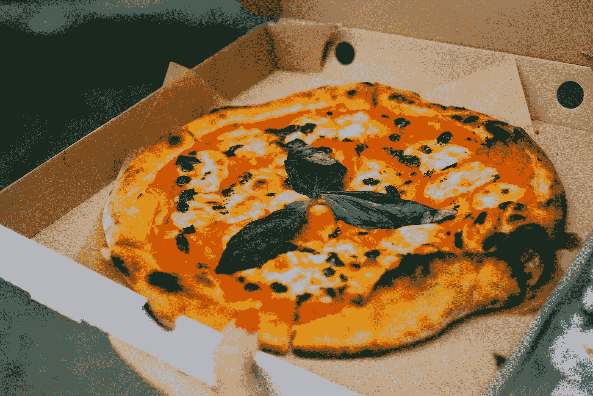

# 什么比萨饼可以教你面向对象编程

> 原文：<https://itnext.io/what-pizzas-can-teach-you-about-object-oriented-programming-3570143aef3f?source=collection_archive---------5----------------------->

[Alexandra Gorn](https://unsplash.com/@alexagorn?utm_source=medium&utm_medium=referral) 在 [Unsplash](https://unsplash.com?utm_source=medium&utm_medium=referral) 上发表的“晚餐送来的玛格丽塔披萨盒”

上周，我有机会讲授了一门名为“面向对象编程简介****和 UML 与 Java”的课程我面前有 10 名学生，来自不同的背景，年龄从 20 岁到 40 岁不等。****

**如果你正在读这篇文章，那就看你们了！免费咖啡&马里奥赛车做到了这一切。
☕️🎮**

**一个很大的挑战是找到一致的例子，用每个人都能理解的简单词汇来解释设计模式。**

**信不信由你，披萨不仅仅是食物。**

**这篇文章将引导你通过一些被广泛实现的非常有用的设计模式，用比萨饼和一个文件片段来解释。**

# ****设计模式观察器****

**经营一家披萨店并不容易，管理食物的困难之一是确保你的食物对顾客来说仍然是新鲜的。**

**在现实生活中，披萨不会告诉你它们过期了。**

**在编程中他们会。**

**`Margherita`是一个`Observable`:另一个物体可以观察到的东西。**

**`Chef`是一个`Observer`:可以观察另一个物体的物体。**

**`Margherita`可以有多个`Observer`使用`addObserver`。**

**`setChanged()`会让`notifyObservers()`发生。不使用该功能会使`notifyObservers()`完全没有作用。**

**`notifyObservers()`可以取一个常用参数来描述发生了什么样的变化。**

**`update()`用两个参数调用。修改的`Observable`实例和来自`notifyObservers()`的可选`details`参数。**

****设计模式观察者让你用低耦合和最少的样板代码让一个对象对另一个对象的变化做出反应。与前端开发类似的是 Javascript 监听器。一个 Java 用例是** `**KeyListener**` **。****

**也叫:**监听器/处理程序。****

# ****设计模式装饰器****

**经营披萨生意包括管理不同种类的披萨，如 Margherita、Marinara 等。**

**尽管如此，大多数公司还是会让你做自己定制的披萨。**

**这就是它在现实生活和编程中的工作方式。**

**`Pizza`是一个我们想要在运行时动态添加属性/方法的对象。**

**有一个基类`Pizza`保存了构造函数中给定的另一个`Pizza`和参数。**

**有子类扩展`Pizza` : `WithGarlic | WithOnions | WithPepperonis`。这些类是使用带参数的构造函数实例化的。**

**这些子类只做一件事:覆盖`cost()`函数以获得`base`成本，并在其上添加额外的成本。**

**重要的是:由于一个`Pizza`可以容纳另一个`Pizza`，后者又可以容纳另一个`Pizza`，以此类推，总成本是使用`this.base.cost()+XXX`以级联方式计算的。**

**通常有 3 种设计模式的实现**装饰器**:**

*   ****使用继承和组合**，就像我一样。从语义上讲，说一个比萨饼包含另一个比萨饼是不可思议的，但是我们在编程中，这种事情经常发生。**
*   ****使用接口:**更灵活，因为 Java 不支持多重继承，但它支持实现多重接口。从 Java 8 开始，接口可以保存默认方法来简化这个过程。我仍然相信实现应该由实际的对象来完成。还要注意，接口不能保存实例成员。**
*   **使用继承、组合和抽象类:就像我做的那样，使`Pizza`变得抽象。这将确保没有人可以写`Pizza p = new Pizza(new Pizza())`，这将是一个完全的废话，因为只能有一个非常基础。**

**每种实现都有优点和缺点，但我认为我提供的这种实现绝对是最简单易懂的。**

**看看在线教程是如何设计的，我认为有太多复杂的样板代码，一个完全的初学者可能会感到吃力。**

****Design Pattern Decorator 允许你在运行时动态地给一个对象添加属性和功能，不需要使用大的 if-else 语句，也不需要改变基类的行为。一个 Java 用例是** `**IO with InputStream | BufferedInputStream | FileInputStream, etc**`**

**我希望这篇文章对你有价值，并帮助你理解那些简单而常用的设计模式。**

**比萨饼在解释编程方面非常有用，就像具体的例子有助于理解概念性的概念一样。**

**在课堂上，我很愉快地解释了这两种设计模式，并用冰淇淋和游戏角色来说明。**

**想知道如何运行我的片段？使用这个[在线 Java 编译器](https://www.tutorialspoint.com/compile_java_online.php)**

# **感谢阅读**

**我的文章源于你的掌声和鼓励。**

**我正在尽最大努力保持每周一篇文章，如果你没有那么多读者来告诉我什么是好的/糟糕的，我就不会在那里了。**

**这是我最新的故事:**

** [## 塑造现代:我用代码手工设计名片的小小旅程

### 我想制作自己的名片，作为一个半瞎的猴子，我负担不起使用 Photoshop 或 Sketch 来…

itnext.io](/shaping-modern-age-my-tiny-journey-designing-a-business-card-with-code-by-hand-59ceeb271427) 

请随时联系 **david.mellul@outlook** 。 **fr** 。

[吴仪](https://unsplash.com/@takeshi2?utm_source=medium&utm_medium=referral)在 [Unsplash](https://unsplash.com?utm_source=medium&utm_medium=referral) 上的《白色马克杯里的卡布奇诺，白色泡沫艺术在木桌上》**