# 什么…国家机器

> 原文：<https://itnext.io/what-the-state-machine-96189764567e?source=collection_archive---------3----------------------->

当您开始使用案例管理时，熟悉一些术语是很有用的。我已经决定，今年我要做研究，尽可能简单地解释这些概念。然后，当我们实现它时，我将把它与案例管理框架联系起来。而我会一路评估是否值得。

(当然，你不需要读完整本书，如果你想在刚刚学会这个概念后挖掘出来，我没问题。或者，如果您只想了解状态机的案例管理框架版本，请跳到*那么您是如何实现这个案例管理框架的呢？*

今天…我们将谈论状态机。

**状态机**

状态机是一组状态以及它们之间所有可能的转换。这听起来不像是革命性的，但也算是吧。如果你习惯于编程顺序进程，你可能会想:“那有什么用？状态转换自然会从过程中产生。”

但问题是，状态机不仅是一种记住哪些状态转换是可能的方法，也是一种将状态与导致状态转换的事件分开的方法。这非常方便，因为它将你的项目分解成更小的块。你不需要理解整个过程，你只需要知道案件如何发展到一个特定的状态，以及当它发展到那个状态时会发生什么。

状态机方法如下:

1.  你定义各州
2.  您定义了这些状态之间的潜在转换
3.  您对是否需要进行这样的转换进行评估
4.  神奇！

让我们举一个荷兰的好例子:

如果你把你的自行车带到商店，它会以“坏了”开始，这是我们的初始状态。你只能有一个初始状态。坏了的自行车可能修好了，或者判断无法修复了，这是两种后续状态。自行车修好后，你将进入付款过程，这将有潜在的阶段，如“已付款”、“付款期限已过”和“债务出售”。到目前为止，它非常简单，你可以很容易地在 BPT 把它模拟成这样:

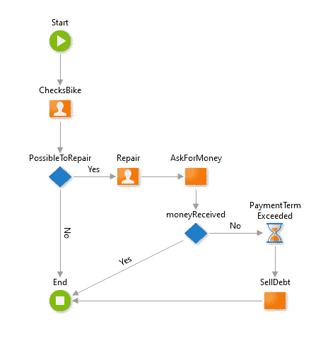

(快速注意，我在这里放置计时器的方式是为了说明的目的，如果您真正实现它，它会略有不同，但我想保持我的说明简单。在本文的这一部分，我将保持事情的简单性，甚至不惜牺牲准确性。)

现在说，这是一个非常年轻的自行车店，他们只做了一些维修，并希望能够扩展和调整这一进程，因为他们的增长。在这种情况下，采用一种以更松散耦合的方式建模的建模方法可能是有用的。在一个连续的过程中做出改变意味着你需要审视你的部分与过程中所有其他部分的交互方式。你可能无法预见所有的后果。

在状态机中，事物之间的联系并不那么紧密，因此这是一种使您能够构建不那么严格的流程的方法。你可能不知道自行车从进店到出店的路径，但你知道它可能经过的一些状态。随着商店的扩张和增加更多的服务，你将调整模型。

那么自行车修理是如何在状态机中建模的呢？

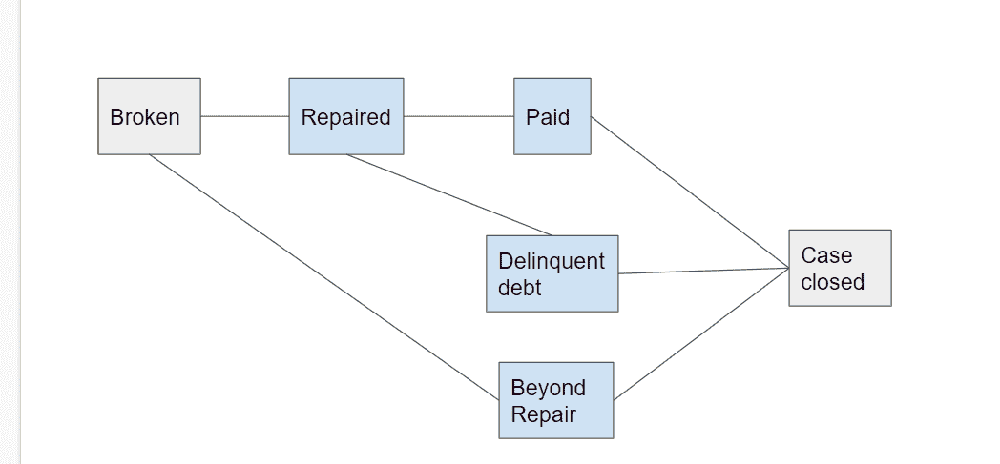

在状态机中，状态之间的每次转换都是由一个事件触发的。如果一辆曾经坏了的自行车被修理工修好了，这个事件就是使它进入“已修复”状态的原因。达到已修复状态是触发付款期限时钟开始倒计时的事件，而时钟耗尽是将自行车移动到拖欠债务状态的事件，除非债务被付清。

为了扩展这一点，我们可以添加一个“无容量状态”,当一辆新的坏自行车进入商店并且没有可用时，该状态会自动设置。然后，当雇佣了新的修理工并且可用能力超过正常能力 20%时，最近被拒绝的维修可能会自动转移到“能力现在可用”状态，并收到他们最终可以进来的电子邮件。或者，如果我们在组织中添加一个将债务人纳入付款计划的财务部门，我们将为付款计划添加一个状态，并添加一个从拖欠债务到付款计划的转换。也许当人们开始拖欠付款计划时，也是一个过渡。

一旦我们有了基本的设置，添加新的状态，新的转换和新的逻辑是一个相对较小和独立的工作。我们本质上开始创建随着组织和人的发展而发展的自然过程，而不是预先制定一套严格的过程。

因此，设置状态机可以使您的案例管理更加灵活。

(现在事情要变得技术化了，所以如果你不喜欢，请跳到**“值得吗？**”)

**那么，您如何利用案例管理框架做到这一点呢？**

为了进行设置，我们需要执行以下操作:

1.  设置具有业务实体和业务流程的应用程序
2.  建立一个状态机
3.  使用状态机来创建我们的应用程序

我们走吧！

对于 MVP，我们将暂时避免所有的自动化，一切都基于人的交互。

我们首先为维修请求建立一个业务实体，制定一个相关的业务流程，并根据本教程[配置案例定义和案例状态。](https://success.outsystems.com/Documentation/Case_Management/Set_up_a_case_management_app)

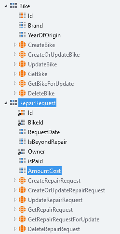

现在可以随意忘记那个业务流程，当它变得相关时我会告诉你！然后，我们使用本教程中的[将允许的状态转换添加到模型中。](https://success.outsystems.com/Documentation/Case_Management/Case_state_machine) 我已经用这些教程制作了一个自举动作的截图。它用我们的状态机的正确信息填充元数据数据库表。

(如果您不明白我的意思，请阅读[“什么……案例管理框架”](https://medium.com/@sezen.debruijn/what-the-case-management-framework-780e94c026a0)。)

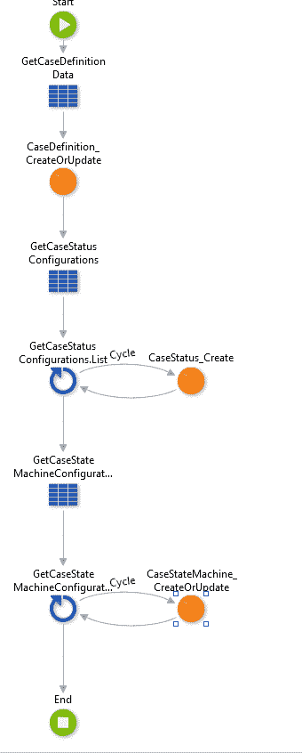

发布配置模块以触发引导操作后，我们将构建一个操作，通过该操作我们可以创建修复请求。正如您在屏幕截图中看到的，此操作首先从初始化案例开始，这样我们就可以使用其 id 来提出维修请求。这样，数据和业务流程将被链接在一起。

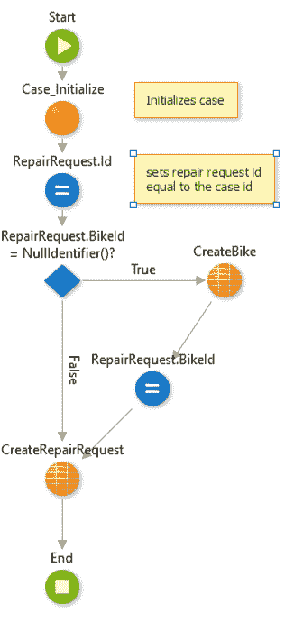

现在是构建 UI 的时候了。

我们将基于修复请求实体搭建两个简单的屏幕。详细信息屏幕中的“保存”按钮将替换为我们针对维修请求的新创建操作，以便我们在创建请求时启动案例。
我们还添加了一个 DataAction 来获取基于 RepairRequestID 的可能状态。为此，我们将使用案例管理框架的 Case_GetAllPossibleStatus，您可以在 CaseServices_API 中找到它。

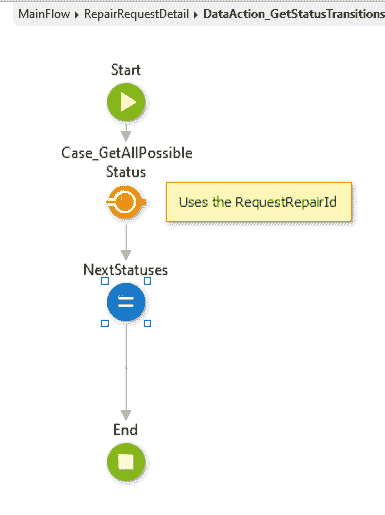

为了测试我们的状态机是否正常工作，我们现在将在连接到 DataAction 的屏幕中添加一个列表元素。在列表元素中，我们将添加一个按钮元素，标签为 StatusName。

onclick 操作调用 Case_UpdateStatus 操作，该操作使用 RepairRequestId 和 CaseStatusId 更新案例的状态，然后刷新数据操作。

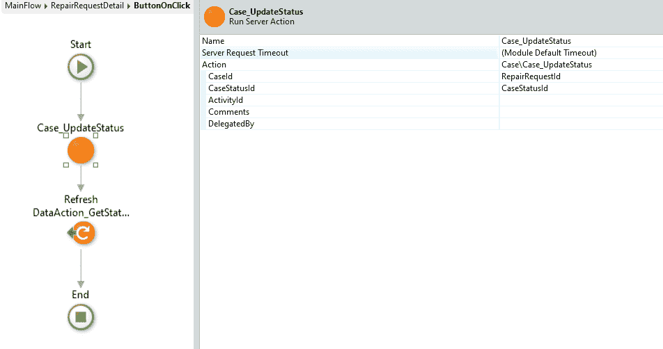

现在我们将通过创建一个请求然后打开它来进行测试。我们可以在“被盗”、“已修复”和“无法修复”之间做出选择。

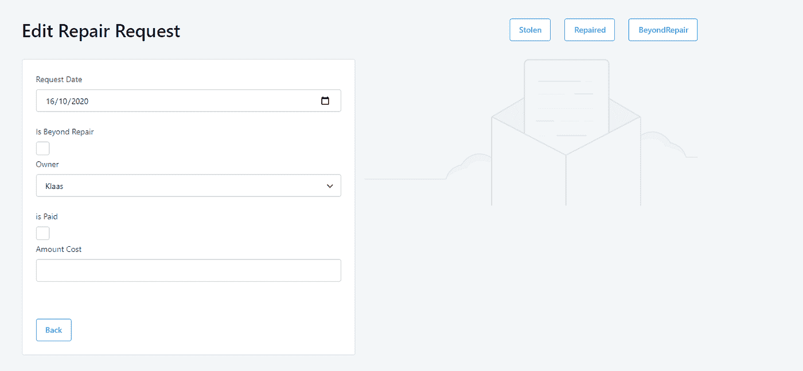

点击已修复，我们现在得到新的选项，即“被盗”，“拖欠债务”和“已支付”。这将一直工作，直到我们到达终端状态“结案”，因为这个状态自然没有任何后续状态。

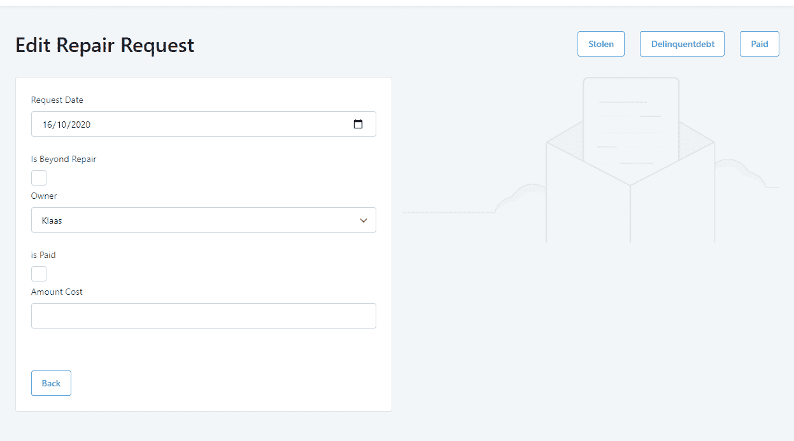

我们已经成功地实现了一个低级状态机。现在让我们去添加一些自动化！

让我们自动化

还记得我们在整个实施开始时创建的流程，该流程与案例相关联，但很快就被遗忘了吗？是时候让这一切变得有意义了！

对于这个实现，我将使用一个初级模式，我称之为星型模式。星形的核心是检查哪些状态转换是可能的逻辑。对于可能的转换，可能需要启动自动或人工活动来检查是否满足转换条件。这些活动形成了星的点，当它们被执行时，它们将指向回心脏。

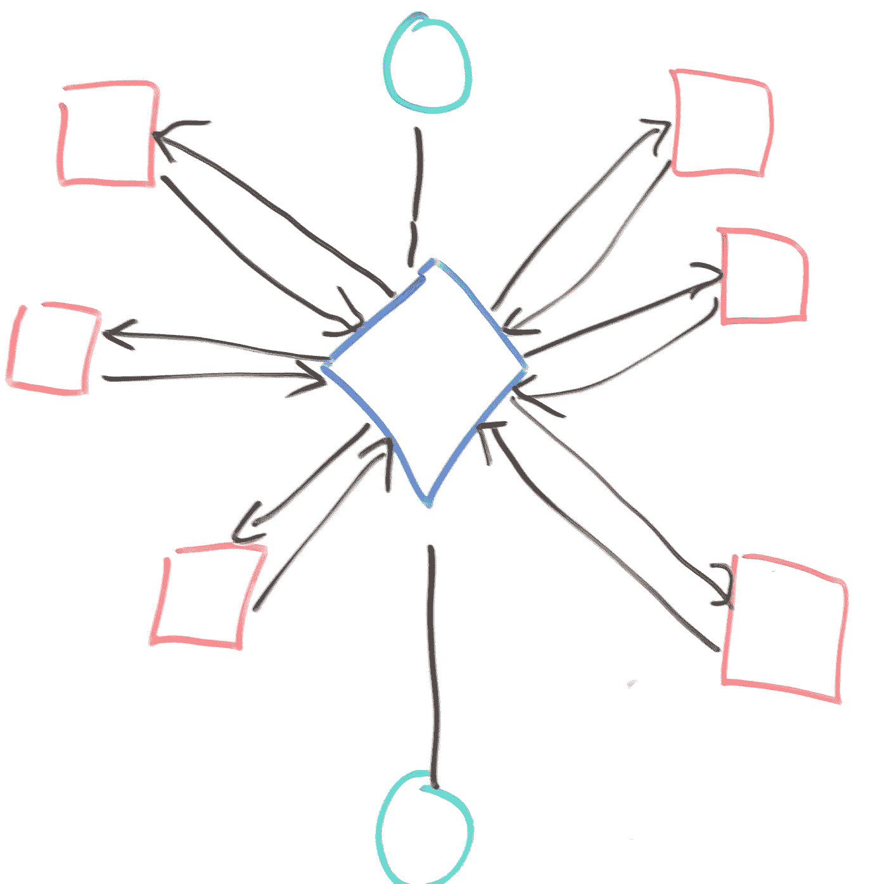

在我们的自行车商店中，星星的中心是一个名为“下一个状态”的决策点。该决策的目标是根据潜在的后续状态和其他信息，确定接下来应该采取的行动。

因为我们的自行车商店示例非常简单，所以我们将只关注允许的后续状态。因此，首先我们使用 Case_CetAllPossibleStatus 操作来获取潜在后续状态的列表，就像我们在屏幕上所做的那样。然后，我们将循环遍历该列表，并在切换中检查可能的下一个状态是已修复还是已修复。如果是这样，我们将连接到一个名为 RepairJob 的决策结果。RepairJob 是一个动作，它将检查这些状态中的哪一个是合适的下一阶段。

如果潜在的下一阶段是付款或拖欠债务，我们将连接到 PaymentTermStarts 决策结果。(见正下图。)

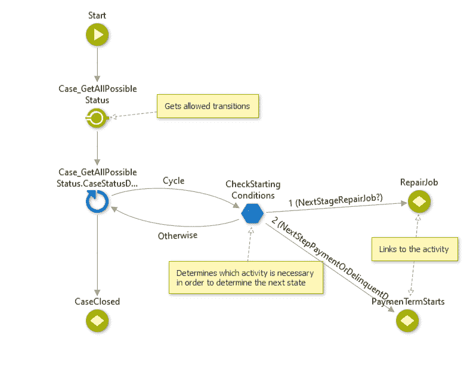

还记得状态机只是一组状态和在这些状态间转换的方法吗？

这部分逻辑的要点只是查看发生了哪些潜在的转换，然后创建一个新的活动来评估哪个状态应该是下一个状态。请允许我热情洋溢地讲述这种方法的美妙之处:

如果你以一种连续的方式思考，你将会看到一个过程大部分是一组自动的和/或人工的活动连接在一起，偶尔会导致状态的改变。状态只是为了让人们清楚进程的状态。当构建一个国家机器时，改变你的视角是很重要的。在状态机中，流程是一组状态，活动只是用来确定应该发生哪种状态转换。

在状态机中，活动的重要性仅在于它们能够实现准确的状态转换。它们本身完全不重要。

说到这里，现在让我们花一半的时间讨论活动…🙃

在下一节中，我们将了解三种活动以及它们如何帮助实现状态之间的转换:

1.  修理工作
2.  付款期限开始
3.  结案了

**维修工作**

当我们需要决定是过渡到已修复阶段还是 BeyondRepair 阶段时，修复作业活动将会启动。它是一个名为“RepairTask”的人工活动，并在具有 RepairRequestId 的 RepairRequest 被更新时关闭。

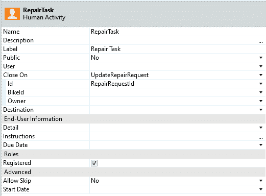

检验自行车的实际人工任务决定了两个可能的转换中的哪一个发生。如果自行车已修理，则案例从“损坏”状态转换为“已修理”状态。如果自行车无法维修，案例将从“损坏”状态转换为“无法维修”状态。应用程序实际上无法读取修理工的想法(目前还不行！)，所以对于我们的目的来说，决定这个转换的人工任务实际上是更新维修请求记录的操作。

此更新会关闭人工活动，并且活动的关闭会触发一个在此活动关闭时运行的操作。“关闭时”操作从数据库中获取修复请求，检查它是否设置为 Beyondrepair，并根据此信息更新状态，如下所示:

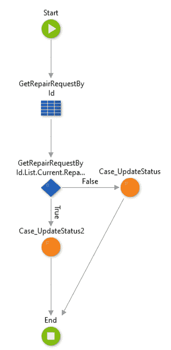

在此操作运行之后，我们返回到下一个状态决策，以确定接下来应该发生什么。

**付款期限开始**

当下一个状态转换为“拖欠债务”或“已支付”时，WaitTillPaymentTermRunsOut 活动启动，以确定应该发生哪种情况。WaitTillPaymenTermsRunOut 活动是一个计时器，它在收到修复请求的更新或 5 天后超时时关闭。

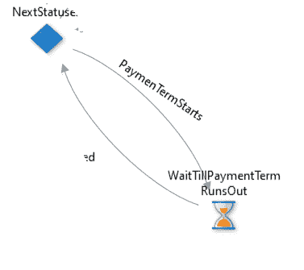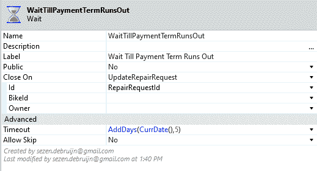

当它关闭时，会运行一个动作来判断时间是否结束或付款是否收到。与前面的操作一样，它从数据库的维修请求中获取数据，检查账单是否已支付，并相应地更新状态。

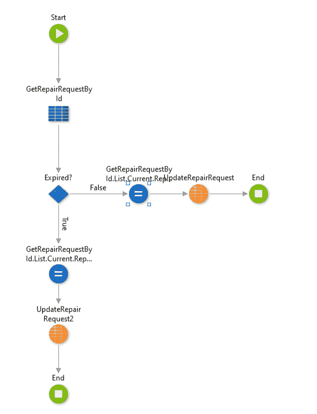

此操作运行后，流程将返回到下一个状态步骤。

**结案**

这是我们最后的活动。结案是唯一一个我们不需要满足任何条件的。我们通过未能满足任何其他结果的标准来达到这个活动。

当我们到达这里时，我们执行的活动是最终的状态转换。我们只需将状态更新为已结案。

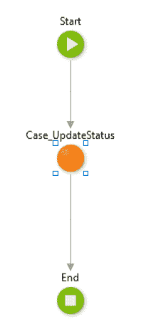

这样我们就有了一个全自动的轻量级状态机，如下所示:

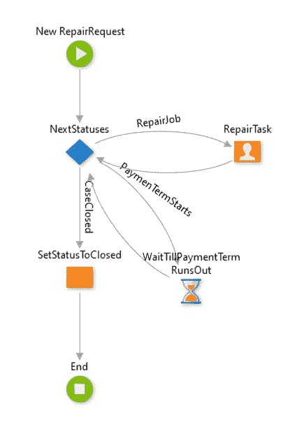

**这值得吗？**

既然我们已经制造出了我们的国家机器，你可能会怀疑所有这些努力是否值得。为什么要在一个可以用简单的 BPT 过程完美构建的应用程序上走这么长的弯路呢？

如果你是这么想的:很好！这是您在构建自己的状态机或任何 CMF 应用程序之前应该问自己的问题。如果你能走一条比这更容易的路，这可能就是正确的解决方案。

在这种情况下，我们看到了状态机方法的一些好处:在应用程序中添加新功能变得更加容易。为此，我们只需将状态和转换添加到数据库中，将其添加到决策的评估中，以查看我们是否需要执行相关活动并构建相关活动。我们不需要弄清楚这在已经存在的顺序过程中的确切位置。在这里，我们也有一个更简单的方法来调整流程，因为我们现在有一个状态产生状态的情况。想让你花时间检查自行车的钱成为可能，即使你已经判断自行车无法修理了？

只需将从“无法修复”到“结案”的过渡转换为从“无法修复”到“已支付”或“拖欠债务”的过渡，您将自动进入下一步的计时器。

作为一个小测试，我实现了一个等待列表机制，如果我们已经满员了，我们就把自行车放在等待列表上。整个实现花了半个小时，而且做起来非常简单，因为状态机方法严重限制了影响。我只需要稍微扩展一下修复作业中的状态转换条件。

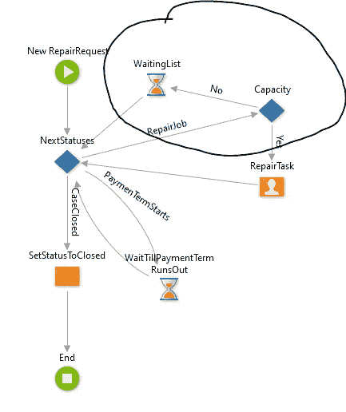

最后，这也是走向动态过程的一种方式。在状态机中，您可以对其进行建模，以便案例可以切换到完全不同的状态，而您通常不会在顺序流程中连接这些状态。这允许您构建更像人类那样工作的应用程序。

这就是状态机方法的好处。

然而，设置案例已经花了一些时间，然后我们必须实际建模我们想要使用的状态转换。这比我用简单的连续过程做同样的事情要花费更多的时间。

因此，这是否值得，在一定程度上取决于我们的自行车店是否会改进他们的流程，并超越我们目前的流程。如果他们想做的只是这个简单的流程，那么业务流程就已经足够了。

但是，如果他们预期在他们的过程中有很多变化或增长，状态机可能会帮助他们。

**一些最后的想法。**

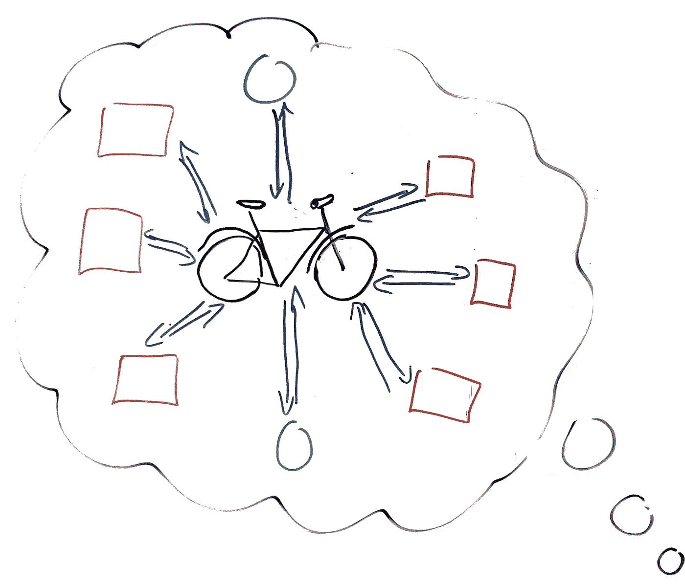

对我来说，状态机是一种有趣的建模方法。通过把国家放在首位并使活动从属于它们，我们把重点放在进程的目标上，而不是放在我们实现目标的方式上。

这是一个哲学上有趣的思维转变，可能会让我们赢回对其工作方式的一些控制。我经常看到人们为一个制度化的过程服务，而不是过程为人们服务。国家机器可以通过将焦点转移到目标而不是活动上来帮助解决这个问题，并避免一条严格规划的道路。

尽管如此，我认为仍然可以用状态机构建令人讨厌的流程，或者使用顺序设计方法构建自然的流程。状态机不会是您工具箱中的唯一工具，也不会解决您的所有问题，但它仍然是一个有趣的工具。