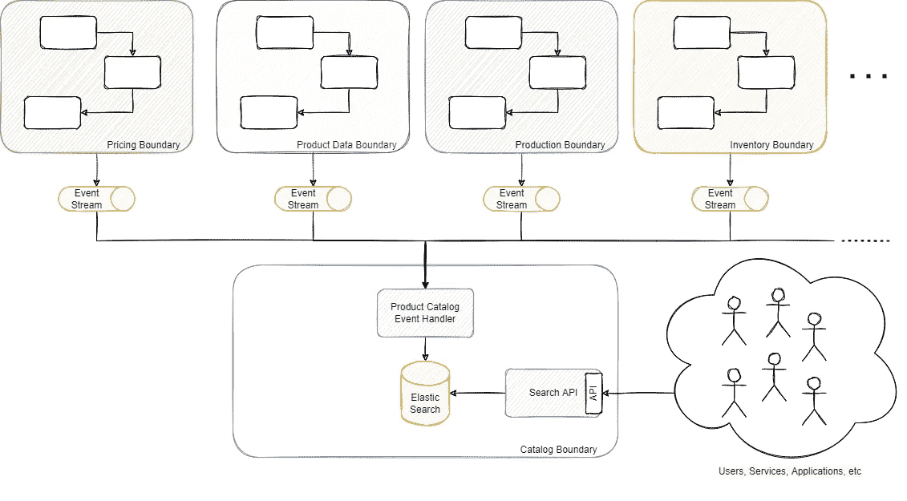
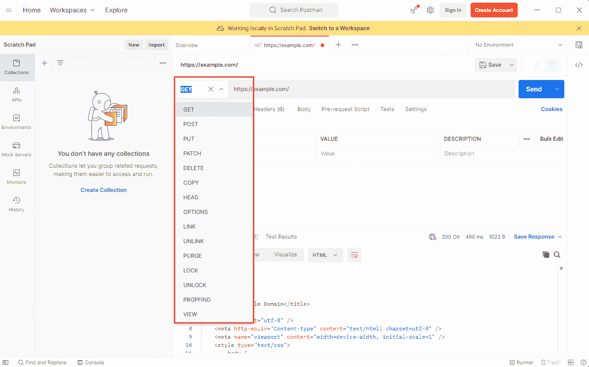
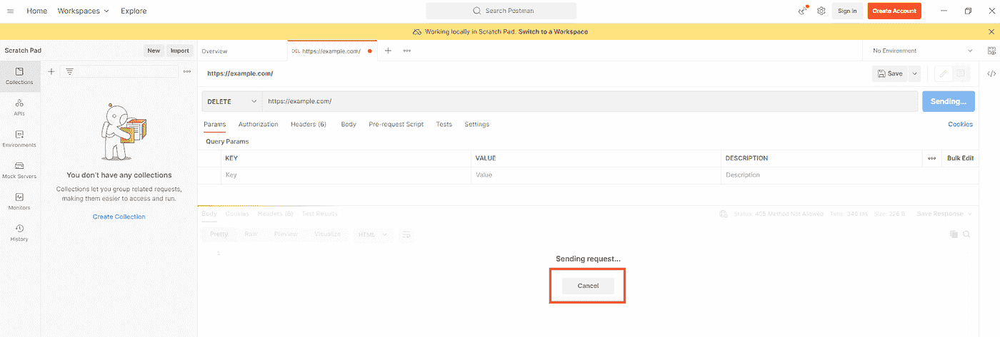
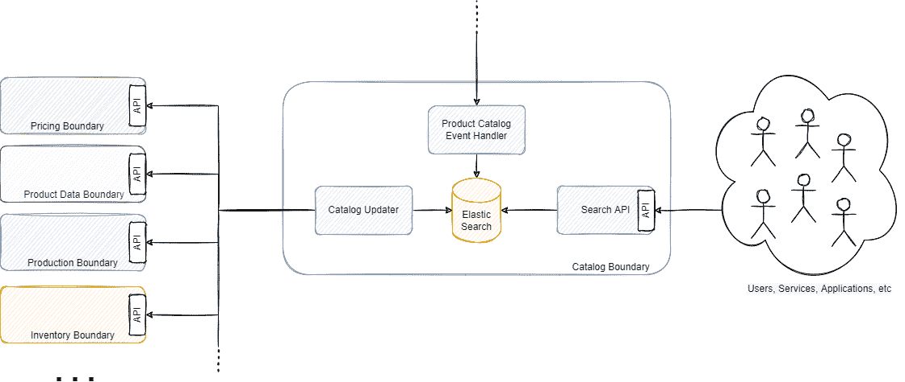

# 在我错误地删除了主生产数据库之后，我们了解到

> 原文：<https://itnext.io/what-we-learned-after-i-deleted-the-main-production-database-by-mistake-13c0a5815de5?source=collection_archive---------0----------------------->

图片来自 [Dev Asangbam](https://unsplash.com/@devasangbam) (Unsplash)

“好吧，去你妈的……”我一边等老板接电话，一边心里想。我敢肯定，他在周五早上想听到的只是他的一位高级领导误手动删除了一个主要的后勤数据库。

电话的来电铃声听起来就像医院心脏监测仪上我职业生涯的垂死心跳。在这些时刻，一盏鼓舞人心的领导明灯会真正发挥作用。喜欢我老板的第一句话；“怎么会这样混账？!"。

好吧，让我告诉你怎么做:

# 一点背景知识

这发生在几年前，我在一家相当新的电子商务公司工作，目前领导着两个团队，负责开发几个核心后台功能。由不同团队维护的后台管理信息暴露在可供全球用户使用的前端中。尽管是一家相对较新的公司，但它已经覆盖全球，拥有数十万用户群。

我的一个团队开发了主要的后勤产品目录，该目录支持大多数后勤流程和工具，从库存和产品信息管理到订单执行流程，等等。它是一个相当重要的组件，因为大多数后勤服务、应用程序和业务流程都以这样或那样的方式访问它。你可以从下面的图表中有所了解:

非正规化读取模型的简化架构

该平台由一个微服务架构组成，产品目录是一个读取模型，其中包含从多个不同领域的事件流构建的非规范化信息，由其他微服务管理。产品目录由 ElasticSearch 数据库支持，该数据库包含 1700 万种产品，信息范围包括产品元数据、库存、生产信息、可用性、定价等。在 REST API 中公开。我们使用 ElasticSearch 主要是因为过滤器的数量和多样性(超过 50 种不同的过滤器，有些带有文本搜索)。

# 非常简短的弹性搜索背景

没有人能够以任何技术直接写访问任何数据库(我们根据用例使用了几种技术，从 SQL Server 到 MongoDB 和 Cassandra)。然而，ElasticSearch 是个例外，因为它传统上是由工程团队而不是基础架构或数据库管理员管理的。

与其他数据库技术不同，ElasticSearch 是通过 REST 接口访问的。通常，URL 具有以下格式(当时我们使用的是 ElasticSearch 第 5 版):

> *{* ***群集 _ 端点*** *}/{* ***索引 _ 名称****}/{****类型****}/{****文档 _id}***
> 
> (例如:elastic.com/productIndex/product/152474145)

在较新的版本中，*类型*被删除。

任何类型的操作都是通过 HTTP 调用来完成的，否则你会用 SQL 脚本来完成，在 ElasticSearch 中，你会做一个 HTTP 请求。例如，遵循 REST 指南，如果您有一个产品目录索引(ElasticSearch 中的索引或多或少相当于 SQL 表)，并且您想要获取特定的产品，您将执行 GET elastic.com/productIndex/product/152474145.。相同的端点将用于使用 PUT 或 PATCH 更新该产品，使用 delete 删除它，或者使用 POST 或 PUT 创建它。这同样可以应用到 URL 的不同部分，一个对 elastic.com/productIndex/product 的获取将得到类型信息，同样可以创建、删除或更新类型。同样的事情发生在 elastic.com/productIndex 获得索引信息，更新，删除或创建索引。

# 契约

那是一个普通的星期五，像大多数日子一样，从一个会议跑到另一个会议。在会议间隙的短暂时间里，我通常会挤出一些临时任务，比如帮助解决困难的问题或团队没有自主权的任务。在这种情况下，有一个业务请求要用 API 中没有的过滤器导出一些数据，这不是一个典型的操作，但是考虑到主题的业务紧迫性和影响，我们决定伸出援手。

在下一次会议之前的 15 分钟内，我迅速与我的一名高级成员一起快速访问现场环境并执行查询。由于对 ElasticSearch 的直接访问本质上是一个 REST API，我们通常使用 Postman 来完成请求。

我的同事通过远程屏幕共享提供了帮助。我经常做的一个实践是对任何实时操作进行某种形式的实时代码审查。首先，我想测试连接性以确保我有正确的 URL，所以我复制了活动端点和索引名称(类似于我们在上面讨论的 cluster_endpoint/index_name ),并提交了一个 GET 请求。如果您熟悉 Postman 界面，您可能还记得您从下拉列表中选择了 HTTP 操作:

选择 HTTP 操作的邮递员接口

不幸的是，令我惊恐的是，在我提交请求后，我注意到 DELETE 操作被选中了，而不是 GET。我没有检索索引信息，而是直接删除了它。

这个请求过了几秒钟才得到确认，我立即按下了取消。取消操作立即成功。一丝希望在我心中绽放，就像一棵垂死的树的最后一片叶子。我天真地想，也许我及时取消了请求。

在邮递员接口上取消请求的可能性

很快就被理性之风吹走了，理性意识到尽管请求在客户端(邮递员)被取消了，但请求仍然会在服务器端(在 ElasticSearch 中)继续。我对索引进行了常规搜索，没有使用过滤器来确认总计数，一个通常会返回 1700 万次点击的查询返回了几百次(服务每秒消耗大约 70 个事件，这几百次是同时创建/编辑的产品)。

就这样，主要的 backoffice 产品目录被永久删除了，其中包括 1700 万个产品的非规范化视图，以及来自整个平台上几十个微服务的信息，还有我的自尊。

# 我们走运的地方

我打电话给我的老板，我们很快成立了一个作战室，因为其他地区都开始报告问题。因为它本质上是一个读取模型，它不是任何特定信息的真实来源，所以我们必须从所有其他服务中获取信息。

我们有几个选择:

当发生重大变化时，ElasticSearch 没有办法进化模式。该策略基本上是将所有信息重新编入一个新的索引。为了解决这些情况，我们有一个组件，通过同步 REST APIs 从每个其他微服务获取数据，从头开始构建每个产品。这也有助于解决由于上游服务中的错误或任何事件而导致的一致性问题。但是，获取全部 1700 万件产品的所有数据需要 6 天时间。不管怎样，我们马上开始跑。

目录更新程序的体系结构—重建目录的组件

我们缓解这个问题的另一个选择是利用事件流。大多数服务都具有在需要时重新发布事件的功能，因此我们还请求最关键的区域开始重放数据，这些数据将与正常使用相关的更改一起被消耗。

然而，我们真正幸运的地方是几天前我们不得不在模式上做了一个突破性的改变。正如我们之前所讨论的，要做到这一点，我们必须创建一个新的索引版本并重新索引所有信息。这是一个漫长的过程，在运行两个版本的同时，用最新的更改进行更新。几天前我们对旧的索引进行了分解，需要重大改变的新功能并不重要，所以我们只是把它改成了旧版本。数据有几天的延迟，但没有什么重要的。我们讨论的另外两个过程最终使一切都更新了。

# 我们学到了什么

## 备份与重建速度

一个关于备份需求的老话题出现了。我们备份了大多数数据库，但没有为 ElasticSearch 数据库实施任何流程。此外，该数据库是一个读取模型，根据定义，它不是任何事情的真实来源。理论上，读取模型不应该有备份，它们应该足够快地重建，在发生重大事件时不会造成任何影响或影响极小。由于读取模型通常具有从其他地方推断的信息，因此它们是否补偿了维护定期备份的相关货币成本是有争议的。但在实践中，在一个没有可感知影响的时间框架内重建一个模型，说起来容易做起来难。重建包含数百或数千条记录的读取模型应该不成问题。然而，一个拥有来自几十个不同来源的几百万条信息的人就完全是另一回事了。

我们最终得到了两者的混合。我们重构了流程，从 6 天缩短到了几个小时。但是，由于组件的重要性，几个小时的不可用仍然会产生重大影响，特别是在特定的时间段(例如销售季节)。我们有几个选择来进一步减少时间，但它开始感觉像过度工程，并产生了大量额外的基础架构成本。因此，我们决定在风险较高时也包括备份，例如在销售季节或其他业务关键时期。

## 水平可伸缩性是一个谎言

拥有微服务最广为人知的优势之一是水平扩展的能力。通常不明显的细节是，仅仅依靠同步 API(如图 4 所示)，水平可伸缩性很快就变成了谬论。负责重建读取模型的组件花了 6 天时间才完成，但是理论上，我们可以通过水平缩放来将时间减少几个数量级。事实是，它依赖同步 REST APIs 来检索信息。它通过 REST 请求从每个其他微服务请求数据，构建非规范化视图，并持久化状态。扩展它会触发对其他服务的大量请求，这些服务没有准备好处理相当大的额外负载，并且需要自己扩展。这将引发连锁反应，最终将整个平台置于危险之中。此外，他们中的大多数都非常依赖于数据库，他们的数据库也需要扩展。

我们确实扩大了规模，但保守估计，即便如此，随着其他服务开始陷入困境，影响也开始显现。回头看，整个事情开始看起来更像一个整体，而不是一个真正解耦的架构。而是分散的，这更糟，以各种可能的方式。

当重构组件时，我们采取了一种不同的方法，仅仅依赖于事件流，事件流有其自身的挑战，但给系统注入了真正解耦的性质。扩展组件只会影响其资源，并使设计能够真正水平扩展。一个常见的设计挑战是事件应该更大还是更小(我之前在本文的[中详细介绍了这个主题)，通常更大的读取模型更好，这取决于用例。我们应用的一个有趣的策略是使用 Kafka 压缩主题的文档，这在速度和伸缩能力方面都有很大帮助(我将在即将到来的](https://medium.com/@hugo.oliveira.rocha/handling-eventual-consistency-11324324aec4)[文章](https://medium.com/@hugo.oliveira.rocha/membership)中详细介绍这个主题的技术实现，以免这个主题过于宽泛)。这种方法实现了重建策略从批处理到流处理的转变。与通过 HTTP 请求来请求数据不同，数据在事件流上很容易获得，这要快得多，因为它享有较低的网络延迟，并且不依赖于从数据库获取数据的中间服务；仅在事件流上。此外，事件流真正的解耦特性使得整个流程真正实现了水平伸缩，而不用担心对其他服务的意外影响。

## 基于角色的访问

我们采取的最明显的行动之一是实现基于角色的访问控制。我们使用的是旧版本的 ElasticSearch，只允许非常基本的用户认证，选项是使用 XPack，该版本是付费的。在最近的版本中，XPack 已经包含在一个免费许可证中。

我们确实迁移到了一个更新的 ElasticSearch 版本(版本 7 ),并实现了不同的读写角色。最后，应该只有应用程序能够定期直接写入数据库，用户可能能够(最多)读取。

## 该受责备的是过程，而不是人

当出现问题时，我总是告诉我的团队一句常见的话，作为一个通用的指导原则，是过程而不是人应该受到责备。我们需要了解流程的哪个部分失败了，并找到改变它的方法，以便我们或其他任何人，新员工或经验丰富的员工，永远不会再犯同样的错误。

这是我真正相信的事情，也是我领导和处理事件的方式。虽然这并没有阻止我觉得自己是个彻头彻尾的白痴，而且在事情发生多年后的今天，听起来仍然像是在找借口，但在内心深处，这背后的理性是健全的。我们改变了访问实时数据的方式，因为任何人都不应该有直接写入权限。即使对于读取访问，也开始高度避免，因为恶意查询会对资源产生可怕的影响，特别是在 ElasticSearch 中，复杂的查询(例如高度深度分页)可能会使集群崩溃(例如客户端节点内存不足)。这并不意味着限制团队的自主权，而是为了保护人们不做错事。

特别的请求被传递给管理这些请求的现场工程团队，理想情况下没有直接的数据库访问。手动重复任务被集成到相应的服务功能中，并通过应用层进行适当验证，从而防止不必要的删除或大量查询。总的来说，最重要的是保证人们有办法做好自己的工作，用适当的工具，最重要的是，以可持续和安全的方式来响应业务请求。

# 最后的话

我总是读到这类问题，但我总是确信它们永远不会发生在我身上。“*我有一个过程*”——我天真地以为，“*我不会对这种行动掉以轻心*”。有时候，只需要一瞬间，分神的一瞬间就能留下无法弥补的伤害。这一经历让我永远感到谦卑，这是一个警示故事，我有时会告诉我的团队，有时他们的老板也会犯最严重的错误，最终的过程是保护我们免受自己和我们永恒的愚蠢的伤害。

你可以在 https://medium.com/@hugo.oliveira.rocha/的[查看我的其他文章](https://medium.com/@hugo.oliveira.rocha/)

 [## 通过我的推荐链接加入 Medium—Hugo Rocha

### 作为一个媒体会员，你的会员费的一部分会给你阅读的作家，你可以完全接触到每一个故事…

medium.com](https://medium.com/@hugo.oliveira.rocha/membership)