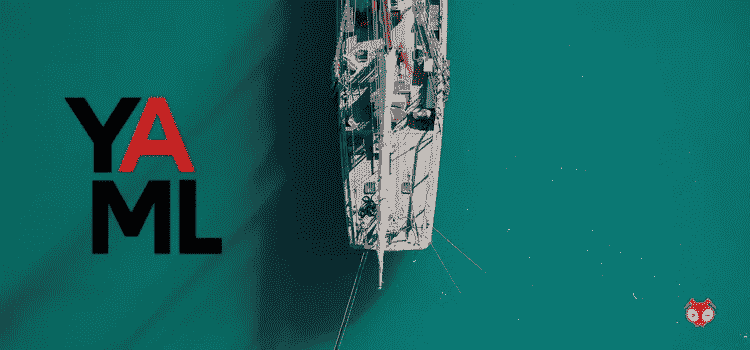

# 你所 YAML 的就是你所得到的——不用舵柄而用舵

> 原文：<https://itnext.io/what-you-yaml-is-what-you-get-using-helm-without-tiller-d0eedcd7b1a5?source=collection_archive---------6----------------------->

当开始使用 Kubernetes 时，学习如何编写清单并将它们带到 apiserver 通常是第一步。最有可能的是`kubectl apply`是这个命令。

这里的好处是，您想要在集群上运行的所有东西都被精确地描述了，并且您可以很容易地检查什么将被发送到 apiserver。

[](https://www.giantswarm.io/on-demand-webinar-kubernetes-hard-lessons-and-how-to-avoid-them?utm_campaign=Medium%20CTA%20Conversion&utm_source=Kubernetes%20hard%20lessons_Medium&utm_medium=Medium%20CTA&utm_term=Kubernetes%20hard%20lessons)

在享受了理解这是如何工作的快乐之后，复制清单并编辑不同文件上的相同字段以获得稍微调整的部署很快就变得麻烦了。

最明显的解决方案是模板化，Helm 是 Kubernetes 生态系统中最著名的解决方案。大多数操作指南直接建议你安装集群侧 Tiller 组件，不幸的是这带来了一点操作开销，更重要的是你还需要注意[对 Tiller](https://github.com/kubernetes/helm/blob/master/docs/securing_installation.md#best-practices-for-securing-helm-and-tiller) 的安全访问，因为它是一个在你的集群中运行的具有完全管理权限的组件。

如果你想知道实际上什么会被发送到集群，你可以省略 Tiller，只在本地使用 Helm 作为模板，最后使用`kubectl apply`。

不需要舵柄，大致有三个步骤可以遵循:

1.  获取图表模板
2.  使用可配置的值呈现模板
3.  将结果应用到群集

通过这种方式，您可以从社区正在构建的大量维护图表中受益，但同时也拥有应用程序的所有构件。当将它们保存在 git repo 中时，可以很容易地将新版本的变更与您用来部署在集群上的当前清单进行比较。这种方法现在可能被称为[gitop](https://thenewstack.io/gitops-kubernetes-devops-iteration-focused-declarative-infrastructure/)。

可能的目录结构如下所示:

```
kubernetes-deployment/
  charts/
  values/
  manifests/
```

对于以下步骤，需要在本地安装 [helm 客户端](https://github.com/kubernetes/helm/blob/master/docs/install.md#from-the-binary-releases)。

# 获取图表模板

要获取图表的源代码，需要存储库的 url，还需要图表名称和想要的版本:

```
helm fetch \
  --repo https://kubernetes-charts.storage.googleapis.com \
  --untar \
  --untardir ./charts \
  --version 5.5.3 \
    prometheus
```

此后，可以在`./charts/prometheus`下检查模板文件。

[](https://www.giantswarm.io/on-demand-webinar-kubernetes-hard-lessons-and-how-to-avoid-them?utm_campaign=Medium%20CTA%20Conversion&utm_source=Kubernetes%20hard%20lessons_Medium&utm_medium=Medium%20CTA&utm_term=Kubernetes%20hard%20lessons)

# 使用可配置的值呈现模板

默认的`values.yaml`应该被复制到不同的位置进行编辑，这样在更新图表源时就不会被覆盖。

```
cp ./charts/prometheus/values.yaml \
  ./values/prometheus.yaml
```

复制的`prometheus.yaml`现在可以根据需要进行调整。要使用可能已编辑的值文件从模板源呈现清单，请执行以下操作:

```
helm template \
  --values ./values/prometheus.yaml \
  --output-dir ./manifests \
    ./charts/prometheus
```

# 将结果应用到群集

现在，可以彻底检查生成的清单，并最终将其应用于集群:

```
kubectl apply --recursive --filename ./manifests/prometheus
```

# 结论

只需使用标准的`helm`命令，我们就可以仔细检查从图表内容到集群上出现的应用程序的整个链条。为了使这些步骤更加简单，我把它们放在一个简单的 helm 插件中，并命名为 [nomagic](https://github.com/giantswarm/helm-nomagic) 。

# 警告

可能有龙。可能是这样的，一个应用程序需要不同种类的相互依赖的资源。例如，应用一个引用了一个`ServiceAccount`的`Deployment`将不会工作，直到它出现。作为一种变通方法，可以在`manifests/`下的服务帐户清单的文件名前加上前缀`1-`，因为`kubectl apply`是按字母顺序遍历文件的。这在带舵柄的系统中是不需要的，所以在上游图表中通常不考虑。交替运行`kubectl apply`两次，在第一次运行中创建所有独立对象。依赖者会在第二次运行后出现。

显然，你失去了蒂勒本身提供的功能。根据 [Helm 3 设计方案](https://github.com/kubernetes-helm/community/blob/master/helm-v3/000-helm-v3.md)，这些将由 Helm 客户自身和可选的 [Helm 控制器](https://github.com/kubernetes-helm/community/blob/master/helm-v3/008-controller.md)提供。随着 Helm 3 的发布，不再需要 nomagic 插件，但它也可能不再起作用，因为插件需要在 Lua 中[实现。所以趁它有用的时候抓住它吧！](https://github.com/kubernetes-helm/community/blob/master/helm-v3/005-plugins.md#lua-plugins)

请分享您对此的想法，其他警告或改进的想法。

一如既往:如果您对 Giant Swarm 如何在本地或云中运行您的 Kubernetes 感兴趣[请立即联系我们](https://giantswarm.io/)。

托拜厄斯·布拉德克——支持工程师@ [巨型蜂群](https://giantswarm.io/)撰写

[](https://twitter.com/webwurst) [## webwurst (@webwurst) | Twitter

### webwurst 的最新推文(@webwurst)。兴趣:Kubernetes，Docker，微服务，Python 3，Elasticsearch…

twitter.com](https://twitter.com/webwurst)