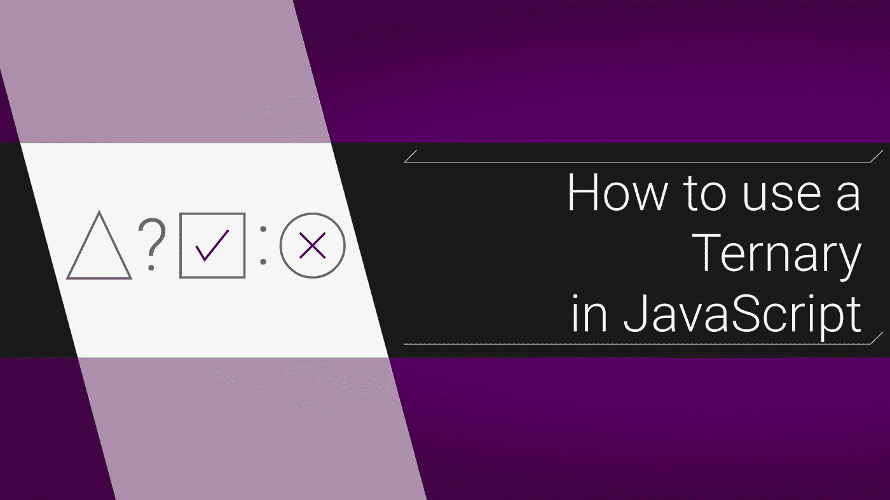

# 如何在 JavaScript 中使用三元组

> 原文：<https://itnext.io/whats-a-javascript-ternary-5edf4415a09d?source=collection_archive---------3----------------------->

## 节省时间和空间的有条件捷径



如果说传统的`if-else`支票是编程的面包和黄油，那么**三元**就是烤面包机。也就是说 ternaries 让事情变得更好。它们一开始看起来确实很奇怪，但是一旦你习惯了，它们就会成为你最喜欢的工具之一，*尤其是*如果你使用 React 的话。

# 语法是什么？

这里有一个函数使用了一个`if-else`，然后是一个三元组:

```
*// traditional*
const **movieLengthCheck1** = (**runtime**) => {
  if (**runtime** <= 90) {
    ***return*** '*Short!'*; 
  } else {
    ***return*** '*Long.*';
  }
}*// ternary*
const **movieLengthCheck2** = (**runtime**) => {
  ***return*** **runtime** <= 90 ? '*Short!*' : '*Long.*';
}
```

分解成纯粹的组件，它是任何`if-else`检查的相同的三个部分:要检查的条件、条件为真时的值和条件为假时的值。下面是伪代码:

```
(**condition**) ? (if **condition** *true*) : (if **condition** *false*)
```

你不需要之前看到的`( )`，但是可以随意使用它们来帮助巩固你头脑中的概念。想象一下,`?`在问一个问题，而`:`将答案分开。第一个选项用于`true`，第二个选项用于`false`。这个顺序*永远不会*改变。所以在我们的例子中，如果`runtime`小于`90`，那么三元计算结果为`Short!`，否则，计算结果为`Long.`。

请记住，`truthy`和`falsy`值仍然像通常一样工作。此外，您也可以在变量赋值中使用 ternaries:

```
const **getMovieReview** = (wasEnjoyed) => {
  const **opinion** = wasEnjoyed ? '*Great!*' : 'Bad.';
  ***return*** *`I thought the movie was* ${**opinion**}*`*;
}
```

# 我什么时候会用它？

Ternaries 通常用在有两个简单的选择，但你不想占用一堆行的时候。如果你是一个反应型开发者，你会经常用到它们。它们是 React 中处理[条件渲染最常见的方式之一。这是因为它们是带有返回值](https://reactjs.org/docs/conditional-rendering.html#inline-if-else-with-conditional-operator)的[单个表达式，所以您可以在 JSX 中使用它们:](https://stackoverflow.com/questions/22876978/loop-inside-react-jsx)

```
const **Greeting** = (**props**) => {
  ***return*** (
    <h1>
      { **props**.isHappy ? *"Hey hey!!"* : "*Hello.*" }
    </h1>
  );
}
```

# 一些时尚小贴士

你走之前还有两件事。当将一个三元组分成多行时，惯例是用`?`和`:`开始每个新的缩进行，如下所示:

```
const **isBirthday** = true;
const **greeting** = isBirthday
  ? *'Hello! Today is my Birthday!!'*
  : *'Hey. I wish it was my birthday.'*
```

同样，之前我说过 ternaries 是两个值的，然而这不是全部的事实。有一种方法可以将 ternaries“链”在一起以获得更多选项。您可以通过将`false`条件检查值*变为另一个*三元值来实现这一点:

```
const **greeting** = **isMorning** 
  ? *"Good Morning"*
  : **isAfternoon** /* new ternary */
    ? *"Good Afternoon"*
    : "*Good Evening"*
```

现在我们有*三个*不同的问候，基于*两个*不同的检查。从理论上讲，你可以想锁多少就锁多少。尽管我不使用它们，因为我个人认为它们更难阅读。我在这里举了一个简单的例子，但是对于真正的检查，它们会变得很复杂。我觉得 ternaries 在简单的时候工作得最好，比如返回一个 React 组件或`null`。然而，这只是我的观点，对于使用三进制链接的，有一些很好的反驳[。](https://medium.com/javascript-scene/nested-ternaries-are-great-361bddd0f340)

就像编码中的许多事情一样，一旦你学会了语法，你就能找到自己的风格。如果你曾经见过链式终端完美的案例，请告诉我！

大家编码快乐，

麦克风