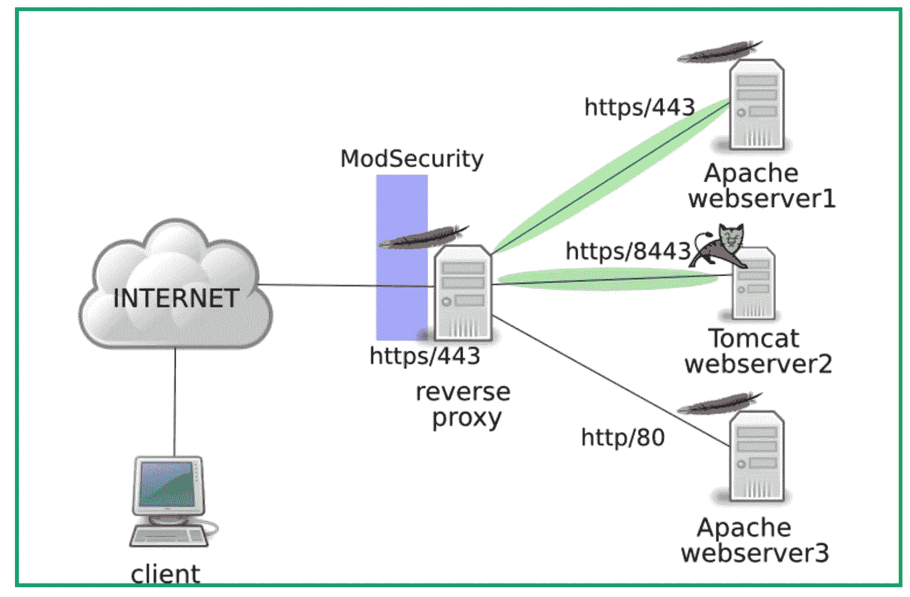
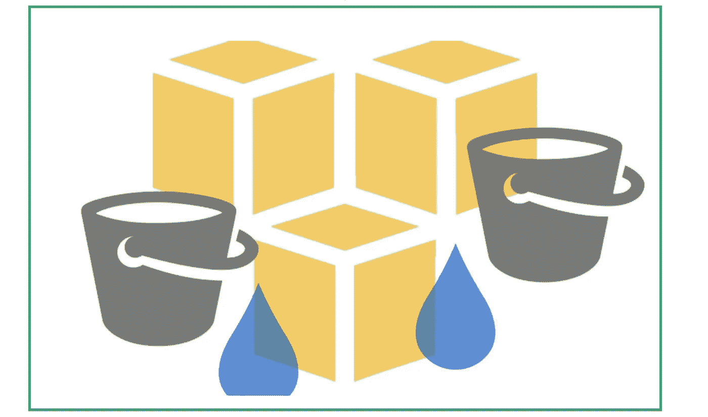
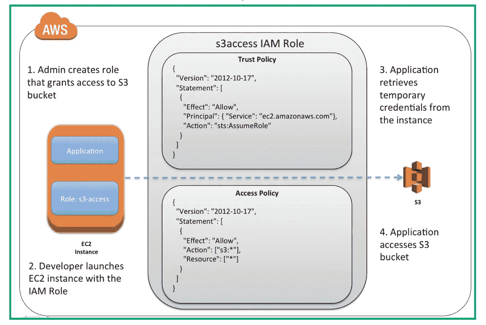

# 你的桶里有什么？

> 原文：<https://itnext.io/whats-in-your-bucket-36ecaa4e0df5?source=collection_archive---------1----------------------->

## 对 Capital One 违规的非技术和技术方面的深入研究。为什么会这样？我们如何避免这种程度的数据泄露？

你的桶里有什么？

***免责声明:*** *本文所表达的观点和意见均为本人观点，不一定代表任何其他人或组织。本文所做的假设基于以下* [*法院文书*](https://regmedia.co.uk/2019/07/29/capital_one_paige_thompson.pdf) *中提供的数据。*

[Capital One 违约](https://techcrunch.com/2019/07/29/capital-one-hacked-over-100-million-customers-affected/)泄露了从 2005 年到违约日申请 Capital One 信用卡的客户的信用卡申请信息。大约 1 亿美国人和另外 600 万加拿大人。受损数据存储在亚马逊网络服务(AWS)的 S3 桶中。如果你的数据遭到破坏，不要指望任何超过信用监测，因为免费的信用监测是我们从 Equifax 得到的。在这一点上，客户不会怀疑他们的信息是否不在那里，但他们会怀疑他们的财务记录中有哪些信息不在那里。

Capital One 和 GitHub 本周被起诉，这是在加州提起的集体诉讼的一部分，指控其未能保护或防止安全漏洞。

国会希望 Capital One 和亚马逊解释数据泄露事件，他们希望从 Capital One 和亚马逊那里得到答案。让我们看看指责游戏将如何进行。

如果你认为这篇博客是在指责第一资本，那你就看错了博客，但我肯定是在指责某个人。尽管我认为 Capital One 应该为此次违规行为承担全部责任，因为调查证实，安全错误配置(防火墙)导致了违规行为。

我仍然认为，企业作为一个整体，存在着大部分的技术缺陷。你和我很可能成为下一个受害者。如果你不相信我，去审计你的 AWS 云基础设施。寻找开放的安全组/NaCl、过度宽松的 IAM/资源策略或公开可用的存储桶，不要担心未打补丁的服务器或未加密的数据。我知道你想，所以继续读下去。

Capital One 承认这是一个配置错误的防火墙，但是给了攻击者通往王国的钥匙的那个 IAM 角色呢？我不认为这是一个糟糕的防火墙或宽松的安全政策那么简单。我知道这就是攻击者所利用的，也许足以成为一份面向公众的官方声明，但我认为不仅仅是这样。

我在这里讨论我们行业今天面临的一个挑战。

安全专家试图检查这种规模的安全事件，我们希望了解受害者可能做对了什么，以及攻击者利用了哪些漏洞。内部知识可以帮助安全社区更好地准备防御安全威胁，修复错误配置，并修补会使我们的基础架构暴露于类似攻击的漏洞。因为我们仍然没有来自首都一号的官方声明，我怀疑那会发生。这取决于我们根据在法庭文件和其他报告中找到的信息将这些点联系起来，所以让我们这样做吧。

上周二，新闻出来的第二天，我和几个朋友在西雅图市区喝了杯咖啡。在一次关于 AS-Code 系统未来的非正式聚会后，我的一个新的安全伙伴问了我这个问题；“为什么 Capital One 云托管公司未能保护 Capital One 客户的数据？”—这个问题应该由我来回答，因为我倾向于过多地支持这个工具。我对自己说；很公平。如果你推荐一项技术，你应该能够报告它的优点和缺点。我认为它是任何云安全团队的优秀工具。根据我当时掌握的信息，我对攻击者能够利用的 AWS 资源知之甚少。我知道首先是一个错误配置的防火墙。我不知道这个防火墙是一个安全组，还是他们 elb 前面的 AWS Web 应用程序防火墙(WAF ),还是第三方 Web 应用程序防火墙(开源/商业)。根据调查，被破坏的 EC2 实例所附带的 IAM 角色使我认为有问题的防火墙确实是第三方。WAF 作为 IAM 角色不能直接“附加”到 AWS 管理的 WAF。

典型的 ModSecurity 部署

幸运的是，周五，Krebs 的一份报告显示，被入侵的资源是一个错误配置的开源 [Web 应用](https://en.wikipedia.org/wiki/ModSecurity)防火墙( [**ModSecurity**](https://en.wikipedia.org/wiki/ModSecurity) )。我查看了技术细节来回答这个问题，但我问自己，“这真的与工具有关吗？”。如果我们确定云托管云是否有一个可以防止这种攻击的策略，我们会有什么收获吗？正确的问题应该是:“像 Capital One 这样技术先进、拥有数百万个人财务记录的公司，怎么可能不把基本的事情做好。?"

“在 Capital One，我们做的每一件事都是从客户的需求出发，然后再考虑如何满足他们的需求。与 AWS 合作的最大好处是，我们不必担心构建和运营必要的基础设施，而是可以将我们的时间、金钱和精力集中在为客户创造卓越体验上。”~ ***乔治·布雷迪。首都一号*执行副总裁兼首席技术官**

我会回来引用这句话！

## 让我们开门见山吧

那些活跃在云领域的人都非常清楚，Capital One 是采用云的领导者。Capital One 曾在许多云活动中公开谈论他们的云优先战略。通过阅读 Capital One AWS 案例研究，您可以轻松地在网上找到更多相关信息。Capital One 背后是一个优秀的云安全工具([云托管](https://cloudcustodian.io/))。数百名云专业人员使用该工具来实施护栏，以增强安全性并帮助控制 AWS 的成本。我还可以告诉你，第一资本雇佣了当今世界上非常有才华的安全专家，我知道他们中的一些人。几年前，当我开始我的云职业生涯时，我申请了 Capital One 的一个云职位。我通过了他们所有的数字和其他推理考试。我花了几周的时间准备面试，我还获得了三个 AWS 认证，去参加工作面试。我仍然没有得到这份工作，这也是我在过去七年中唯一没有得到的工作。简而言之，Capital One 不雇佣任何人他们有聪明的人来管理他们的云船。他们刚刚聘请了前网飞工程师威尔·本特森担任云安全总监。威尔知道如何保护云基础设施@Netfix scale 的安全，早在这次入侵之前，他就已经为网飞撰写了一篇关于 SSRF 的博客。在纸上资本，一个人提出的武器库需要阻止这种攻击。

那么交易是什么！？他们拥有强大的云能力、工具、有才华的安全专业人员，但仍然遭到黑客攻击？让我们回到乔治·布雷迪先生的浪漫名言，因为我认为这是一切的开始。

## 这很复杂

高管和决策者对于将他们的一些运营开销转移给公共云提供商感到非常兴奋，这也包括一些安全运营。AWS 明确地标注了他们的共享责任模型，其中他们确定了我们客户需要拥有的领域。分担责任模式归结为这样一个事实:无论我们使用什么样的云服务；我们将始终承担保护数据安全的责任。如果您需要了解更多关于共享责任模型的信息，请查看我的 AWS 账户博客中的[架构安全&治理。在那里，我更详细地解释了这个概念。](/architecting-security-governance-across-your-aws-accounts-part-1-introduction-ae200624424d)

如果你重读乔治·布雷迪*的话，你不会捕捉到他对安全的兴奋。对于转向 AWS 如何帮助他们专注于客户，他表现出明显的兴奋。这并不意味着他不关心安全，但这加强了我对我们行业的信心。高管们不太关心安全性，因为他们关心的是缩短上市时间和不断提高数字。他们会告诉你相反的情况，但现实描绘了一幅不同的画面。这意味着开发者面临很大的交付压力。在之前的工作中，我与客户的关系非常密切。客户通常不太关心安全性，因为他们关心的是增强当前功能和更新新功能。这决定了高管需要关注什么，基于客户压力的决策也会影响开发人员需要担心什么，而且通常是安全性。*

*客户希望有更多的小部件和小工具可以点击，但他们只关心发生事故时的安全性。技术高管忙于为公司赚更多的钱，这是有道理的，因为这是他们被雇来做的事情。问题是，我们没有看到多少支持安全计划的行动，这些计划可能有助于防止公司遭受灾难性的损失。*

*每资本一，攻击者获得访问利用错误配置的防火墙。这句话指出了*安全专家应该*负责保护基础设施的安全；它不会让“高管”或开发人员对你大喊大叫。我并不是在责怪开发人员，因为我知道要跟上需求并实现良好的安全实践有多难。*

*高管希望开发人员快速交付；我还认为他们希望避免违规。我认为他们在弥合开发和安全运营之间的差距方面做得不够。开发人员负责在云基础设施上构建这些服务、迁移和维护本地工作负载，这使得他们很难给予安全性应有的关注。*

*安全专业人员不得不打败仗，因为他们没有从技术领导者那里获得所需的支持。*

*这个问题在企业范围内很明显，而且不会很快消失。*

*通常，在年度安全审计之后，软件开发团队的路线图会被修改，以适应需要修复的安全发现。我们很少在后装或主动冲刺中看到任何安全项目*

*直到我们赞美那些故意提高安全姿态的开发者，调味品缺乏安全卫生，积极的改变不会发生。*

*安全专业人员被迫创建和管理各种例外。我们让一个不安全的版本投入生产，因为我们没有能力阻止它。我们保留易受攻击的基础设施，因为保护它意味着开发人员必须做更多(不必要的)工作来使他们的应用程序工作。如果你已经做了几年的安全专家，我知道你会有同感。*

*如果你读过我以前的博客，我是简化安全流程以适应业务的大力提倡者。*

*繁重的安全流程和文档不是答案。答案是安全与发展之间的密切合作。编纂安全策略，因此没有人必须找到它们、阅读它们并应用它们的内容。安全和运营应该为开发人员构建支持平台，以便将可靠和安全的代码顺利地转移到生产环境中。没有 CTO 和技术领导的支持，健康的安全计划就不会实现；没有开发人员的支持是不行的。*

## *技术领导者的关键点*

*你的员工可能不会谈论这个，所以请相信我:*

*1-从了解您的安全环境开始；你有什么数据？谁想要？有多值钱？你能做些什么来保护它？如果丢了会怎么样？*

*2-与你的工具无关；如果您的安全团队可以使用它们来实施安全策略，那么它们就毫无用处。*

*3-不是关于你有才华的安全团队；如果没有应对永无止境的安全挑战的全面支持，他们就无法增加价值。*

*4-这不全是为了眼前的利润，一次违规就意味着数百万美元的损失和名誉损害*

*5-建立健康的安全文化，每个人都有责任保护所有的东西。每个人在实现安全性时都会受到称赞，就像他们在发布新服务时会受到称赞一样*

*6-雇用能够讲述安全故事的专业人员，通过鼓励组织范围内的协作来转变组织的安全文化。*

*7-通过整理您的安全策略来简化安全性，并将它们提交给托管您的应用程序代码的同一个 Git repo*

# *技术方面*

**

*尽管从技术角度来看调查没有提供足够的细节。安全工程师的结论是，附加到受损服务器的过度宽松的 IAM 角色策略被用来访问包含数据的 s3 存储桶。*

***步骤:***

*1-攻击者在错误配置的 Web 应用程序防火墙后危害了 EC2 实例。*

*2-受损的服务器可以访问大量的桶(可怕的做法)*

*3-聪明的攻击者不会从元数据服务中提取角色凭证，也不会使用这些凭证进行 API 调用(如果安装了 AWS CLI)。(如果启用，这将触发 AWS 警卫值班警报)相反，只有攻击者会直接从受损的 EC2 和 boom 运行该命令，他们可以访问并运行 *s3 sync。**

**

*最坏的情况是 s3 资源后面有一个。*

*我并不是说上面的数字就是准确的设置，但是考虑到攻击者能够完成的任务，这已经非常接近了。*

***简单的事情就可以阻止这次袭击***

*1- **最小特权:**为什么给 EC2 实例访问大量桶的权限 IAM 允许我们制定细粒度的策略，这样您就可以只给代码一个桶或前缀的访问权限。 ***不确定为什么那个服务器需要*** [***列出所有桶***](https://aws.amazon.com/blogs/security/writing-iam-policies-how-to-grant-access-to-an-amazon-s3-bucket/) ***！？****

*2- **健康的安全组/防火墙:**您的安全组或防火墙不应允许来自 0.0.0.0/0 的入站流量进入直接访问敏感数据的服务器。*

*3- **监控:** Capital One 承认他们的日志显示，有问题的服务器与一个 Tor 出口节点进行了愉快的对话。谁在看那些东西？我知道在检测到此类事件时会发出警报。*

*只有那些简单的措施才能阻止这次入侵？是的，我说过！*

## *我能自动化上面的吗？是的。请使用 Capital One 云托管！*

*1-编写一个云托管策略，创建一个 AWS 配置规则来标记许可策略。*

*2-使用云保管者创建一个策略，以响应以下 GurdDuty 发现:“**通过实例启动角色专门为 EC2 实例创建的凭据正在从外部 IP 地址使用。”***

*3-编写云托管策略，对指示与 Tor 出口节点通信的事件做出反应。*

***最后:***

*我真的希望看到 Capital One 出来向社区宣传这一事件，分享知识，并且永远不要停止他们的云优先战略。这种事件可能会发生在我们当中最优秀的人身上，我们所能做的就是建立强大的集体知识来应对类似的安全挑战。*