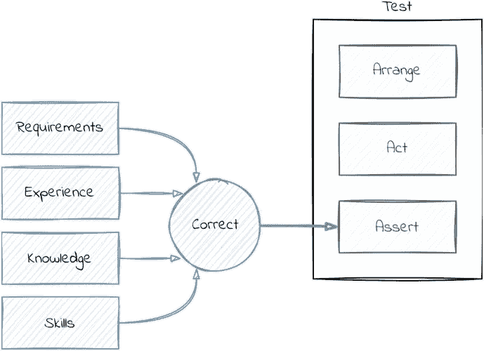

# 什么时候软件是正确的

> 原文：<https://itnext.io/when-is-software-correct-ceed968fdab6?source=collection_archive---------2----------------------->

[附身摄影](https://unsplash.com/@possessedphotography?utm_source=unsplash&utm_medium=referral&utm_content=creditCopyText)在 [Unsplash](https://unsplash.com/?utm_source=unsplash&utm_medium=referral&utm_content=creditCopyText) 上拍照

开发软件应该总是与测试软件携手并进。通过测试，我们可以证明我们的软件工作正常。有很多方法可以证明这一点，但所有的方法都需要我们定义什么是“正确工作”。在这篇文章中，我将探索如何在软件测试的环境中定义正确的*。*

# *需要*纠正**

*测试软件时，我们有一堆必须通过的测试。一次失败的测试意味着我们必须改变我们的应用程序。当它的一个断言被拒绝时，测试失败。不会失败的测试是没有用的。这些都是我们想当然的事情。这是我们使用公认术语的方式。然而，我注意到我们没有停下来思考什么定义了我们的断言，即使它们是测试中最重要的部分。*

*读到这里，你可能会想:“显然，正确是由需求定义的。你在暗示什么，你这个装腔作势的人。”你是对的，但只是在完美的世界里。在现实世界中，需求永远不会完整到足以定义测试中的每一个断言。我们必须填补空白，以获得*正确*的完整定义。*

*为了创建*正确*的完整定义，我们从使用需求开始。但是我们也利用我们的经验、知识和技能。*

*我们利用我们的经验来预防常见问题，并有效地利用我们的知识。*

*我们利用我们的知识找出最大的风险在哪里。更大的风险应该有更彻底的定义*正确的*。为此，我们使用我们的基本人类心理学知识(例如，我可能会忽略这个按钮)、软件开发过程(例如，一个仓促的功能)、业务领域(例如，银行)、组织(例如，这会中断某人的工作流程)和其他主题。*

*当需要时，我们利用我们的技能来收集数据或知识。我们还用它将所有东西结合成一个紧密的、可用的整体。*

*一旦我们定义了*正确的*，我们就使用这个定义为我们的测试做断言。*

**

## **的隐含定义正确**

*自动化测试迫使我们以代码断言的形式写下正确的。每个自动化测试都需要一个或多个断言。这些书面断言是对正确的 T21 的明确定义。*

*手动测试时，测试人员写下*正确*的定义是不太常见的。他们往往止步于要求，不完全是*正确*的水平。但是，这并不意味着没有这样的定义。相反，测试人员使用了*正确*的隐含定义。隐式定义应该写下来，使它们显式，更重要的是，可重用。不过，我承认这并不总是可行的。*

*每一个可能失败的测试都有一个*正确、*隐式或显式的定义。不会失败的测试是没有用的。*

# *如何定义正确*

*定义*正确*有两种基本方法:例子和规则。它们是基本的，因为你不能把它们描述成除了它们自己以外的东西。它们是我所知道的定义*正确*的最基本形式。*

*下面的描述不是很详细，但应该足以给你一个大致的概念。*

## *例子*

*一个例子需要一个特定的情况(=状态和输入)和*正确的*结果(=输出或副作用)给一个特定的被测对象(SUT)。*正确的*结果仅适用于这种情况和这种 SUT。如果*正确的*结果不等于实际结果，则测试失败。您可以通过在不同的情况下对同一个 SUT 多次这样做来证明 SUT 工作正常。*

*举例是目前为止定义*正确*最常用的方法。为了用这种类型的*正确的*编写一个测试，我们必须做以下事情:*

1.  *设置一个示例状态*
2.  *使用示例输入执行测试中的主题*
3.  *断言实际结果是否与正确的结果相同*

*您可能认为这些步骤是 AAA 模式(安排、行动、断言)。*

**正确*在第三步中被定义为一个或多个断言，仅适用于本例。另一个例子可能对正确的有不同的定义，因此有不同的断言。*

**

## *规则*

*规则是一个可重用的逻辑包，通常有一个人类可读的名称。根据规则逻辑，如果规则输入*不正确*，则认为规则被破坏。无论状态、输入或测试对象是什么，都不能破坏规则(SUT)。一个被破坏的规则不能通过测试。您可以通过应用多条规则来证明 SUT 正常工作。*

*规则永远不能被打破，这意味着规则有时会自行失效。例如，当规则与给定输入不相关时。例如，禁用自身是不可接受的，但对于规则来说是可以的。*

*为了用这种类型的*正确的*编写一个测试，我们必须做以下事情:*

1.  *写一条规则*
2.  *使用示例情况(=状态和输入)和受测对象执行规则*
3.  *断言规则是否被破坏*

*规则的优势在于它们的可重用性。因此，我们可以使用生成的输入多次运行步骤二(例如[基于属性的测试](https://medium.com/criteo-engineering/introduction-to-property-based-testing-f5236229d237))。它还允许我们创建可以在应用程序和团队之间共享的规则集(例如 [Linters](https://www.wikiwand.com/en/Lint_(software)) )。*

**

# ***用*不同的方式纠正****

*使用*纠正*的基本方法，我们可以更好地理解其他测试方法。我还没有遇到过我不能定义为例子和/或规则的测试方法。*

*大多数非基础方法将*正确的*与软件开发的其他方面结合起来。例如，[基于契约的测试](https://lakitna.medium.com/contract-based-testing-part-1-introduction-b42e6236720a)用从契约派生的规则定义*正确的*。最重要的是，它为团队合作和保持同步增加了一种结构化的方式。*

*其他方法结合了这两种基本方法来创建对*正确*的更好定义。例如，[基于属性的测试](https://medium.com/criteo-engineering/introduction-to-property-based-testing-f5236229d237)通过在规则中包装一个例子来定义*正确的*。这导致了许多规则生成的例子，它们一起创建了一个可靠的定义。*

*这里有更多的方法可以发现。我正在做一个以规则和例子为中心的测试方法概述。然而，那要等到另一天，另一篇文章。*

# *结论*

*为了证明我们的软件工作正常，我们首先定义什么是正确的。*正确的*是根据需求、经验、知识和技能定义的。有时我们含蓄地定义*正确的*，但我们应该努力使其明确化。*

*我们可以用两种基本方法来定义正确的:例子和规则。示例需要特定的情况，并且*为受测对象纠正*结果。规则是可重复使用的，无论测试的情况或主题是什么，都不能被打破。*

*我们可以根据例子和规则定义许多有趣的测试方法。在以后的文章中，我将进一步探讨这个问题。*