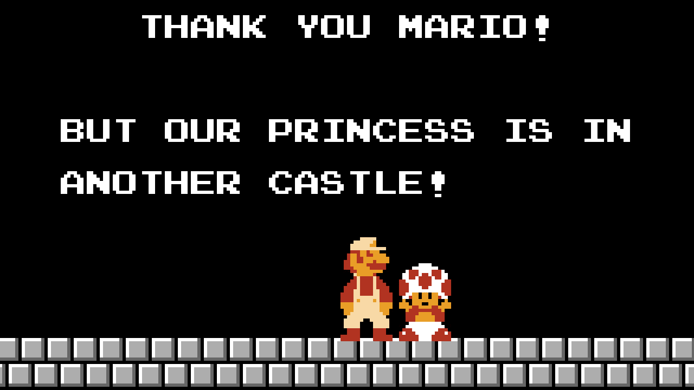
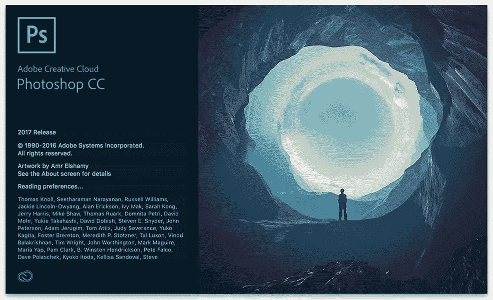

# 当编程变成一件苦差事时

> 原文：<https://itnext.io/when-programming-became-a-chore-a0be2b9919c0?source=collection_archive---------0----------------------->

我在九年级时和我的一位老师的一段对话现在仍不时浮现在我的脑海中。我们在讨论如何与人交往，以及如何做到不让人觉得是个傲慢的混蛋。这当然是一个值得讨论的问题。她知道我喜欢编程，并建议我把它作为一个需要解决的问题来对待。在某个时候，她建议使用商业术语“解决方案”，这是从科技行业的某个人那里听来的。“只有公司的无人机才会用这种术语，”我回击道。“这是对创造力的拒绝。”

虽然我愿意相信在过去的二十年里，我至少学到了一点不要做一个自大的混蛋，但我仍然欣赏 15 岁的我的观察。几年后，在我贬低企业无人机时想到的那家公司工作的一位朋友抱怨说，他的工作已经变成了无休止的重复工作，重新实现 CRUD──创建、读取、更新、删除。

从那以后，很多事情都变了。软件行业和我都变得更加成熟。对于行业来说，这意味着不同的语言和趋势，更大的抽象层堆和更强大的库来完成繁重的工作；软件开发中令人兴奋的部分已经变成了一项罕见的实验室任务，而大多数程序员的日常工作已经变成了令人麻木的琐事，一位朋友恰当地将其概括为“精神健康卖淫”。

对我来说，这意味着转到了一个与人交流比写代码更多的工作领域。尽管如此，在我的空闲时间，我还是会定期回到我的本源，因为尽管现代软件业和它的技术基础有很多缺点，我仍然喜欢编程，我仍然认为自己是一名程序员，我仍然*关心*技术的发展方向。

# 软件有哲学教义吗？

在某种程度上，我们面对的是哲学的失败。随着技术越来越商品化，经济压力越来越大，为了提高效率，很多优点都被抛弃了。

这些美德包括对问题的深入思考，对整个系统的理解，以及更普遍的对知识的渴求。软件开发的文化曾经充斥着文学参考、双关语、古怪的幽默和真正的艺术──如今很少发生在这些事情上，当一个人这样做时，几乎肯定会从创客文化、黑客空间或偶尔设法不被吸进去的巫师那里获得喜悦。

在某种程度上，人们可能会说，近几十年来，整个社会已经偏离了康德“哥白尼革命”的理想，甚至是启蒙运动的价值观。根据你的世界观，你可以把这归因于很多因素。但是，无论你是采取赫胥黎式的“自娱自乐至死”的观点，还是更积极的麦克卢汉式的观点，即我们只是太忙于探索人类的精神世界而无暇顾及诸如启蒙这样的发明，还是某种更马克思主义的观点，最终都归结为一个问题:我们寻求发展技术的目的是什么？对此，我认为在[爱德华·R·莫罗对早期技术的分析中可以发现巨大的智慧](https://www.rtdna.org/content/edward_r_murrow_s_1958_wires_lights_in_a_box_speech):

> 这个仪器可以教学，可以照明；是的，甚至它能激发灵感。但它只能在人类决心利用它达到这些目的的范围内发挥作用。否则，它只不过是盒子里的电线和灯。对无知、不宽容和漠不关心将进行一场伟大的、也许是决定性的战斗。

然而，缺乏美德很难成为问题的有用描述，即使是，也不会提供任何解决方案的路线图。当我们试图剥离软件开发中的单调时，似乎有几个根本原因。

1.  很多时间都花在了为 CRUD 操作做样板文件上。
2.  太多的精力花在了与工具链的角力上。
3.  错误的抽象和隐喻让人类和计算机都精疲力尽。
4.  创造力和技能已经被运送产品的压力所篡夺。

每一个都值得进行专门的检查，但是值得说明的是，不是所有的程序员或者所有的编程工作都要处理这些问题中的全部甚至一部分。我的主张是，大多数软件开发人员每天都至少经历一些这样的问题，这导致了动力的减少，对技术卓越的兴趣的丧失，对技术的草率态度，也许最有害的是，一种感觉*只要它能工作，它就很好*。

对于像我这样一个荒谬的存在主义者来说，这种相当脆弱的功利主义方法有很多不足之处。但不难看出，“足够好”的信条是如何从一种文化中产生的，在这种文化中，照明和灵感更多地是工业制造的产物，而不是丰富的内心生活，在这种文化中，无知、不宽容和冷漠被认为是如此自然，以至于成为选举成功的秘诀。

# 样板管道，或者，超级马里奥如何预测第四次工业革命



在软件开发的前沿，有很多疯狂的太空忍者在进行着。从语音识别到自动化药物发现，从神经链接到深度学习驱动的自动化，有很多温和的东西即将出现。

然而，绝大多数的软件开发都是在追踪 bug，为网站制作模板，连接不同的东西来读写和操作数据库中的数据。对于现代程序员来说，一个并不罕见的任务是编写这样的代码:

```
function api_get_user_profile(request) {
    if (request.method != 'POST') { return http.response(405); }
    if ('userid' in request.params) {
         var user = db.users.get(id=request.params['userid']);
         if (user) {
             http.response(json.serialize(user.get_public_info()));
         } else {
             return http.response(404);
         }
    }
}
```

在这种任务集中，您的工作是创建一个管道，从数据库获取数据，并将其传递给链中的下一个组件。然后编写从 API 或诸如此类的东西接收数据的管道，并弄清楚如何处理这些数据。有时，在您真正开始处理数据之前，您会有 2-3 个不同的单独管道。在大多数情况下，您只是显示数据，可能在表单元素内部，以便可以通过其他类似的管道修改数据。

你在一个迷宫一样的曲折通道中。

平心而论，这种苦差事并非毫无用处，只是乏味而已。并且越来越多地以各种方式实现自动化。有完整的框架致力于使这尽可能地不痛苦，尽管这只是将程序员降低为管道的管理者，而不是它们的创造者。

也许在某种程度上，这就是我们的童年为我们准备的。许多现代程序员是在像超级马里奥这样的游戏中成长起来的。虽然我是最后一个怀疑一次又一次发现公主确实在另一个城堡中的娱乐价值的人，但游戏机制在一定程度上让我们适应了这种苦差事:你不再坚持复杂的谜题、挑战性的任务和创造力，而是放弃了无意识地在一系列(基本上是线性的)管道中穿梭，踩住偶尔阻挡你的笨蛋。

我们目前听到的故事是，所有上述疯狂的太空忍者狗屎是“第四次工业革命”，它将从根本上改变每个人的生活方式。这个故事让我们兴奋地发现，公主在另一座城堡里，在某个地方，可能在硅谷更凉爽的校园里，未来正在被创造。

但不是你。你的工作，直到它被一个宏伟的围棋、自动驾驶、发现药物的人工智能自动遗忘，是继续踩 Goombahs。

对于科技行业的绝大多数人来说，第四次工业革命并不是一个迷人的技术卓越的世界观。当你的浏览器决定它需要多少千兆字节的内存来调用你的框架的文档站点需要的 JavaScript 糖蜜，以便让你记住验证用户权限的正确方法时，它正在与你的咖啡机的支持互联网的磨豆机斗争。

在某些时候，我们都发现自己在想，“如果我有一个工具来帮我做这些不用动脑的事情就好了。”

# 适合正确工作的正确工具


在《作为灵魂工艺的车间》一书中，马修·b·克劳福德认为理解工具是一种深度冥想的方式:“当然，事实是，创造力是通过长期实践培养出来的那种精通的副产品。它似乎是通过*提交*建立起来的(想想音乐家练习音阶，或者爱因斯坦学习张量代数)。将创造力等同于自由与新资本主义的文化非常和谐，在新资本主义文化中，灵活性的必要性排除了在任何足以发展真正能力的任务中停留的时间。”

这点我感受很深，很痛。作为一个 36 岁的职业生涯第四或第五年的人，我觉得我已经掌握了胜任不胜任的能力:调整我的技能以适应手头的任何问题，根据以前的经验进行模式匹配，不断地在我力所不及的地方踩水，但不知何故设法基本上不把事情搞砸。我并不孤单。

现代性需要超连接性、[持续的部分注意力](https://en.wikipedia.org/wiki/Continuous_partial_attention)，以及无限的会议。我们生活在一个快节奏和潜意识信息的时代，被速度金属的音轨所覆盖。当我在 Twitter 上问程序员他们发现自己在花时间做什么时，他们的回答遵循一个模式:

> “我浪费最多时间的任务是试图在失去注意力后重新获得注意力和头脑状态。”

和

> “说真的，这在很大程度上取决于项目处于哪个阶段。早期有很多样板文件，慢慢地趋向于大多数哭泣，因为我不理解缓存失效和多线程计算。”

在这种环境下，我们努力将我们的知识模块化，并将其从我们身边抽象出来。为每一个场合制作一个工具，这样我们就不会纠结于记忆技巧，而是记住如何寻找我们知道存在的工具。因此，为了计算一个数是奇数还是偶数，而不是:

```
number & 1
```

人们会:

```
const isOdd **=** require('is-odd');
isOdd(number);
```

这看起来像是一个人为的例子，但提到的 [*是-奇数*包有 60 万周下载量](https://www.npmjs.com/package/is-odd)。当然，从某种程度上说，这是一种发明，掩盖了 Javascript 类型系统的缺点。但这也是贯穿现代软件的现实。

这被正确地批评为 cargo cult 编程，但是我觉得所有关于 NPM 万能和编辑器中的[堆栈溢出帮助器的讽刺忽略了实际问题，那就是大多数程序员，实际上是大多数人，根本没有时间或思想空间来真正正确地了解他们的工具。](https://atom.io/packages/stack-overflow-help)

大多数工具实际上并不做您需要它们做的事情，这并没有什么帮助。这是乔纳森·布洛的观察之一，他认为“IDE 是古怪的弗兰肯斯坦的野兽，它的主要工作是弥补大多数语言未被指定的事实。”有关于如何解释变量声明的详细说明，但没有关于如何将多个代码文件汇编成一个程序的指导。编译器知道如何标记和解析输入流，但不知道任何关于构建、测试或调试的事情。 [Blow 在各种演讲中认为](https://www.youtube.com/watch?v=TH9VCN6UkyQ&list=PLmV5I2fxaiCKfxMBrNsU1kgKJXD3PkyxO)开发环境倾向于忽略开发实际上是如何发生的，人们实际上想要完成什么，相反，我们得到了一层又一层的系统，这些系统并没有做我们想要它们做的事情，即使我们可以重新利用它们来完成这些任务，它们仍然工作得相当糟糕。

虽然有些人无疑完全乐意以做粗水管工为生，但是创造这种需求的文化，当与越来越糟糕的不适合工具链的文化混合在一起时，会导致软件质量回报的减少。

所有这些的总和就是，我们让程序员分心，使用糟糕的工具来解决他们没有时间完全理解的问题。如果这还不是糟糕的工作满意度和最终精疲力竭的原因，更不用说糟糕的软件质量了，我不知道还有什么原因。

# 不重复自己的微妙艺术



软件开发中有一个原则，叫做“干”或“不要重复自己”，通常表述为“每一项知识在一个系统中必须有一个单一的、明确的、权威的表示”。

虽然很容易看到程序员试图在他们的项目中坚持这一原则，或者通过精心制作的类层次结构，明智的数据结构选择。但是，除了这一特定的、语法上暴露的层，我看到在将 DRY 原则应用到抽象本身和设计中使用的隐喻上的努力要少得多。

面向对象的类层次结构就是一个基本的例子。计算机科学家被训练成相信干净类的概念，这些干净类只与它们的从属对象通信，并且符合一种容易识别的模式。但在实践中，这很快就会失败，因为您最终会构建越来越复杂的机制来将消息传递到程序的另一部分，而不会违反一些严格遵守的约定。

人们被告知要观察 DRY，但是他们也被告知要依靠定义良好的设计模式。这是一个矛盾:如果你在使用设计模式，你就是在重复自己——尽管是在一个更抽象、更无形的层面上。

像这样的趋势导致了一个世界，在这个世界中，复合的有损抽象导致了软件运行速度的数量级下降。这是对考虑底层系统硬件设计的一种非常普遍的轻视。浪费被认为是可以接受的，也是正常的，理由是硬件便宜，程序员贵。

因此，在一般的基准测试中，您可以假设 Python 程序比同等的 C 程序慢大约 37 倍。内存中数百个对象的单独实例化(例如 RAII 风格)经常会导致缓存性能下降 100-500 倍。结果，闪屏，加载对话框，甚至是间隙网站充斥在它们不需要存在的地方。

维护这些越来越荒谬的抽象是程序员不快乐的一个因素。但这也是代码缓慢、错误和不安全的主要因素。

当您的工作是在不同的库之间提供符合教条的管道，以缓存低效的方式传递不兼容的数据结构，而不是找到将这些库的逻辑应用到您试图解决的问题的方法时，那么您的 CPU 将会不高兴，您的用户将会不高兴，您也会不高兴。

# 单调杀死了编程明星

> 她不知道这个项目是什么——那是机密——也不知道它叫什么。这只是她的项目。她和其他几百个程序员分享，她不确定具体是谁。每天当她在上面签字时，都会有一堆备忘录等着她，其中包含新的规定和对他们在为项目编写代码时必须遵守的规则的修改。这些规定让卫生纸的生意看起来像十诫一样简单而优雅。──*尼尔·斯蒂芬森，雪灾*

当考虑现代编程工作时，很难不去想这个场景。或者，实际上，任何数量的呆伯特或用户友好的条。虽然在实践中，人们并不知道他们的项目是什么，但是他们通常也不知道。

你很难找到一个程序员不是出于对创造性出路的渴望、对技术的好奇心以及对控制盒子里的电线和灯的渴望而进入这一行的，这些电线和灯如果不能照亮和激励我们，至少也能娱乐我们。但是你同样很难找到一个随机抽样的程序员，他们觉得他们把大部分时间花在了创造性的技术工作上，而不是通过单调乏味的琐事来打发时间。

但是记住:重复*就是*练习。通过一遍又一遍地做同样的事情，无论是做管道工程、实现快速排序还是构建 web 框架，你都在磨练自己的技能。但是你在练习正确的事情吗？您是在发展自己的技能，还是只是在舒适区的抽象层里闲逛？

另一方面，人们不断实施新框架可能是有原因的──事实证明，如果你使用框架的任务很单调，那么制作框架或学习新框架往往比使用它们更有吸引力。每个人都知道这样一个人，他为了好玩使用了五种不同的框架。

作为一个人，学习和成长也许是重复自我的诅咒和内在要求:你必须重复自我以达到精通；但是真正的大师从不允许自己陷入某个特定的层次，从不积累思想包袱，认为他们已经找到了*一条真正的路*，也许最重要的是，展示了坚持花时间自己解决问题的“坏习惯”，即使有已被证明的最佳解决方案可用。

但是，缩小一点来看，值得注意的是，这种情况不仅仅发生在技术领域。到目前为止，我所说的关于软件行业的一切都可以很容易地翻译到我最近的四五个从业者中的任何一个身上。这当然非常适合我的政治工作。我刚刚花了一周时间连续开会讨论对疫情飓风的经济反应，感觉这就像是在重新安排泰坦尼克号上的躺椅。我们的抽象概念、隐喻、工具链和专横的哲学教条是对任何创造性解决实际问题的尝试的嘲弄。

与此同时，我觉得在被诊断出感染了这种奇怪的病毒后，在家里隔离了两周之后，很长时间以来我第一次有了思考问题的空间。如果我说我没有哪怕一点点想要继续自我隔离几个星期，寄希望于新哲学草案的出现，那我就是在撒谎。

至少在技术方面，与政治不同，人们真切地感觉到事情可能会有所不同。有了对我们潜在假设的适当的批评，有了对构建优秀工具的适当的努力和花时间去掌握它们的适当的努力，有了对当前时代的指导哲学的适当的安静的反省，也许有一天我们能再次让编程变得有趣。